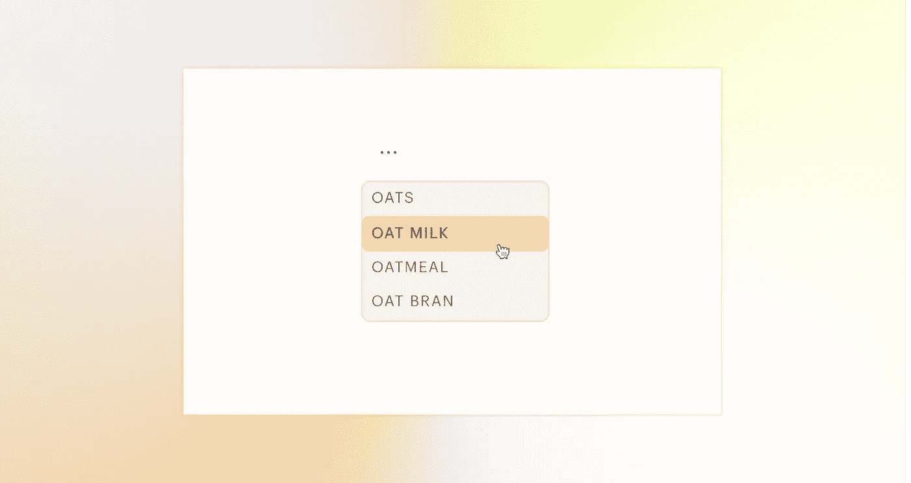
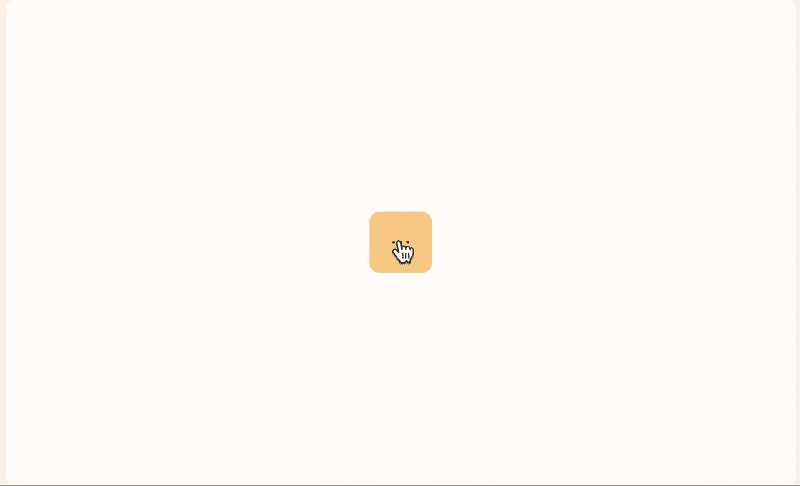
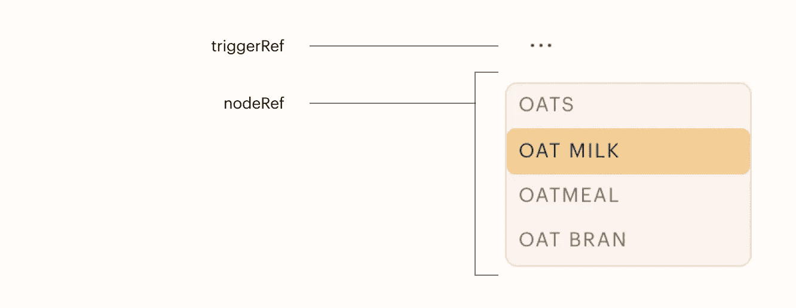

# 如何检测 React 组件外部的点击

> 原文：<https://javascript.plainenglish.io/detect-a-click-outside-of-a-react-component-with-a-reusable-hook-and-useref-a0c282171c3f?source=collection_archive---------4----------------------->

## 使用可重复使用的钩子和 useRef



检测 React 组件外部的单击对于关闭下拉框、模式和对话框非常有用。一个常见的模式是，在这些组件的主体外部单击会关闭它们:



Clicking outside of this dropdown menu closes it

我从栈溢出上的 [Ben Bud 得到了这个钩子中的主函数。我并不声称自己发明了这种代码——我修改了它，但这个概念的所有功劳都归于他的帖子。](https://stackoverflow.com/users/1212039/ben-bud)

这是钩子: **useDetectClickOut.js**

```
import { useEffect, useRef, useState } from 'react';export default function useDetectClickOut(initState) {
   const triggerRef = useRef(null); // optional
   const nodeRef = useRef(null); // required 

   const [show, setShow] = useState(initState);const handleClickOutside = event => {
     //if click is on trigger element, toggle modal
     if(triggerRef.current && 
        triggerRef.current.contains(event.target)) {
        return setShow(!show);
       }

    //if modal is open and click is outside modal, close it
    if(nodeRef.current && 
      !nodeRef.current.contains(event.target)) {
        return setShow(false);
      }
   };useEffect(() => {
     document.addEventListener("click", handleClickOutside, true);
     return () => {
     document.removeEventListener("click", handleClickOutside, true);
    };
   });return {
   triggerRef,
   nodeRef,
   show,
   setShow
   }
 }
```

Ref 设置在我们打开的任何东西上——工具条、菜单、对话框等等。

**triggerRef** 是设置在任何触发 **nodeRef** 的事件上。例如，如果 nodeRef 是一个下拉菜单，那么 triggerRef 就是切换菜单打开和关闭的按钮。

**triggerRef** 是可选的——有时组件不会被终端用户可用的元素触发，比如警告用户其订阅将在一天后到期的对话框。但是对于有最终用户触发器的组件来说，这是必要的。否则，单击 triggerRef 将注册为外部单击，这将自动关闭 nodeRef，而有时 triggerRef 应该打开 nodeRef。



**手柄点击外部**设置和移除**使用效果**。useEffect 的[清理函数](https://dev.to/otamnitram/react-useeffect-cleanup-how-and-when-to-use-it-2hbm)在组件未渲染时移除事件监听器。同时，在呈现组件时，在文档(整个窗口)上设置一个事件侦听器来侦听单击。

单击时，会检查两个条件:

1.  如果 triggerRef 被呈现并且被点击。如果两个条件都成立，`show`应该设置为它的对立面。这使得 triggerRef 作为一个开关工作。
2.  如果 nodeRef 被呈现(`ref.current`)，并且如果 Ref 不包含被点击的元素(`event.target`)。如果满足这些条件，则点击必须在 ref 之外，并且`setShow(false)`被设置。

这是钩子的全部内容。这是它在组件中的使用方式:

```
import React from 'react';
import useDetectClickOut from '../../hooks/useDetectClickOut';
import IconButton from '../raw/IconButton';
import { DrawerTest } from '../../components/DrawerTest';
import { VscEllipsis } from 'react-icons/vsc';const Dropdown = () => {const { show, nodeRef, triggerRef } = useDetectClickOut(false);return(
    <>
   <div ref={triggerRef}>
      <IconButton icon={<VscEllipsis/>} inline/>
   </div>
   {show && <Drawer nodeRef={nodeRef}>
      <li>{"oats"}</li>
      <li>{"oat milk"}</li>
      <li>{"oatmeal"}</li>  
      <li>{"oat bran"}</li>    
    })}
    }
   </> 
)}export default Dropdown;
```

注意，只有当`show`为真时，抽屉才会被调用。这使得钩子可以打开和关闭它。

因为抽屉从它的父级 Dropdown 被传递了一个 ref，所以它必须用一个`forwardRef`来呈现。更多关于 forwardRefs 的细节[在这里](https://medium.com/javascript-in-plain-english/using-forwardref-with-react-hooks-9d0d096ad810)，但这是我使用`forwardRef`的超级简单的抽屉组件示例

```
import React, { forwardRef } from 'react';const Drawer = forwardRef((props, ref) => {
   return (
     <menu className="dropdown" ref={ref}>
       {props.children}
     </menu>
    );
  });export default Drawer;
```

下拉列表的例子只是 **useDetectClickOut** 钩子的一个实现。它可以重复用于同一应用程序中的多个其他组件。