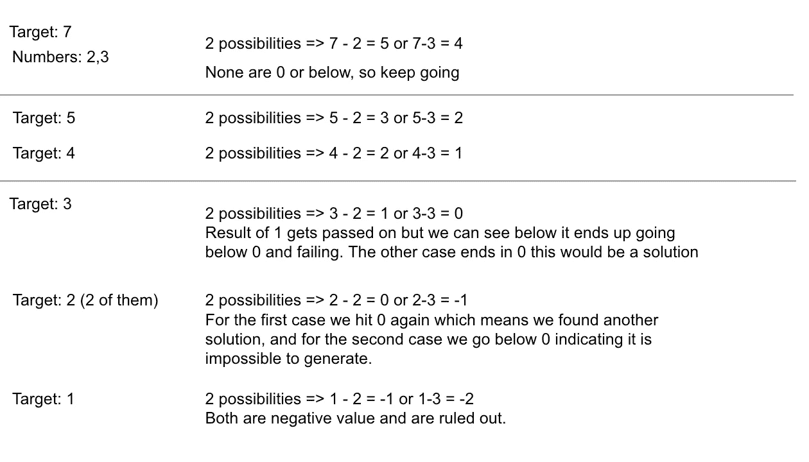
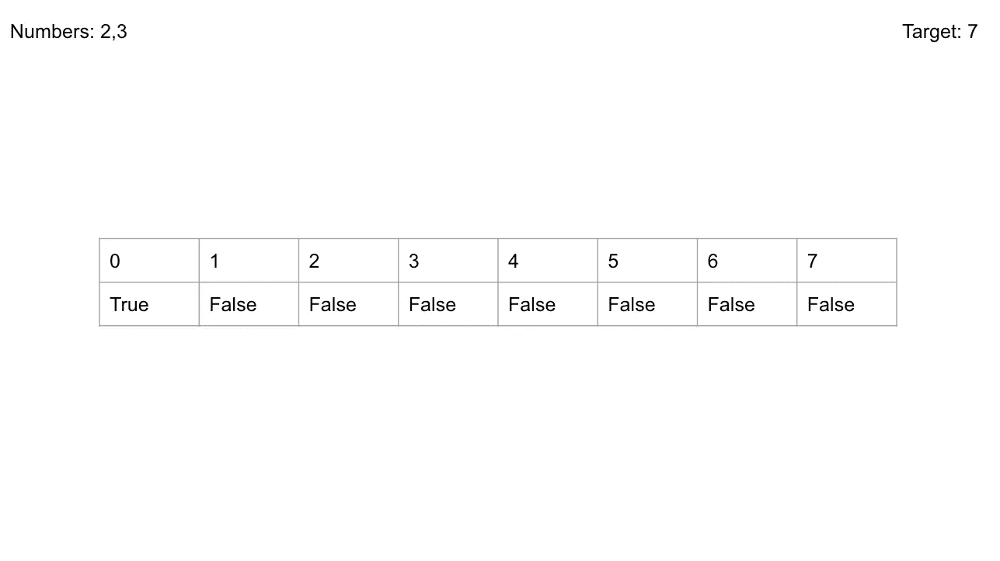
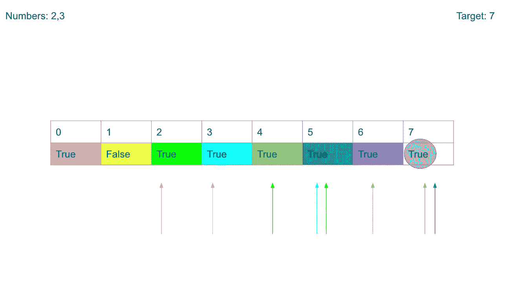

# 如何确定一个数字数组是否可以累加到一个指定的目标上

> 原文：<https://javascript.plainenglish.io/determining-if-an-array-of-numbers-can-sum-to-a-specified-target-21466c139124?source=collection_archive---------17----------------------->

Photo by [Silvan Arnet](https://unsplash.com/@silvanarnet?utm_source=medium&utm_medium=referral) on [Unsplash](https://unsplash.com?utm_source=medium&utm_medium=referral)

中级和更高级工程师的一个常见面试问题是确定一系列数字的组合是否可以累加到一个指定的目标。

在这个问题中，我们也能够重复使用数字。这意味着，对于我们开始的每个数字，当我们试图从列表中的一个数字向 0 递减时，下一步我们仍然可以从列表中的所有数字中进行选择。基于是否能够创建目标和，算法的结果应该返回 true 或 false。

让我们来看一个图表，看看我们如何在大脑中思考这个问题，并开始分解我们如何把它放进某种代码结构中。

Diagram Demonstrating How To Reason About Can Sum Be Created By List of Numbers, Screenshot By Author.

我的大脑开始处理这个问题的方式只是推理，而不考虑代码。我开始从目标中减去数字，并试图达到 0。如果我们这样做，我们得到低于 0，那么你知道这是不可能的。如果我们真的到了 0，我们已经找到了一个解，实际上，我们可以停止继续寻找一个解，因为我们知道在那个点是可能的，我们可以返回 true。

我们可以看到，在这种更“纸和笔”的解决方案中，解决方案是可行的，这是我可能会从整理我的想法开始的，但要真正可视化解决方案，我们应该创建一个数据树。这将有助于我们更简洁地可视化解决方案中的数字，并仔细检查我们的工作。

Diagram Showing All The Different Paths To Attempt To Subtract To 0, Screenshot By Author.

在这张图中，我们可以清楚地看到用绿色突出显示的成功案例。这些是可能的解决方案，而红色突出显示的情况低于零，表明这条数字路径不可能达到目标。我还用黄色突出显示了相似和重叠的子问题。

事实上，看这个图，我们可以看到，要计算 7 的总和，我们需要在每一层按照在 numbers 数组中找到的每个值来分解目标总和。我们一遍又一遍地这样做，直到我们讨论的两种情况中的一种得到满足，要么我们处于 0，要么一个数字低于 0。

基于上面的描述，我们可以从这个图开始制定一个递归的解决方案。我们看图表的底部，红色和绿色的方框，它们可以用来导出我们的基本案例。

现在，如果我们达到零，我们将返回`true`，如果我们低于零，由于上面讨论的原因，我们可以返回`false`，因为在那个点上不可能返回正确的解。让我们回到我们的图表。

注意我们在每一层都做了什么。我们从数字数组中减去每个数字，然后从这些数字中我们做同样的事情，等等，直到最后，我们达到我们的基本情况之一。让我们试着将它添加到我们的代码中。

对于函数的每次调用，我们简单地遍历每个数字，递归地调用我们的算法，传递从当前目标总和中减去该数字后得到的新余数。

如果`canConstructSum`返回`true`，那么我们知道我们可以简单地返回`true`并停止循环。如果我们完成了整个循环，并且所有对`canConstructSum`的递归调用都返回了`false`，那么我们就退出最初的 for 循环并返回`false`。这表明我们已经尝试了所有可能的解决方案，但我们无法创建目标金额。

请注意第 19 行注释掉的代码。如果您在这段代码中添加了注释并运行它，请准备好等待一段时间(在我的电脑上大约 45-60 秒)来处理这段代码。其原因是，如果你能想象当我们在给定的数组中有一个大的目标和一些小的数字时，会产生什么样的树，树会以指数级增长。事实上，这种算法的运行时间复杂度本质上是指数级的，达到 O(N^M，其中 m 是目标和，n 是所提供数字的长度。

# 我们能做得更好吗？

当我们写算法的时候，一旦我们有了解决方案，我们应该经常问自己这个问题，我们是否对问题的解决方案感到满意。

我们可以使用一种叫做记忆化的技术来缓存我们之前已经计算过的值。如果你回到重复函数调用周围的黄色方块图，你可以看到我们有一些重复的工作。在更大的树中，这种重复的工作将代表比我们在这个基本例子中看到的更多的函数调用。

记忆化是一种简单的技术，我们可以使用函数的第一个参数作为缓存中的一个键，并将调用的解作为值。然后，我们只需要修改我们的函数，在进行任何函数调用之前检查这个缓存。让我们在代码示例中看看这是什么样子。

现在，在我们做任何评估之前，我们检查是否已经处理了这个子问题，如果是，我们立即从 memo 对象返回结果。如果我们以前没有处理过这个问题，那么我们继续运行预期的算法。主要区别在于，当我们返回值时，无论是`true`还是`false`，我们都要确保在 memo 对象中正确记录结果。这是对初始实现的巨大改进，并且由于高速缓存，与初始递归实现相比，允许计算更大的树。

我们确实从这种记忆中得到了很好的性能提升，运行时复杂度为 O(MN)。不幸的是，我们在最后一个例子中看到，我们将在内存中创建一个巨大的树，这将导致太多的递归调用被推到执行堆栈上，这将导致堆栈溢出。我们能进一步扩展这个算法来处理这个庞大的结果吗？

# 使用制表求解

我们目前研究的解决方案是一种自上而下的方法。这仅仅意味着我们从最高值或起始值开始，一遍又一遍地分解它，直到我们达到一些我们知道如何计算的更小的基本情况。然后，我们将所有这些结果组合在一起，并将结果返回给我们的初始函数调用。制表试图做相反的事情。

使用表格，您可以从基本情况开始执行计算并构建结果。在计算结束时，你的表格中会有一个索引，你可以在那里查找你的结果。让我们看一张图来更深入地理解这一点。

Diagram Showing The Starting State For Our Table, Screenshot By Author.

这里要收集两个重要的东西，我们从数组中的`targetSum + 1`空格开始。我们可以将所有值初始化为`false`，但是我们必须将索引位置`0`设置为`true`。为什么？因为我们可以创造没有数字的`0`。同样，这是我们递归算法的基本情况，这是我们应该做的另一个提示。

我们的目标是遍历这个表，对于每个有`true`值的位置，我们应该遍历数字数组，并在`currentIndex + currentNumberIteratingOver`到`true`的位置标记索引。

Diagram Showing How Each Value We Iterate Over Causes An Effect On Future Values, Screenshot By Author.

由于上述逻辑，我们将位置`0`开始为`true`。这也是我们开始迭代的地方，我们说过我们将遍历所有的数字，将它们的值添加到当前索引中，并将该索引标记为`true`，因为这表明我们可以创建该值。请注意，每个彩色方块代表 for 循环的一次迭代，彩色箭头表示每个循环中受影响的索引。

一旦我们完成了循环，存储在表的最终位置的结果就指示了最终结果。让我们看看刚才看到的同样的例子，但是现在用制表来实现。

正如图中所示，我们简单地在我们的外部循环中遍历表索引，如果在数组中的那个位置保存了一个`true`,表明可以创建该数字，那么我们也知道我们可以创建该数字以及存储在 numbers 数组中的任何数字。因此，我们从`currentIndex + currentNumberIteratingOver`开始向前看，并将该索引标记为`true`。

然后，在 for 循环的未来迭代中，我们将知道还要将所有数字加到该值上，以继续向上分支到我们的目标和。这是一个更优化的算法，你可以看到我们的最后一个调用创建了非常大的分支因子，即使记忆化也不能避免堆栈溢出，现在是可能的。我承认，我个人注意到在控制台上看到`true`时有 500 毫秒的延迟。当使用递归的记忆化时，它是如此的微妙，几乎不可察觉，不可运行。这真正展示了制表的力量。

这里我们又有 O(MN)的运行时复杂度，但是不同之处在于我们没有使用递归，我们可以计算更大的值而不用担心堆栈溢出。

# 结论

这种算法的实现可能难以公式化。我试图用图表来帮助你确切地看到代码在做什么，以及我们如何可视化它来设计一个最终的解决方案。对我个人来说，这是最困难的部分，甚至是进入可视化阶段。

一旦可视化完成，您可以寻找自顶向下或自底向上的解决方案。我们看到在这种情况下，使用列表的自底向上的解决方案如何优于使用递归和记忆的自顶向下的解决方案。这是本文的一个重要观点。

如果你在面试中被问到这个问题，你现在应该准备好面对这个问题。

*更多内容尽在*[*plain English . io*](http://plainenglish.io/)