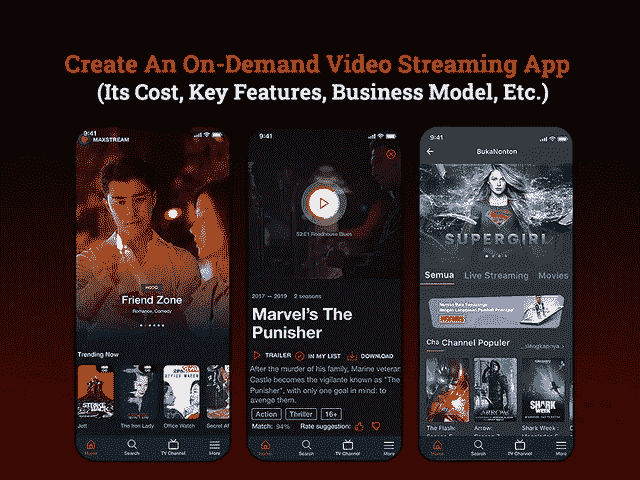

# 开发一个视频流应用程序:你要花多少钱？

> 原文：<https://javascript.plainenglish.io/develop-a-video-streaming-app-how-much-does-it-cost-you-c62b5303446?source=collection_archive---------4----------------------->

## 创建一个视频流应用程序需要多少成本？

网飞、YouTube 或 Hulu 等视频流媒体应用是电视的未来吗？嗯，电视是唯一主要娱乐来源的日子已经一去不复返了。

拥有 1.5 亿网飞全球用户和 71.6 亿美元收入的网飞已经占据了市场的中心位置，并成功超越了传统电视。

事实上，在疫情如此紧张的时期，直播应用程序像病毒一样传播开来，似乎是一种很好的娱乐来源。此外，世界上每个行业巨头都推出了自己的直播解决方案，如亚马逊的 prime、YouTube Live、Instagram Live 等，并且正在见证飞速增长。

如果你也在考虑推出一款点播视频流应用，成为这个蓬勃发展的行业的一部分，那么你就在正确的道路上。

但在此之前，你们中的许多人都想知道，在这个行业已经被科技巨头主导的情况下，为什么要投资这个应用程序的想法？要得到这个问题的答案，你需要更深入地挖掘视频流应用的市场统计数据，并了解下面提到的影响应用开发成本和时间的参数。

## **博客重点:**

*   *为什么投资视频流媒体移动应用开发？*
*   *开发点播视频流应用时最值得注意的事情
    -遵守广播规则并添加免责声明
    -内容和用户个人数据安全
    -用户互联网连接以获得出色的用户体验
    -服务器上的云托管*
*   *开发点播视频流应用的主要特性
    -需要考虑的前端特性
    -无缝功能的后端特性*
*   *如何从你的视频流应用中赚钱？
    -商务应用货币化画布*
*   *开发一个像网飞这样的视频流应用需要多少成本？
    -了解影响视频流应用开发成本的参数*
*   *结论*

> 让我们从详细讨论每一点开始…

## **为什么要投资视频流移动应用开发？**

随着应用程序开发中的新兴技术和创新，视频流应用程序正在吸引数百万观众的注意力，并通过推出自己的视频流应用程序为企业带来全新的机遇。用户数量每年都在急剧增加，毫无疑问，视频流媒体应用程序已被证明是产品和服务促销、直播通知、在线课程、广播等最强大、最有效的平台之一。

事实上，尽管许多企业一直在努力应对在家办公的限制，但企业中的流媒体网站的销售额却出现了增长。如果你仍然想知道它如何帮助你最大化你的回报，那么你需要看看这些统计数据…

*   像 Disney+这样的应用程序于 2019 年 11 月推出，已经在全球积累了大约 1.16 亿用户，Hulu 拥有 3880 万用户，而网飞在 2020 年的前三个月就增加了 1600 万用户，从而引领了这个行业。
*   根据调查报告，预计到 2021 年，视频流应用有望产生[708.45 亿美元的收入。](https://www.statista.com/outlook/dmo/digital-media/video-on-demand/video-streaming-svod/worldwide)
*   预计 2021 年，视频流媒体应用的平均每位用户收入将达到[65.68 美元。](https://www.statista.com/outlook/dmo/digital-media/video-on-demand/video-streaming-svod/worldwide)
*   到 2025 年，视频流媒体应用的用户数量预计将达到[14.23 亿。](https://www.statista.com/outlook/dmo/digital-media/video-on-demand/video-streaming-svod/worldwide)
*   [根据 Statista](https://www.statista.com/outlook/dmo/digital-media/video-on-demand/video-streaming-svod/worldwide) 的数据，2021 年用户渗透率将达到 14.3%，预计到 2025 年将达到 18.2%。

有了这些数据和事实，很明显，投资和计划创建一个像网飞这样的应用程序已经成为一个相当重要的决定。如果你最终下定决心，那么如果你真的想征服世界，有几个重要的考虑因素需要你牢记在心。

## **开发点播视频流应用时最值得注意的事情**

统计数据出来后，新兴企业充满热情和好奇，想知道以下问题的答案:

*   *如何创建像网飞一样的流媒体直播应用？*
*   *制作一个 Periscope 这样的流媒体直播 app 需要多少钱？*
*   *建立一个像网飞一样的视频流应用程序需要多长时间？更多…*

在我们得到这些问题的答案之前，首先你需要对这个应用程序有一个基本的概念。企业通常会聘请视频流应用开发公司，利用他们在该领域的专业知识和经验来帮助他们，但在视频流应用开发中，仍然有几个重要而重要的考虑因素不容错过。让我们开始吧…

*   **遵守广播规则并添加免责声明**

视频流应用程序通常被分类为不同的视频内容选项，这些选项并不适合所有年龄组，因此它们会在播放内容之前通知观众。

为了避免任何问题，请确保您的应用程序开发人员遵守广播内容的适当规则和法规，将年龄类型标记为 14 岁、18 岁以上、U/A、U、A，并根据这些标记或年龄组添加免责声明。

此外，你可以在签署应用程序时询问用户的年龄，并推荐适合年龄的内容，或者使用儿童锁或儿童帐户选项来过滤内容。

*   **内容和用户个人数据安全**

在启动像网飞这样的视频流应用程序时，为了您的内容和用户的个人数据安全，请确保您采用了高级别的安全性和视频加密。

为了提供最高级别的安全性，请确保应用程序开发人员正在进行应用程序质量测试，以检测安全系统中的任何问题或漏洞。此外，对于某些域，他们可以锁定内容并最大限度地降低内容泄露的风险。

此外，对于高端加密来说，提供许可和遵守法规可能是一个好主意。

*   **用户互联网连接带来卓越的用户体验**

为了获得不间断的用户体验并避免此类不便，将注意力放在互联网连接上非常重要，因为它会影响质量、加载速度等。

如果内容加载需要很长时间，那么将会影响用户体验。为了避免面对这些问题，请确保您提供各种质量选项，如 360p 到 4k 范围的视频观看。

*   **服务器上的云托管**

云托管是视频流应用程序开发过程中最重要的组成部分之一，因为它允许您将内容放在每个人都可以轻松访问的平台上。为了更好地管理应用程序的这一功能，值得 [**雇用移动应用程序开发人员**](https://www.appsdevpro.com/hire-developers/hire-mobile-app-developers.html) 来帮助您扩大应用程序的业务规模。你所需要的只是为额外的储物空间支付一些额外的费用，它提供了更好的可持续性。即使服务器崩溃，您的服务将继续工作。

无论你是在用网飞、YouTube、Disney+、Hulu 或更多网站复制应用克隆，如果不结合这些要点，成功的机会就更小。

视频应用程序开发的另一个主要因素实际上影响了应用程序的成功，那就是你为你的项目选择的特性和功能。

## **开发点播视频流应用的主要特性**

当谈到视频流移动应用程序开发时，每个企业主都梦想融入最佳功能选择，以满足您的业务需求并吸引您的客户。因此，记住这一点，我们在这里收集了帮助您获得更好结果的最佳功能选择。

为了便于理解和采用，我们将特性分为两个部分——前端(用户面板)和后端(管理面板)。

> **用户面板的特性**

*   **社交登录&注册:**大多数应用程序注册可以通过三个选项进行，要么使用电子邮件，要么使用电话号码或用户名，但为了让用户快速、简单和方便，你可以考虑整合社交媒体。
*   **浏览和搜索内容:**使用浏览框或搜索过滤器，从应用程序上提供的成千上万的视频内容中，找到您最喜欢的内容变得更加容易。允许用户根据语言、年龄类别、视频内容类型类别找到他们选择的内容。
*   **选择语言和类型:**用户喜欢用他们的本地语言观看视频，所以请确保您有不同语言的视频，或者提供使用他们选择的语言观看特定视频的选项。你可以想到 [**雇佣 app 开发者**](https://www.appsdevpro.com/hire-developers.html) 来定制这个功能或者帮你上传多语言选项的内容。
*   **将视频添加到播放列表:**通过此功能，用户可以快速将他们喜欢的内容或剪辑添加到播放列表中，以便稍后或再次观看。该功能将提供极大的便利，并提升用户体验。
*   **播放视频预览:**确保你添加的是视频的预览，这样用户可以快速了解这个内容是否符合自己的选择。用户会喜欢视频宣传片，而不是花 2 到 3 个小时看无聊的内容。
*   **下载视频离线收听:**为了获得不间断的用户体验，许多用户更喜欢下载他们在离线模式下可以欣赏的内容，因此请确保您的内容可供下载。此外，你可以在这里提到内容的质量范围，这样它就不会在手机上占据太大的空间。
*   **创建公共和私人播放列表:**允许用户将内容分成两个播放列表，他们可以在电话上私下观看，也可以与家人一起观看公共视频。
*   **在不同的社交网络上分享视频:**根据视频的类型，你可以选择在不同的社交媒体平台上分享内容，以扩大你的业务范围。
*   **按名称、艺术家和专辑搜索视频:**在这个视频流应用程序中有一个选项，可以根据艺术家、专辑或制作人名称搜索剪辑或内容，以确保出色的用户体验。
*   **支付集成:**由于不同的人使用不同的支付方式使用该应用程序，因此具有多支付集成的功能是有意义的。
*   **在你的订阅中管理设备:**可以付费选择在多个设备上访问应用程序，但请确保你的应用程序中有此选项，并允许用户在移动设备、电视、笔记本电脑或平板电脑上观看视频。
*   **使用应用内语音助手:**有了语音识别功能，用户在你的应用上搜索任何内容都变得容易得多。此外，对于那些不能深入应用程序导航的所有年龄组来说，它也更容易访问。

> **管理面板的功能**

*   **管理订阅用户和用户:**如果你正在考虑开发一个像网飞这样的应用，那么你可能很快就会看到数百万的订阅用户，但是要管理好你的应用，并随着用户群的增加而扩大规模。
*   **在平台上上传视频:**确保你在后端有一个功能，可以在不中断应用程序任何其他功能的情况下，完美地上传或添加内容。
*   **编辑视频、艺术家或相册:**允许管理员根据不同艺术家和类别的相册管理内容。
*   **管理广告和促销:**通过此功能，管理员可以控制应用程序上的所有广告和促销。如果由于广告数量过多而导致放弃率增加，那么管理员可以限制广告或限制此类广告。
*   **运行忠诚度计划:**考虑增加忠诚度计划的功能，通过在每次购买时提供忠诚度积分来帮助你保持你的观众参与应用程序。
*   **管理订阅和会员:**允许管理员管理不同用户的多重订阅和会员计划。
*   **添加和删除视频、艺术家或专辑:**添加一个选项，从后端添加、删除不在趋势中或具有最低浏览量或下载量的视频内容。因为这是一个重要的功能，你可以考虑雇佣一个应用程序开发者来帮助你以一种更简单直接的方式定制它。
*   **应用分析:**要分析你的应用表现如何，你可以添加仪表盘，提供应用指标，让你跟踪用户访问你的应用的频率、哪个年龄组或来自哪个位置、活跃用户、货币化模式的使用等。

这些是你在计划创建像 YouTube 或网飞这样的点播视频流应用程序时可以考虑的几个功能。但是，在雇佣一个**的移动应用开发者之前，你们中的许多人都很困惑它将如何帮你的企业赚钱？视频流应用的商业盈利前景是什么…**

## ****如何从网飞这样的视频流媒体应用中盈利？****

**说到在 app 开发上投入巨大的预算和精力，我是如何用我的商业 app 开发思路赚钱的？**

**这是所有企业孵化器最突出的问题之一。有几种方法可以将你的线下业务货币化，但当你将业务迁移到数字平台时，业务货币化策略的工作方式会有所不同。**

> **以下是从流媒体服务中获利的三种主要方式。**

*   ****订阅和会员计划****

**这种模式是流媒体平台最流行也是最常见的盈利方式之一。虽然它可以免费下载，并提供 15 天的试用期，因此潜在用户可以有机会检查他们是否喜欢这个平台，是否愿意为此付费。**

**订阅计划可以从基本、标准到 VIP 选项变化，因此它们向用户提供不同的访问。**

*   ****广告和促销****

**这很简单，也是行业领导者使用的主要创收策略之一。你可以向其他公司收费，让他们在你的平台上投放广告。如果与主题相关，也可以在视频内容中添加产品广告。**

*   ****视频内容上市费****

**你可以在一个月或一周内为每个相册列出大量内容来收取费用。这是从你的视频流应用程序(如网飞)赚取额外收入的好方法。**

**无论你对流媒体平台使用哪种应用盈利策略，你最常问的问题都是一样的，即创建一个像网飞这样的视频流媒体应用需要多少成本？但在此之前，如果你打算创建一个像网飞一样的移动应用程序，请确保你雇佣了一家移动应用程序开发公司，该公司可以帮助雇佣业务分析师、项目经理、应用程序开发人员、质量分析师、UI/UX 设计师等项目人员，以确保项目按时交付。此外，寻找一个有能力的应用程序开发团队，他们拥有使用最新技术、工具和应用程序开发策略的专业知识和经验。**

## ****开发一个视频流 App 要多少钱？****

**估算像网飞这样的点播视频流媒体应用的成本从来都不是一件简单的事情。由于视频流应用程序包装了大量采用先进技术开发的特性和功能，并且可以在多个平台上完美运行，因此固定数量的应用程序开发成本是一项复杂的任务。**

**应用程序开发的精确成本实际上取决于几个因素，例如应用程序的大小、集成的特性和功能的数量、设计的可扩展性、UI/UX 设计的复杂程度等等。**

**最重要的是，应用程序开发的总成本很大程度上受你选择雇佣的应用程序开发人员的影响，而他们的小时成本取决于应用程序开发人员的位置。**

**如果我们考虑总结所有这些因素和参数，并估计应用程序开发成本，那么它将是 20，000 美元的基本版本，这可能需要大约 4 至 6 个月的应用程序开发。而完全加载现代功能并由高质量标准驱动的中等至高级水平的流媒体应用程序将需要 9 个多月的开发时间，成本在 25，000 至 35，000 美元之间。**

**这些都是粗略的估计，因此建议期待与应用程序开发团队合作，讨论您的业务理念和需求，相应地，他们将帮助您获得实际的应用程序开发成本。**

# **结论:开发一个像网飞这样的视频流应用程序值得吗？**

**在过去的几年里，事情发生了巨大的变革，人们从基于文本的内容转向音频，然后迅速转向基于视频的内容。随着视频流应用程序中的直播功能，甚至博客也转向视频日志，以留住他们的追随者并吸引新的追随者。因此，如果你也计划用点播视频流应用程序扩展你的业务，那么 [**雇用移动应用程序开发人员**](https://www.appsdevpro.com/hire-developers/hire-mobile-app-developers.html) 帮助你推出一个包含所有最新技术和最新特性和功能的平台。**

**我们试图给你全面的信息，告诉你如何建立一个像网飞这样的应用程序，但是，如果你对应用程序开发有任何疑问或疑问，那么你可以联系我们或在下面提出疑问！**

**— — — — — — — — — — — — — — — — — — — — — — — — — — — — — —**

***更多内容请看*[***plain English . io***](http://plainenglish.io/)**