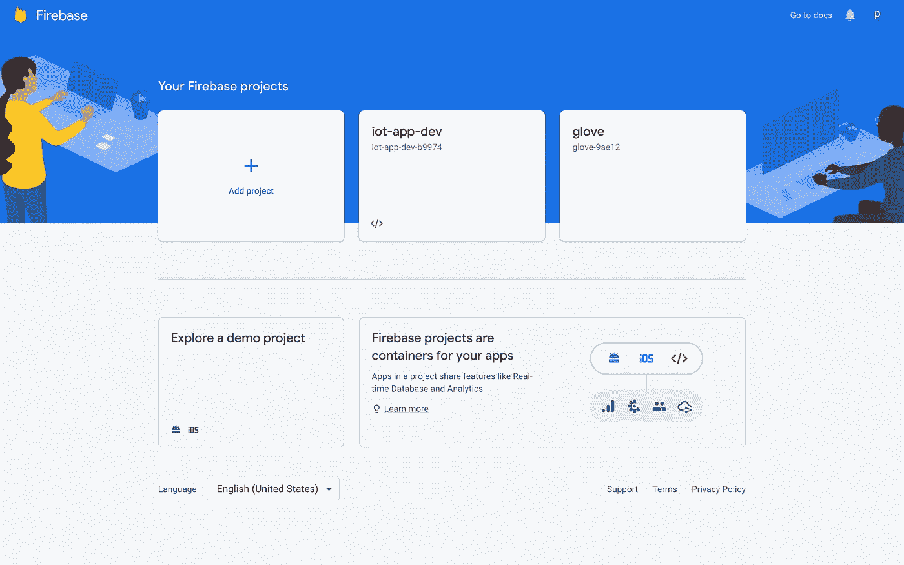
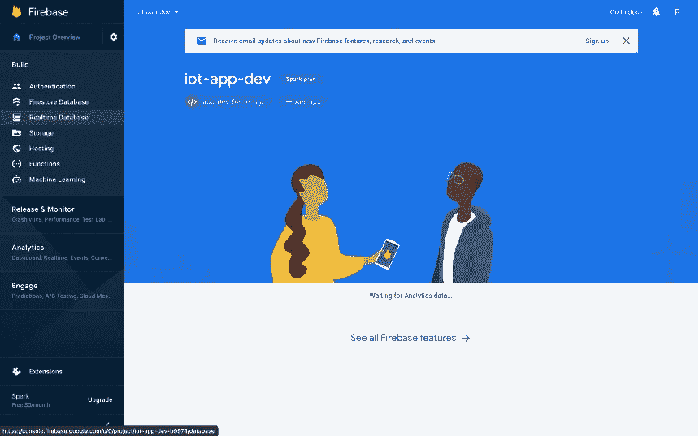
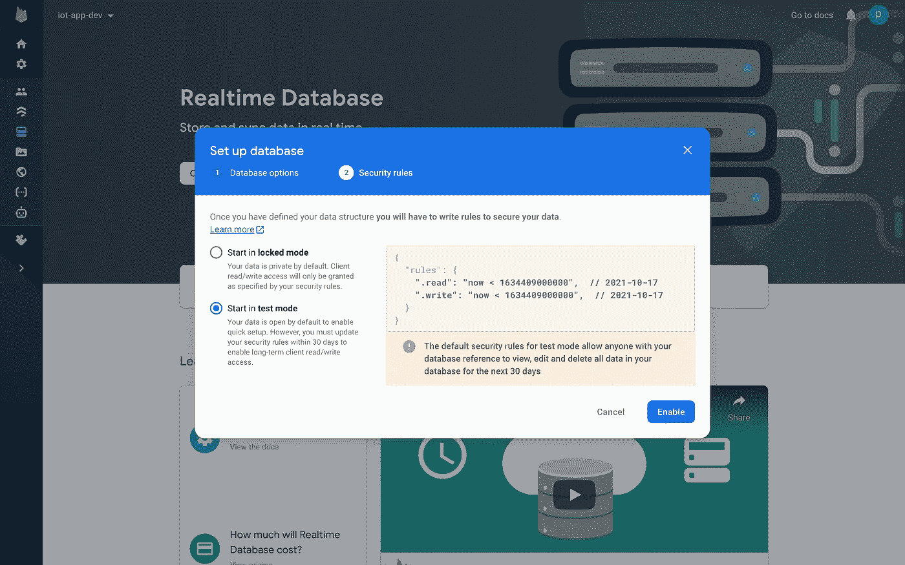
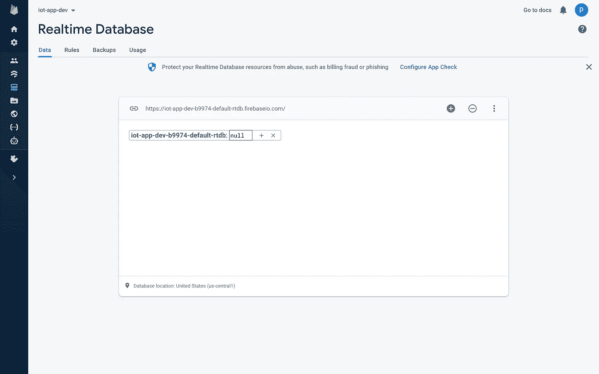
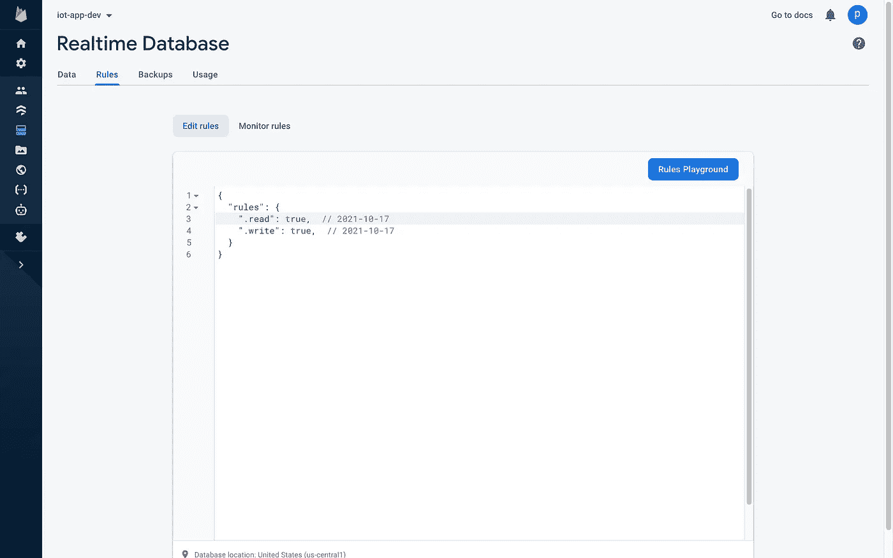
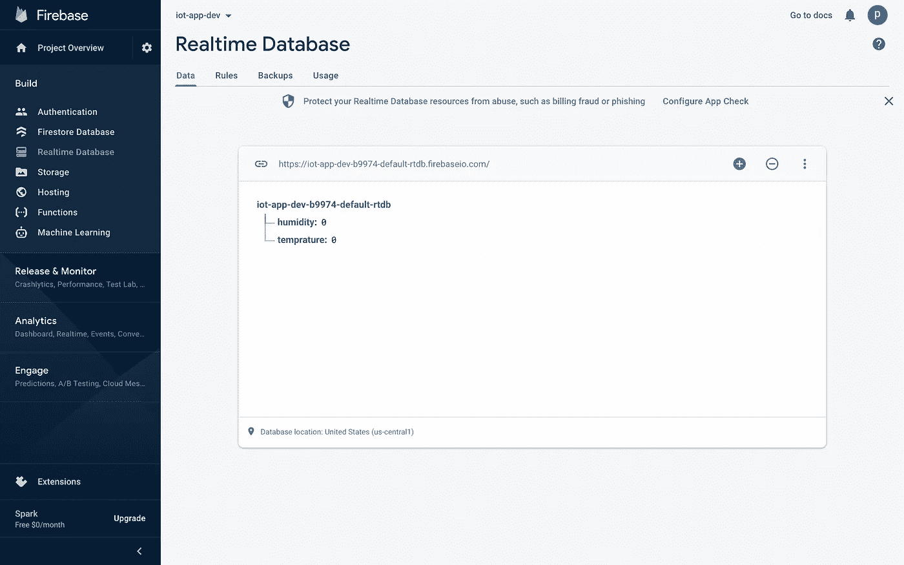
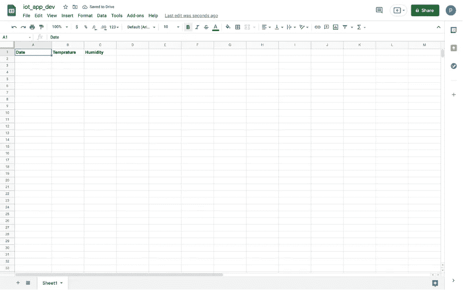
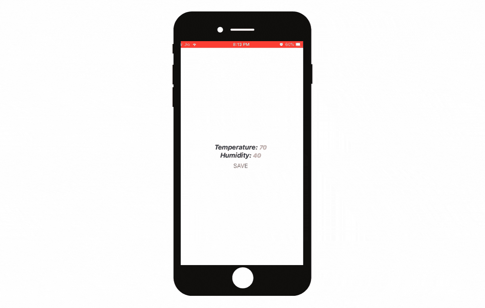
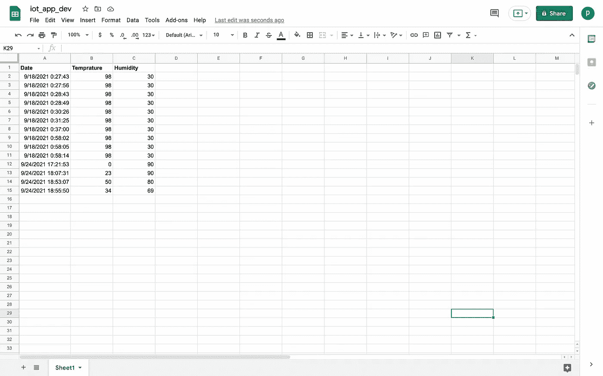

# 为物联网设备开发跨平台移动应用:简易入门指南

> 原文：<https://javascript.plainenglish.io/develop-cross-platform-mobile-apps-for-iot-devices-an-easy-starters-guide-bb9c01da9d87?source=collection_archive---------9----------------------->

## 使用 React Native、Firebase 和 Google Sheets 为物联网设备构建移动应用。


Created by the author

物联网已经渗透到生活的几乎所有领域。它对住宅建设、医疗保健、物流和环境保护有着最重要的影响。你可以在我的专利项目[这里](https://www.poojitagarg.com/smart-glove-for-physiotherapists)探索医疗保健领域的一个这样的用例。在从事这个项目的过程中，我花了大量时间寻找为支持物联网的设备创建完美移动应用的方法。经过一番努力，花了大量时间阅读博客，观看了大量 youtube 视频，我终于设计出了一种创建完美移动应用程序的好方法，我将在这篇博客中分享它的基本原理。

本教程将帮助您开发一个基本的 React-Native 移动应用程序，该应用程序能够通过 Wi-Fi 从您的物联网设备获取传感器读数，并将它们保存在 Google sheets 上以供将来检索。该指南基于应用程序开发及其与后端和云数据库的集成，因此，编码硬件(Arduino 和 Wi-Fi 模块)的步骤可以在详细的[这里](https://create.arduino.cc/projecthub/pulasthi-Narada/connecting-esp8266-to-firebase-to-send-receive-data-4adf66)找到。

让我们开始吧！为简单起见，我们将以一个**温度和湿度传感器系统**为例，我们需要通过我们的应用程序查看和保存温度和湿度读数。

```
**·** [**Setup real-time database with Firebase**](#9dc7)
  ∘ [*Step 1:* Creating an account and adding a project on Firebase](#8af8)
  ∘ [*Step 2:* Add a real-time database to your project](#d808)
  ∘ [*Step 3:* creating nodes for your data in the real-time database](#e554)**·** [**Connecting the React-Native app to firebase to view data on app**](#08bb)
  ∘ [*Step 1:* Create a new React Native project](#a689)
  ∘ [*Step 2:* Setup firebase in the app](#90a5)
  ∘ [*Step 3:* Create a Firebase event listener](#a6d2)**·** [**Saving data to Google Sheets using Google’s Apps Script**](#2e83)
  ∘ [*Step 1:* Create a Google Sheet for the project](#612a)
  ∘ [*Step 2:* Create Apps Script project](#a788)
  ∘ [*Step 3:* Create a function in the mobile app to save readings](#8592)**·** [**Conclusion**](#d932)
  ∘ [Resources](#09ae)
```

# 用 Firebase 设置实时数据库

Firebase 是一个后端即服务(Baas ),可以用来创建一个最小可行产品(MVP ),保持低成本并快速构建应用原型。Firebase 被谷歌收购，有一个健康活跃的社区。它为构建、发布、监控和分析应用程序提供了广泛的产品和解决方案。在本教程中，我们将使用 Firebase 的*实时数据库*作为我们的物联网设备和移动应用程序之间的桥梁。

## 步骤 1:在 Firebase 上创建一个帐户并添加一个项目

你可以使用你的谷歌账户登录 Firebase，然后进入“控制台”。



Firebase console (Image by author)

点击“添加项目”,通过几个简单的步骤开始您的新 firebase 项目。

## 步骤 2:向项目中添加实时数据库

单击左侧菜单中的“实时数据库”。通过添加您的位置和安全规则来创建新的实时数据库。 [Firebase 安全规则](https://firebase.google.com/docs/rules/basics#realtime-database)允许您控制对存储数据的访问。



Choosing ‘Realtime Database’ from the left menu (Image by author)

为了原型化我们的应用程序，我们将从“测试模式”开始。



Start the real-time database in ‘test mode.’ (Image by author)

## 步骤 3:为实时数据库中的数据创建节点

与 SQL 数据库不同，Firebase 实时数据库以 JSON 树的形式存储数据，没有表或记录。数据作为一个节点添加到现有的 JSON 树中，并带有一个惟一的键。你可以在这里阅读更多关于数据库[的结构。一个空白的实时数据库应该是这样的。](https://firebase.google.com/docs/database/web/structure-data)



Blank real-time database (Image by author)

您可以通过单击“+”号添加带有名称和默认值的新节点。为了让硬件访问实时数据库，我们必须确保数据库的读取和写入规则都设置为“真”(如果还没有设置的话)。可以通过单击“规则选项卡”来查看规则。



Setting read and write rules to ‘true’ (Image by author)

在添加了湿度和温度两个节点并将它们的值分别初始化为‘0’之后，我们的数据库看起来会像这样。



Firebase real-time database with desired nodes (Image by author)

# 将 React-Native 应用程序连接到 firebase 以查看应用程序上的数据

这一部分将创建一个简单的 React-Native 应用程序来显示我们的两个传感器读数。如果是第一次设置 React 原生开发环境，请参考 [React 原生官方文档](https://reactnative.dev/docs/getting-started)。

## 步骤 1:用 VS 代码或者任何你喜欢的编辑器创建一个新的 React 原生项目。

对于本教程，我们将使用 [Expo](https://expo.dev/) 来构建和部署我们的应用程序。Expo 是一个开源平台，使用 JavaScript 和 React Native 为 Android、iOS 和 web 制作通用的原生应用程序。在终端中使用以下代码安装 Expo CLI。我们将在 React-Native 项目的“App.js”文件中编写所有代码。

`npm install --global expo-cli`

## 步骤 2:在应用程序中设置 Firebase

要在我们的应用程序中使用 Firebase，我们需要在终端中使用下面的命令安装`firebase`库。

`npm install firebase`

安装后，我们可以通过以下三个简单的步骤在应用程序中设置 Firebase。第一，您应该使用`import * as firebase from “firebase”;`在代码中导入 firebase；第二，使用下面的代码基于您的 firebase 实时数据库的配置创建一个 Firebase 配置变量。这些配置可以在 Firebase 项目控制台左侧菜单中的“项目设置”中找到。

```
 const firebaseConfig = {
 apiKey: "XXX",
 authDomain: "XXX",
 databaseURL: "XXX",
 projectId:"XXX",
 storageBucket: "XXX",
 };
```

第三，您必须使用`firebase.initializeApp(firebaseConfig);`初始化 firebase 配置参数

## 步骤 3:创建 Firebase 事件侦听器

在这一步中，我们将首先使用`this.state.mUserRef = firebase.database().ref();`定义一个数据库引用，这里我们引用数据库中的完整数据，并将其存储在变量`mUserRef`中。

现在，我们必须在先前生成的数据库引用上创建一个事件监听器，以监视特定 Firebase 节点中的更改。在我们的例子中，每当新数据被添加到我们的数据库引用中时，监听器会自动向应用程序提供更新的数据，称为`snapshot`。你可以在这里了解更多这样的事件处理程序[。](https://firebase.google.com/docs/database/admin/retrieve-data#node.js)

在代码的后面，我们从实时数据的`snapshot` 中获取温度和湿度的 firebase 变量的值到两个本地变量`data_1`和`data_2`。之后，我们使用下面的代码设置 React 本机状态对象`temperature`和`humidity` 的状态，我们已经用各自的值初始化了它们。

```
 this.state.mUserRef.on(“value”, function (snapshot) {
       let data_1 = snapshot.val().temprature;
       let data_2 = snapshot.val().humidity; that.setState({
       temprature: data_1,
       humidity: data_2,
 });
 });
```

# 使用 Google 的应用程序脚本将数据保存到 Google Sheets

[Google Sheets](https://www.google.com/sheets/about/) 是一个电子表格程序，是 Google 提供的免费的基于网络的 Google Docs 编辑器套件的一部分。我们将使用 Google Sheets 作为我们的云数据库来存储我们的传感器读数。

[Apps Script](https://developers.google.com/apps-script) 是 Google 开发的一个脚本平台，用于 Google Workspace 平台中的轻量级应用开发。Apps Script 是一个平台，允许用户通过 JavaScript 派生的脚本语言来扩展谷歌的在线产品 G 套件。我们将使用应用程序脚本来自动添加我们的谷歌电子表格与添加的时间戳读数。

## 步骤 1:为项目创建一个 Google Sheet 作为云存储

转到 Google Sheets，用您的 Google 帐户登录。创建一个新的电子表格，并添加三列来记录**日期**、**温度**和**湿度**。您的工作表看起来会像这样



Blank google sheet with desired columns (Image by author)

## 步骤 2:创建一个 Apps 脚本项目，在 Google Sheets 和 React Native app 之间创建一个连接。

要使用 Apps 脚本，首先使用您的 Google 帐户登录 [Apps 脚本](https://www.google.com/script/start/)，点击“新建项目”创建一个新项目。我们将使用`SpreadsheetApp.openByUrl`它连接我们之前创建的 Google 电子表格，通过使用它的 **URL** 连接到我们的应用程序脚本项目，并在变量`spreadsheet`中引用它。要复制 **URL** ，到浏览器顶部，点击地址栏选择整个 **URL** 。

然后，我们使用`spreadsheet`变量来获取电子表格的特定工作表，即‘sheet 1’。

```
// fetch spreadsheet using its URL
var spreadsheet = SpreadsheetApp.openByUrl({**URL**});// reference the particular sheet in the sheet variable
var sheet= spreadsheet.getSheetByName("Sheet1");
```

现在，我们用参数`e`创建一个 doPost()函数，稍后我们将引用我们从移动应用程序的 Post 请求中收到的数据。我们使用 Date()函数给变量`date`分配时间戳。稍后，我们将参数解析成`e.parameter`以获得`temperature`和`humidity`变量的值。此外，我们使用 appendRow()函数并传递一个变量列表，我们需要将这些变量添加到 Google sheet 中。

```
function doPost(e){
var date = new Date();
var temperature = e.parameter.temp;
var humidity = e.parameter.hum;
sheet.appendRow([date,temp,hum]);
return ContentService.createTextOutput(“Success”).setMimeType(ContentService.MimeType.TEXT); }
```

我们使用 [ContentService](https://developers.google.com/apps-script/guides/content) 来指示我们的数据保存成功，并使用 createTextOuput 中的字符串“Success”作为指示符。我们将 mime 类型设置为`ContentService.MimeType.TEXT`，以成功地将我们的响应发送到我们的应用程序中的调用函数。你可以在下面找到完整的应用程序脚本代码。

保存后，我们将把项目部署为 web 应用程序。我们的 web 应用程序生成的 URL 将在稍后的应用程序代码中用于向我们的应用程序脚本代码发出 POST 请求。使用以下步骤将应用程序脚本项目部署为 web 应用程序。

1.  在脚本项目的右上方，点击**部署** > **新建部署**。
2.  在“选择类型”旁边，单击启用部署类型设置> **Web 应用程序**。
3.  在“部署配置”下的字段中输入有关您的 web 应用程序的信息
4.  点击**部署**。
5.  复制 URL 并保存以备后用。

***注意:*** *您应该确保，对于要由我们的移动应用程序访问的应用程序脚本 web 应用程序，在部署应用程序时，应将“有权访问的人”列标记为“任何人”*

## 第三步:在手机应用程序中创建一个功能，将读数保存到谷歌工作表中

我们将从在 React-Native 代码中创建一个名为`saveReadings()`的函数开始。我们将使用'[表单-数据'](https://www.npmjs.com/package/form-data)库来创建可读的“多部分/表单-数据”流，用于向其他 web 应用程序提交表单和文件上传。在我们的例子中，我们将使用表单数据来发送温度和湿度值。要安装表单数据库，使用项目终端`npm install form-data`中的代码，并使用`import FormData from “form-data”;`将其导入到您的代码中

接下来，我们将创建一个“FormData”类型的变量`bodyData`。我们将为变量`bodyData`添加我们之前设置的`temperature`和`humidity` 的状态数据值，同时使用`temp`和`hum`作为名称，以便在稍后作为参数传递时识别这些变量。

***注意:*** *确保变量“temp”和“hum”应该与在 Apps 脚本中使用 e.parameter 解析参数时使用的变量相同。*

然后，我们将使用 React-Native 的 [Fetch API](https://developer.mozilla.org/en-US/docs/Web/API/Fetch_API) 将我们的移动应用程序连接到我们的应用程序脚本的远程 URL。我们使用 fetch()函数发出 POST 请求，并在其主体中传递我们的`bodyData`。Fetch 方法将返回一个[承诺](https://developer.mozilla.org/en-US/docs/Web/JavaScript/Reference/Global_Objects/Promise)，我们可以使用`.then`得到它，并在变量 *res* 中捕捉响应。稍后，我们使用 *res* 变量进行检查，通过使用 [Alert](https://reactnative.dev/docs/alert) 创建具有指定标题和消息的警告对话框来警告用户保存是否成功。

下面给出了 saveReadings()函数的完整代码。

```
saveReadings = () => {

 var bodyData = new FormData();
 bodyData.append(“temp”, this.state.temprature);
 bodyData.append(“hum”, this.state.humidity); fetch(
 “{**URL**}",

 {
 method: “POST”,
 body: bodyData,
 }
 )
 .then((response) => response.text())
 .then((res) => {

 if (res == “Success”) {
 Alert.alert(“Great!”, “readings saved”, [{ text: “done” }]);
 }
 })
 .catch((e) => {
 console.log(e);
 });

 };
```

我们将调用这个 saveReadings()函数。下面给出了 react-native 应用程序的完整代码，包括使用的样式表和呈现组件。

使用`expo start`运行移动应用程序。您将被重定向到远程 expo 服务器，在那里您可以扫描生成的二维码以使用手机上的应用程序。您的应用程序看起来会像这样。



The final mobile application view



View of Google Sheets after saving some values

本教程到此为止。我希望这能帮助你开始物联网设备的应用程序开发，并帮助你使用它创建许多令人敬畏的“智能”项目:)

# **结论**

在本教程中，我们学习了如何在用于物联网设备的任何应用的三个基本组件之间创建基本连接，即实时后端、移动应用开发和云存储。在为基础服务的同时，这些连接可以根据特定的用例进行扩展，以包含更广泛和更复杂的功能。

最后，如果您正在开发包含敏感逻辑的商业 React 原生应用程序，请不要忘记特别注意。您可以了解更多关于安全方面的信息，以保护您的 react 原生应用程序免受代码窃取、篡改和逆向工程[点击这里](https://medium.com/simform-engineering/security-aspects-to-consider-for-a-react-native-application-95556f0e4244)。

感谢阅读。编码快乐！

## 资源

[完整代码实现](https://github.com/poojitagarg/iot_app_dev)

*更多内容请看*[***plain English . io***](http://plainenglish.io/)