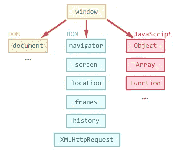

# 开发者面试问题:浏览器对象模型是什么？

> 原文：<https://javascript.plainenglish.io/developer-interview-question-what-is-the-browser-object-model-dfbf43b9b367?source=collection_archive---------14----------------------->

## 不要混淆 BOM 和 DOM！


Photo by [Tim Gouw](https://unsplash.com/@punttim?utm_source=medium&utm_medium=referral) on [Unsplash](https://unsplash.com?utm_source=medium&utm_medium=referral)

每个 web 开发人员都应该知道的一件事是 BOM，以及它到底有什么用。

JavaScript 中的浏览器对象模型(BOM)包括 JavaScript 与 web 浏览器交互的属性和方法。

BOM 为您提供了窗口对象，可用于多种用途，例如，显示窗口的宽度和高度，以及打开或关闭窗口。

例如，它包含了`window.screen`对象来显示屏幕的宽度和高度。

换句话说，它通过为 JavaScript 提供方法和属性，允许开发人员与浏览器交谈，而不仅仅是页面内容，如下图所示:



[Source](https://learn.javascript.ru/article/browser-environment/windowObjects.png)

然而，BOM 没有全球标准，因此每个浏览器都有自己的实现。

此外，值得注意的是，浏览器中的每个选项卡都有自己单独的`window`对象，因此在一个选项卡上执行的操作将仅限于该选项卡本身。

## BOM 和 DOM 有什么区别？

最明显的区别是名称本身——DOM 代表文档对象模型，而 BOM 代表浏览器对象模型。

DOM 基本上通过将整个页面视为一个文档来提供对页面的访问。

另一方面，BOM 由对象`navigator`、`history`、`screen`、`location`和`document`组成，它们是`window`的子对象。在`document`节点中是 DOM。

因为`window`对象是最核心和最根的元素，所有的东西都依附于它。因此引用它是多余的。

# BOM 示例

下面提供的代码片段使用 BOM 写窗口大小(以像素为单位)。

```
<!DOCTYPE html>
<html>
   <body>
      <script>
         document.write("Inner width: " + window.innerWidth);
         document.write("Inner height: " + window.innerHeight);
      </script>
   </body>
</html>
```

## 为什么每次都不需要引用`window`对象？

如前所述，由于`window`对象是最核心和最根的元素，所以所有的东西都依附于它。因此引用它是多余的。

```
window.document.getElementById("container");
document.getElementById("container");
```

在这里，两行代码完全相同，无论是否调用`window`对象都没有关系。

所有的全局变量和函数分别成为`window`对象的属性和方法。

## BOM 的一些重要功能

`window`对象让您可以访问一些在构建站点时最常用的功能。

```
//window dimenstions
const outerHeight = window.outerHeight;
const outerWidth = window.outerWidth;
const innerHeight = window.innerHeight;
const innerWidth = window.innerWidth;//setting timers
const timeout = setTimeout(callback, delay); // delay in ms
const interval = setInterval(callback, delay); // delay in msclearTimeout(timeout);
clearInterval(interval);//local storage
localStorage.setItem("lastname", "Smith");
```

你可以在这里找到一个更全面的列表[，它包括`alert`、`screenLeft`、`history`、`parent`、`navigator`等重要方法。](https://www.w3schools.com/jsref/obj_window.asp)

## 结论

BOM 或浏览器对象模型在 web 开发中至关重要，因此成为 web 开发人员在参加面试前应该知道的最重要的事情之一。

它允许开发人员使用 JavaScript 与窗口进行通信，并提供一些常见的功能，如设置计时器和时间间隔。

然而，仅仅知道理论上的定义是不够的，你必须应用这些知识。

做兼职项目是挑战自我的好方法，但是如果你厌倦了从零开始做项目，或者想要一个更有趣的方法来实现你的知识，看看下面这个博客。

[](/7-fun-games-you-should-play-to-up-your-coding-skills-ec051a55faaa) [## 你应该玩的 7 个有趣的游戏来提高你的编码技能

### 掌握各种网络技术的非典型方法。

javascript.plainenglish.io](/7-fun-games-you-should-play-to-up-your-coding-skills-ec051a55faaa) 

我将会发布更多关于 JavaScript 和 web 开发概念的短小精悍的文章，这篇文章仅仅是个开始。

我希望你喜欢阅读这篇文章！