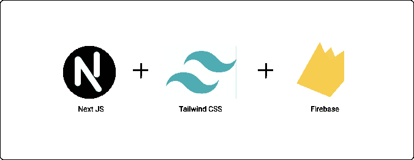

# 开发全栈存储库

> 原文：<https://javascript.plainenglish.io/developing-a-full-stack-repository-52dc58c4820?source=collection_archive---------21----------------------->

Next.js 中带顺风 CSS 的 Firebase。



[Repositories](http://www.ihatereading.in/repos)

我已经讲述了安装 Next.js、在 Next.js 中安装 Firebase 和在 Next.js 中安装 Tailwind CSS 的故事。在今天的故事中，我们将使用 Firebase、Tailwind CSS 和 Next.js 创建一个完整的全栈存储库。

[](https://medium.com/nerd-for-tech/2-minute-2-steps-for-installing-tailwind-css-in-react-8dd420d81647) [## 在 React 中安装顺风 CSS 只需 2 分钟和 2 个步骤

### 在下一个 JS 项目中开始使用 Tailwind CSS

medium.com](https://medium.com/nerd-for-tech/2-minute-2-steps-for-installing-tailwind-css-in-react-8dd420d81647) [](https://medium.com/nerd-for-tech/firebase-installation-with-react-35c9a2434d6f) [## 带 react 的 Firebase 装置

### 我们会安装燃烧基地来应对。

medium.com](https://medium.com/nerd-for-tech/firebase-installation-with-react-35c9a2434d6f) 

# 入门指南

最基本也是最重要的一步是安装所需的软件包。我们将需要以下包装—

*   顺风 CSS
*   PostCSS
*   自动预混合器
*   重火力点

```
yarn add firebase tailwindcss postcss autoprefixer
```

一旦安装了包，我们需要进行两个步骤:

*   添加 Firebase 凭据并初始化 Firebase。
*   添加顺风 CSS 配置并导入顺风 CSS。

# Firebase 凭据

要添加 Firebase 凭证，您需要从 Firebase 控制台获取凭证，一旦您在控制台中创建了一个项目，就会获得这些凭证。

一旦您获得了凭证，我们需要通过提供这些凭证并将我们的应用程序连接到项目来初始化 Firebase。

这也是一个简单的步骤。我更喜欢在 env 文件中添加凭证。然后为了初始化 Firebase 应用程序，我们在根目录下的 **utils** 中有 **firebase.js** 文件。

```
utils/
 -- firebase.js
```

我们已经初始化了 Firebase 应用程序。基本上，我们已经将 Firebase 连接到我们的前端应用程序。

# 连接顺风 CSS

一旦安装了所需的包，使用 Tailwind CSS 也非常容易。我们只需要创建 2 个文件并执行一个步骤来将 Tailwind CSS 添加到我们的存储库中。

创建一个文件名 **postcss.config.js，并**在文件中添加以下代码:

```
module.exports = {
  plugins: {
    tailwindcss: {},
    autoprefixer: {},
  },
}
```

在根目录中创建另一个名为 tailwind.config.js 的文件，并向其中添加以下代码:

```
module.exports = {
 purge: ['./pages/**/*.{js,ts,jsx,tsx}', './components/**/*. {js,ts,jsx,tsx}'],
  darkMode: false, *// or 'media' or 'class'* theme: {
    extend: {}, 
    screens: {
       'xxs': '320px',
        *// => @media (min-width: 320px) { ... }* 'xs': '420px',
         *// => @media (min-width: 420px) { ... }* 'sm': '640px',
         *// => @media (min-width: 640px) { ... }* 'md': '768px',
         *// => @media (min-width: 768px) { ... }* 'lg': '1024px',
         *// => @media (min-width: 1024px) { ... }* 'xl': '1280px',
         *// => @media (min-width: 1280px) { ... }* '2xl': '1536px',
         *// => @media (min-width: 1536px) { ... }* }},
 variants: { 
    extend: {},
 },
   plugins: [],
}
```

最后一步是在 pages 目录的 **_app.js** 文件中导入 Tailwind CSS。导入 Tailwind CSS，你就完成了设置。

# 结论

我们正在创建安装过程中所需的所有存储库。每个存储库都遵循一个被全世界接受并在专业领域使用的架构。

您可以在这里找到更多存储库— `www.ihatereading.in/repos`

```
**Code repository —** [https://github.com/shreyvijayvargiya/iHateReadingLogs/tree/main/TechLogs/FirebaseWithTailwindCSSAndNextJS](https://github.com/shreyvijayvargiya/iHateReadingLogs/tree/main/TechLogs/FirebaseWithTailwindCSSAndNextJS)
```

[](https://medium.com/nerd-for-tech/these-online-courses-are-missing-one-single-thing-e8950e9561ed) [## 那些在线课程忽略了一件重要的事情

### 他们从来没有教你建筑的重要性

medium.com](https://medium.com/nerd-for-tech/these-online-courses-are-missing-one-single-thing-e8950e9561ed) 

*更多内容请看*[*plain English . io*](http://plainenglish.io/)