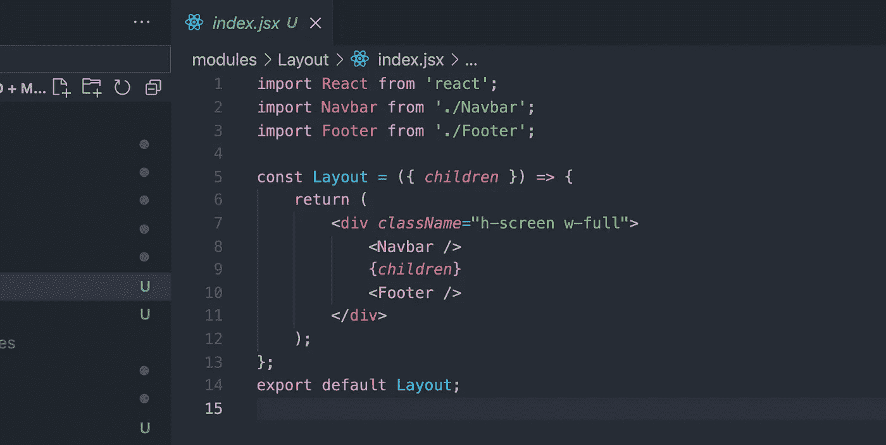

# 开发一个布局包装，整个网站的一个组成部分

> 原文：<https://javascript.plainenglish.io/developing-a-layout-wrapper-one-component-for-the-entire-website-51618d7de1b8?source=collection_archive---------13----------------------->

这个组件开发了你整个网站的布局。



[**Find more here**](http://www.ihatereading.in)

## 在后台

React 制造可重用组件的概念以及一次编写、随时随地使用的理念非常强大。我喜欢它，作为一名自由开发人员，我的大多数客户至少有 2/3 的功能或产品是我已经开发过的，所以我不再浪费时间重复编写相同的逻辑，而是重用它。

同样，我已经创建了几乎所有的前端 UI 库安装过程，你可以在下面的链接中找到。您可以在下一个自由职业项目中使用这个库，所以请继续查看。

## 概观

在今天的故事中，我将向您展示如何为您的前端项目开发布局包装器或组件。首先，让我解释一下什么是布局包装器。包装整个前端项目的包装器由导航条、页脚等组件组成，这些组件通常可以在网站的几乎所有页面上找到。

## 定义和要求

你一定想知道为什么布局包装如此有用

*   一个包装器处理整个网站的响应
*   几乎在应用程序的每个页面上都可以重用一个包装器
*   代码更少，开发速度更快
*   更少的代码更容易维护代码库

我可以记下很多要点来展示拥有布局包装器的好处——它让一切变得如此简单。

让我们决定我们的布局看起来像什么，因为，我已经解释过，布局是根应用程序的包装器，由几乎每个页面中常见的组件组成，在这种情况下，我们的布局将有一个导航栏和一个页脚。

## 布局组件

我们的布局组件肯定会有 3 个子组件:导航栏、页脚和应用程序的主体。

*   导航条——应用程序的最顶层
*   主体—应用程序的内容
*   页脚—应用程序的结尾

```
const Layout ({ children }) => {
  return (
   <div>
    <Navbar />
    {children} 
    </Footer />
   </div>
  )
};
```

子组件是一个道具，它将呈现我们的布局组件的子组件，分别由顶部和底部位置的 navbar 和 footer 覆盖。

## 开发组件

让我们开发简单的导航栏和页脚组件。我将使用现成的示例 repo 在根目录的 modules 文件夹中开发这些组件。

一旦 repo 被克隆，下面是 navbar 和 footer 组件的样本代码，没有这样的火箭科学。布局、导航栏和页脚等所有组件都将添加到`modules`文件夹中，并在下一个 js 项目中将其打包到 inside _app.js 中，在`src`文件夹中将其打包到 index.js 中，以创建 React 应用程序。

```
--Layout
 -- Footer
   -- index.jsx
 -- Navbar
   -- index.jsx
 --index.jsx
```

布局模块的架构将看起来像这样，不要担心在最后我会分享代码库有一个更好的外观。

```
// wrapping layout inside  _app.jsimport { Layout } from '../modules';
import 'tailwindcss/tailwind.css'function MyApp({ *Component*, *pageProps* }) 
 return (
   <Layout>
     <Component {...pageProps} />
   </Layout>
  );
};export default MyApp; 
```

我们已经导入了布局模块，并将其包装到应用程序的根目录，现在我们的导航栏和页脚组件可以在应用程序的每个页面中找到。

Footer component

Navbar Component

Layout component

这样，我们就为整个前端应用程序创建了布局包装器。为了测试它的额外功能，我又创建了 2 个页面，比如 about 和 contact，如果你去那些地方，你会发现只有子组件在改变，其余的导航栏和页脚是一样的，可以重复使用。

## 结论

这种逻辑非常强大，并且易于开发和维护，你甚至可以根据用户主题(如深色或浅色)或路线(如 about 或 contact)来改变导航栏和页脚的布局，任何事情都是可能的，这使得这个想法非常具有可扩展性。这样的故事继续关注我。

```
[**Click to reach the code repository**](https://github.com/shreyvijayvargiya/iHateReadingLogs/tree/main/TechLogs/Layout%20Wrapper)
```

下次再见，祝大家愉快。

```
For more such stories - 💻 [**iHateReading**](http://www.ihatereading.in)
```

## 更多阅读

[](/4-steps-for-reusable-user-wallet-logic-in-frontend-1626d1cd126a) [## 前端可重用用户钱包逻辑的 4 个步骤

### 一次编写，随时随地使用。😎✌️

javascript.plainenglish.io](/4-steps-for-reusable-user-wallet-logic-in-frontend-1626d1cd126a) [](https://medium.com/geekculture/3-ways-for-the-perfect-onboarding-process-9e3eee47e9d2) [## 完美入职流程的 3 种方式

### 致所有产品经理、设计师和开发人员💬

medium.com](https://medium.com/geekculture/3-ways-for-the-perfect-onboarding-process-9e3eee47e9d2) [](https://medium.com/geekculture/5-tips-for-perfect-landing-page-b235b6bb0fb7) [## 完美登录页面的 5 个技巧

### 为了一个稳定的登陆页面，注意这 5 件事

medium.com](https://medium.com/geekculture/5-tips-for-perfect-landing-page-b235b6bb0fb7) 

*更多内容尽在*[*plain English . io*](http://plainenglish.io/)