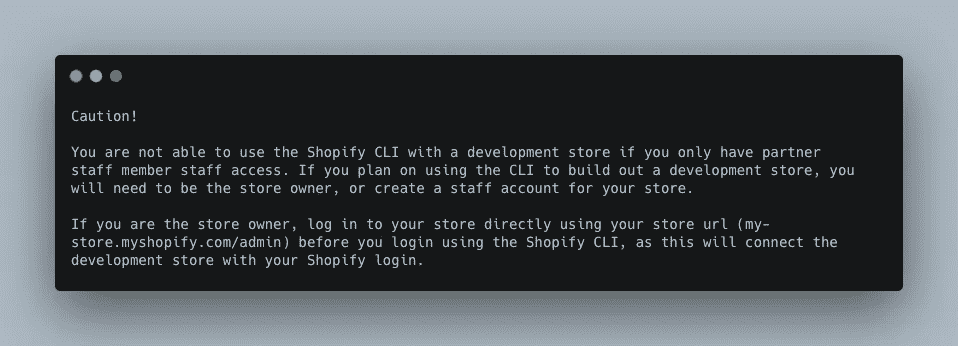

# Shopify 定制主题开发入门

> 原文：<https://javascript.plainenglish.io/developing-custom-themes-for-shopify-getting-started-b137407c0cb7?source=collection_archive---------3----------------------->


Photo by [Nataliya Vaitkevich](https://www.pexels.com/@n-voitkevich?utm_content=attributionCopyText&utm_medium=referral&utm_source=pexels) from [Pexels](https://www.pexels.com/photo/black-iphone-7-on-pink-surface-6214453/?utm_content=attributionCopyText&utm_medium=referral&utm_source=pexels)

所以你想为 Shopify 建立一个自定义主题，但不确定从哪里开始？好吧，那么，我是来帮忙的。这个过程非常简单，但是在开始之前你需要一些东西。首先，您需要一台能够运行 IDE 的计算机。我个人使用 mac，但 windows 电脑或运行任何形式的 linux 的电脑也可以(我将只使用 mac 的终端命令，但这些也可以在 Windows 上运行)

在开始之前，您需要一些先决条件。他们是

*   使用 Ruby installer for Windows(2.7 或更高版本)安装 [Ruby](https://www.ruby-lang.org/en/) 或 [Ruby+Devkit。](https://rubyinstaller.org/downloads/)
*   如果你想使用一个[开发商店](https://shopify.dev/themes/tools/development-stores)来建立一个主题，那么创建或登录一个 [Shopify 合作伙伴账户](https://partners.shopify.com/signup)，然后[创建一个开发商店](https://shopify.dev/themes/tools/development-stores#development-store-apps-themes)。
*   确保您有一个[协作者帐户](https://shopify.dev/themes/tools/collaborator-accounts)或[员工帐户](https://help.shopify.com/manual/your-account/staff-accounts)，并且拥有管理主题权限或您想要工作的商店的主题权限，或者您是商店的所有者。
*   记下您想要使用的商店的 URL。
*   确定您已接入互联网。大多数 Shopify CLI 命令需要互联网连接才能运行。
*   您选择的 IDE。一些流行的是[Visual Studio Code](https://code.visualstudio.com/)&[Atom](https://atom.io/)，因为它们是免费的并且背后有大型社区。还有几十个，但这是我个人用过的，可以强烈推荐的 2 个。
*   确保安装了[自制软件](https://brew.sh/)。家酿是包管理器，Shopify 推荐的，所以是我用的。您可以通过运行以下命令轻松安装它。

```
/bin/bash -c "$(curl -fsSL [https://raw.githubusercontent.com/Homebrew/install/HEAD/install.sh](https://raw.githubusercontent.com/Homebrew/install/HEAD/install.sh))"
```

一旦你完成了所有这些，你就准备好发展了！

在终端中，您需要运行以下两个命令。这样做的目的是让你可以从 Shopify 自己构建的 CLI(命令行界面)中安装主题和更新。这将使从 Shopify 下载更新和代码更加容易。你可以在他们的 CLI [这里](https://shopify.dev/themes/tools/cli)阅读更多内容。

```
brew tap shopify/shopifybrew install shopify-cli
```

接下来，您需要登录 Shopify CLI，将您的本地计算机连接到您的在线商店。您可以通过在终端中键入以下内容来实现这一点(将 my-store 替换为您在设置开发存储时使用的任何内容)

```
shopify login --store my-store.myshopify.com
```

在终端中键入此命令后，您的浏览器窗口将会打开。在您的浏览器窗口中，登录到您要用于开发的商店所关联的帐户。



A Cautionary tale

成功登录后，您将需要在本地环境中初始化一个新主题。为了实现这一点，您需要将您的目录更改到您想要工作的地方。我通常有一个名为 development 的目录，这是我保存所有工作的地方。如果您想知道如何实现这一点，请运行以下命令。这将克隆样本主题，Shopify 允许你在你的个人电脑上访问它，这样你就可以开始构建了。

```
// change your directory to the documents director
cd documents// make a new directory named development
mkdir development// change your directory to your newly created development environment
cd development// use the Shopify CLI to create a fresh copy of the theme "dawn"
shopify theme init
```

一旦这样做了，你将想要改变你的目录到你命名的主题。运行以下命令来实现这一点。

```
cd "enter theme name here"
```

接下来，我们将需要一些数据来处理。这可以是任何东西，从产品到客户，甚至是草拟订单，要完成这一点，您可以运行以下任何或所有命令。

```
shopify populate productsorshopify populate customersorshopify populate draftorders
```

这将引入模拟数据，供您使用您的主题进行测试。现在我们可以开始构建我们的主题了。要启动本地环境，请运行以下命令

```
shopify theme serve
```

你的终端会显示一个进度条，并给你一些链接，你可以在那里查看你的工作。一旦你开始开发，你偶尔会想“剥”你的工作。简而言之，林挺就是你运行命令来清理你的代码并保持其一致性的地方。它会让您在推进代码之前知道是否有问题，这是您最不希望出现问题的地方。就当是安全检查吧。您可以通过运行以下命令来 lint

```
shopify theme check
```

完成所有这些之后，您就可以开始实际编写代码了。在您的 IDE 上打开代码并开始构建！

如果你想要一些 Visual Studio 代码插件，我个人使用下面的

*   [Shopify Liquid](https://marketplace.visualstudio.com/items?itemName=Shopify.theme-check-vscode)—[官方 VS 代码扩展 Shopify Liquid](https://shopify.dev/docs/themes) 由[主题检查提供支持](https://github.com/Shopify/theme-check)在线商店主题的 Liquid linter 和语言服务器。
*   液态语言支持 —这是一个针对 Visual Studio 代码的液态语言支持扩展。
*   [括号对上色器](https://marketplace.visualstudio.com/items?itemName=CoenraadS.bracket-pair-colorizer) —该扩展允许用颜色识别匹配的括号。用户可以定义匹配哪些字符，使用哪些颜色。
*   [更漂亮的](https://marketplace.visualstudio.com/items?itemName=esbenp.prettier-vscode) —一个固执己见的代码格式化程序。它通过解析您的代码并根据自己的规则(考虑到最大行长度，必要时换行)重新打印代码来强制执行一致的风格。
*   [着色](https://marketplace.visualstudio.com/items?itemName=kamikillerto.vscode-colorize) —在您的 css/sass/less/post CSS/stylus/XML…文件中即时可视化 CSS 颜色。

我希望这篇文章是令人愉快的。如果你有任何反馈，发表评论，让我知道我可以改进的地方。如果你想看看我的其他帖子，可以在这里找到。我写的都是前端特有的东西，所以我有关于基于[类的 React 组件](/class-based-components-in-react-14335f0ee539)、 [Fetch API](https://avetwhocodes.com/fetching-data-from-an-api-with-the-fetch-api-in-react-5dbe0abcfb41) 、 [React](/level-up-your-react-skills-with-the-use-of-composition-766a41f544c9) 、 [TypeScript](https://jgrice01.medium.com/typescript-understanding-the-basics-a2264759cd2d) 、[SASS](https://medium.com/codex/writing-better-sass-with-dynamic-class-generators-e486a0413d0d)&[electronic](https://jgrice01.medium.com/want-to-build-desktop-apps-using-js-say-hello-to-electron-4f862c3b4e38)的文章。感谢您的阅读，祝您愉快！

*更多内容看*[***plain English . io***](http://plainenglish.io)