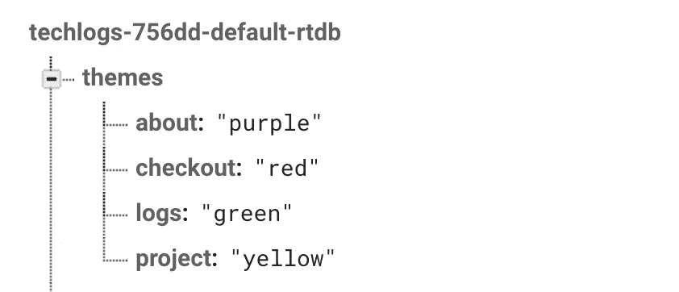
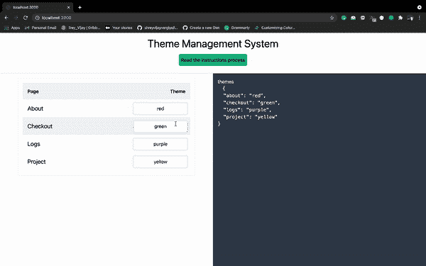
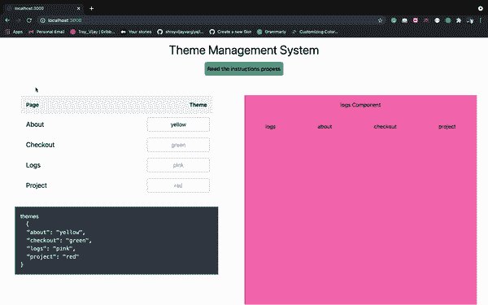

# 开发一个主题管理系统

> 原文：<https://javascript.plainenglish.io/developing-theme-management-system-c55e5bb996a0?source=collection_archive---------22----------------------->

## 在我想到开发它之前，没有这样的东西存在。


Photo by [William Felker](https://unsplash.com/@gndclouds?utm_source=medium&utm_medium=referral) on [Unsplash](https://unsplash.com?utm_source=medium&utm_medium=referral)

是的，大概这个主题管理系统只归入内容管理系统，不确定。但是有一个单一的主题控制或管理是如此强大，因为我们可以简单地将我们的网站外观交给公司的非技术员工或营销团队。

整个故事始于现实世界，当时一位营销经理坚持让我们的团队在吉祥的排灯节期间改变前台主题。手动更改代码中的所有内容让我痛苦不堪。后来，我明白了为什么我们有时应该有一个单一的管理系统，以使我们将来的工作更容易。

开发就是在当前时间内解决问题和编写代码，这样你就不必在将来编写更少的代码，所以手动添加新颜色或改变颜色根本不是一个好主意，这只会增加我的工作量。

昨天，我写了另一篇关于如何在 react 应用程序中切换主题的文章，在那篇文章中，我给出了将这些主题存储在数据库中的想法和方法，可以使用简单的管理系统进一步编辑这些主题。今天，我将向你展示如何开发这个主题管理系统。

[](https://shreyvijayvargiya26.medium.com/theming-and-theme-switching-in-react-8dc99797ed49) [## React 中的主题化和主题切换

### 这是一个有趣而强大的游戏，让我来教你怎么做。

shreyvijayvargiya26.medium.com](https://shreyvijayvargiya26.medium.com/theming-and-theme-switching-in-react-8dc99797ed49) 

我将使用 Firebase 实时数据库来存储主题。我们将开发一个界面来更新、编辑甚至删除 firebase 数据库中的主题。最后，我们将从 firebase 中获取这些主题对象，并相应地更新我们的 UI。

我没有介绍在 firebase 控制台中创建项目的完整过程，也没有介绍如何开始使用实时数据库及其方法，也没有介绍在您的项目中设置 Firebase 的任何过程，相反，我将使用 [**即用型示例**](https://github.com/shreyvijayvargiya/iHateReadingLogs/tree/main/TechLogs/FirebaseWithTailwindCSSAndNextJS) ，其中预装了 Firebase、Tailwind CSS 和 next js。

克隆存储库后，用您的 firebase 凭据替换 firebase 密钥。

# 创建主题数据库

在 Firebase 实时数据库中，创建一个名为 themes 的数据库对象。这个对象包含了我们应用程序的整个 UI 主题。

```
const themes = {
  logs: green,
  about: purple,
  checkout: red,
  project: yellow
}
```

键-值对将页面的名称定义为键，值是相应页面的主题。

现在你可以理解这有多容易，我们可以有一个接口作为我们的管理系统来控制、编辑、删除或更新这个主题对象，然后可以在前端应用程序中获取最新的 UI 主题。

# 开发系统

在 Firebase 控制台中，我创建了一个实时数据库主题。结构将如下所示。



Themes database object in the real-time database

我们将开发一个界面来编辑，获取，更新这些键值。

# 火基方法

Firebase 提供了编辑、保存和删除对象的方法。我们将如下所述使用这些方法。

用户可以同时编辑所有值，并且只能在单击保存按钮后保存。主题对象在 JSON 预览模式的右边预览。



Here is the demo

```
const [ themes, setThemes ] = useState(null);function handleChange(*e*){
  const val = e.target.value;
  const name = e.target.name;
  setThemes(*prevState* => ({
    ...prevState, [name]: val 
   }));
};function handleSave(){
  const dbRef = app.database().ref("themes");
  dbRef.set(themes);
};
```

OnChange 函数，处理变化只是更新我的主题对象，并把它放在最新和更新更多。我们使用输入的模糊值来保存值，因此一旦用户停止输入并移动光标，firebase 数据库中的主题值就会更新。

# 前端的可访问性

下一步是简单地访问这个主题对象并应用它们。我将使用主题对象中每个页面的值，并将其设置为背景色。

我们有一个从 modules 文件夹导入的通用 Navbar 组件，顺便说一下，它将提供一组按钮，用于重定向到其他页面，如 about、check out 等。每个页面都有相应于主题对象的背景颜色。

以上是 Navbar 组件的要点，这里是最终产品的演示。



The final product

# 结论

我们遵循的流程是首先创建一个界面，该界面将编辑和创建主题对象，并将该主题对象保存在 firebase 或我们的数据库中。然后从我们的数据库中获取主题对象，并相应地更新我们的 UI 主题。这是如此强大和易于执行的系统，你甚至可以为你的每个页面创建多个主题。

您可以将这些值存储在 SQL 或 NoSQL 数据库中，以任何您想要的高度可伸缩和广泛的方式。

这是代码库

```
[https://github.com/shreyvijayvargiya/iHateReadingLogs/tree/main/TechLogs/ThemeManagementSystem](https://github.com/shreyvijayvargiya/iHateReadingLogs/tree/main/TechLogs/ThemeManagementSystem)
```

直到下一次。祝大家愉快。

[](/nobody-covers-this-real-world-installation-process-of-adding-test-cases-to-react-components-1fda2c2bd738) [## 没有人讨论过添加测试用例来反应组件的真实安装过程

### 使用已经安装的第三方库(如 Redux)为 React 组件编写测试用例。

javascript.plainenglish.io](/nobody-covers-this-real-world-installation-process-of-adding-test-cases-to-react-components-1fda2c2bd738) [](https://medium.com/nerd-for-tech/this-library-makes-css-a-cakewalk-471521a27d5a) [## 这个库使 CSS 变得轻而易举

### 替代 bootstrap 和 tailwind CSS，使用 React 应用程序开始使用 Bulms CSS

medium.com](https://medium.com/nerd-for-tech/this-library-makes-css-a-cakewalk-471521a27d5a) 

## 进一步阅读

[](https://bit.cloud/blog/theming-in-components-with-react-and-bit-l386casw) [## 使用 React 和 Bit 在组件中进行主题化

### 工程和设计团队面临的一个大的组织问题是分离外观和感觉…

比特云](https://bit.cloud/blog/theming-in-components-with-react-and-bit-l386casw) 

*更多内容请看*[***plain English . io***](https://plainenglish.io/)*。报名参加我们的* [***免费周报***](http://newsletter.plainenglish.io/) *。关注我们关于*[***Twitter***](https://twitter.com/inPlainEngHQ)[***LinkedIn***](https://www.linkedin.com/company/inplainenglish/)*[***YouTube***](https://www.youtube.com/channel/UCtipWUghju290NWcn8jhyAw)***，以及****[***不和***](https://discord.gg/GtDtUAvyhW) *对成长黑客感兴趣？检查* [***电路***](https://circuit.ooo/) ***。*****