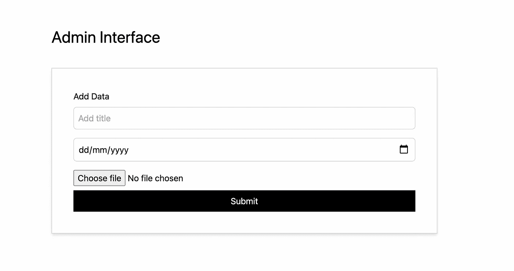
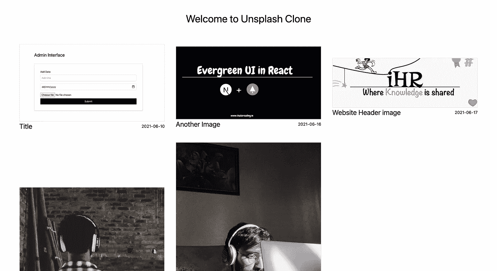

# 如何使用 React 和 Firebase 开发 Unsplash 克隆

> 原文：<https://javascript.plainenglish.io/developing-unsplash-clone-using-react-and-firebase-2c232f487142?source=collection_archive---------12----------------------->

Firestore 入门，上传图像，并在 React 中以画廊模式预览


Photo by [Mike Von](https://unsplash.com/@thevoncomplex?utm_source=medium&utm_medium=referral) on [Unsplash](https://unsplash.com?utm_source=medium&utm_medium=referral)

## 在后台

这个故事开始于我们为我们的网站 iHateReading 创建管理内容管理的时候。我们希望为我们的设计师和创作者创建一个界面，将他们的作品直接上传到数据库中。这是一种自动管理数据库的过程，无需手动操作。

```
[Complete code repository can be downloaded from here](https://github.com/shreyvijayvargiya/iHateReadingLogs/tree/main/TechLogs/unsplash-clone)
```

## 概观

在今天的故事中，我们将创建一个 Unsplash 类型的克隆项目，通过开发一个单一的接口来上传我们的图像和数据库中的标题。接下来是从数据库中获取所有图像，并在我们的前端显示它们，就像 Unsplash 或 dribble 所做的那样。

我们将使用的数据库是 Firebase firestore，上传图像，我们将开发一个界面，接受图像，标题和日期来添加我们的图像。

## 入门指南

这些是我们将遵循的步骤—

*   在 Firebase 中创建一个帐户
*   将 Firebase 连接到 React 项目
*   开发一个管理界面来上传 Firebase firestore 中的数据
*   开发主页或登陆来抓取所有的图片，并使用相应的标题、图片和日期进行预览。

## 在 React 项目中安装 Firebase

我已经在这个专题上发表了大量的文章。所以，我就不多说细节了。我只是添加了这个故事的链接，你可以直接阅读，并参考安装过程。另外，我使用的存储库是 Next.js，可以从链接中下载。

```
Download ready-to-use-repository-from-here
```

## 开发管理界面

管理界面是所有数据可以上传到我们的数据库的地方。在我们的例子中，我们的数据库需要一个横幅图像、一个标题和一个日期。

它将是一个简单的形式，由使用输入和文件上传添加的键值对组成。一旦用户点击提交按钮，只有这样我们才会在 Firebase 的实时数据库中添加数据。此外，由于我们正在处理图像，所以，我们需要 firestore 来处理我们的大文件。

这个过程是这样的

*   点击提交按钮时在 Firestore 中上传图像
*   检索图像云 URL 链接
*   将标题、日期和图像云 URL 链接保存在 Firebase 实时数据库中。

管理界面将有一个名为`admin/Unsplash`的路由。该路径将提供一个上传图像、添加标题和日期的表单。点击提交按钮后，我们将在 Firebase 存储桶中上传图像，并抓取图像 URL，以将图像云 URL 和标题以及日期存储在实时数据库中。



The Admin interface for uploading data

下一步如下—

*   在 Firebase 存储中上传图像
*   抓取上传的图像云网址
*   在实时数据库中添加图像云 URL、标题和日期

一旦用户点击提交按钮，这些步骤将被触发。

```
async function handleSubmit(e){
        e.preventDefault();
        setLoader(true);
        const dbRef = app.database().ref("unplash-clone");
        let storageRef = 
            app
             .storage()
             .ref("unsplash-clone")
             .child(values.imageName);
        const imagePutUpdate = await 
             storageRef.put(values.imageFile);
        if(imagePutUpdate){
            const uploadedImageUrl = await 
                   app.
                    storage()
                    .ref( "unsplash-clone")
                    .child(values.imageName)
                    .getDownloadURL();
            dbRef.push({
                title: values.title,
                imageName: values.imageName,
                imageUrl: uploadedImageUrl,
                date: values.date
            })
            setValues({ 
                  title: "", 
                  date: "", 
                  imageData: "", 
                  imageFile: "", 
                  imageName: ""
             });
            setLoader(false)
 };
```

上述功能是将图像上传到 Firebase 存储中，然后将完整的数据(如图像云 URL、标题和日期)上传到实时数据库中。

这是管理界面的最终代码。

## 在图库模式下预览数据

最后一步是获取我们的数据或图像及其相应的数据，并在我们的主页上像画廊模式一样预览它们。由于我们将所有内容都存储在实时数据库中，因此，我们只需使用 Firebase 方法从 Firebase 实时数据库中获取数据。

```
const dbRef = firebase.database().ref("images")
dbRef.on("value",  snap => console.log(snap.val());// This will return all the images stored in "images" real-time database object.
```

获取所有图像后，我们将它们存储在我们的全局存储或本地组件状态中，然后使用`map`函数，我们将呈现每张图像及其相应的数据。

## 最终产品

下面两张图片显示了两个界面——一个是管理员或用户可以上传数据库中的图片，另一个是用户可以预览上传的图片。



## 结论

开发这些类型的内容管理系统是非常有用和强大的。他们不仅自动化了这个过程，加快了开发速度，而且通过在上传图片的管理界面中添加更多的检查，你可以对数据库进行自动检查。我们确实为我们的网站 [iHateReading](http://www.ihatereading.in) 使用了内容管理系统。

```
For more such stories, visit our wesbite 💻[**iHateReading**](http://www.ihatereading.in)
```

## 更多阅读

[](/developing-a-full-stack-repository-52dc58c4820) [## 开发全栈存储库

### Next.js 中带顺风 CSS 的 Firebase。

javascript.plainenglish.io](/developing-a-full-stack-repository-52dc58c4820) [](https://medium.com/nerd-for-tech/basic-imperative-underrated-node-js-packages-c02deb8c3ecc) [## 基本、必要和被低估的节点 JS 包。

### 在专业开发中广泛使用的 API 开发有用包。

medium.com](https://medium.com/nerd-for-tech/basic-imperative-underrated-node-js-packages-c02deb8c3ecc) [](https://shreyvijayvargiya26.medium.com/5-minutes-read-to-add-github-authentication-via-express-servers-6dd764818124) [## 5 分钟阅读通过 Express 服务器添加 Github 认证

### 不能从浏览器访问 Github API，下面是在前端添加 Github 认证的方法。

shreyvijayvargiya26.medium.com](https://shreyvijayvargiya26.medium.com/5-minutes-read-to-add-github-authentication-via-express-servers-6dd764818124) 

*更多内容尽在*[*plain English . io*](http://plainenglish.io/)