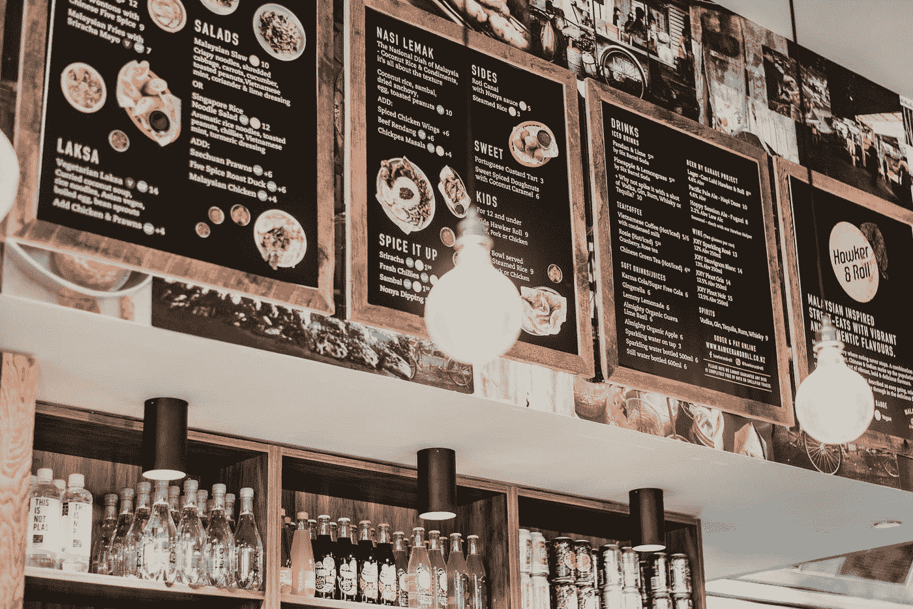

# 使用 Quasar 库开发 Vue 应用程序——菜单

> 原文：<https://javascript.plainenglish.io/developing-vue-apps-with-the-quasar-library-menu-56be8e8673f2?source=collection_archive---------9----------------------->



Photo by [Sunrise Photos](https://unsplash.com/@sunrisephotography?utm_source=medium&utm_medium=referral) on [Unsplash](https://unsplash.com?utm_source=medium&utm_medium=referral)

Quasar 是一个流行的 Vue UI 库，用于开发好看的 Vue 应用程序。

在本文中，我们将了解如何使用 Quasar UI 库创建 Vue 应用程序。

# 菜单

我们可以用`q-menu`组件在我们的 Vue 应用程序中添加一个菜单。

例如，我们可以写:

```
<!DOCTYPE html>
<html>
  <head>
    <link
      href="https://fonts.googleapis.com/css?family=Roboto:100,300,400,500,700,900|Material+Icons"
      rel="stylesheet"
      type="text/css"
    />
    <link
      href="https://cdn.jsdelivr.net/npm/quasar@1.12.13/dist/quasar.min.css"
      rel="stylesheet"
      type="text/css"
    />
  </head>
  <body class="body--dark">
    <script src="https://cdn.jsdelivr.net/npm/vue@^2.0.0/dist/vue.min.js"></script>
    <script src="https://cdn.jsdelivr.net/npm/quasar@1.12.13/dist/quasar.umd.min.js"></script>
    <div id="q-app">
      <q-layout
        view="lHh Lpr lFf"
        container
        style="height: 100vh;"
        class="shadow-2 rounded-borders"
      >
        <div class="q-pa-md">
          <q-btn color="primary" label="Basic Menu">
            <q-menu>
              <q-list style="min-width: 100px;">
                <q-item clickable v-close-popup>
                  <q-item-section>New tab</q-item-section>
                </q-item>
                <q-item clickable v-close-popup>
                  <q-item-section>New incognito tab</q-item-section>
                </q-item>
                <q-separator></q-separator>
                <q-item clickable v-close-popup>
                  <q-item-section>Recent tabs</q-item-section>
                </q-item>
              </q-list>
            </q-menu>
          </q-btn>
        </div>
      </q-layout>
    </div>
    <script>
      new Vue({
        el: "#q-app"
      });
    </script>
  </body>
</html>
```

我们在`q-btn`中添加了`q-menu`组件，让按钮触发菜单。

我们可以通过用`v-model`绑定到一个反应属性来自动切换菜单:

```
<!DOCTYPE html>
<html>
  <head>
    <link
      href="https://fonts.googleapis.com/css?family=Roboto:100,300,400,500,700,900|Material+Icons"
      rel="stylesheet"
      type="text/css"
    />
    <link
      href="https://cdn.jsdelivr.net/npm/quasar@1.12.13/dist/quasar.min.css"
      rel="stylesheet"
      type="text/css"
    />
  </head>
  <body class="body--dark">
    <script src="https://cdn.jsdelivr.net/npm/vue@^2.0.0/dist/vue.min.js"></script>
    <script src="https://cdn.jsdelivr.net/npm/quasar@1.12.13/dist/quasar.umd.min.js"></script>
    <div id="q-app">
      <q-layout
        view="lHh Lpr lFf"
        container
        style="height: 100vh;"
        class="shadow-2 rounded-borders"
      >
        <div class="q-pa-md">
          <div class="q-gutter-sm">
            <q-btn color="primary" @click="showing = true" label="Show"></q-btn>
            <q-btn
              color="primary"
              @click="showing = false"
              label="Hide"
            ></q-btn>
          </div> <div>
            <q-menu v-model="showing">
              <q-list style="min-width: 100px;">
                <q-item clickable v-close-popup>
                  <q-item-section>New tab</q-item-section>
                </q-item>
                <q-item clickable v-close-popup>
                  <q-item-section>New incognito tab</q-item-section>
                </q-item>
                <q-separator></q-separator>
                <q-item clickable v-close-popup>
                  <q-item-section>Recent tabs</q-item-section>
                </q-item>
              </q-list>
            </q-menu>
          </div>
        </div>
      </q-layout>
    </div>
    <script>
      new Vue({
        el: "#q-app",
        data: {
          showing: false
        }
      });
    </script>
  </body>
</html>
```

我们可以添加带有`q-menu`组件的子菜单:

```
<!DOCTYPE html>
<html>
  <head>
    <link
      href="https://fonts.googleapis.com/css?family=Roboto:100,300,400,500,700,900|Material+Icons"
      rel="stylesheet"
      type="text/css"
    />
    <link
      href="https://cdn.jsdelivr.net/npm/quasar@1.12.13/dist/quasar.min.css"
      rel="stylesheet"
      type="text/css"
    />
  </head>
  <body class="body--dark">
    <script src="https://cdn.jsdelivr.net/npm/vue@^2.0.0/dist/vue.min.js"></script>
    <script src="https://cdn.jsdelivr.net/npm/quasar@1.12.13/dist/quasar.umd.min.js"></script>
    <div id="q-app">
      <q-layout
        view="lHh Lpr lFf"
        container
        style="height: 100vh;"
        class="shadow-2 rounded-borders"
      >
        <div class="q-pa-md">
          <q-btn color="primary" label="Click me">
            <q-menu>
              <q-list dense style="min-width: 100px;">
                <q-item clickable v-close-popup>
                  <q-item-section>Open...</q-item-section>
                </q-item>
                <q-item clickable v-close-popup>
                  <q-item-section>New</q-item-section>
                </q-item>
                <q-separator></q-separator>
                <q-item clickable>
                  <q-item-section>Preferences</q-item-section>
                  <q-item-section side>
                    <q-icon name="keyboard_arrow_right"></q-icon>
                  </q-item-section> <q-menu anchor="top end" self="top start">
                    <q-list>
                      <q-item v-for="n in 3" :key="n" dense clickable>
                        <q-item-section>Submenu</q-item-section>
                        <q-item-section side>
                          <q-icon name="keyboard_arrow_right"></q-icon>
                        </q-item-section>
                        <q-menu auto-close anchor="top end" self="top start">
                          <q-list>
                            <q-item v-for="n in 3" :key="n" dense clickable>
                              <q-item-section>3rd level Label</q-item-section>
                            </q-item>
                          </q-list>
                        </q-menu>
                      </q-item>
                    </q-list>
                  </q-menu>
                </q-item>
                <q-separator></q-separator>
                <q-item clickable v-close-popup>
                  <q-item-section>Quit</q-item-section>
                </q-item>
              </q-list>
            </q-menu>
          </q-btn>
        </div>
      </q-layout>
    </div>
    <script>
      new Vue({
        el: "#q-app",
        data: {}
      });
    </script>
  </body>
</html>
```

我们添加`q-btn`组件来添加一个按钮来触发菜单。

然后我们通过在`q-item`组件中添加`q-menu`来添加子菜单。

# 结论

我们可以添加 Quasar `q-menu`组件，将菜单添加到我们的 Vue 应用程序中。