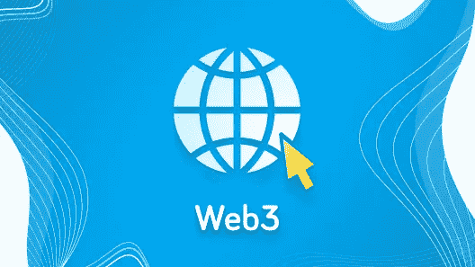

# 开发你的 Web3 分散式应用程序:需要考虑的 3 件事

> 原文：<https://javascript.plainenglish.io/developing-your-web3-decentralized-application-3-things-to-consider-ce36f450cbf?source=collection_archive---------9----------------------->

作为 Web3 的前身，Web1 完全是关于去中心化的。一切都是社区管理和开放的。价值不在服务提供商手中，而是在边缘——在个人用户和多个用户的团体手中。

“Web 2.0”是 Darcy DiNucci 在 1999 年创造的一个术语，后来由 Tim O'Reilly 和 Dale Dougherty 在 2004 年的 O'Reilly Media Web 2.0 会议上推广开来。在这一章中，权力掌握在平台手中，并且一直集中在平台上，比如脸书、谷歌和 Twitter。

这导致了**许多**问题([剑桥分析](https://www.theguardian.com/news/series/cambridge-analytica-files)有人知道吗？).然而，关于新名字的争论是不同的。在新时代之前，内容大多是静态的，而 Web2 是关于动态内容的。并不是所有人都同意(甚至连互联网的创造者自己也不同意)，但这个名字被保留了下来。

快进到现在，我们可能生活在一个新时代的开端，Web3 时代。在区块链上运行分散式应用程序(也称为 d apps、Dapps、DApps 或简称为 dApps)的时代。现在，我们终于可以把事情做好了。网站的下一次迭代旨在修复上一版本的许多缺点和缺陷。

管理交易并运行在以太坊(ETH)虚拟机(EVM)上的代码对所有人都是完全可见的。这里没有惊喜。

Web3 应用也更加安全。那是因为你的代码的真实性是由全世界所有以太坊节点保证的。当然，ETH 不是你唯一的选择，这是一件幸事，因为这个链没有最高的带宽。在实践中，网络被限制为每秒仅处理大约 15 个事务，一些替代方案可以很好地解决这个问题。这些是[索拉纳，波尔卡多特，或 EOS](https://www.itmagination.com/services/custom-software-development/blockchain-development-services) 。

随着可伸缩性问题的消失，还有一个问题没有消失。无论你使用哪种解决方案，新应用的复杂性都会急剧上升。

# 复杂？不一定。

不管人们怎么想，Web3 应用程序比它们的 Web2 祖先更复杂。当然，你不再像以前那样编写后端代码，也不像以前那样管理后端。

你不需要担心确切的服务器。缺少传统的后端可以被视为一个积极因素。有太多的东西你不需要担心或配置。

另一方面，传统服务器的伸缩性要好得多。不过，你最终还是要开始添加资源，尽管肯定不会碰壁。当越来越多的用户知道你的产品时，困难就开始了。

以太坊不能一次处理太多的操作，这是它的一个坏名声。极限会变得痛苦，太快。然而，还是有一线希望。Eth2 更新于 2021 年 10 月 29 日开始，目的是使链更具可扩展性。

复杂性是绕过以太坊限制的结果。IPFS 存储数据，第 2 层解决方案增加了一次可能的事务数量。

下图展示了 dApp 的架构。

# 去中心化？绝对的。

Web3 也没有完全解决集中化的问题。我们仍然需要在某个地方托管我们的网络应用。它通常位于云提供商的服务器上，比如 AWS 或 Azure。总有一种选择是在你的场所托管所有的东西，尽管我们确实看到了一种以其他方式托管的趋势。

然而，HTTP 不是必需的。访问网站(包括我们的网站)的传统方式，并不是你的客户访问你的新应用的唯一方式。星际文件系统(IPFS)或 Swarm 可能是您的服务的替代路线。当然，大多数用户不会安装必要的扩展。最有可能的是，你将不得不以“传统”方式和 Web3 方式托管你的服务。

# 成本高？看情况。

即使我们不一定要有数据库，保存我们所有生成的数据到以太坊链会变得非常昂贵，非常快。如果你觉得不要太快用完钱会更好，你可以将数据存储在外链上。有几个选项可供您选择。有 IPFS，还有蜂群。

IPFS 可以作为你的应用程序的分散存储，尽管它旨在取代 HTTP，你的客户必须至少安装一个定制的扩展才能查看你发送给他们的网站。Swarm 是该问题的另一种解决方案。您可以在网络上托管您的网站，也可以享受在分散网络上托管您的应用程序的好处。

有一些客户端也有基于 Chrome 的浏览器 Brave，内置 IPFS 功能。如果你想要一个好的兼容 Web3 的浏览器，那将是最好的选择。另一个自带 IPFS 本地支持的浏览器是 Opera。这两款浏览器可能都不适合你的口味，所以如果你想继续使用目前的浏览器，你可以下载 [IPFS 配套扩展](https://docs.ipfs.io/install/ipfs-companion/)。

# 结论

当任何新技术达到早期多数阶段时，总有一些障碍需要克服——不要气馁，这次也是一样。障碍可以用我们描述的一些方法来克服。

这些障碍不是人们无法攀登的高山。如果你对我们现在的局限性感到气馁，这就像在拨号调制解调器时代宣称“网飞将永远不会工作”一样。当然，这在当时是行不通的。我们需要的是一些突破性的进展，这些进展确实及时到来了。

一旦你克服了这些障碍，一个全新的世界正等着你和你的用户。在这个世界里，你和你的客户实际上拥有部分网络。一个比现在更民主的世界。如果你需要帮助踏入这个世界，[随时查看我们的区块链发展服务并联系我们](https://www.itmagination.com/services/custom-software-development/blockchain-development-services)！

【https://www.itmagination.com】最初发表于**。**

**更多内容请看*[*plain English . io*](http://plainenglish.io/)*。报名参加我们的* [*免费周报*](http://newsletter.plainenglish.io/) *。在我们的* [*社区不和谐*](https://discord.gg/GtDtUAvyhW) *获得独家获得写作机会和建议。**