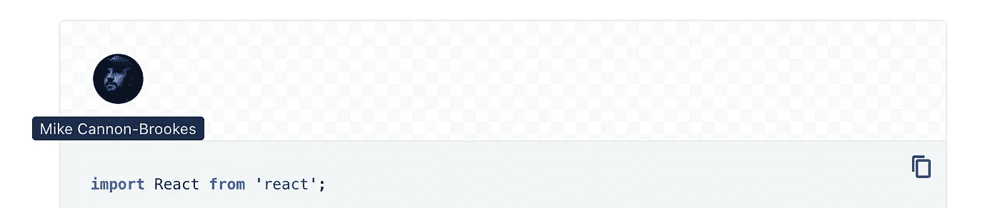
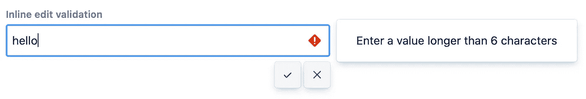

# 有人说作文了吗？

> 原文：<https://javascript.plainenglish.io/did-someone-say-composition-c7843d898b2?source=collection_archive---------9----------------------->

## 如何组成 React 组件


Photo by [Dayne Topkin](https://unsplash.com/@dtopkin1?utm_source=medium&utm_medium=referral) on [Unsplash](https://unsplash.com?utm_source=medium&utm_medium=referral)

# 一点背景知识

在过去的几个月里，我在一个致力于**性能改进**的团队中，对抗 React 代码库中的[设计系统](https://atlassian.design/components)。

从表面上看，优化有两个部分:性能增强和代码重构/重新设计。然而，在几个月处理了几十个组件重构后，我们发现它们基本上是一个问题的两个方面:好的设计通常会带来更好的性能，反之亦然。

这是一个有趣的发现，当我们讨论增强性能的方法时，一个最容易被忽视的因素是软件本身的**设计**。我们关心包的大小和不必要的重新渲染，甚至 CSS 选择器的优先级。但是我们通常不会仅仅为了提高组件的性能而审查设计。另一方面，如果一个组件没有完全遵循`S.O.L.I.D`原则，我们会说它缺乏可扩展性，或者太大而难以维护，但通常不会认为糟糕的设计会影响*性能*(也许性能问题只有在开发生命周期的后期才会被注意到)。

为了更详细地说明这个问题，以及我们如何改变我们的设计以使代码更有性能，让我们看一些具体的和典型的例子。

# 头像组件

在我们设计系统中的一个早期实现的[头像](https://atlassian.design/components/avatar/examples)组件上，它有一个便利的特性:如果用户将`name`道具传入组件，那么当鼠标悬停在上面时，工具提示将显示在头像底部，并以`name`为值。



Avatar component with Tooltip

在内部，`Avatar`正在利用另一个组件`Tooltip`来实现这一目标:

```
import Tooltip from "@atlaskit/tooltip";const Avatar = (props) => {
  if (props.name) {
    return (
      <Tooltip content={props.name}>
        <Circle>
          
        </Circle>
      </Tooltip>
    );
  } return (
    <Circle>
      
    </Circle>
  );
};
```

上面的代码是好的，当消费者要求定制工具提示时，我们才开始失去对组件的控制。例如，用户 A 可能希望工具提示显示在头像的顶部，而用户 B 希望能够定制工具提示的背景颜色/字体大小，等等。

当然，我们也可以简单地给`Avatar`添加一些道具，比如:

```
<Avatar
  tooltipPosition="top"
  tooltipBackgroundColor="blue"
  tooltipColor="whitesmoke"
/>;
```

或者我们公开一个更灵活的*选项*对象，比如:

```
<Avatar
  tooltipProps={{
    position: "top",
    backgroundColor: "blue",
    color: "whitesmoke",
  }}
/>;
```

然后将它发送给底层的`Tooltip`组件。但是很快，我们会看到这种方法的一些问题:

*   头像包包括工具提示包，是一个比较大的包
*   每当用户想以某种方式定制`Tooltip`时，`Avatar`也需要采用这种改变
*   来自`Tooltip`的任何 API 变更可能需要在`Avatar`重新打包

但是如果我们仔细观察头像组件，我们会注意到`Tooltip`更像是一个补充功能，而不是一个基本功能(为用户显示图像)，更像是一个可选功能。因此，我们可以简化`Avatar`，如下面没有`Tooltip`的代码:

```
const Avatar = (props) => (
  <Circle>
    
  </Circle>
);
```

它不会打破一个头像的定义，但它会打破现有的用户体验(例如，在这种情况下不一致)一点。这是我们考虑是否可以/应该将这两个组件分开并将 Tooltip 移出软件包的时候了。然后由消费者决定他们是否需要工具提示。换句话说，我们可以使代码更具有*可组合性*。

因此，从依赖项中删除工具提示，代码变成:

```
import Avatar from "@atlaskit/avatar";
import Tooltip from "@atlaskit/tooltip";const MyAvatar = (props) => (
  <Tooltip
    content="Juntao Qiu"
    position="top"
    css={{ color: "whitesmoke", backgroundColor: "blue" }}
  >
    <Avatar
      name="Juntao Qiu"
      url="https://avatars.githubusercontent.com/u/122324"
    />
  </Tooltip>
);
```

乍一看，它可能与上一个没有太大区别，但注意这里上面的片段来自阿凡达的*消费者*。这意味着头像组件不知道(也不应该知道)工具提示的存在。例如，我们可以从另一个包`@material-ui/core/Tooltip`中引入`tooltip`，功能应该是相同的(当然，除了用户界面有一点改变):

```
import Avatar from "@atlaskit/avatar";
import Tooltip from "@material-ui/core/Tooltip";const MyAvatar = (props) => (
  <Tooltip title="Juntao Qiu" placement="top" classes={...}>
    <Avatar
      name="Juntao Qiu"
      url="https://avatars.githubusercontent.com/u/122324"
    />
  </Tooltip>
);
```

这意味着什么呢？现在对于头像的消费者来说，工具提示不再是一个与头像绑定的黑匣子。此外，这种多 ***可组合*** 的方法也有以下好处:

*   对于头像本身来说，包的大小要小得多
*   消费者只为他们需要的东西付费
*   avatar 不再绑定到任何特定的工具提示实现，所以用户可以选择他们喜欢的其他工具提示

事实上，在这些转换过程中，我们已经做了许多类似的更改。例如，在下一个例子中，我们将讨论——我们如何设法将*无效对话框*移出内嵌编辑组件。

# InlineEdit 组件

[内联编辑](https://atlassian.design/patterns/inline-edit)是代码库中另一个广泛使用的通用组件。它允许用户在不改变上下文的情况下编辑和保存页面上的内容。所以本质上，它是一个只有一个输入字段的表单。

在早期版本中，它提供了这样一个特性:当提供了`validate` function prop 时，如果在用户击键后返回 false，那么在输入的右边会出现一个带有错误消息的弹出窗口。



Invalid status of an inline edit

这个特性的逻辑是这样的:

```
import InlineDialog from "@atlaskit/inline-dialog";const InlineEdit = (props) => {
  const { validate, editView } = props;
  return (
    <Field>
      {({ fieldProps, error }) => (
        <div>
          {editView(fieldProps)}
          {validate && (
            <InlineDialog
              isOpen={fieldProps.isInvalid}
              placement="right"
              content={<span>{error}</span>}
            />
          )}
        </div>
      )}
    </Field>
  );
};
```

注意这里的`editView`是一个返回`ReactNode`的函数，用户可以将自己的`editView`定义为真实项目中的`Textfield`或`Select`。同样，通过隐式使用`InlineDialog`，它可以防止用户使用其他对应的包。而`validate`是用户传入检查内容是否有效的函数。

例如，`validate`可以是如下函数:

```
validate={(value) => {
    if(value && value.length < 8) return false;
}}
```

此外，如果我们想应用与在`Avatar`中相同的方法，那也不行:与头像和工具提示之间的松散耦合不同，这里的`InlineEdit`和`InlineDialog`是紧密耦合的:只有当`InlineEdit`处于`invalid`状态时，`InlineDialog`才会出现。

这意味着我们可以*而不是*简单地将其重构为:

```
import InlineDialog from "@atlaskit/inline-dialog";const MyEdit = () => {
  return (
      <InlineDialog content={} isOpen={} placement="top">
      <InlineEdit
        editView={(fieldProps) => <Textfield {...fieldProps} />}
        validate={(value) => {
          return false;
        }}
      />
    </InlineDialog>
  );
};
```

因为作为父节点，`InlineDialog`无法知道其子节点的状态是什么(您可以使用上下文 API 来传递状态，但这会使组件不那么通用/独立)。所以我们需要做的是摆脱**具体的** `InlineDialog`用法，转而依靠一些抽象:一种允许我们在输入内容出错时处理错误的抽象。

## 选项 1

这里我们关心的是，当出现问题时，需要触发一个*动作*。动作是什么并不重要:它可能是在控制台上打印一条错误消息，或者从浏览器 API 使用本机`alert`或者呈现一些其他定制组件。

让我们称这个动作为名为`invalidView`的函数，它接受两个参数:`isInvalid`表示验证状态，`error`表示真正的错误消息。并且函数的签名可以是:

```
invalidView: (isInvalid: boolean, error: string) => React.ReactNode;
```

然后我们可以使用`InlineEdit`中的功能来拆除`InlineDialog`:

```
const InlineEdit = (props) => {
  const { validate, editView, invalidView } = props; return (
    <Field>
      {({ fieldProps, error }) => (
        <div>
          {editView(fieldProps)}
          {validate && invalidView(isInvalid, error)}
        </div>
      )}
    </Field>
  );
};
```

对于消费者来说，他们可以选择使用哪个包来进行错误提示:

```
import InlineDialog from "@atlaskit/inline-dialog"; //Note here how a consumer introduce InlineDialog for rendering error messageconst MyEdit = () => {
  return (
    <InlineEdit
        editView={(fieldProps) => <Textfield {...fieldProps} />}
      validate={(value) => {
        return false;
      }}
      invalidView={(isInvalid, error) => (
        <InlineDialog isOpen={isInvalid} content={error} placement="top" />
      )}
    />
  );
};
```

从理论上来说，`invalidView`可以做任何事情，因此存在无限的无效对话框的机会。

## 选项 2

或者，我们可以用另一种方式去掉`InlineDialog`的直接/隐式用法。我们在内联编辑开始时谈到的`editView`也是一个相对通用的函数，如果你查看它的签名的话:

```
editView: (fieldProps: FieldProps) => React.ReactNode;
```

所以我们可以用另外两个参数扩展这个函数:`isInvalid`和`error`，就像这样:

```
const InlineEdit = (props) => {
  const { validate, editView } = props; return (
    <Field>
      {({ fieldProps, isInvalid, error }) => (
        <div>
          {editView(fieldProps, isInvalid, error)}
        </div>
      )}
    </Field>
  );
};
```

然后当用户定义他们自己的`editView`时，他们可以简单地用一个`InlineDialog`或另一个 UI 包来包装它:

```
import InlineDialog from "@atlaskit/inline-dialog";const MyEdit = () => {
  return (
    <InlineEdit
      editView={(fieldProps, isInvalid, error) => (
        <InlineDialog isOpen={isInvalid} content={error} placement="top">
          <Textfield {...fieldProps} />
        </InlineDialog>
      )}
      validate={(value) => {
        return false;
      }}
    />
  );
};
```

这样，我们就可以解耦`InlineEdit`和`InlineDialog`，注意这里 editView 的内容来自消费者，而不是我们的设计系统。

例如，消费者现在可以在相同的场景中使用 Material-UI 中的`popover`:

```
import InlineDialog from "@atlaskit/inline-dialog";
import Popover from "@material-ui/core/Popover";
import Typography from "@material-ui/core/Typography";const MyEdit = () => {
  return (
    <InlineEdit
      editView={(fieldProps, isInvalid, error) => (
        <Popover open={isInvalid}>
          <Typography>{error}</Typography>
          <Textfield {...fieldProps} />
        </Popover>
      )}
      validate={(value) => {
        return false;
      }}
    />
  );
};
```

或者默默咽下错误:

```
const MyEdit = () => {
  return (
    <InlineEdit
      editView={(fieldProps, isInvalid, error) => {
        if (isInvalid) {
          console.log(error);
        } return (<Textfield {...fieldProps} />);
      }}
      validate={(value) => {
        return false;
      }}
    />
  );
};
```

正如我们所看到的，选项 1 和选项 2 非常相似:我们试图让组件不知道真实的错误响应，并将这个决定推迟到组件的消费者。这种方法的优点是组件对于处理无效内容更加开放(而不是引入一个具体的包来关闭所有其他可能性)。我们通过减少额外的封装实现了这一点，这意味着更小的包尺寸。此外，有了简化的逻辑，我们的设计系统组件就不太可能出现错误。

# 摘要

通过上面的例子，我想我们可以得出这样的结论:一旦我们决定在我们的代码中使用一个特定的库/包，我们就不可避免地关闭了所有其他的替代方案。例如，我们在《阿凡达》中使用了`@atlaskit/tooltip`，那么最终消费者无论如何都必须使用它(他们可能必须使用其他类似的包)，就像我们在`InlineEdit`中使用`@atlaskit/inline-dialog`来关闭消费者使用`Popover`的可能性一样。

好消息是，一旦我们发现了问题，解决方案就相当简单了。对于那些可以完全分离的部分(比如工具提示和头像场景)，我们可以从我们的包中移除该组件，并要求消费者进行一些迁移(我有另一篇文章)来覆盖它。对于那些有相互关系的，我们需要让我们的代码依赖于抽象(而不是具体的实现)，并且确保我们的代码只访问这些抽象的层，让消费者完成其余的工作。这样，我们可以最大限度地减少依赖性，最大限度地提高灵活性。

# 其他参考文献

*   如果你对`editView`函数不熟悉，这里有一些关于 Final Form(我们在内嵌编辑中使用的底层 API)的类似例子
*   肯特·多德有一篇非常棒的帖子《T4》，详细描述了这里使用的模式背后的理论。强烈建议。

*更多内容请参见* [*简明英语. io*](http://plainenglish.io/)

**如果您喜欢阅读，请** [**在我的邮件列表**](https://icodeit.com.au/#subscribe) **上签名。我每周都通过** [**博客**](https://juntao-qiu.medium.com/)**[**书籍**](https://leanpub.com/u/juntao) **和** [**视频**](https://www.youtube.com/@icodeit.juntao) **分享清洁代码和重构技术。****