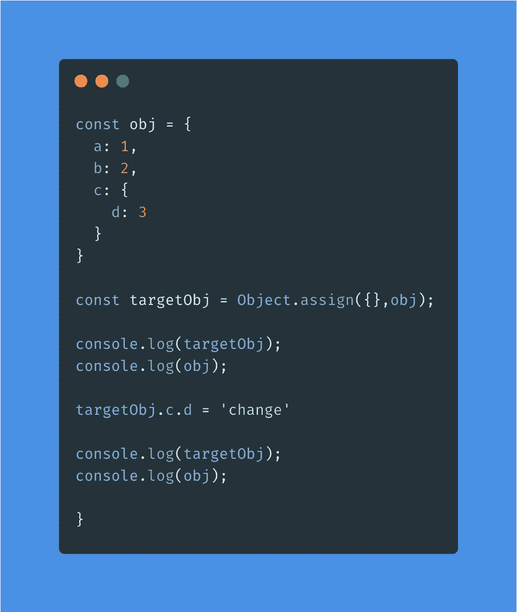

# JavaScript — JS 访谈系列中 Object.assign()和 Object.create()的区别

> 原文：<https://javascript.plainenglish.io/difference-between-object-assign-and-object-create-in-javascript-6f3ee100f99d?source=collection_archive---------1----------------------->

物体之间的区别。create()和 Object。assign()是 JavaScript 面试中被问得最多的问题之一。因此，有必要了解这两种方法之间的区别以及它们实现的本质。

在本文中，我们将讨论对象之间的差异。赋值()和对象。详细创建()。所以抓紧了，让我们开始吧。

# 1.Object.assign()和 Object.create()之间的基本区别

**对象。assign():** 对象。assign()用于复制可枚举属性(可迭代的属性或者可枚举属性设置为 true 的属性[检查这个！！](https://www.geeksforgeeks.org/what-does-enumerable-property-mean-in-javascript/) )从源对象到目标对象。还有，对象。assign()方法返回新形成的目标对象。

查看以下示例:

Run in Fiddle: [https://jsfiddle.net/ShaikWasef/e93cm5xu/5/](https://jsfiddle.net/ShaikWasef/e93cm5xu/5/)

上面的例子说明了。assign()在复制目标和源的属性值后返回目标对象。returnedTarget 和 Target 是相同的对象，并且拥有对相同键-值对的引用。但是，assign 不会通过引用复制属性，因此更改目标属性不会更改源的属性，如下所示。

Run in Fiddle: [https://jsfiddle.net/ShaikWasef/4xsden5w/](https://jsfiddle.net/ShaikWasef/4xsden5w/)

除此之外，如果在 Object 执行期间源和目标的键匹配，源的属性将被覆盖。如上面的例子所示。

注意:为了创建源对象的新副本，请使用以下语法: *Object.assign({}，source)*

**object . create()**:object . create()用于以现有对象为原型创建新对象。这意味着返回的对象除了继承源对象本身的属性之外，还继承与源对象链接的所有原型的属性。因此，目标对象不仅仅是源对象的副本。查看下面的例子

Run in Fiddle: [https://jsfiddle.net/ShaikWasef/kcg08ypn/27/](https://jsfiddle.net/ShaikWasef/kcg08ypn/27/)

# 2.事实真相

考虑以下使用 Object 的代码片段。assign()创建对象的副本并猜测输出。

Run in Fiddle : [https://jsfiddle.net/ShaikWasef/yz084oje/8/](https://jsfiddle.net/ShaikWasef/yz084oje/8/)

如果你已经运行了小提琴，你一定已经观察到当 targetObj.c.d 改变时 obj 值也改变了。

这是因为对象。assign()只创建源对象的浅表副本。如果源值包含对某个对象的引用，则复制对该对象的引用。因此 obj。c.d 也改成了‘变’。要创建深层副本，您必须编写一个单独的代码，可以在这里找到该代码的引用 [MDN DOCS](https://developer.mozilla.org/en-US/docs/Web/JavaScript/Reference/Global_Objects/Object/assign) 。

现在考虑下面使用 Object 的代码片段。create()创建一个具有原型继承的新对象。

Run in Fiddle: [https://jsfiddle.net/ShaikWasef/6j17cmgp/1/](https://jsfiddle.net/ShaikWasef/6j17cmgp/1/)

上面的代码片段产生了与前者相同的输出。

原因对象。create()这样做是因为原型链接的工作方式。JS 原型链接中有两个规则(没有正式定义，但为了更好地理解，已经声明)。

*规则 1:* **从子对象中读取属性:** 当你试图从子对象中访问一个属性时，Javascript 将搜索整个原型链，直到它设法找到该属性，否则如果没有找到则返回 undefined。

*规则 2:* **在子对象中写属性:** 它会先尝试定位你的目标属性所属的对象，然后直接在那个对象上设置那个属性。

因此，如果您更改了 targetObj 的属性“a ”,那么 JS 将直接设置 targetObj 的属性。但是，如果您更改属性“d ”,它将为 targetObj 和 Obj 设置值“d ”,因为“d”是键“c”的对象值的属性，因此为 targetObj 和 Obj 设置值“d ”,因为属性“c”属于它们两者，并且它**是属性“d”的目标对象**。

欢迎评论和分享您的知识，帮助 JS 社区成长。

*更多内容请看*[***plain English . io***](http://plainenglish.io)