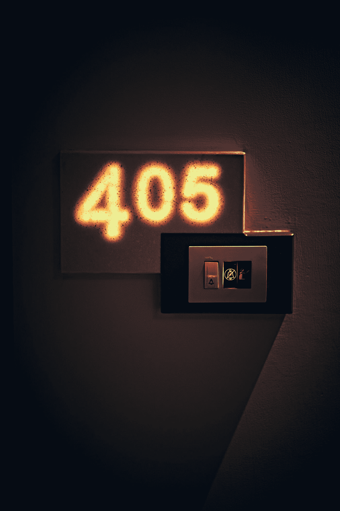

# 不同的 HTTP 状态代码

> 原文：<https://javascript.plainenglish.io/different-http-status-codes-87518fe387d4?source=collection_archive---------13----------------------->

## 了解所有 HTTP 状态代码

Photo by [Ashwini Chaudhary](https://unsplash.com/@suicide_chewbacca?utm_source=medium&utm_medium=referral) on [Unsplash](https://unsplash.com?utm_source=medium&utm_medium=referral)

超文本传输协议(HTTP)状态代码是指服务器提供的关于请求的响应。

HTTP 状态代码总是 3 位数的整数。状态代码的第一个数字定义了响应的类别，而最后两个数字不包含任何分类规则。

# **序列号描述**

**1XX** :请求已成功接收，正在等待处理

**2XX** :请求被成功接收、理解和接受

**3XX** :请求正在等待完成请求的进一步操作

**4XX** :请求包含不正确的语法，服务器无法处理

**5XX** :服务器无法处理有效请求。

在本文中，我们将研究各种 HTTP 状态代码及其相应的表示。

# **状态码 2xx:成功。**

**200** —请求通过，表示服务器已成功返回请求的数据。

**201** —已创建。新资源(数据)已成功创建。

**202** —请求已被接受处理，但在异步队列中。

203 —非权威信息。请求标头中的信息不是来自原始服务器。

204 —信息删除成功

205 —浏览器应该清除用于相应交易的表单，以确保额外的输入。

# **状态代码 3xx:重定向。**

**300** —多项选择。用户可以选择一个链接并转到该位置。链表最多有五个地址。

**301** -(永久移动)。请求的链接页面已被永久重新定位到另一个链接页面。

**302** —请求的页面 URL 已被临时移动到另一个页面 URL。

**303** —可以使用不同的 URL 链接访问请求的链接页面。

**305** —请求的链接页面必须使用 location 头中标识的代理来访问。

**307** —临时重定向

# **状态代码 4xx:客户端错误。**

**400** —发送的请求有错误，因此服务器没有修改或创建任何数据。

**401** —用户没有授权。需要正确的用户名、密码或令牌。

**402** —需要付款，代码还不允许使用。

**403** —请求的访问被禁止。

404 —服务器无法找到请求的页面。

**405** —请求中提供的方法不被允许。

**407** —需要代理认证。

# **状态代码 5xx:服务器错误。**

**500** —由于服务器错误而出现错误

**502** —网关错误。

**503** —服务器过载，导致服务不可用。

**504** —网关超时。

# **结论**

感谢您阅读到目前为止，如果您觉得这篇文章有趣，请不要犹豫，让我知道在评论和分享。

**延伸阅读:**

 [## 用这些 GitHub 库赢得技术面试

### 利用这些存储库来赢得您接下来的技术和编码面试

javascript.plainenglish.io](/ace-your-technical-interviews-with-these-github-repositories-65a426b599a8) 

*更多内容请看*[***plain English . io***](https://plainenglish.io/)