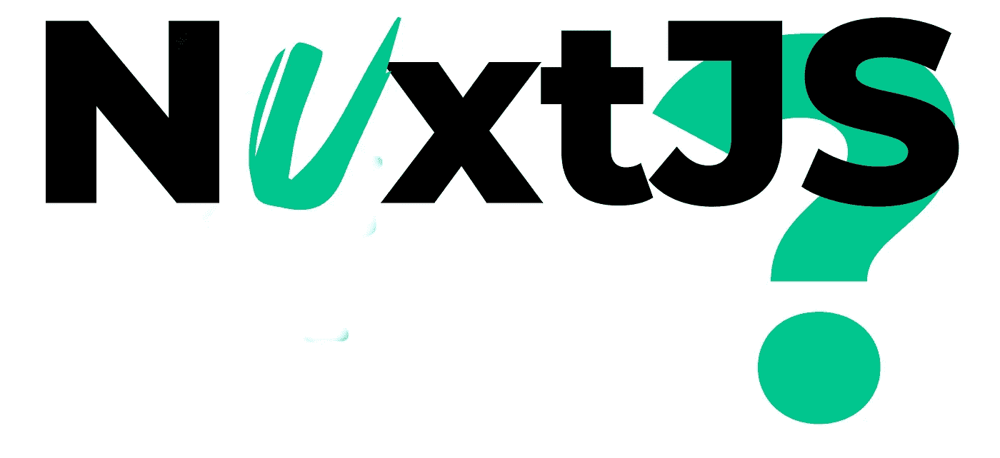

# 发现 Nuxt.js

> 原文：<https://javascript.plainenglish.io/discovering-nuxt-62ffbb791a0e?source=collection_archive---------8----------------------->

## Nuxt.js 是什么，有什么好的吗？

Nuxt.js: Next.js with a “u”, as in Vue

我真的很喜欢 Next.js。它有如此棒的开发人员体验，而且该框架自包含的全栈性质意味着我可以立即投入使用，而不用担心启动服务器。

然而，我热爱学习。我已经自学了 Angular 2+和 React，但我一直在寻找更多的信息。我一直在寻找一个好的项目，可以作为学习 Vue 的机会。我已经决定尝试建立一个法语科技博客，这似乎是一个完美的机会，尤其是当我看到它也有一个名为“Nuxt”的 Next.js 对等物时。

那么 Nuxt 是做什么的呢？而开发者体验是否与 Next.js 并驾齐驱？或者稍微换一种说法:Nuxt 和 Next 有什么共同点，它们的区别是什么？

# Next & Nuxt:为什么全栈元框架如此受欢迎

当使用 React 或 Vue 这样的前端框架时，我主要担心的是搜索引擎机器人将如何消费我的内容。如果我的网站是一个单页应用程序，我如何让谷歌将流量导向这个或那个页面？我如何知道**通过解释客户端代码来消费内容会如何影响**爬行？

另一方面，一旦您体验了客户端应用程序的流畅用户体验，就很难回到传统服务器端呈现提供的完整页面重新加载体验。

Nuxt 和 Next 试图分两个阶段解决这个问题。在第一阶段，服务器渲染一个页面的初始版本(也称为做服务器端渲染或 SSR)，目的是让 Google 的爬虫生活更轻松，提高页面的首次加载。这意味着每个页面的元数据(标题、元描述等。)得到更好的管理。

该页面的第一个版本包含该页面的 HTML 结构，以及“**合并**该页面的 javascript 代码，即一旦该页面已经显示，就注入客户端呈现代码。

在页面上没有动态数据的情况下，这两个框架都可以生成静态 HTML，这些 HTML 可以托管在一个无 CPU 的解决方案上，如 AWS 的 S3 服务，该服务提供文件而不必运行任何逻辑。

所有这些意味着我们有了一个快速显示的页面，但是是交互式的，导航时不需要刷新。这优化了 SEO 和用户体验。在我看来(并不总是谦逊的)，它们是开发的未来，因为它们带来了开发人员体验(或“DX”)方面的改进:您所做的更改会立即出现在屏幕上，无需手动刷新。

# Nuxt 的开发者体验优势在哪里？

为了比较这两个框架，我选择了一个特定的角度，一个范围有限但具有现实意义的实际案例:博客。如何从开发者体验的角度比较 Next 和 Nuxt？我在三个开发阶段比较了这两种解决方案:

*   **安装**:安装的时候会发生什么？
*   编码索引页，并降价**内容检索**
*   一个**博客文章页面**的编码(和创建铺设)

## 该装置

在安装时，Nuxt 提供了更多的选项。对于 Next，之后需要安装额外的部分，Nuxt 直接提供安装 Typescript 或 CSS 框架，如 Bootstrap、布尔玛、Tailwind 等。类似地，Nuxt 支持测试机制(并提供不同的解决方案)或 lint 的安装。Nuxt 引导你完成这个过程:一切都已经准备好了。没有必要搜索互联网(并找到大部分陈旧的信息)，也没有必要进行繁琐的操作。因此，在 Nuxt 上安装时，开发人员的体验会更好。

## 内容搜索(创建索引页面)

Nuxt 有一个特殊的访问器($content ),它直接获取本地 Markdown 内容，语法受 MongoDB 的启发。该库允许您搜索内容并对结果进行过滤或排序，或者选择相邻的内容(即下一篇或上一篇文章)。这使得内容管理比我们在 Next 中所做的要容易得多，在 Next 中，您必须自己编写内容访问代码。Nuxt 也赢得了这一分。

## 创建文章页面

与 Next 一样，路由(即 URL 和内容的关联)基于文件系统。和页面布局非常相似。有两件事值得强调。首先:Nuxt 安装了一个**顺风游乐场**，允许显示哪些风格已经被激活，它们看起来像什么。令人耳目一新的是，不必在心里将 Tailwind 文档和配置文件的细节结合起来。其次:Nuxt 提供了一个**内置编辑器**来动态编辑 Markdown 内容。不必深究源代码。这里值得一提的是，Nuxt 的文档非常广泛，并且提供了许多例子。其中一个特别有用，因为它解释了如何使用排版，这是一个顺风插件，让创建博客布局变得轻而易举。Nuxt 再次提供了更好的 DX。

# 结论…和选择

在这三点上，我都认为 Nuxt 领先。如果我从零开始，如果我了解 Vue 和我的反应一样好，我可能会选择 Nuxt。但事实并非如此，至少目前如此。已经很熟悉 Next 和 React 了，不知道 Vue(太像 Angular 了，让我想学)。但是，如果你了解 Vue，或者不熟悉 React，Nuxt 是一个非常扎实的选择。就我而言，我希望 Nuxt 能激励下一批开发人员更进一步地开发这个框架，因为 Nuxt 有很多令人喜欢的地方。

*更多内容看*[***plain English . io***](http://plainenglish.io/)