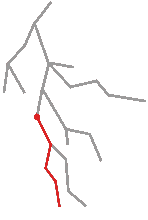

# 如何调度操作来更新 React 中的同级

> 原文：<https://javascript.plainenglish.io/dispatch-an-action-to-update-a-sibling-within-react-e98f5b5041f3?source=collection_archive---------3----------------------->

当 React 收到一个分派时，它会渲染纤程，然后根据属性和状态将更改提交给 DOM。

当我们有一个状态和一个动作位置时，这是非常简单的。

```
const Title = () => {
  cont [count, setCount] = useState(0)
  const onClick = () => { setCount(1) }

  return <div onClick={onClick}>{count}</div>
}
```

假设我们的组件树如下所示，并且我们在红点处安装了组件标题。



虽然 React 必须通过根来找出整个渲染的拓扑结构，但上面的调度的效果几乎做到了这一点。

## 兄弟姐妹的问题

当标题中有一个兄弟姐妹时，或者只是不在同一个分支中时，问题就出现了。你想改变兄弟姐妹的状态。在我们的例子中，我们想从某个地方调用标题中的`setCount`。相信我，有时候你想拥有它，即使兄弟姐妹不想分享任何东西:)

```
const Somewhere = () => {
  const onClick = () => { setCount(1) }

  return <div onClick={onClick}>{count}</div>
}
```

1.  如果某处是 Title 的孩子，我们会把`setCount`作为道具传过去。

```
<Title setCount={setCount} />
```

2.如果某个地方是 Title 的父级，或者在 Title 的兄弟分支中，我们将不能通过`setCount`,除非我们能首先从某个地方和 Title 中找到一个共同的祖先。这就是我们通常所说的提升。

```
const App = () => {
  cont [count, setCount] = useState(0)
  const onClick = () => { setCount(1) }

  return (
    <>
      <Title count={count} />
      <Somewhere setCount={setCount} />
    </>
  )
}
```

本质上，我们现在在 App 中定义`count`，而不是在 Title 中。

3.我们可以把状态存储到一个全局存储器中，然后一切又变得美好起来。

```
const Somewhere = () => {
  const { dispatchCount } = useRedux(...)
}
```

我对 redux 语法不太熟悉，在此致歉。但是实际上，您重新定位了状态，并将其分派到 React 之外的上下文中。这个世界并不像我想象的那么美好。因为全局策略太危险，无意冒犯，React 在内部使用了太多的全局变量。但是这个全球战略，对我来说，首先就违背了拥有道具的整个目的。

## 与兄弟姐妹交谈的练习

好了，我们来看看其他选项。其中常见的一件事就是用一个`useContext`来分享国家。

```
const App = () => {
  const [count, setCount] = useState()
  return (
    <Context.Provider value={{count, setCount}}>
      <Title />
      <Somewhere />
    </>
  )
}
```

这样，当任何一个孩子调用`setCount`时，它应该更新`count`，这又会触发对所有孩子使用`useContext`的更新浪潮。

```
const Somewhere = () => {
  const { setCount } = useContext(Context)
  const onClick = () => { setCount(1) }
}
```

这似乎可行。这种方法的唯一问题是成本。


想象有组件使用这个`Context`。最有可能的情况是，当`setCount`被触发时，我们得到上面的图片来通知三个位置(如 React `propagateContextChange`源代码)。

我大部分时间想做的就是让一切都保持在原来的位置，但是触发原始组件标题中的`setCount`。不是父母，不是我自己，不是全球池。

此外，React 的设计方式是来自`useState`的`setCount`也绑定到定义它的组件(如 React `dispatchAction`源代码)。因此，理论上，将`useState`转移到其他地方只会让事情变得复杂。

## 提议的解决方案

所以我不想改变`context`的值，我只想用它注册一个来自另一个组件的调度函数。

```
const fns = {}
const add = (name, fn) => { fns[name] = fn }
const dispatch = (name, n) => { fns[name] && fns[name](n) }
const RefContext = createContext({ add, dispatch })export default RefContext
```

一个`RefContext`被创建，它的任务是保持调度功能。所以你可以在任何地方做下面两条语句。

```
add('setCount', setCount)
dispatch('setCount', n)
```

有了`RefContext`，让我们把它用在任何一个孩子身上。

```
const Somewhere = () => {
  const { dispatch } = useContext(RefContext)
  const onClick = () => { dispatch('setCount', 10) }
  return <div onClick={onClick}>+</div>
}
```

现在在某个地方，我们可以通过定制的`dispatch`函数访问`setCount`。它不漂亮，但我们可以`setCount`到另一个组件。

我们还需要源组件来提供调度功能。

```
const Title = () => {
  cont [count, setCount] = useState(0)
  const { add } = useContext(RefContext)
  useEffect(() => { add('setCount', setCount) }, [])   const onClick = () => { setCount(1) }
  return <div onClick={onClick}>{count}</div>
}
```

向原来的标题组件添加两行，这样我们就可以向池中添加调度函数`setCount`。

现在，如果您转到同级的某个地方，并单击按钮，您可以将标题`count`设置为`10`。哇哦。这不是很疯狂吗？

如果您担心内存泄漏，我们可以在设置`setCount`时调整`useEffect`。

```
useEffect(() => { 
  add('setCount', setCount)
  return () => {
    add('setCount', null)
  } 
}, [])
```

下面是一些观察结果。

一个是上下文值没有改变，你可以把它当作一个引用。不知何故，当我玩这个的时候，我甚至没有添加一个提供者，似乎 React 可以默认抓取根提供者。

另一个是`useState`必须在原来的位置，这正是我想要的:)为什么我要把它放在原来的位置？因为否则它会改变渲染的拓扑结构，就像上面的两个树形图一样。

最后但同样重要的是，使用这种方法，兄弟可以在树中的任何位置。

## 摘要

背景很重要，我们都知道。但是我们不必把可变的状态存储到它里面，相反，我们可以把它作为一个容器来承载功能，而不需要任何状态变化。如果我们这样做，我们似乎得到了两个世界的最佳选择，用`useContext`的广泛覆盖和用`useState`的瑞士刀。

**附录—挂钩**

也许如果我们把上面的想法变成钩子。我们可以为源`useSharedSource`准备一个，在这里它接受`Context`，并存储状态和调度函数。

```
const useSharedSource = (initialState, RefContext) => {
  const [state, dispatch] = useState(initialState)
  const { current } = useContext(RefContext)
  current.state = state
  current.dispatch = dispatch
}
```

我们可以为消费者设置另一个`useSharedState`。

```
const useSharedState = (RefContext) => {
  const { current } = useContext(RefContext)
  return [current.state, current.dispatch]
}
```

这是背景。

```
const RefContext = createContext({ current: null })
```

也许这能导致多功能的`useState`。

```
const useState = (initialState, RefContext) => {
  const [state, dispatch] = useState(initialState)
  if (RefContext === undefined) return [state, dispatch]

  const { current } = useContext(Context)
  return [current.state, current.dispatch]
}
```

如果给定了一个`RefContext`，它就使用代理版本，否则就恢复到经典的`useState`。这里我打破了在两个钩子之间有一个`if`的规则，但是我认为`useContext`是例外的，因为它只读取内存。

*更多内容请看*[***plain English . io***](http://plainenglish.io)