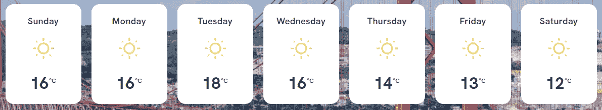
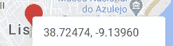
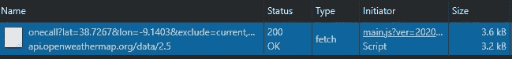

# 用 OpenWeather API 显示 7 天天气预报

> 原文：<https://javascript.plainenglish.io/display-7-day-weather-forecast-with-openweather-api-aac8ba21c9e3?source=collection_archive---------3----------------------->

## 使用现代 JavaScript 技术

有许多天气 API 允许我们获取数据并显示特定位置的天气预报。我发现 [openweathermap API](https://openweathermap.org/api) 是个不错的选择。每月高达 100 万次免费通话，并且有一个一次通话 API 为您提供您需要的所有重要信息。我将使用它来建立一个天气网络“小部件”，显示 7 天的预测与以下数据:

*   天
*   温度(摄氏度)
*   图标(晴空、雨、雾等。)


Photo by [Raphael Rychetsky](https://unsplash.com/@raphaelfyi?utm_source=medium&utm_medium=referral) on [Unsplash](https://unsplash.com?utm_source=medium&utm_medium=referral)

我们可以将流程分为 3 个部分:

1.  获取数据
2.  显示数据
3.  性能改进——当用户滚动组件时加载资源(交叉点观察器 API)



design of weather component

> 注意:下面的代码示例是用普通的 JavaScript 编写的，所以实现可能会有所不同，这取决于你的技术。我不打算分享 CSS，你可以随心所欲地设计它。

## 1.获取数据

我们要做的第一件事是[在 openweathermap](https://home.openweathermap.org/users/sign_up) 上注册，以便创建一个 API 密匙。之后，我们可以遵循 [One Call API](https://openweathermap.org/api/one-call-api) 文档。端点看起来像这样:

> [https://api.openweathermap.org/data/2.5/onecall?lat={lat}&lon = { lon }&exclude = { part }&appid = { API](https://api.openweathermap.org/data/2.5/onecall?lat={lat}&lon={lon}&exclude={part}&appid={API)key }

例如，我们可以从谷歌地图中获取纬度和经度。右键点击地图，复制坐标。例如，对于里斯本，它将是:



默认响应包含许多我们并不真正需要的东西。我们只对每日预测感兴趣，所以让我们**排除**以下部分:

`&exclude=current,minutely,hourly,alerts`

我们也可以改变单位，所以让我们把它设置为公制，以显示摄氏温度。

`&units=metric`

考虑到这些变化，端点将如下所示:

```
[https://api.openweathermap.org/data/2.5/onecall?lat=38.7267&lon=-9.1403&exclude=current,hourly,minutely,alerts&units=metric&appid={API](https://api.openweathermap.org/data/2.5/onecall?lat=38.7267&lon=-9.1403&exclude=current,hourly,minutely,alerts&units=metric&appid={API) key}
```

在我们编写任何代码之前，我们可以测试端点，例如在 [Postman](https://www.postman.com/) 中，看看它返回什么。下面是结果，我突出显示了我们将使用的数据:

```
{
  “lat”: 38.7267,
  “lon”: -9.1403,
  “timezone”: “Europe/Lisbon”,
  “timezone_offset”: 0,
  “daily”: [
    {
      **“dt”: 1615723200,**
      “sunrise”: 1615704562,
      “sunset”: 1615747333,
      “temp”: {
        **“day”: 16.03,**
        “min”: 9.38,
        “max”: 18.2,
        “night”: 11.87,
        “eve”: 16.01,
        “morn”: 9.68
      },
    “feels_like”: {
      “day”: 12.26,
      “night”: 9.14,
      “eve”: 12.95,
      “morn”: 5.5
    },
    “pressure”: 1027,
    “humidity”: 49,
    “dew_point”: 5.33,
    “wind_speed”: 3.87,
    “wind_deg”: 31,
    “weather”: [
      {
        “id”: 800,
        “main”: “Clear”,
        “description”: “clear sky”,
        **“icon”: “01d”**
      }
    ],
    “clouds”: 4,
    “pop”: 0,
    “uvi”: 5.33
  },
  ...
```

## 2.显示数据

我们得到了每日天气预报的数据。“每日”数组包含 8 个对象，这意味着今天+ 7 天。假设我们有下面的 HTML，我们可以编写一个函数，为每一天创建一个元素，我们可以将它附加到*。预测*部门。

```
<section class=”weather”>
  <div class=”container”>
    <div class=”forecast”>
      // here we populate the 7 days forecast
    </div>
  </div>
</section>
```

让我们将这个函数命名为 *fetchForecast()*

这是我们在这里做的:

*   我们创建 *forecastEl* 变量来引用 HTML 元素
*   我们使用 *fetch()* 方法，该方法接受一个强制参数——我们的端点。它返回一个解决响应的承诺
*   我们得到一个 JSON 数据( *response.json()* )，并使用 *forEach* 循环遍历每日数组。
*   接下来的 7 天是我们关心的，所以我们检查*(索引> 0)*
*   `daily.dt`是预测数据的时间，Unix，UTC。
    取一个可读的名字(周一，周二等。)我们需要转换它:

```
var dayname = new Date(value.dt * 1000).toLocaleDateString(“en”, { weekday: “long”, });
```

*   我们用 [*toFixed()*](https://developer.mozilla.org/en-US/docs/Web/JavaScript/Reference/Global_Objects/Number/toFixed) 方法格式化温度，并用[模板文字](https://developer.mozilla.org/en-US/docs/Web/JavaScript/Reference/Template_literals)在 HTML 中显示我们感兴趣的其他数据。
*   最后，我们将 HTML 添加到页面中。

## 3.性能改进

有很多方法可以优化网站的速度。例如，我们可以延迟加载资源(基于路径、基于交互、在视口中)，使用新的 CSS 技术如`content-visibility`等。

在这个例子中，我们可以只在滚动到天气元素后，集中精力获取数据。为此，我们可以利用交叉点观察器 API。
我们查询一下*。天气选择器，观察它，一旦我们通过滚动足够接近它，我们就调用 *fetchForecast()* 函数。*

Intersection Observer on weather element

这样，我们在初始加载时节省了将近 4kB。



我们还以像素为单位定义了 rootMargin，这表示在我们到达元素之前，调用应该在 x 像素处被触发。

## 摘要

在本文中，我们学习了如何使用 OpenWeather API 获取天气预报数据，以及如何使用 JavaScript 在 web 上显示这些数据。我们使用像 *fetch()* 这样的本地方法来获取数据，并使用模板字符串轻松地创建了 HTML。

考虑性能影响总是好的，因此在这种情况下，我们确保仅在用户在视口中滚动后获取和处理数据。为此，我们使用了交叉点观察器 API。

*更多内容请看*[***plain English . io***](https://plainenglish.io/)