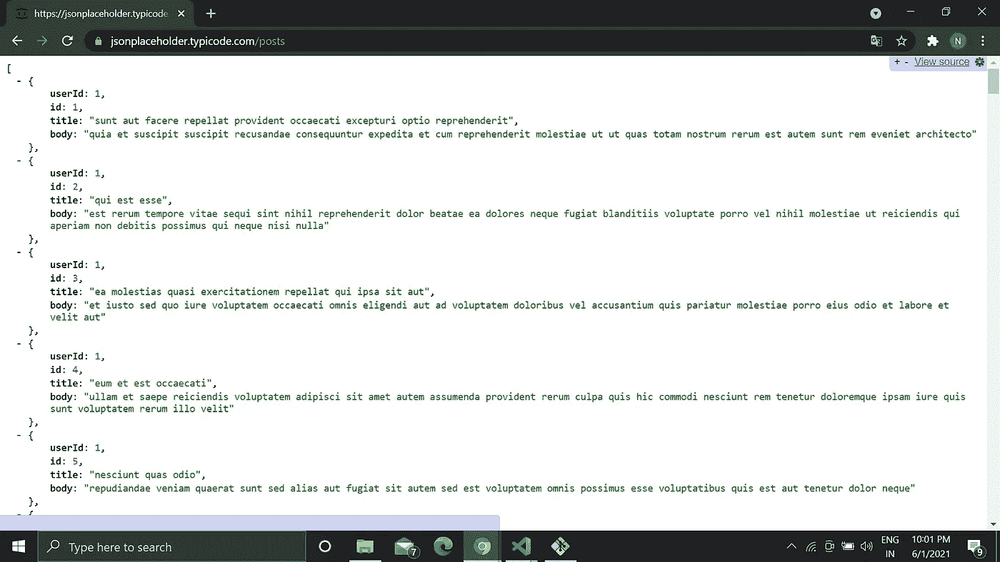
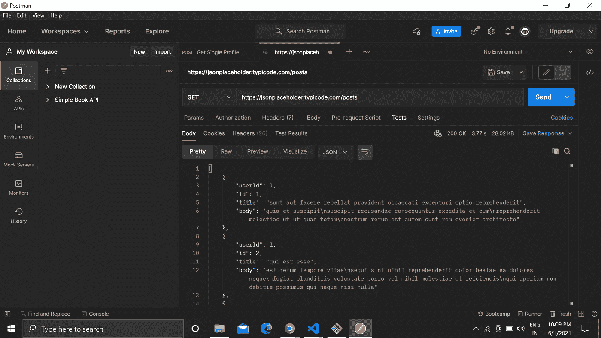
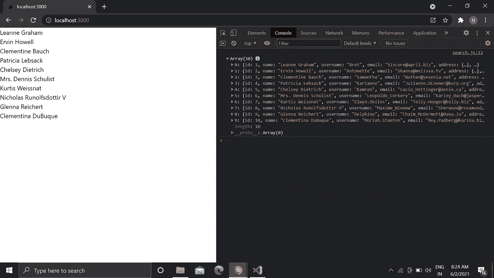

# 在带有钩子的 React 应用程序中使用 Axios 显示 API 数据

> 原文：<https://javascript.plainenglish.io/display-api-data-using-axios-in-a-react-app-with-hooks-eb9ca298f27?source=collection_archive---------1----------------------->

## JavaScript 中 fetch 方法的替代方法


Photo by [Corinne Kutz](https://unsplash.com/@corinnekutz?utm_source=medium&utm_medium=referral) on [Unsplash](https://unsplash.com?utm_source=medium&utm_medium=referral)

前端对我来说很简单。在 Figma 或 Adobe 中进行设计，并使用 React、Angular 或 Vue 创建相同的 UI。

但是当我需要从一个 API 或者后端获取数据的时候，我不得不花费很大的精力。我还没有找到一个很好的资源向我解释如何从 API 或后端获取数据。

实际上，我对使用 Axios 获取数据的概念不是很清楚。

这可能是我的错，但我必须为使用 Axios 搜索很多。此外，Axios 的许多使用方式让我有点不知所措。

经过大量的学习，我发现了一个初学者可以用来获取数据的简单方法。

那我们开始吧。

# API 到底有没有用？

假设当你得到一个 API 或者你想向一个 API 发出请求，你会怎么做？转到 VS 代码，开始实现。

但这不是正确的方法。

首先，检查 API 是否在工作。

你可以用三种方法来做这件事。让我们从一个免费的假 API 比如 [JSONPlaceholder](https://jsonplaceholder.typicode.com/) 中取一个例子。你可以从这里得到各种各样的假 API，比如[帖子数量](https://jsonplaceholder.typicode.com/posts)、[用户数量](https://jsonplaceholder.typicode.com/users)等等。

1.  第一种方法是直接点击链接或转到该网址。例如，当我点击[文章数量](https://jsonplaceholder.typicode.com/posts)时，它会显示类似下图的内容。



我有一个扩展，可以更准确地显示 API 中的数据。扩展的名字是 [JSONView](https://chrome.google.com/webstore/detail/jsonview/chklaanhfefbnpoihckbnefhakgolnmc?hl=en) 。也可以在 Chrome 内部安装使用。

如果 API 是公开可用的，这有助于我们知道它正在工作。此外，您可以更清楚地看到 API 内部的数据数量。

2.第二种方法是使用邮递员。Postman 使用 API 帮助我们减轻工作负担。只需编写 API 链接，并通过单击 send 按钮获取数据。



您可以看到，我们也在这里获取数据。

邮递员同时为公共和私有 API 工作。对于私有 API，您需要设置不记名令牌或其他类型的授权。

[这里的](https://www.youtube.com/watch?v=VywxIQ2ZXw4)是一个很棒的视频，如果你想学习使用 Postman 使用 API 的话。

3.第三种方式是在任何代码编辑器内部使用`**console.log(response.data)**` 。我们稍后将讨论这个问题。

# 初始化 React 应用程序

首先，您需要使用初始化 React 应用程序，

```
npx create-react-app my-app
```

之后，使用以下命令安装 Axios，

```
npm i axios
```

# 创建功能组件

在 React 应用程序中创建一个组件文件夹，或者根据需要创建一个文件。

我的文件名是 Get.js

在你的文件中创建一个如下的功能组件。

```
import React from 'react'function Get() {
return (<div></div>)}export default Get;
```

现在导入我们将使用的依赖项。

```
import React from 'react'
import { useState, useEffect } from "react";
import axios from "axios"
```

并创建一个如下所示的 useState 挂钩，

```
const [data, setData] = useState(‘’);
```

在这里，我们将设置从 API 获得的数据。最初，不会有任何数据。

# 使用 Axios 获取 API 数据

目前为止我们还没有和 API 合作过。现在我们开始吧。

首先，定义一个任意名称的方法。

```
const getAllData = () => {axios.get("https://jsonplaceholder.typicode.com/users").then((response) => {
console.log(response.data);
setData(response.data);
}).catch((error) => {
console.log(error);
});};
```

这里我们使用 Axios，而在`axios.get`中我们定义了我们需要 API 数据的 URL。然后我们将设置数据，如果我们遇到错误，它将打印错误。

让我们看一下，我们也在这里`console.log(response.data);`，这将帮助我们了解我们正在从 API 获取数据。

但是上面的方法不会起作用，因为到目前为止我们还没有调用它。

因此，我们将使用`useEffect hook`

```
useEffect(() => {
 getAllData();
}, []);
```

# 使用 Axios 显示数据

现在我们也看不到数据。因为到目前为止我们还没有展示过。

让我们展示它。

```
<>{data ? ( data.map((data) => {return (<div className="data" key={data.id}>
<h3>{data.name}</h3>
</div>); })) : (<h3>No data yet</h3>)}</>
```

这里，我们使用三元运算符。并且应用了一个条件，如果存在一些数据，那么只呈现一个带有 data-name 的 div，否则不打印任何数据。

就是这样。我们已经使用 Axios 从 API 访问了数据，并显示了数据。

这里有一个完整的代码为您提供帮助。

```
import React from 'react'
import { useState, useEffect } from "react";
import axios from "axios"function Get() {
    const [data, setData]  = useState('');const getAllData = () => {
        axios
          .get("[https://jsonplaceholder.typicode.com/users](https://jsonplaceholder.typicode.com/users)")
          .then((response) => {
            console.log(response.data);
            setData(response.data);
          })
          .catch((error) => {
            console.log(error);
          });
}useEffect(() => {
      getAllData();
},[]);return (
        <>
            {data ? 
                data.map(data => {
                    return(
                       <div className="data" key={data.id}>
                         <h3>{data.name}</h3>
                       </div>
                    )
                }) : <h3>No data yet</h3> }
        </>
    )
}export default Get;
```

当你在 App.js 中导入这个功能组件，它就可以工作了。



这里，我们正在获取数据，甚至在控制台选项卡中显示数据。

现在你也可以说得更清楚了。除了在 return 语句中编写逻辑，您还可以创建一个方法并像下面这样调用。

```
import React from "react";
import { useState, useEffect } from "react";
import axios from "axios";function Get() {
  const [data, setData] = useState("");const getAllData = () => {
    axios
      .get("[https://jsonplaceholder.typicode.com/users](https://jsonplaceholder.typicode.com/users)")
      .then((response) => {
        console.log(response.data);
        setData(response.data);
      })
      .catch((error) => {
        console.log(error);
      });
  };useEffect(() => {
    getAllData();
  }, []);**const displayData = () => {
    return data ? (
      data.map((data) => {
        return (
          <div className="data" key={data.id}>
            <h3>{data.name}</h3>
          </div>
        );
      })
    ) : (
      <h3>No data yet</h3>
    );
  }**return (
    <>
      **{displayData()}**
    </>
  );
}export default Get;
```

仅此而已。您已经在应用程序中显示了 API 数据。

[*如果你喜欢阅读这样的故事，并想帮助我成为一名作家，考虑成为一名中等成员*](https://nitinfab.medium.com/membership) *。它每月花费 5 美元，给你* [*无限制访问媒体内容*](https://nitinfab.medium.com/membership) *。如果你通过我的链接注册，我会得到一点佣金。*

就这些——谢谢。

你也可以阅读下面的故事。

[](/6-free-tools-that-helped-me-become-an-expert-web-developer-41b999403865) [## 6 个免费工具，帮助我成为一名专业的网络开发人员

### 由一位拥有 30 多年经验的 web 开发人员建议。

javascript.plainenglish.io](/6-free-tools-that-helped-me-become-an-expert-web-developer-41b999403865) [](/how-i-would-learn-front-end-web-development-if-i-had-to-start-over-again-24e6228050d0) [## 如果我必须重新开始，我将如何学习前端 Web 开发

### 一个白手起家的 web 开发者的故事。

javascript.plainenglish.io](/how-i-would-learn-front-end-web-development-if-i-had-to-start-over-again-24e6228050d0) [](/how-to-learn-web-development-using-free-resources-1c677e70de14) [## 如何利用免费资源学习 Web 开发

### 初学者的深入指南。

javascript.plainenglish.io](/how-to-learn-web-development-using-free-resources-1c677e70de14) 

*更多内容请看*[*plain English . io*](http://plainenglish.io/)