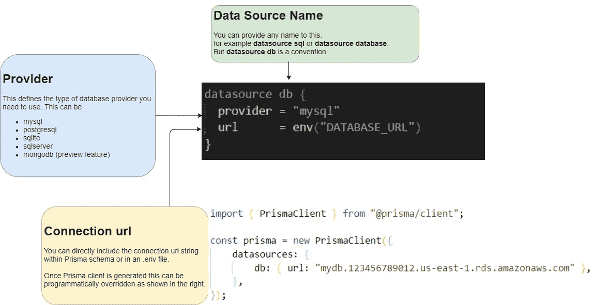
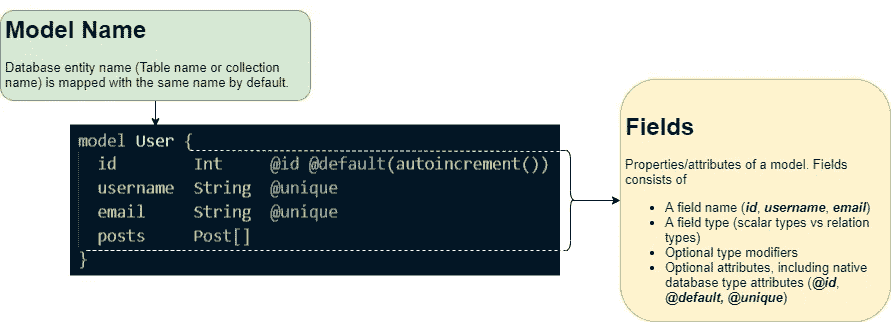
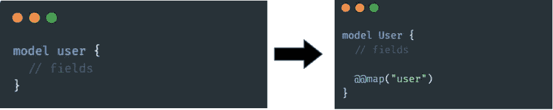
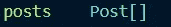

# 对 Prisma 模式的深入探究

> 原文：<https://javascript.plainenglish.io/diving-into-prisma-schema-b278e92dff8b?source=collection_archive---------3----------------------->


Photo by [Kelly Sikkema](https://unsplash.com/@kellysikkema?utm_source=unsplash&utm_medium=referral&utm_content=creditCopyText) on [Unsplash](https://unsplash.com/s/photos/plan?utm_source=unsplash&utm_medium=referral&utm_content=creditCopyText)

在上一篇文章中，我概述了利用 Prisma 进行后端开发的好处。如果你还没看过，请在这里阅读。

[](/simplifying-backend-development-with-prisma-564200f31943) [## 使用 Prisma 简化后端开发

### Prisma 初学者演练，了解我们如何开发灵活和可伸缩的后端。

javascript.plainenglish.io](/simplifying-backend-development-with-prisma-564200f31943) 

尽管我们直接用 Prisma 编写了一个简单的应用程序逻辑，但我们并没有仔细研究它所涉及的大部分方面。

在本文中，我将简要介绍一下 Prisma 设置中的主要配置文件:**Prisma 模式**。

与上一篇文章类似，我们将关注 MySQL 数据库的一切工作原理。

我们之前使用的所有代码都可以在下面的库中找到。

[](https://github.com/Pasi-D/Prisma-Starter/) [## GitHub - Pasi-D/Prisma-Starter:一个简单的项目，演示了使用 Prisma ◭的简单性

### 一个简单的项目旨在展示使用棱镜◭的简单性。这个演示分为以下几个分支…

github.com](https://github.com/Pasi-D/Prisma-Starter/) 

# 让我们在🤿潜水吧


Prisma schema we developed so far

Prisma 模式有三个主要部分。

1.  数据源
2.  发电机
3.  数据模型定义

让我们来看看他们中的每一个。

## [数据来源](https://www.prisma.io/docs/concepts/components/prisma-schema/data-sources)

> Prisma 如何连接到数据库由 Prisma schema 中的[***data source***](https://www.prisma.io/docs/reference/api-reference/prisma-schema-reference/#datasource)*块决定。*

***⚠您只能在 Prisma 模式中指定一个** [**数据源**](https://www.prisma.io/docs/reference/api-reference/prisma-schema-reference/#datasource) **块。***

**

*datasource block in a nutshell*

*除了 ***提供者***&***URL***字段之外，还有另一个名为***shadowDatabaseUrl***的字段，它在管理迁移时很方便。我们将在以后的文章中讨论这个问题。*

*截至撰写本文时，Prisma 已经否决了与多个数据库提供商合作的支持。*

## *[发电机](https://www.prisma.io/docs/concepts/components/prisma-schema/generators)*

> *当您运行`npx prisma generate`(或`prisma generate`如果您全局安装 Prisma)时，将创建的资产由该块的配置决定。*

*Prisma 模式可以有一个或多个生成器模块。*

*以下字段可以在此块中修改。*

*   ***provider** :定义创建哪个 Prisma 客户端的必填字段。目前只有`prisma-client-js`(即 Prisma 的 JavaScript 客户端)是 Prisma 唯一可用的提供商。
    但是，您可以在这里指定遵循 Prisma 的生成器规范的任何其他文件或 [npm](https://www.npmjs.com/) 包。你可以在这里查看来自[的社区构建生成器列表。](https://www.prisma.io/docs/concepts/components/prisma-schema/generators#community-generators)*
*   ***输出**:可选字段，决定生成的客户的位置。默认情况下，该位置路径为`node_modules/.prisma/client`*

*当您将提供者指定为`prisma-client-js`时，可以在生成器块中解析以下两个字段。*

*   *[**binary targets**](https://www.prisma.io/docs/concepts/components/prisma-schema/generators#binary-targets):`prisma-client-js`使用多个引擎二进制文件，这些二进制文件是可执行的二进制文件。因此，在将应用程序部署到特定平台时，使用正确的二进制文件非常重要。
    默认情况下，该字段值为*。对于本机二进制目标，Prisma 检测当前操作系统&自动为客户端指定正确的二进制目标。
    您可以从 [Prisma schema API 参考](https://www.prisma.io/docs/reference/api-reference/prisma-schema-reference#binarytargets-options)中查看 binaryTargets 选项列表。**
*   **[**预览功能**](https://www.prisma.io/docs/concepts/components/preview-features/) : Prisma 发布某些只在预览中的功能。它们还没有完全投入生产，但是你可以开始采用它们。Prisma 客户端功能标志的完整列表& Prisma 模式可以在[这里](https://www.prisma.io/docs/concepts/components/preview-features/client-preview-features/)找到。
    ⚠如果你希望使用 ***预览功能*** (s)先与可用的 Prisma 版本进行交叉检查。**

## **[数据模型定义](https://www.prisma.io/docs/concepts/components/prisma-schema/data-model)**

**让我们看一下我们在上一篇文章中完成的最后一个数据模型。**

```
**model User {
  id        Int     @id @default(autoincrement()) 
  username  String  @unique 
  email     String  @unique 
  posts     Post[] 
}model Post { 
  id        Int     @id @default(autoincrement()) 
  title     String 
  content   String? 
  authorId  Int 
  author    User?   @relation(fields: [authorId], references: [id]) 
}**
```

> **现在你可能已经意识到 ***模型*** 块负责你的应用领域中的一个实体。它们被映射到表(对于关系数据库)或集合(对于非 sql 数据库)。**

****

**model block.**

**你如何命名你的 Prisma 模型是非常重要的。默认情况下，它以相同的名称映射到相关的数据库实体。**

**使用`[@@map](https://www.prisma.io/docs/reference/api-reference/prisma-schema-reference/#map-1)`属性，您可以重命名底层数据库实体。**

```
**model User { 
  id        Int @id @default(autoincrement())  
  username  String @unique   
  email     String @unique   
  posts     Post[] @@map("user")
}**
```

**通过内省更新 Prisma 模型时，Prisma 不遵循特定的约定。它将使用相同的实体名称。在这种情况下，为了在您的模型中保持相同的约定，可以使用属性`@@map`。**

****

**Its essential to keep a consistency in how you write your application models**

**对于两个模型名称&数据库实体名称，我们将坚持使用 [pascal 大小写约定](https://techterms.com/definition/pascalcase)。**

**字段嵌套在模型块中。它们代表了我们的数据库实体的属性。
类似于`[@@map](https://www.prisma.io/docs/reference/api-reference/prisma-schema-reference/#map-1)`用于模型名，我们可以使用`[@map](https://www.prisma.io/docs/reference/api-reference/prisma-schema-reference/#map)`属性来重命名数据库实体中映射的属性名。**

**说到字段，有两种类型**

*   **标量字段**
*   **关系字段**

*****标量字段*****

**我们在模型中使用的一般数据类型，如 *Int* 、 *String* 就属于这种类型。**

**我们之前使用的数据源连接器决定了每个 Prisma 标量类型如何映射到底层的本地数据库类型。**

**由于我们使用的是 MySQL，下面是每个标量字段的映射方式。这些字段包括某些属性，这些属性有助于调整底层数据库实体的形状。**

**model field scalar types in MySQL database**

*****关系字段*****

**Prisma 模型上的某些字段没有标量类型。相反，他们的类型是另一种模式。这些字段是关系字段。**

**在我们构建的数据模型中，有一个一对多的关系，一个用户可以有多个 Post 记录&一个 Post 记录有一个用户。**

****

**author relation field in Post model**

****

**posts relation field in User model**

**这些关系字段不会映射到基础数据库实体中。它们用于生成 Prisma 客户端。**

**`@relation`属性只能应用于关系字段。通常，当您需要向模型中的标量字段添加外键约束时，就会用到这一点。**

# **属性**

**到目前为止，我们已经看到了诸如 [@@map，](https://www.prisma.io/docs/reference/api-reference/prisma-schema-reference/#map-1) @relation，@unique 等属性。这些会改变字段或模型块的行为。有两种类型的属性可以添加到数据模型中。**

1.  **字段属性—前缀为@(例如:`[@id](https://www.prisma.io/docs/reference/api-reference/prisma-schema-reference#id)`)**
2.  **阻止属性—前缀为@@(例如:`[@@map](https://www.prisma.io/docs/reference/api-reference/prisma-schema-reference#map-1)`)**

**我们将看看与关系数据库一起工作的一些属性。**

**`[**@id**](https://www.prisma.io/docs/reference/api-reference/prisma-schema-reference#id)`**

**该属性有助于将字段标记为数据库实体的唯一标识符。它映射到底层关系数据库中的`PRIMARY KEY`。**

**`[**@@id**](https://www.prisma.io/docs/reference/api-reference/prisma-schema-reference#id-1)`**

**为了在关系数据库中创建复合主键，可以利用这一点。**

**我们可以用用户名和电子邮件在用户模型中创建一个复合主键来替换 id 字段。**

```
**model User { 
  username  String
  email     String
  posts     Post[] @@id([username, email])
}**
```

**同样，可以用`[**@@unique**](https://www.prisma.io/docs/reference/api-reference/prisma-schema-reference#unique)`生成一个复合唯一键**

```
**model User {  
  id         Int      @id @default(autoincrement()) 
  username   String   
  email      String   
  posts      Post[]  

  @@unique([username, email]) 
}**
```

**除了这些属性之外，您还可以在 [Prisma 模式参考](https://www.prisma.io/docs/reference/api-reference/prisma-schema-reference#attributes)文档中详细阅读其他属性。**

**除此之外，还有属性函数。**

**`[**autoincrement()**](https://www.prisma.io/docs/reference/api-reference/prisma-schema-reference#autoincrement)`**

**在 MySQL 这样的关系数据库中，这映射到`AUTO_INCREMENT`，数据库将增加数字 ID 值。**

**`[**uuid()**](https://www.prisma.io/docs/reference/api-reference/prisma-schema-reference#uuid)`**

**这将生成一个 UUID 字符串。**

**`[**now()**](https://www.prisma.io/docs/reference/api-reference/prisma-schema-reference#now)`**

**这将设置当前时间戳。MySQL &中的`CURRENT_TIMESTAMP()`映射与`DateTime` Prisma 标量类型兼容。**

**属性函数的完整列表也可参考 [Prisma 模式参考](https://www.prisma.io/docs/reference/api-reference/prisma-schema-reference#attribute-functions)。**

## **结论**

**我们将从这里结束这篇文章。在下一篇文章中，我们将考虑简单的博客场景，采用一种实用的方法来建模我们的数据。**

***更多内容请看*[***plain English . io***](http://plainenglish.io)**