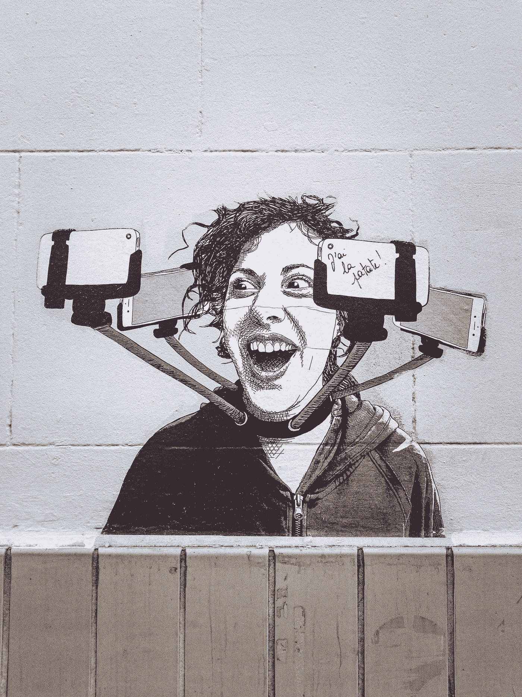

# 开发人员真的会一辈子都在编码吗？

> 原文：<https://javascript.plainenglish.io/do-developers-really-spend-their-entire-lives-coding-4a471c4deb03?source=collection_archive---------18----------------------->

## 整天写代码不休息还是写优质代码？选择你的立场。

Photo by [Roman Synkevych](https://unsplash.com/@synkevych?utm_source=medium&utm_medium=referral) on [Unsplash](https://unsplash.com?utm_source=medium&utm_medium=referral)

首先，如果你在一家公司工作，你每天花在电脑上的时间比例是很清楚的。你的吃饭时间，休息时间，是例行公事，甚至在你喝咖啡或茶之后，它也变成例行公事。我 8 点到 18 点工作，12 点到 13 点吃午饭。刚开始工作的时候，我习惯每天在不同的时间买茶和咖啡，现在我的咖啡里有一个小时。

对我来说，早晨是我头脑最清醒的时间段。下午 4 点的时候我脑子有点崩溃，5 点以后我的耳机和我的都没电了。

Photo by [Cookie the Pom](https://unsplash.com/@cookiethepom?utm_source=medium&utm_medium=referral) on [Unsplash](https://unsplash.com?utm_source=medium&utm_medium=referral)

有时你在电脑上，但你也不是。你写东西，解一些代码，但是怎么解，有点复杂。最重要的问题是，我看到我做梦的能力在一天的那个时候消失了。

Photo by [Ryoji Iwata](https://unsplash.com/@ryoji__iwata?utm_source=medium&utm_medium=referral) on [Unsplash](https://unsplash.com?utm_source=medium&utm_medium=referral)

对于一个开发者来说，梦想是最大的天赋。没有梦想你就不能把碎片拼在一起，如果碎片拼不到一起，诚信就出不来。

 [## 用我的推荐链接加入媒体

### 作为一个媒体会员，你的会员费的一部分会给你阅读的作家，你可以完全接触到每一个故事…

bestte.medium.com](https://bestte.medium.com/membership) 

如果加上往返时间，我的工作生涯中每天大约有十一个小时。一天中很大一部分时间，我在这么长的时间框架内编码的时间，大约是 60–70%。

坐在办公桌前变得疲惫是一个很大的天赋，很大的乐趣。我真的很累。我们可以用手臂做我们唯一的身体动作，有时我会摇摇我的脚。我们吃饭睡觉。如果你愿意，每天喝 2 升咖啡，因为身体过一段时间就会习惯咖啡因，所以它永远不会成为不睡觉的方法。

我觉得开发者的生活从外面看起来很神秘。你整天在你的计算机上做什么？

1.  我在做人们对我的期望
2.  Spotify 上没有我不听的歌曲
3.  我经常阅读别人写的代码或励志文章来改变我的观点

阅读与我的工作相关或无关的有趣代码示例真的很有帮助。语言变了，但伪代码的逻辑是一样的，它把我带到了我作品中美丽的地方。

Photo by [Nicole Wolf](https://unsplash.com/@joeel56?utm_source=medium&utm_medium=referral) on [Unsplash](https://unsplash.com?utm_source=medium&utm_medium=referral)

比方说，我平均工作 6-7 个小时编写代码。如果我的一天没有那么无聊、疲惫、不堪，我会回家休息，然后坐在电脑前。我在一次又一次地做研究。一段时间后，做研究成为你最大的活动。如果我喜欢什么，我就试着用自己的方式编码。

我在工作中开发网站，在家里处理手机。两样都做给了我一种奇怪的快乐。当我一天中有规律地做这两件事时，我会开心得多。当我把头靠在枕头上时，我开始新的一天，希望能够说，哇，我今天会变成什么样。

当你刚开始生活中的某件事时，你会想去追求它。当你看到你能做什么并开始前进时，你会想走得更高。成功给了一个人快乐、平静和自我。有必要活出自我，否则不愉快的情况就会出现。例如，我离开前一份工作的原因是大四学生膨胀但空虚的自我。

程序员也是人，他们有个人生活。如果他愿意，他有家庭，妻子，或者丈夫和孩子。如果他能在早上以极大的动力去工作，并在工作中取得成功，那么他在自己成功之后最大的来源也许就是他的家庭。如果他们能满足与家人的共同期望，他们就能在电脑前工作到天亮。双方都很高兴。一个人的幸福变成了很多人的幸福。

但是有很多痴迷的程序员，他们有孩子，却不感兴趣。他唯一的目标就是为孩子的生活挣更多的钱。我认识一些人，他们没有去看你妻子的生日，因为他很忙。做程序员其实不是这样的。人的脑子里总会有这样的想法。

如果你愿意，戴上眼罩，每天编码二十个小时，然后大肆吹嘘。但是一个非常积极的人可能在 3-4 小时内写出你写的代码。

在我看来，一天写多少个小时的代码，花多少个小时在电脑上，都没有关系。重要的是你发现的作品。

要做好一份高质量的工作，重要的是保持高昂的动力，不要失去想象力。

Photo by [mariel reiser](https://unsplash.com/@mailinr?utm_source=medium&utm_medium=referral) on [Unsplash](https://unsplash.com?utm_source=medium&utm_medium=referral)

我认为人们问你今天写了多少行、多少小时的代码的原因只是为了满足他们自己的自尊心。如果你的答案比他/她多很多，第二天他就会和你赛跑。但是，唉，他会被自我打败的。

*更多内容看*[***plain English . io***](http://plainenglish.io/)

 [## 作为一名软件工程师，我从商业中学到的最重要的事情

### 写代码只是写代码吗，现阶段的认识在哪里，我们这些年在哪里犯了错误，还有…

javascript.plainenglish.io](/the-most-important-thing-i-learned-in-business-as-a-software-engineer-479aaa589ec)