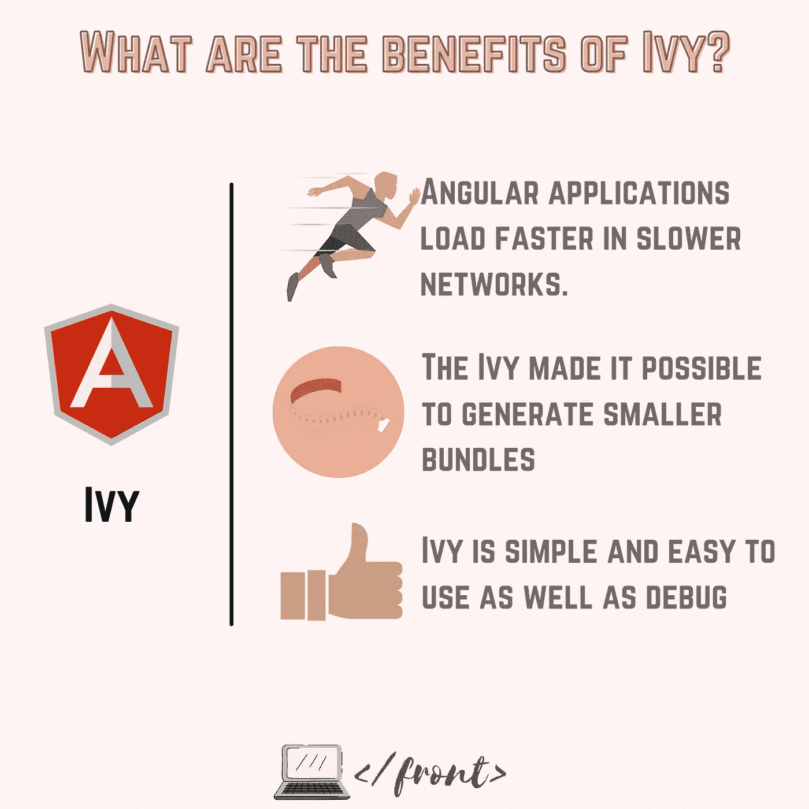
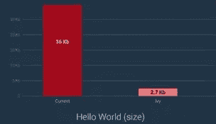

# Angular 的下一代编译和渲染管道

> 原文：<https://javascript.plainenglish.io/do-you-know-about-the-next-generation-compilation-and-rendering-pipeline-of-angular-37fb979a5e13?source=collection_archive---------6----------------------->

## 角常春藤和 AOT 汇编


从 Angular 9 开始，IVY 作为 Angular 的新默认渲染引擎发布。IVY 编译器可以更快地编译 Angular。Angular frontend 框架用于构建基于组件的应用程序，如拼图。Angular 组件是 Typescript 代码、HTML 和 CSS 的混合(在所有 3 个文件+ 1 个测试文件中)。

TypeScript 是 JavaScript 的超集。因为浏览器只能阅读和理解 Javascript、HTML 和 CSS。因此，从 Typescript 代码生成 javascript 代码的编译阶段是强制性的。

把 Typescript 代码转换成 Javascript 的东西叫做 ***Ivy。***

# Angular 9 之前发生了什么？

旧版本的 Angular 使用了视图引擎。视图引擎产生的包大小相当大。有了 Ivy，捆绑包大大减少了，这使得 Angular 克服了它的捆绑包问题。

# 常春藤有什么好处？

主要有 3 大好处:

*   **大小:**常春藤使得产生更小的束成为可能
*   **速度:** Angular 应用在较慢的网络中加载速度更快。
*   简单性: Ivy 简单易用，易于调试。



# 使这成为可能的关键点是什么？

## 关键#1:树摇动

这个技术术语意味着在捆绑过程中删除未使用的代码。树抖动技术使用静态分析，并消除了未引用的代码。

这就解释了为什么尺寸变小了！

## 关键#2: AOT 汇编

这项技术将 HTML 代码和类型脚本编译成 Javascript，在浏览器下载并执行代码之前完成。解释装载时间不同的原因。

顺便说一句，你有没有想过在构建过程中，你的编译器是如何发现你的模板有问题的？甚至在浏览器上启动应用程序之前？嗯，这就解释了！

## 关键 3:地点

应用速度的另一个关键点。局部性是用每个组件自己的局部变量和信息独立编译每个组件的过程，以便更快地重新构建。这在做局部改动的时候很有帮助。它不是愚蠢地编译整个项目文件，而是只编译发生变化的区域。

这大大提高了构建过程的速度。(特别感谢棱角团队！干得好！).

# 想看看这个变化有多大意义吗？

下面是由 **Google** 提供的一个基础***Hello World app***的结果。在新一代编译器 Ivy 之前，生成的包重 36Kb，而在 Ivy 中，相同应用程序生成的包重 2.7Kb

这意味着尺寸减少了大约 93% 。惊喜吧，哈哈！



Hello world app size before and after Ivy

# 现在来说代码吧！

如果您愿意，可以启用和禁用此功能。要启用它，您必须将其添加到您的配置`tsconfig.app.json`文件中:

```
{
  "compilerOptions": { ... },
  "angularCompilerOptions": {
   ** *"enableIvy": true***
  }
}
```

## AOT 怎么样？

AOT 汇编也是如此。该选项可以在项目配置构建选项(文件`angular.json`)中激活:

```
{
  "projects": {
    "my-project": {
      "architect": {
        "build": {
          "options": {
            ...
            ***"aot": true,***
          }
        }
      }
    }
  }
}
```

# 这篇文章的摘录

*   生成的代码在运行时更容易阅读和调试
*   重建时间更快
*   改进的有效载荷尺寸
*   改进的模板类型检查
*   更早地检测模板错误
*   AOT 模式下编译器生成的代码文件大小大大减小了。
*   由于我们将 HTML 模板和组件编译成 JavaScript，所以不会有任何注入攻击，因此安全性更好。
*   AOT 编译器是构建过程的一部分，它生成一个小型、快速、随时可运行的应用程序包，通常用于生产。
*   在浏览器下载和运行代码之前的构建阶段，AOT 和艾维的编译过程将你的 Angular HTML 和 TypeScript 代码转换成高效的 JavaScript 代码。
*   顺便说一句，AOT 代表提前的 T2。

亲爱的读者，谢谢你。❤

*我希望你和你的家人无论在哪里都平安无事！坚持住。明天会更好！*

**让我们联系上** [**中**](https://medium.com/@famzil/)**[**领英**](https://www.linkedin.com/in/fatima-amzil-9031ba95/)**[**脸书**](https://www.facebook.com/The-Front-End-World) **，或者** [**推特**](https://twitter.com/FatimaAMZIL9) **。******

******FAM******