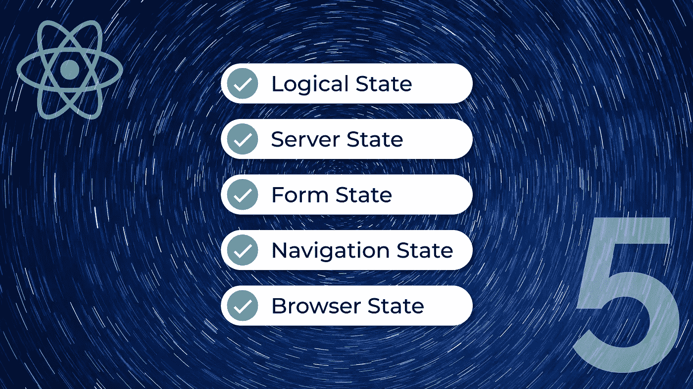
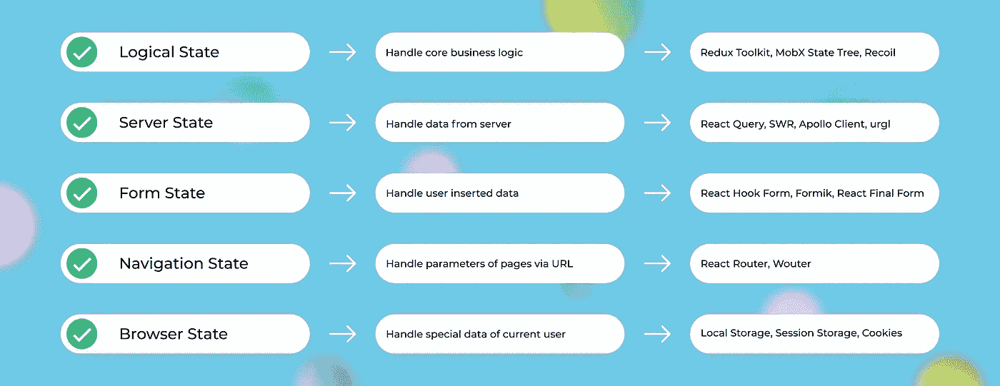

# 你知道反应的 5 种状态吗？

> 原文：<https://javascript.plainenglish.io/do-you-know-the-5-types-of-states-in-react-8734a04a5ffb?source=collection_archive---------0----------------------->

## 帮助您更好地了解自己的状态

Cover picture (Background photo by [Fred Moon](https://unsplash.com/@fwed) from [Unsplash](https://unsplash.com/))

## 介绍

根据调查，69.28%的人喜欢在他们的网站开发中使用 React，但是也有 30.72%的人害怕它。作为这个伟大图书馆的崇拜者，结果让我大吃一惊。于是我和新人讨论了一下，找出了一些原因。最后得出的结论是，让新来的人讨厌的主要原因是反应中不自以为是的处理状态的方式。

因此，本文将清楚地讨论逻辑、服务器、表单、导航和浏览器等状态的类型以及处理它们的主要方法。此外，它将帮助 25.12%的希望学习的开发人员在未来做出反应。阅读并享受！

## 1.逻辑状态

逻辑状态有一个存储区，用于存储业务逻辑的信息，这些信息对于执行应用程序的主要功能需求是必不可少的。商店预定义了数据模式，以便轻松执行保存、更新、删除和查看等操作。此处存储的信息是整个应用程序全局所需的。

在 Amazon alike 电子商务网站中，订购的产品、数量、送货人、送货费、总金额等细节，以及许多其他对执行主要业务用例(如产品订购和送货)至关重要的信息都安全地维护在逻辑状态中。

所有的`[**React State Management Libraries**](https://rsml.netlify.app/)`都可以用在中型到大型的应用程序中，并在小型应用程序中反应上下文，以维护全局的逻辑状态。

Github Gist on handling logical states using Redux Toolkit

## 2.服务器状态

服务器状态处理由 HTTP 请求引入的服务器端数据。该信息包含数据和请求状态，如加载、获取和错误。

电子商务网站主要显示产品、促销、用户资料等信息。该应用程序将使用 isLoading 等请求状态来显示加载器或微调器，同时从服务器获取数据，并使用 isError 在请求失败时向用户显示错误提示。

像`[React Query](https://react-query.tanstack.com/)`、`[SWR](https://swr.vercel.app/)`、`[Apollo Client](https://www.apollographql.com/docs/react)`和`[urql](https://formidable.com/open-source/urql/)`这样的库用于管理服务器状态。

Github Gist on handling server states using React Query

## 3.表单状态

表单状态用于保存表单中使用的多种类型的数据。这里主要处理表单构造器的状态，如输入字段、选择、复选框、单选按钮和切换开关。这种状态仅限于几个组件。

电子商务网站有产品、结帐和付款表单，其中包括产品数量、送货地址、卡的详细信息等，这些都要使用表单状态进行管理。这些表单字段的状态对于通过向服务器发送 POST 请求来创建订单至关重要。

像`[React Hook Form](https://react-hook-form.com/)`、`[Formik](https://formik.org/)`和`[React Final Form](https://final-form.org/react)`这样的库主要用于管理表单状态。

Github Gist on handling form states using React Hook Form

## 4.导航状态

导航状态是关于 URL 中的路径和参数，用于显示页面的状态，以便更好地进行用户友好的导航。通过在 URL 中使用搜索词、排序和过滤选项来维护搜索状态，这些状态对于创建完美的搜索功能特别有用。URL 中的路径表示组件层次结构，有助于了解应用程序。

电子商务站点主要使用导航状态通过路径导航到嵌套页面，并通过参数利用搜索功能。

像`[React Router](https://reactrouter.com/)`和`[Wouter](https://github.com/molefrog/wouter)`这样的库用于传递导航状态。

Github Gist on handling navigation states using React Router

## 5.浏览器状态

浏览器状态处理应用程序当前用户的详细信息。它主要在组件安装时读取。这些状态存储在本地的键值对中。

*   本地存储对象用于长期存储。窗口/选项卡关闭后，数据仍然存在，并在所有浏览器窗口/选项卡之间共享。根据浏览器的不同，它的大小为 5/10MB。
*   会话存储对象用于与单个浏览器窗口相关的短暂数据。存储在 sessionStorage 对象中的数据在窗口/选项卡关闭后不再保留，并且不与其他窗口/选项卡共享。根据浏览器的不同，它的大小为 5/10MB。
*   Cookies 数据— Cookies 在较旧的浏览器中用于保存带有到期时间的数据。它的大小为 4KB。

电子商务网站将未经身份验证的用户的购物车详细信息等重要数据的副本保存在任何这些浏览器存储中，并在身份验证过程后将数据与数据库同步。此外，一些用户详细信息(如用户令牌、首选项和其他详细信息)通常会保存在浏览器中，供整个应用程序使用。

像`[localStorage](https://developer.mozilla.org/en-US/docs/Web/API/Window/localStorage)`、`[sessionStorage](https://developer.mozilla.org/en-US/docs/Web/API/Window/sessionStorage)`和`[cookies](https://developer.mozilla.org/en-US/docs/Web/HTTP/Cookies)`这样的浏览器 API 用于处理浏览器状态。

Github Gist on handling browser states using localStorage

## 结论

States, uses and used libraries

如果我们将应用程序的状态分为逻辑、服务器、表单、导航和浏览器，这将会更容易。它提供了一种显式的方法来可视化应用程序中使用的数据。我们可以通过使用提到的库来有效地处理所有这些状态，从而利用应用程序的性能和代码可读性。我希望这篇文章对所有开发人员学习、忘记和重新学习 React 状态管理是有用的。

感谢您阅读文章。

*更多内容尽在*[***plain English . io***](http://plainenglish.io/)