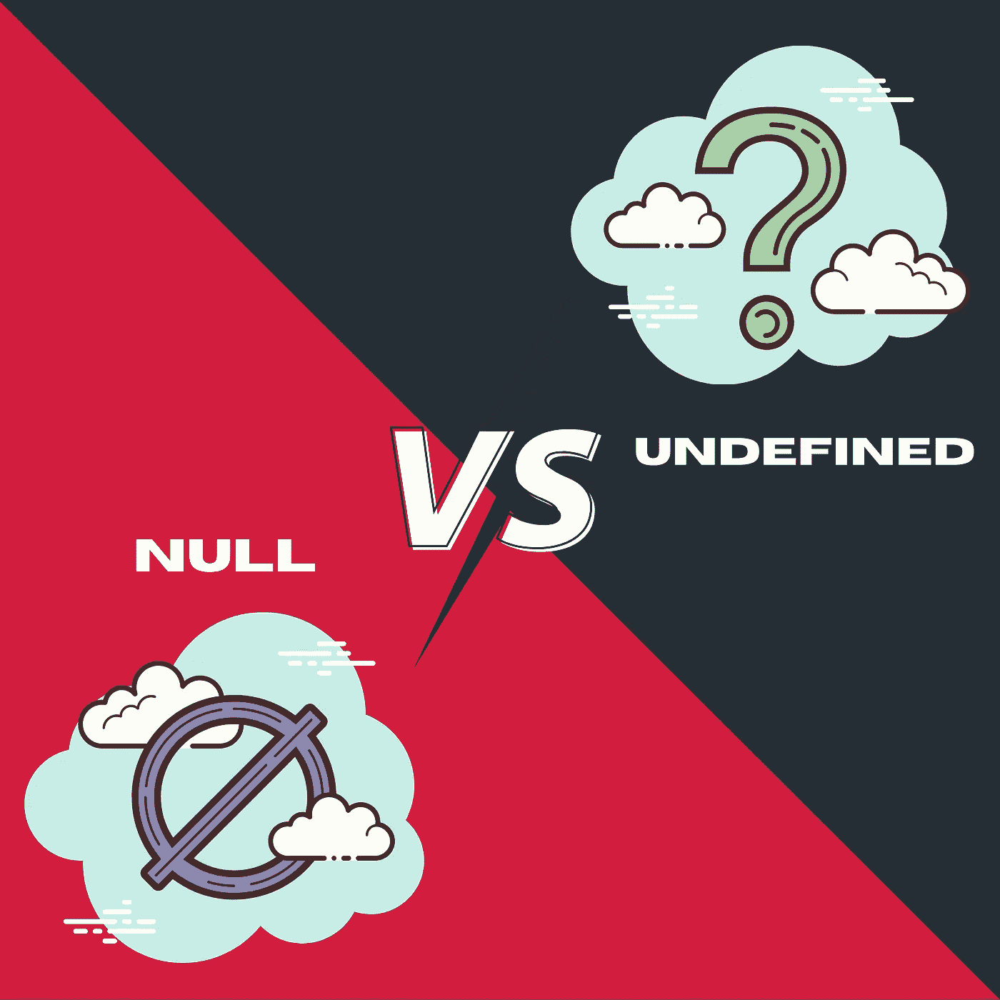

# JavaScript 中 null 和 undefined 有什么区别？

> 原文：<https://javascript.plainenglish.io/do-you-know-whats-the-difference-between-null-and-undefined-1d68bf56322b?source=collection_archive---------12----------------------->

## Null 和 Undefined 的区别



作为一名开发人员，您肯定用过一天 null 或 undefined。你知道那两个完全不同吗？哦对了，它们绝对不是一回事，需要用在正确的地方。这里有一个详细的比较，可以帮助你理解 null 和 undefined 之间的区别，并且能够在正确的地方使用正确的。

下面是详细的对比:

# 就定义而言

## 空

空变量意味着该变量没有值。

```
let myVar = null;
alert(myVar); //shows null
```

## 不明确的

一个未定义的变量意味着它已经被声明了，我们还没有给这个变量赋值。

```
let myVar;
alert(myVar); //shows undefined
```

# 就类型而言

## 空

空值是一个**T3 对象:T5**

```
let myVar = null;
alert(myVar); //shows null
alert(typeof myVar); //shows object
```

## 不明确的

undefined 的类型为 ***undefined*** 并且不是空类型的对象:

```
let myVar;
alert(myVar); //shows undefined
alert(typeof myVar); //shows undefined
```

# 就 JSON 而言

## 空

空在 Json 中是有效的。

## 不明确的

未定义的在 Json 中无效。

# 就性质而言

## 空

null 表示有意缺少对象值。这意味着我们没有以正确的方式管理一个 bug 或其他东西。

## 不明确的

undefined 意味着变量还没有赋值。

# 在控制方面

## 空

当您想要检查一个空变量时，您需要使用 null 对象:

```
variable === null
```

## 不明确的

未定义的需要用字符串“undefined”检查，因为它不是一个对象:

```
typeof variable === "undefined"
```

# 就误差而言

## 空

Null 被视为 0。

```
console.log(10+null); // 10
```

## 不明确的

而 undefined 不被视为数字，而是 NaN。

```
console.log(10+undefined); //NaN
```

# 就条件而言

## 空

身份符将返回 ***假*** 。

## 不明确的

相等运算符将返回 true。

# 就使用而言

## 空

用`null`设置一个变量，你知道它是一个对象。

## 不明确的

使用`undefined`设置一个混合类型的变量。

# 谢谢

我希望你和你的家人无论在哪里都平安无事！坚持住。明天会更好！

**让我们联系上** [**中**](https://medium.com/@famzil/)**[**领英**](https://www.linkedin.com/in/fatima-amzil-9031ba95/)**[**脸书**](https://www.facebook.com/The-Front-End-World) **，或者** [**推特**](https://twitter.com/FatimaAMZIL9) **。******

******FAM******