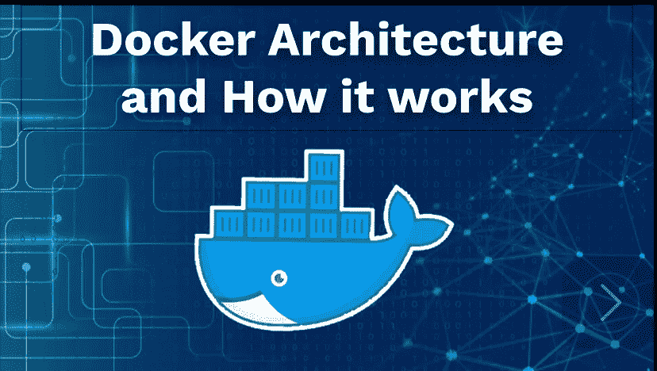
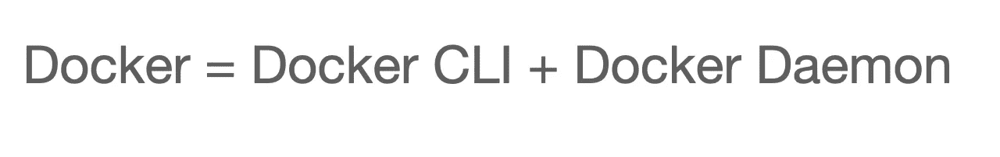
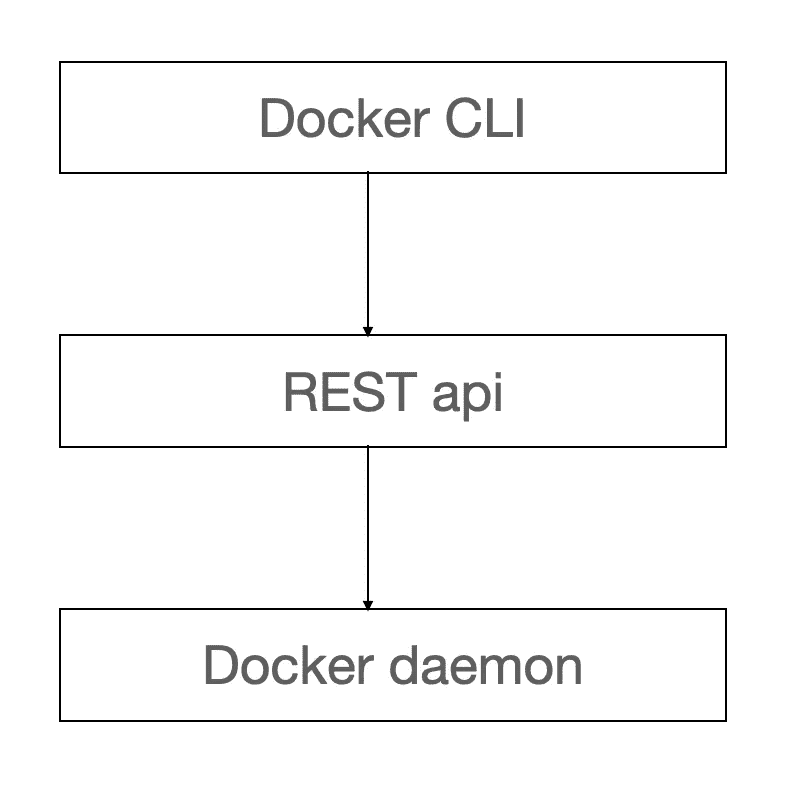

# Docker 架构及其工作原理

> 原文：<https://javascript.plainenglish.io/docker-architecture-and-how-it-works-4db326eb1712?source=collection_archive---------8----------------------->



Docker 是当前技术栈中最流行的技术之一。我们使用 Docker 与容器进行交互。在高层次上，容器可以被认为是一个独立运行的程序。

在这篇博客中，我们将尝试理解 Docker 的基本架构，并从高层次了解容器是如何工作的。



当我们在机器上安装 Docker 时，我们基本上安装了两件东西。一个是 Docker CLI，另一个是 Docker 守护进程。我们用来与 Docker 交互的所有命令都是 Docker CLI 的一部分。Docker CLI 获取一个命令，解析它，检查它的语法，如果一切正常，它会将命令传递给 Docker 守护进程。Docker 守护进程负责与图像、容器、卷等各种 Docker 对象进行交互。

Docker CLI 和 Docker 守护进程遵循客户端-服务器架构。因此，docker CLI 接收命令，并在所有验证之后，将这些命令转换成 rest API 调用。docker 守护进程继续监听 API 调用，一旦 Docker CLI 对 Docker 守护进程发出 rest API 调用，Docker 守护进程就会负责执行这些命令。



```
 docker run -d nginx:latest
```

让我们举一个例子，运行 Docker run 命令来运行带有 Nginx 映像的容器。因此执行步骤如下:

1.  Docker CLI 将接收命令并进行基本验证。
2.  Docker CLI 将创建一个相应的 REST API 调用
3.  Docker CLI 将对 Docker 守护进程进行 REST API 调用

现在 Docker 守护进程将处理命令的执行。执行流程如下:

1.  Docker 守护进程被要求运行一个带有 NGINX 映像的容器
2.  Docker 守护进程将检查 NGINX 映像是否存在于本地机器上

3a。如果图像存在于机器上，请转到步骤 4。

3b。如果机器上不存在该映像，请遵循以下步骤:

3b.1 —在 Docker 存储库中搜索图像

3b.2a —如果在存储库中找不到图像，则返回错误

3b.2b —转到并下载图像，然后转到步骤 4

4.现在，映像在机器上可用了，docker 守护进程将从该映像创建一个 Docker 容器。

创建容器后，它将继续启动容器。

我还试图在视频中更好地解释这一点。请看看它。

*更多内容尽在*[*plain English . io*](http://plainenglish.io/)