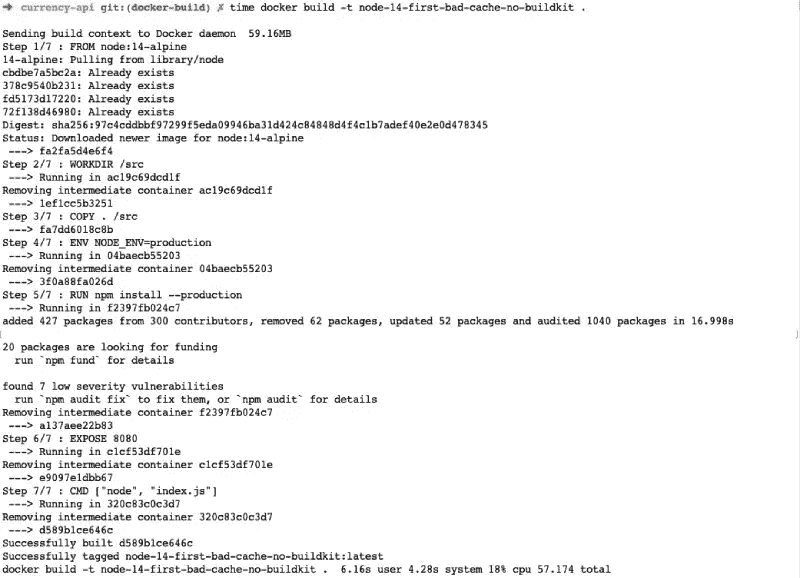
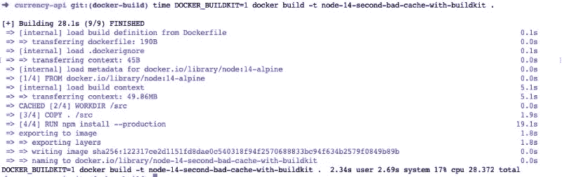
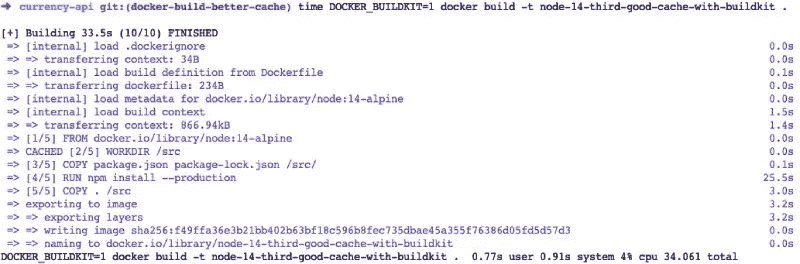
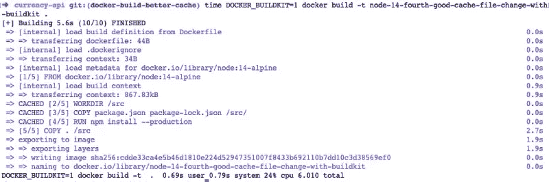

# 如何加速你的 Docker 构建

> 原文：<https://javascript.plainenglish.io/docker-build-example-nodejs-9eb174e081f1?source=collection_archive---------9----------------------->

## 在 Node.js 应用程序示例中，从 60 秒增加到 6 秒

Photo by [Cameron Venti](https://unsplash.com/@ventiviews?utm_source=unsplash&utm_medium=referral&utm_content=creditCopyText) on [Unsplash](https://unsplash.com/s/photos/whale?utm_source=unsplash&utm_medium=referral&utm_content=creditCopyText)

在本帖中，我们将看到一个 Node.js API 应用程序的 docker 构建示例，从慢到快了大约 10 倍。我已经谈到了在开发环境中使用 docker 的[原因。我在过去的帖子中也提到过](https://geshan.com.np/blog/2018/10/why-use-docker-3-reasons-from-a-development-perspective/)[docker 如何改变我们软件工程师的工作方式](https://geshan.com.np/blog/2018/11/4-ways-docker-changed-the-way-software-engineers-work-in-past-half-decade/)和[多阶段 docker 构建](https://geshan.com.np/blog/2019/11/how-to-use-docker-multi-stage-build/)。对于这一个，让我们着眼于 docker 构建示例，考虑更快的构建。

# 跳进去之前的信息

1.  需要熟悉 docker 和 Docker 构建过程
2.  所有的例子都是基于苹果电脑上的`Docker version 19.03.13, build 4484c46d9d`
3.  这个 docker 构建示例使用了 [Currency API](https://github.com/geshan/currency-api) 应用程序

Image by [Pete Linforth](https://pixabay.com/users/thedigitalartist-202249/?utm_source=link-attribution&utm_medium=referral&utm_campaign=image&utm_content=1696051) from [Pixabay](https://pixabay.com/?utm_source=link-attribution&utm_medium=referral&utm_campaign=image&utm_content=1696051)

# 为什么更快的 docker 构建

您希望 Docker 容器构建得更快有许多原因，下面是一些紧迫的原因:

1.  这将节省软件工程师在等待 CI/CD 管道中构建容器映像的时间。想象一下，如果你的 docker 构建只需要一半的时间，那么等待的时间会少很多。
2.  这也将节省工程师在本地构建和运行软件的时间。在这个微服务的时代，如果这些映像能够构建得更快，将会有很大帮助。
3.  更快的构建还支持更快的部署和发布。如果您想回滚一个有问题的部署(如果构建花了 10 分钟),那么在构建恢复的更改时，有问题的代码至少会在 prod 中停留 10 分钟。

# Docker 构建示例:缓慢构建

让我们看看下面的 docker，这个看起来很无辜的 docker 文件取自一个[节点 Js API](https://github.com/geshan/currency-api/commit/1bfa57939bb7647d9350a7445d223e4c0789f112) 。随着我们的深入，我们将会发现一个主要问题:

`RUN npm ci`是代替`RUN npm install --production`的另一个更好的[选项](https://blog.npmjs.org/post/171556855892/introducing-npm-ci-for-faster-more-reliable)

# 让我们使用常规的 docker 版本

当我们尝试使用以下命令用 docker build 构建上述 docker 文件时

`time` [命令](https://www.computerhope.com/unix/utime.htm)放在`docker build`命令的前面，这样我们就知道 docker build 命令完成所需的时间。下面是花了多长时间:

*如上所示，耗时 57.17 秒。*

# 轻松加速，使用 BUILDKIT

Docker build 最近从 18.09 版本增加了 [BUILDKIT](https://docs.docker.com/develop/develop-images/build_enhancements/) 。Docker 基本上说这是对构建过程的彻底检查。正如这篇[文章](https://brianchristner.io/what-is-docker-buildkit/)中提到的，它更快、更高效、更并发。你可以在这篇关于 docker.com 的文章中读到更多关于它的好处。现在，让我们看看它的运行情况:

现在让我们看看花了多长时间:

如您所见，构建时间不到没有 BUILDKIT 时的一半。

*这个构建只花了 27.32 秒，而上面的构建花了 57.14 秒。*

# Docker 构建示例:快速构建

好的，在我们之前的 docker 文件中有一个主要问题。无论是我们的自定义代码还是任何其他添加的 npm 模块，docker 缓存在每次更改时都会被破坏。在这篇[文章](https://pythonspeed.com/articles/docker-caching-model/)中也可以读到更多关于 docker 构建缓存的信息。

## 通过适当的缓存加快 docker 构建

我们的代码几乎每次都会改变，但是我们引入的 npm 模块很少改变。因此，我们可以安全地缓存 npm 模块，如下所示:

你可以在这里看看这两个 docker 文件[的区别。主要的变化是我们首先复制 package.json 和 package-lock.json 文件，然后运行 npm install。只有在这之后，自定义代码才被复制到`/src`。因此，如果您不添加新的 npm 库，缓存将保持不变。](https://github.com/geshan/currency-api/compare/docker-build...docker-build-better-cache?expand=1#diff-dd2c0eb6ea5cfc6c4bd4eac30934e2d5746747af48fef6da689e85b752f39557R1)

*使用下面的命令第一次构建花了 34 秒:*

上述命令的输出如下所示:

# 代码更改后 docker 构建速度快吗？

对于这个 docker 构建示例，我在 Node JS API 应用程序的 index.js 文件中添加了一行[注释](https://github.com/geshan/currency-api/compare/docker-build...docker-build-better-cache?expand=1#diff-e727e4bdf3657fd1d798edcd6b099d6e092f8573cba266154583a746bba0f346R30)。现在让我们看看它需要多长时间，以及它是否缓存了在`npm install`命令中使用的 node_modules。

*构建只花了 6.01 秒，这要感谢 docker 对缓存的大量使用和 BUILDKIT 的使用，如下所示:*

尽管代码发生了变化，但 NPM 模块被缓存，使得构建仅用了 6 秒钟就完成了。同样的原理也适用于利用 docker 构建缓存。可以用 composer.json 和 composer.lock 文件应用于 PHP 或者其他任何语言。总是想到以前的命令运行，以及如何更好地缓存它。

所有四张图片的大小都在 233 MB 左右，其中一张花了大约 60 秒，最后一张花了 6 秒。速度快了 10 倍。

# 结论

如果你正在构建 docker 图像，别忘了使用 BUILDKIT，它非常高效。在 BUILDKIT 之上，始终分析如何利用 [*docker 构建缓存*](https://docs.docker.com/develop/develop-images/dockerfile_best-practices/#leverage-build-cache) *来加快 docker 构建。*

我希望这个小的 docker 构建示例对您有所帮助。像使用 alpine base Image 这样的较小的 docker 图像也可以帮助你加快 docker 的构建。

*最初发表于*[*https://geshan.com.np*](https://geshan.com.np/blog/2020/10/docker-build-example-faster-docker-build/)