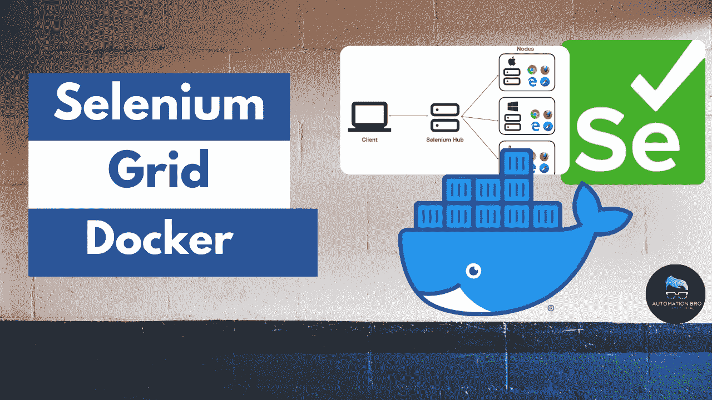
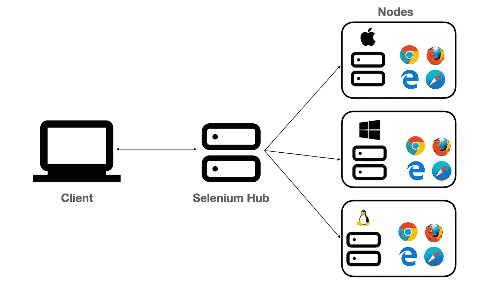
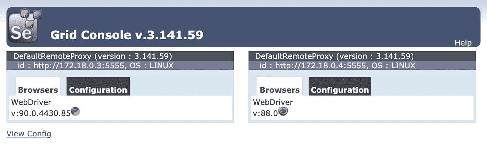
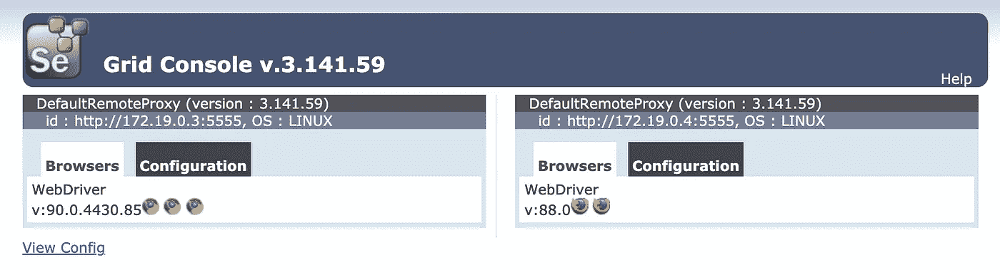

# Docker Selenium 网格设置

> 原文：<https://javascript.plainenglish.io/docker-selenium-grid-setup-7e66d60a926a?source=collection_archive---------10----------------------->



[https://youtu.be/GxktKTtnSfk](https://youtu.be/GxktKTtnSfk)

在本教程中，我们将介绍如何使用 Docker 来设置 Selenium Grid，以及为什么我们应该使用 Selenium Grid。我们还将增加 Docker 中 Selenium 网格的最大实例数和最大会话数，以便并行运行测试。

# 为什么我们需要硒栅？

所以在我们用 Docker 设置 Selenium Grid 之前，我们先来了解一下为什么我们甚至首先需要 Selenium Grid？

*   多个浏览器/设备:网格让我们在多个浏览器/设备上运行测试变得更加容易
*   **测试执行时间:**您可以通过在网格中并行运行测试来减少总的测试执行时间
*   **基础设施:**在网格的帮助下，建立基础设施在不同操作系统的多种浏览器/设备上运行测试也是可能的



Selenium Grid

# 用 Docker 设置 Selenium 网格

我们需要运行以下步骤来使用 Docker 设置 Selenium 网格:

**建立一个网络(网格)在图像之间进行通信**

```
docker network create grid
```

**运行 selenium/hub docker 镜像，用于运行 Selenium Hub**

```
docker run -d -p 4444:4444 --net grid --name selenium-hub selenium/hub:3.141.59–20210422
```

**注意**:网络名称(网格)应该与您在创建网络时提供的名称相同。

使用网格网络和 selenium/hub 主机运行 Chrome 和 Firefox 映像:

```
docker run -d --net grid -e HUB_HOST=selenium-hub -v /dev/shm:/dev/shm selenium/node-chrome-debug:3.141.59–20210422docker run -d --net grid -e HUB_HOST=selenium-hub -v /dev/shm:/dev/shm selenium/node-firefox-debug:3.141.59–20210422
```

**注意:**网络名称(网格)应该与您在创建网络时提供的名称相同，HUB_HOST 名称(selenium-hub)应该与您在运行 selenium/hub docker 映像时提供的名称相同。

现在，前往端口 4444，您应该看到 Chrome 和 Firefox 的网格设置:



Selenium Grid with Chrome & Firefox

# 增加网格的最大实例数和最大会话数

到目前为止，我们只有 Chrome 和 Firefox 的一个实例，但是，如果你需要一起运行多个测试，你将需要更多的实例。在为 Chrome 和 Firefox 运行 docker 容器时，您可以通过添加参数轻松做到这一点。

```
docker run -d --net grid -e HUB_HOST=selenium-hub -e NODE_MAX_INSTANCES=3 -e NODE_MAX_SESSION=3  -v /dev/shm:/dev/shm selenium/node-chrome-debug:3.141.59–20210422
```

您可以传递 NODE_MAX_INSTANCES 和 NODE_MAX_SESSION 环境变量来添加浏览器的多个实例。

**NODE_MAX_INSTANCES:** 同一版本浏览器的实例数。

**NODE_MAX_SESSION:** 可以并行运行的浏览器数量(任何版本)。

一旦你这样做了，你将会看到如下所示:



Selenium Grid with max instances & max sessions

**观看下面的视频，了解如何使用 Docker 设置 Selenium Grid:**

在下一篇教程中，我将向您展示如何使用 Docker compose 设置 Selenium Grid。

感谢阅读。

*更多内容请看*[***plain English . io***](http://plainenglish.io)