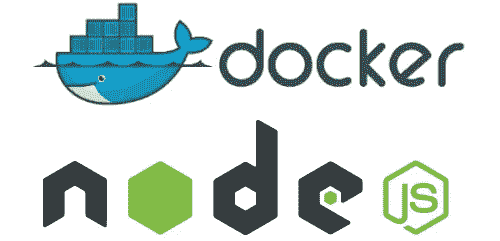

# 如何停靠 Node.js 应用程序

> 原文：<https://javascript.plainenglish.io/dockerize-a-node-js-application-fdc8e2994e16?source=collection_archive---------4----------------------->



Docker 使我们能够避免“它在我的机器上工作”的漏洞。它将我们的应用程序打包成一个盒子，或者换句话说，一个容器。您可以很容易地在任何机器上运行这个容器，其中的内容，即环境保持不变。

本初学者指南旨在帮助您构建和部署一个简单的 Node.js 应用程序映像。本指南还假设您对 node 和 express 框架有一些基本的了解。你还需要在你的机器上安装 docker。

# 使用 Express 创建节点应用程序

要创建节点应用程序，请运行以下命令

```
npm init
```

上面的命令将指导您设置节点应用程序。对于初学者，你可以选择每次选择后按回车键进行默认设置。您也可以选择将入口点设为 index.js 或 app.js。入口点是您的应用程序将开始的地方。

一旦一切都完成了，您的 package.json 应该看起来像这样。

```
{
  "name": "my-app",
  "version": "1.0.0",
  "description": "",
  "main": "app.js",
  "scripts": {
    "test": "echo \"Error: no test specified\" && exit 1"
  },
  "author": "",
  "license": "ISC"
}
```

通过运行以下命令安装 Express:

```
npm install express --save
```

在根目录中创建您的 app.js 或 index.js 文件，然后粘贴下面的代码。

```
const ***express*** = require('express')
const app = ***express***()
const port = 3000

app.get('/', (req, res) => {
    res.send('Hello World!')
})

app.listen(port, () => {
    ***console***.log(`Example app listening at http://localhost:${port}`)
})
```

第一部分声明了一个包含 express 模块的常量变量。该应用程序将在端口 3000 上运行。还定义了一条基本路由，该路由将以“Hello World”作为响应。最后，最后一部分将在端口 3000 启动服务器。

您可以通过运行以下命令来测试您的应用程序:

```
node app.js
```

# 创建 docker 图像

要创建 docker 图像，您需要一个 docker 文件。docker 文件将包含关于如何设置您的图像的信息，以及您的应用程序的细节和它将如何运行。这包括您的应用程序本身、环境以及配置细节等

在根目录下创建一个名为 Dockerfile 的文件。

```
touch Dockerfile
```

用你最喜欢的文本编辑器打开文件。添加下面的代码。

```
FROM node:14

RUN mkdir -p /app

WORKDIR /app

COPY package*.json ./

RUN npm install

COPY app.js .

EXPOSE 8080

CMD [ "node", "app.js" ]
```

1.  来自:我们将要构建的图像。
2.  运行 mkdir:创建一个目录来保存我们的应用程序代码。
3.  工作目录:设置工作目录
4.  复制:将我们的 package.json 和 package-lock.json 文件复制到我们的目录中。
5.  运行:安装我们的应用程序依赖项
6.  复制:复制应用程序文件。
7.  EXPOSE:您的应用程序绑定到这里初始化的端口。
8.  CMD:用于启动应用程序的命令。

# 建立形象

下面的命令将构建我们的 docker 映像。额外的-t 标志用于标记您的图像，有点像命名您的图像。

```
docker build -t node-docker-app .
```

确保您位于包含 docker 文件的目录中。您将看到一堆命令在您的 cli 上运行。

```
Sending build context to Docker daemon  2.006MB
Step 1/8 : FROM node:14
 ---> 67f79f1b32a3
Step 2/8 : COPY package*.json ./
 ---> Using cache
 ---> de0f1d3680b9
Step 3/8 : RUN mkdir -p /app ....Step 7/8 : EXPOSE 8080
 ---> Using cache
 ---> 0b0a873879d0
Step 8/8 : CMD [ "node", "app.js" ]
 ---> Running in dc153dd3b2d5
Removing intermediate container dc153dd3b2d5
 ---> a4bf20c4bb2d
Successfully built a4bf20c4bb2d
Successfully tagged node-docker-app:latest 
```

检查您的映像是否构建成功。

```
docker images
```

你应该看看你的形象

```
REPOSITORY                        TAG                 IMAGE ID            CREATED             SIZE
node-docker-app                          latest              0b700b0d0fc7        4 minutes ago       945MB
```

现在用下面的命令运行您的映像。

```
docker run -p 8081:8080 node-docker-app:latestExample app listening at http://localhost:8080
```

p 标志告诉我们的映像在端口 8081 上公开运行(在我们的映像之外),它类似于内部端口 8080。

在您的浏览器中，导航到可公开访问的端口 8081。您应该会看到页面上印着“Hello World”。

就是这样！