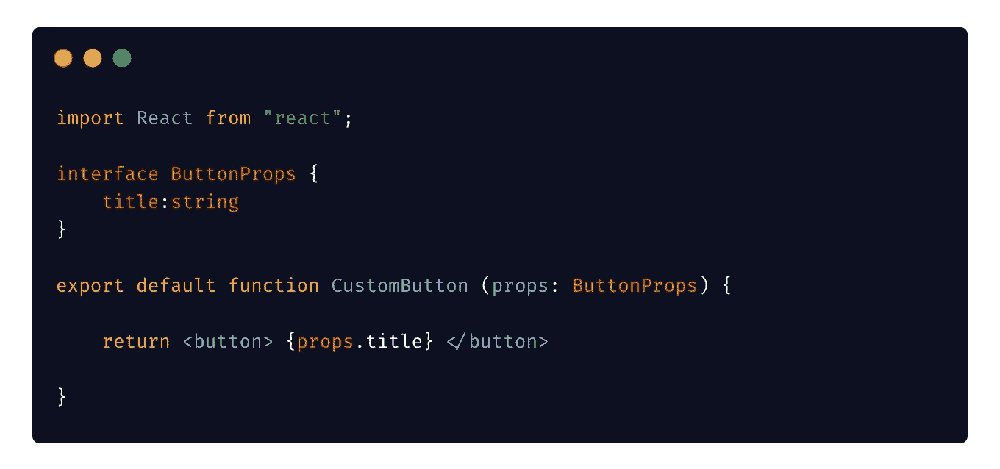
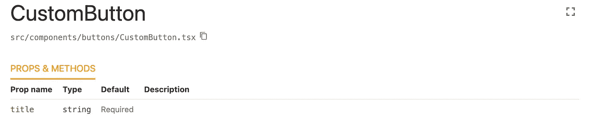
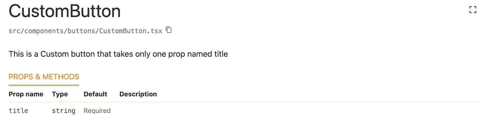
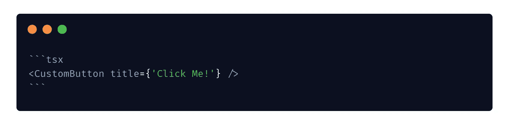
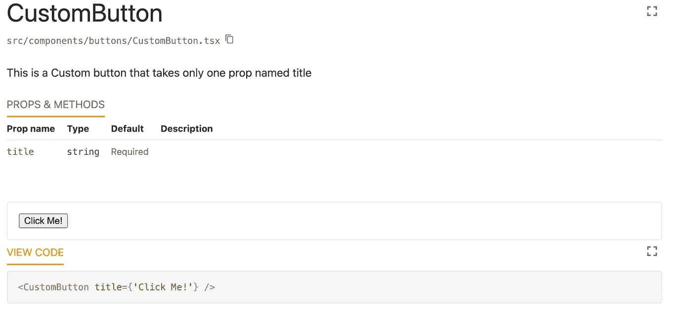

# 以正确的方式记录 React 应用程序

> 原文：<https://javascript.plainenglish.io/document-your-react-applications-the-right-way-f648053c3a70?source=collection_archive---------3----------------------->

## 逐步介绍指南

时不时地，你会遇到一个新的库，它没有可以使用的例子。没有代码示例或外观。如果这发生在你身上，你并不孤单。我们都能感受到在一些没有文档或者文档很差的项目中工作的痛苦。


Photo by [Damian Zaleski](https://unsplash.com/@zal3wa?utm_source=unsplash&utm_medium=referral&utm_content=creditCopyText) on [Unsplash](https://unsplash.com/photos/pjJdOE2XBRU?utm_source=unsplash&utm_medium=referral&utm_content=creditCopyText)

今天我们将走到等式的另一边，学习如何非常容易地正确记录 React 应用程序！

## 当文档变得重要时。

*   您有多个团队在同一个项目上工作。
*   你建立了一些被很多人使用的组件库
*   你很容易忘记事情(像我一样:P)

## 拥有良好文档的优势

*   这是开发商关心这个项目的标志
*   它有助于新人快速理解项目
*   好的文档减少了误解的机会
*   除了您的应用程序之外，文档本身也是一项巨大的资产
*   好的文档有时可以作为他人的风格指南。
*   文档增加了项目的价值。

今天我们将有许多方式使用 react-styleguidist。所以让我们开始吧

## 第一步。安装依赖项

首先，安装所需的依赖项

```
npm install --save-dev react-styleguidist
```

## 第二步。启动服务器

如果你用`create-react-app`创建了你的应用，你不需要配置任何东西。现在启动开发服务器。

```
npx styleguidist server
```

如果您想要构建您的文档，您可以将其构建为静态资源

```
npx styleguidist build
```

## 第三步。开始基本记录

在开始添加任何类型的文档之前，你需要记住一件事，默认情况下，`react-styleguidist`会查看`src/components`目录，并尝试匹配任何扩展名为`.js .ts .jsx .tsx`的文件。

所以确保你的所有组件都在名为`components`的目录下。如果愿意，您可以覆盖此行为。

此外，这个库足够智能，可以找出需要记录的适当组件。例如，它排除了`__tests__`文件夹中的所有文件。

首先，创建一个名为`CustomButton.tsx`的新组件，它是一个非常简单的按钮组件，以标题为道具。



CustomButton.tsx

这是一个非常标准和简单的 typescript 组件。这里的`ButtonProps`定义了应该将哪个属性传递给这个组件。

> 如果不使用 typescript，您可以使用 React `PropTypes`获得类似的结果

现在启动服务器并转到`http://localhost:6060/`查看您的文档服务器的运行情况。您可以看到，在没有添加任何额外代码的情况下，react-styleguidist 已经为我们的组件生成了一个基本定义，如下所示！



Basic Documentation

太酷了！好，让我们给这个组件添加一些描述。

## 第四步。添加更多描述

如果你熟悉`JsDocs`这是你已经知道的事情。但是现在不用担心。只需在您的`CustomButton`组件中添加下面这段注释。

```
*/**
 * This is a Custom button that takes only one prop named title***/*
```

只需保存并在浏览器上实时查看结果！



Component with description

好吧酷。现在我们有了组件的文档，它定义了所需的属性和描述。

但是我们现在想让人们看到这个组件在现实生活中的样子，而不是强迫他们使用它。

怎么做呢？

## 第五步。添加交互式示例

现在在同一个文件夹中创建另一个名为`CustomButton.md`的文件，并在其中添加以下代码。



CustomButton.md

现在这个降价文件将成为我们的互动平台。我们可以看到组件的外观和使用感受。我们可以从文档里面改变道具来看效果！



Interactive Example

所以现在我们可以从下面的编辑器中更改标题并查看更改。

我们可以做得更多。点击[此处](https://react-styleguidist.js.org/docs/documenting)了解更多信息。

好了，今天我们学习了如何非常容易地开始记录 react 应用程序。

今天到此为止。编码快乐！:D

**通过**[**LinkedIn**](https://www.linkedin.com/in/56faisal/)**或我的** [**个人网站**](https://www.mohammadfaisal.dev/) **与我取得联系。**

[](/20-essential-parts-of-any-large-scale-react-app-ee4bd35436a0) [## 任何大型 React 应用程序的 20 个基本部分

### 如果您正在编写企业级代码，您需要了解这一点

javascript.plainenglish.io](/20-essential-parts-of-any-large-scale-react-app-ee4bd35436a0) [](https://betterprogramming.pub/the-7-traits-of-a-rock-star-react-developer-747fbb001c05) [## 摇滚明星 React 开发者的 7 个特质

### 造成差异的习惯

better 编程. pub](https://betterprogramming.pub/the-7-traits-of-a-rock-star-react-developer-747fbb001c05) [](https://plainenglish.io/blog/5-dev-tools-for-documenting-react-code-like-a-pro) [## 像专家一样记录 React 代码的 5 个开发工具

### React 作为构建复杂前端应用程序的库非常有用，但它也需要大量的工具…

简明英语. io](https://plainenglish.io/blog/5-dev-tools-for-documenting-react-code-like-a-pro) [](/code-documentation-is-broken-but-i-think-swimm-may-have-fixed-it-daaa7547d834) [## 代码文档被破坏了——但是我认为 Swimm 可能已经修复了它

### 传统的文档管理系统让软件开发人员失望了，是时候来点新的了。游泳吗…

javascript.plainenglish.io](/code-documentation-is-broken-but-i-think-swimm-may-have-fixed-it-daaa7547d834) 

*更多内容请看*[***plain English . io***](https://plainenglish.io/)*。报名参加我们的* [***免费周报***](http://newsletter.plainenglish.io/) *。关注我们关于*[***Twitter***](https://twitter.com/inPlainEngHQ)[***LinkedIn***](https://www.linkedin.com/company/inplainenglish/)*[***YouTube***](https://www.youtube.com/channel/UCtipWUghju290NWcn8jhyAw)*[***不和***](https://discord.gg/GtDtUAvyhW) ***。*****

*****对缩放您的软件启动感兴趣*** *？检查* [***电路***](https://circuit.ooo?utm=publication-post-cta) *。***