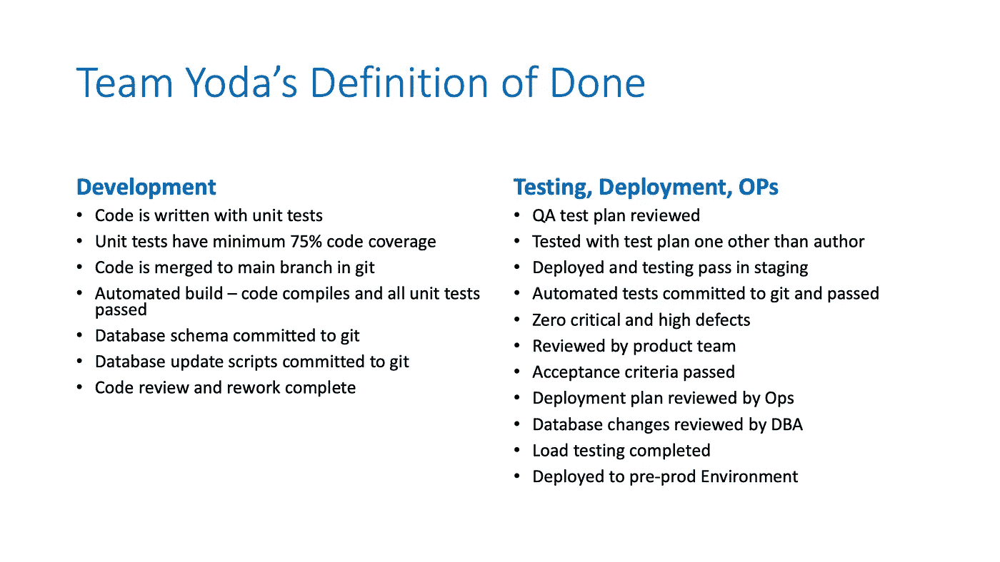

# 作为一名软件开发人员,“完成”的敏捷原则如何帮助你

> 原文：<https://javascript.plainenglish.io/dod-db13fd3b6059?source=collection_archive---------9----------------------->

## “但这只需要两分钟”

Photo by [Mimi Thian](https://unsplash.com/@mimithian?utm_source=medium&utm_medium=referral) on [Unsplash](https://unsplash.com?utm_source=medium&utm_medium=referral)

这是繁忙的一周中一个充满希望的星期五下午。你正在疯狂地捣鼓代码，以推出最后一个功能，并把它称为一个周末。但是它发生了！… ***可怕的肩击*** 和怪异的声音说话:*“嘿，伙计…关于产品页面上的下拉列表，你能把它变成黄色并在列表中添加一个新项目吗？…我相信你应该能马上做到，只是一个小的修正，甚至没有人需要知道。容易极了！”*

你吃惊地转过身，发现鲍勃正满怀期待地盯着你。你试图抗拒和解释，但你说不出话来……"但是……你知道这需要……"不知不觉中，你觉得自己点头表示接受。伤害已经造成了！

听起来太熟悉了？你可能会说这是日常生活。我们，工程师，经常被这样的两分钟请求轰炸。它们要么暂时分散注意力，要么在不增加任何价值的情况下延长我们的开发时间。我们一次又一次地说“是”,感到无能为力，无法说服别人，这是我们的罪过。

但是听我说完！是的，有一条出路。这就叫 [***做过***](https://www.scrumguides.org/scrum-guide.html#artifact-transparency-done) 的定义。简而言之就是国防部。

## 这到底是什么？

*“完成的定义是对期望的共同理解，为了可发布到生产中，增量必须达到期望。由开发团队管理”*[—Scrum.org](https://www.scrum.org/resources/scrum-glossary)

简而言之，这只是一份清单，列出了你的工作需要满足哪些条件才能被认为已经完成。把它想象成飞行前的安全检查清单。只有检查完每一项，飞行员才能安全起飞。同样，DoD 是一个活动/标准的列表，您的工作需要满足这些活动/标准，才能被认为已经完成并适合生产。

团队的 DoD 有助于对已完成的工作项目的样子以及完成它需要什么有一个共同的理解。它自动地帮助团队交付更高的质量并控制范围蔓延。

这是我之前一个团队的国防部样本。您可以看到它是一个所有活动和标准的列表，涵盖了从开发到测试，一直到部署。

A DoD from the author’s team

## 但是作为一名工程师，我有什么好处呢？

*   **保护您免受干扰—** 以及最后一刻变更请求的干扰。当鲍勃带着这样的打断来到你面前时，你现在有了一份书面清单，指着它说:*“我很乐意这样做……但这是我们的国防部！，而且每一项都要经过这个。这需要时间。让我们把这作为新的变化，我们将优先考虑，并在当前项目完成后得到它，或者如果它是紧急的，我担心这个项目将不得不取代已经在进行中的东西。你准备好冒这个险了吗？”*
*   **支持你的工作—** 展示你完成一件事情的复杂性和付出的努力。当有人问，“*你们工程师整天都在做什么*？”，你有一个书面的清单来教育他们。软件开发是一项艰苦的工作，在没有定义“完成”的情况下，向那些涉众描绘这幅图景是一项挑战。
*   **较少需要担心的错误—** 通过将单元测试、代码审查、重构和部署前检查融入您的国防部，您可以对工作质量更有信心。
*   **您可以专注于构建重要的东西—** 我们工程师想要构建好的东西，一个详细的国防部迫使您和您的团队开始努力只致力于高价值的项目，并扔掉无用的东西。在两个请求之间选择时，你会更有意识地选择。你现在意识到所有的严格步骤和努力。
*   **让你值得信任—** 你会信任谁？一名当地机械师隐瞒了所做工作的细节，只说“你的车一切正常！”或者一个专业人士，他也说“你的车一切都好！”还分发了一份 80 分的清单，确保在维修时注意到每个细节。我希望是后者。同样，当你有一个 DoD 时，你的利益相关者和客户会更信任你，给你更多的自由，他们会确信你对质量和交付价值的关注。
*   **显示不必要的浪费和自动化的机会—** 浏览一下创建您的 DoD 的流程，就会发现您工作流程中的许多浪费。您可能会发现许多可以轻松自动化的手动活动。

## 但是我甚至不在敏捷团队中

没关系！真的！你有没有注意到我没有在任何地方提到敏捷或者 Scrum 或者 Scrum master(直到现在)？国防部对任何人来说都是强有力的工具。

你可能在一个非敏捷团队，或者一个独角戏的自由职业者。“完成”的定义对你还是有好处的。

## 好吧，我被说服了！我该怎么做？

你不需要花费太多的时间来给“完成”下一个完美的定义。关于国防部最好的事情是，你将定期重温它，它随着你的产品和开发的增长而发展。这里有一个简单的方法开始…

1.  与您的团队(开发人员、测试人员、业务分析师……每个人)一起，思考您通常参与的所有高级活动，以完成一个工作项目。把它们放在一个贴纸上(或者虚拟板上)。
2.  将相似和相同的项目组合在一起。
3.  将这些组从头到尾排列在一个时间线上。从第一次活动到最后一次活动。
4.  为每个小组想出一个标题活动。你可能会以需求定义、技术设计、测试计划、编码和单元测试等标题结束。
5.  然后，定义完成每一项目标需要什么，重点是可交付成果、结果和条件。例如，测试计划标题项可能在您的案例中被定义为——测试计划已发布，测试用例已提交给 git。

瞧啊。你对完成有了第一个定义。

为一个迭代或者一个发布运行这个定义的第一稿。然后，与您的团队一起再次回顾。看看在国防部之外做了什么活动来完成工作？他们应该被列入名单吗？你对“完成”的定义是否涵盖了一件物品从设计到生产的所有环节？重复这个过程，直到你到达那里！

[这里有一个有趣的活动，由 Wayne Grant 主持](https://waynedgrant.wordpress.com/2013/12/11/definition-of-done-workshop/)

## 结论

我们工程师喜欢不受干扰地建造重要的东西。完成的定义是保护我们并帮助我们保持专注的必要工具。

感谢您的阅读！