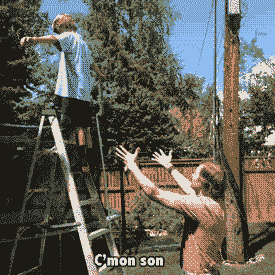
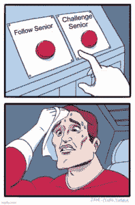
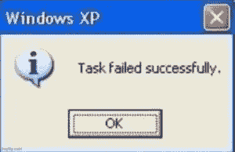
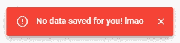
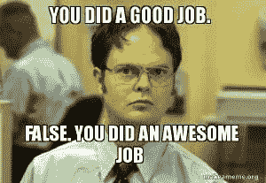
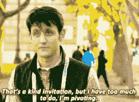

# 不要总是相信你的学长

> 原文：<https://javascript.plainenglish.io/dont-always-trust-your-senior-b31f150d5b9b?source=collection_archive---------14----------------------->

Not even once, especially your senior — [Source](https://giphy.com/gifs/rule-e05GB2c86qgOk)

好吧，你通常可以，只是不要总是盲目相信。虽然我是作为一个初级网站开发人员来说的，但这篇文章适用于任何领域、任何经验水平的任何人。

# 不信任学长，为什么？

作为一名大三学生，我喜欢有一个或多个大四学生在身边指导我，并最大限度地减少我积累的技术债务。我学到了很多东西，有他们在身边，我肯定会过得更好。

Photo by [NeONBRAND](https://unsplash.com/@neonbrand?utm_source=unsplash&utm_medium=referral&utm_content=creditCopyText) on [Unsplash](https://unsplash.com/s/photos/business?utm_source=unsplash&utm_medium=referral&utm_content=creditCopyText)

另一方面，下面的两个经历告诉我，不管他们有多高的职位，最好不要盲目地追随他们的言行。

# 学习经历

## 1.用户抱怨应用程序不再工作了！

*在微软(Microsoft)团队与一位拥有超过 9 年专业软件开发经验的高级开发人员(SD)的屏幕分享会议上…*

**SD:** “哇，这个文件里有很多没用过的代码。还是全部删除吧。”

[Source](https://imgflip.com/memegenerator/Two-Buttons)

我(内部):“我真的不认为这是一个好主意，难道我们不应该在删除它之前检查一下这个代码是否在其他地方被使用过吗？”

*5 秒钟后……*

**我(内部):**“焦虑的 Web Dev，你这个笨蛋，他是学长。他显然知道自己在做什么。只要照他说的做，一切都会好的。”
**SD:** 删除两段代码。
**我:**“嗯好的当然，酷。谢谢你的帮助。”

*一天后…*

“我们的用户报告称，该应用程序已停止查询数据库！怎么回事！现在就有人来修！”，我的产品负责人疯狂地在我们的微软团队群聊中打字。“我会调查的”，我立刻回答道。

我查看最后一次代码提交，因为那是错误开始发生的时间。唯一的变化似乎是删除了那段代码，“也许它被用在其他地方”我沉思着自己。我打开我的代码编辑器，然后对删除的代码进行快速的全局文本搜索，证实了我的怀疑。

它在许多其他地方被使用，它的删除导致了生产问题。

哎呦？

## 2.用户报告说表单没有保存！

我的产品负责人在我们的微软团队群聊中疯狂地说，“我们的用户说，即使在看到‘保存成功’的通知后，表单也没有保存！”

Or did it? — Image by Author

“发生了什么事！现在就有人来修！”他继续说道。“我会调查的”我回答道。

啊藤壶，别再来了。我对导致此问题的代码进行了故障诊断。我将其追溯到我的 SD 所做的最后一次代码提交(与之前相同)。我在我的电脑上运行他的代码，然后点击表格上的保存按钮。我看到“已成功保存”通知。然后，我检查本地数据库，查看保存在其中的表单数据。

然后我想，如果我确保当我单击保存时，数据没有保存到我的本地数据库中，会怎么样呢？我关闭了本地数据库，然后再次单击表单上的 save。我看到弹出“已成功保存”的通知。

What!?! — [source](https://imgflip.com/memegenerator/137732803/Task-failed-successfully)

这是怎么发生的，我更仔细地检查了他的代码。我真的被我所看到的惊呆了。我意识到他对它进行了编码，以便在单击“保存”按钮后，无论表单数据是否插入到数据库中，总是会出现“成功保存”的通知。

为了确认这一点，我在生产 web 应用程序中打开了表单。我断开我的互联网，然后我点击保存。我看到“成功保存”消息再次出现。

我很快修复了它，以便在将数据插入数据库后出现成功通知。如果没有数据插入到数据库中(比如在数据库连接问题或十亿个其他潜在问题期间)，则会出现一个错误通知。

Image by Author

对于任何关心的程序员来说，两次代码提交都是通过同行评审的拉请求完成的。然而，它们也发生在项目的早期，在我们实现适当的测试和 CICD 之前。

# 外卖食品

## 个人的

在我职业生涯的开始，我认为在你的职位或邮件签名中出现“高级”一词意味着:

*   你是一个无所不知的存在，因为你已经看到和做到了这一切。(难道你不需要有几百万年的经验才能当上高管吗？)
*   除非神的干预，否则你的身体不可能犯错或犯错。
*   你在你的职业中名列前茅(即前 2%)。
*   任何比你资历浅的人都不值得质疑你做的或说的任何事情。这样做是异教徒值得流放(到哪里我不知道)。
*   在你周围 5 米范围内，任何比你资历浅的人都会通过某种形式的心灵感应变得更加聪明、高效和敏捷。

我认为大多数职业新人会因为有一些相同的信念而感到内疚(或者这可能只是我一厢情愿的想法)。上述经历是罕见和孤立的事件。幸运的是，他们帮助我放弃了以前对老年人不切实际的想法。

## 对其他所有人(尤其是你是晚辈的时候)

不管你在哪个领域，我认为花一点额外的时间、努力、研究(例如 3 秒钟的谷歌搜索)，也许一些第二意见来验证在给定的情况下什么是最佳选择，总是值得的。

我知道挑战一个高年级学生是令人生畏的(尤其是作为一个低年级学生)，但是有多种方式来看待这个问题:

*   你可以私下复查/核实他们的工作或建议。

**如果你同意他们的观点**

大多数时候，你最终只会同意他们的观点，而根本不需要直接质疑/怀疑他们。

**如果你不同意他们的观点**

*   总是满足某人的要求是不可行的(例如，因为你没有足够的时间/资源，这会导致糟糕/低劣的结果，这与你的伦理/道德相冲突，等等)。).

[Source](https://funnyfoto.org/expectations-vs-reality-100-failed-attempt-to-make-a-cake/26/)

*   这适用于你的所有关系，尤其是与朋友和家人、用户/客户以及同事的关系。你礼貌地拒绝并解释原因，然后同意一个糟糕/不可行的请求(并在此过程中烧伤自己和/或他人)，这是完全合理的。

最佳情况:

*   如果你的上司解释为什么他们的选择实际上是更好的，你会学到新的东西。
*   如果你的上司同意你的观点，巩固你已经掌握的知识。
*   如果你与团队讨论你的不同意见，你也含蓄地与团队分享了知识(尽管高层可能更喜欢私下讨论)。
*   改进现有流程/功能。
*   用你的想法/贡献给别人留下深刻印象。
*   避免所有相关人员(尤其是用户/客户)的痛苦。

[Source](https://makeameme.org/meme/you-did-a-legncg)

最坏情况:

*   它会让你慢下来一点点。我的反驳观点是预防胜于治疗(从长远来看，预防也能节省你更多的时间)。
*   你激怒了一个有自我问题的上司，他不能接受建设性的批评，也听不进任何下级的意见。我的反驳是试图取悦你生活中遇到的每个人是不可能的，也是失败的策略。在我看来，说出你的想法(礼貌而适度)的好处远远大于这些坏处。

# 敬老年人

请对低年级学生的建议和问题持开放态度。

大三学生一般都是非常敏锐的豆子，渴望学习和留下深刻印象(你会记得你大三的时候)。通常没有恶意破坏你的信誉和技能或浪费你的时间。

我曾有过这样的经历:我向一位高管提出了一个想法，却遭到了断然拒绝，没有任何解释(有时是在公共论坛上)。这无疑让我不愿意寻求帮助，也不愿意提出未来改进的想法。

在我看来，一个好的学长:

*   总是在寻求进步。
*   对新思想持开放态度。
*   如果可能的话(可能需要等待一段时间)，会花时间评估一个新想法的可行性和有效性。
*   会感谢下级/同事的想法，如果他们认为想法不太好，会友好耐心地解释原因。

The ideal senior — [source](https://jareddunn.tumblr.com/post/114153056266/silicon-valley-s01e08-weve-got-a-great-name)

我很确定每个人都想在一种鼓励任何人寻求帮助并提出改进意见的文化中工作。

我猜这就是你想要的改变吧？

感谢阅读！我希望它没有表现得太焦虑/暴躁。

[*原帖*](https://anxiouswebdev.com/dont-always-trust-your-senior/) *发表于 2021 年 1 月 3 日*[*anxiouswebdev.com*](https://anxiouswebdev.com/)*。*