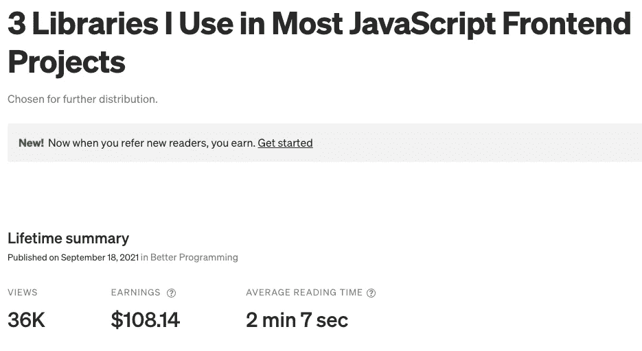

# 不要羞于分享你的知识

> 原文：<https://javascript.plainenglish.io/dont-be-shy-to-share-your-knowledge-afc2178ea150?source=collection_archive---------13----------------------->

## 你从某人那里获得知识；你和别人分享。

Photo by [Mr. Bochelly](https://unsplash.com/@bochelly?utm_source=medium&utm_medium=referral) on [Unsplash](https://unsplash.com?utm_source=medium&utm_medium=referral)

# 介绍

2019 年，我和前公司做了一个梦。通过撰写科技文章改善马来西亚的科技社区。然而，我不停地问自己:“我是否足够完美，可以分享我的知识？”最后，我一篇文章也没发表。

Until **June 2021**, I saw two books recommended by a Youtuber [老石谈芯](https://www.youtube.com/channel/UC5mVFJf71Ax6TJZcbmTnilw)

1.  [展示你的作品！奥斯汀·克里昂](https://austinkleon.com/show-your-work/)
2.  [软技能:软件开发人员的生活手册](https://www.amazon.com/Soft-Skills-software-developers-manual/dp/1617292397)作者约翰·桑梅兹

读完这两本书后，我于 2021 年 8 月在**发表了我的第一篇文章。**

# 分享知识不一定要成为天才。

我和我的一个朋友谈到了维特和 PNPM，他告诉我他的同事和上级都不知道这些。他感谢我提升了他团队的开发速度。

我意识到很多人可能不知道这些图书馆，这可能会改变生活。于是，文章诞生了。

 [## 我在大多数 JavaScript 前端项目中使用的 3 个库

### 提升您的 web 应用程序的性能

better 编程. pub](https://betterprogramming.pub/3-libraries-i-use-in-most-javascript-frontend-projects-555387be69c) 

Screenshot from one of my article’s stats

这个结果激励我为你们写更好的内容。

# 每天/每周分享一些小而有价值的东西。

分享一些你认为对至少一个人有帮助的东西。不一定要在媒体上分享；你可以在推特、脸书、Youtube 等网站上分享它。

例如

*   [简单的 Javascript 脸书页面](https://www.facebook.com/simpleJavascript)
*   [火船 Youtube 频道](https://www.youtube.com/c/Fireship)

但是，请不要把它变成人肉垃圾**。**

# 把你知道的教给别人

教人不会从你所做的事情中减去价值；这是雪上加霜。

16 岁的时候，我的记账科目一直都是满分。我的老师总是想让我在课堂上教我的同学。如果我没有解释清楚，她会惩罚我，她说:“**如果你能教一个人，并能让他明白，这意味着你完全明白了。**

当你在教学的时候，你也在学习

有时候你会面临一些挑战，你会得到你在网上找不到的解决方案。请与他人分享，因为人们可能和你有同样的问题，但他们无法解决。

# 批评是好的

不要害怕仇恨者。他们是你的“朋友”，关心你的工作。

在斯科特·扬的《超级学习》中，他认为反馈可以指导未来的学习。如果有人批评你的工作，这对你有好处，因为你知道你可以改进的地方。

# 但是我为什么要分享我的知识呢？

1.  **作品集和自我品牌** —通过平台分享你的知识可以成为你的作品集和自我品牌。到时候，不是你找工作，而是工作找你。
2.  **学习—** 边教边学。当受到批评时，你就学会了。
3.  **被动收入** —在 Medium 这样的平台上写文章，可以为你带来被动收入。通过加入[中型合作伙伴计划](https://help.medium.com/hc/en-us/articles/115011694187)或[附属营销计划](https://medium.com/trapica/affiliate-marketing-a-step-by-step-guide-539d5c2f11a8)

与西方不同，大多数亚洲人不喜欢通过分享知识、开源、聚会等方式为技术社区做贡献。我希望有一天，亚洲人和西方人能够平等，都有一个坚实的技术社区。

让我们建立一个更好的技术社区！

*更多内容请看*[***plain English . io***](http://plainenglish.io/)