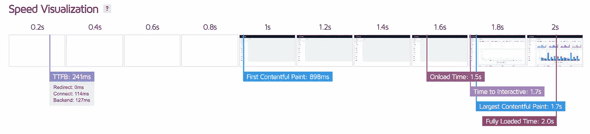
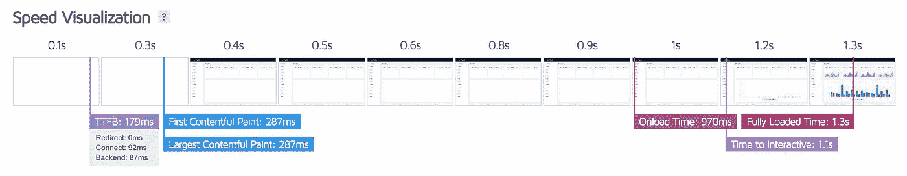
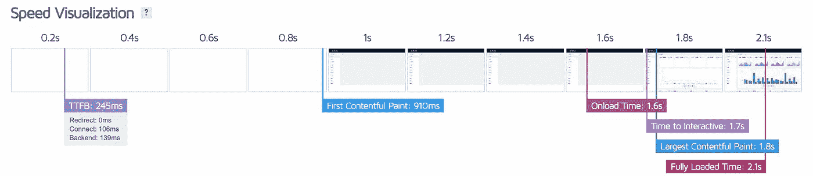
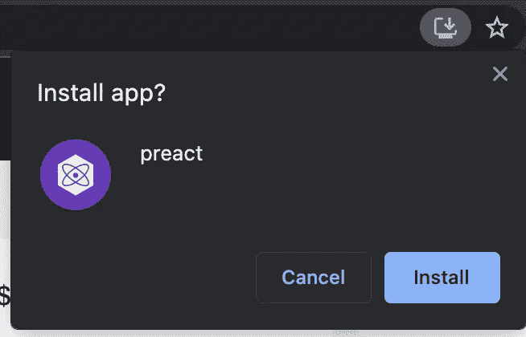
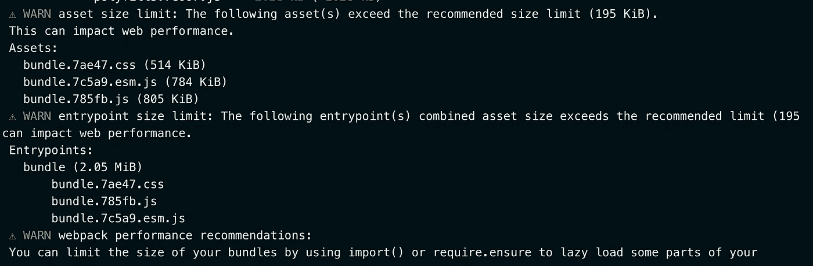

# 不要优化你的 React 应用，用 Preact 代替

> 原文：<https://javascript.plainenglish.io/dont-optimize-your-react-app-use-preact-instead-76cdc3e69b59?source=collection_archive---------2----------------------->

## 默认情况下，Preact 提供性能优化。

Photo by [Kelly Sikkema](https://unsplash.com/@kellysikkema?utm_source=unsplash&utm_medium=referral&utm_content=creditCopyText) on [Unsplash](https://unsplash.com/s/photos/choose?utm_source=unsplash&utm_medium=referral&utm_content=creditCopyText)

几个月前，我写了一篇基于优化 React 加载时间的[文章，大多数读者的评论都建议尝试](https://dev.to/nilanth/how-to-reduce-react-app-loading-time-by-70-1kmm) [Preact](https://preactjs.com/) 来获得默认优化。所以我决定用前一篇文章中使用的应用程序来尝试 Preact。我们先来了解一下 Preact。

Preact 是一个 react 备选库，具有 React 的所有特性！Preact 是一个 **3KB** 库。与 React 相比，它非常小，因为 React 和 react-dom gzip 大小约为 **41KB，**不包括基于 [bundlephobia](https://bundlephobia.com/) 的 react-scripts。Preact 的一些突出特点是:

1.  轻量级虚拟 DOM
2.  体积小的
3.  默认情况下性能优化
4.  集成很简单
5.  默认 PWA

现在让我们看看 Preact 的实际应用。

我在 React 和 Preact 中开发了相同的应用程序来测试应用程序的性能。

Preact and React Dashboard

对于 react 应用程序，我使用了[创建 React 应用程序](https://create-react-app.dev/)，对于 Preact，我使用了`[preact-cli](https://github.com/preactjs/preact-cli)` Preact，它还提供了一个选项，可以使用 [preact-compat](https://github.com/preactjs/preact-compat) 将您现有的 React 应用程序转换为 Preact，但我已经从头开始构建了一个应用程序，以查看最佳结果。

为了比较这两款应用的性能，我使用了 [GTmetrix](https://gtmetrix.com/) ，并在 [Netlify](https://www.netlify.com/) 上托管了这两款应用。

# 对应用性能做出反应

下面是 **GTMetrics** 给基于 React 的 App 的评分。我为仪表板组件使用了基于路线的**代码分割**。性能是 **80%** 带 **B 级**，最大含量漆( **LCP** )和布局移位( **CLS** )看起来低。

正如我们在下图中看到的，整个页面在 **2 秒**内加载，第一次内容绘制在 **1 秒左右。**貌似性能还不错。

# 预测应用程序性能

所有指标都是绿色的！似乎 Preact 中的同一个应用程序在 GTMetrix 中获得了 **100%** 和 **A 级**。最大含量涂料( **LCP** )小于 **500ms** ，无布局偏移( **CLS** )。

这看起来令人印象深刻。Preact 很好地优化了我们的仪表板应用程序。与 React 相比，性能显著提高。现在让我们检查一下装货时间

正如我们在上面的图像中看到的，整个应用程序在 **1.3 秒**内加载，到达第一个字节的时间( **TTFB** )是**179 毫秒！与 react 相比，Preact 看起来要快得多，而且默认情况下它会处理所有事情。**

# 比较两款应用

ReactJS

PREACT

当并排查看页面加载时，preact 应用程序比 react 应用程序提前加载，并且**交互时间**也比 React 应用程序快。Preact 默认为[渐进式网络应用](https://web.dev/progressive-web-apps/) (PWA)，因此在重复访问时即时加载。

Preact 还给出一些有用的警告，说明在构建期间 reg 包的大小会增加，如下所示。

# 悬疑和懒惰

当转换到 Preact 时，我面临的一些限制是**暂停**和**延迟**加载是实验性的，目前还不支持生产。但是对于 routes 目录，默认情况下启用基于路由的代码分割。

# 参考

1.  [预先行动](https://preactjs.com/)
2.  [差异反应过来](https://preactjs.com/guide/v10/differences-to-react)

# 结论

根据上述比较，Preact 在所有零件中均领先。由于减少了库的大小和速度，Preact 使我们能够专注于开发功能，而不是手动优化。

感谢您的阅读。

*更多内容请看*[*plain English . io*](http://plainenglish.io/)*。报名参加我们的* [*免费每周简讯*](http://newsletter.plainenglish.io/) *。在我们的* [*社区*](https://discord.gg/GtDtUAvyhW) *获得独家写作机会和建议。*