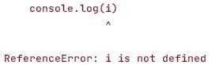
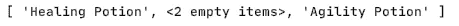
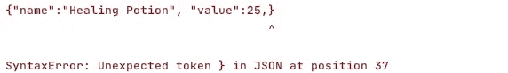
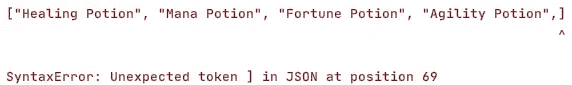
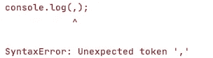

# 写 JavaScript 时不要跳过分号和逗号

> 原文：<https://javascript.plainenglish.io/dont-skip-using-semicolons-and-commas-when-writing-javascript-d508d22d8755?source=collection_archive---------10----------------------->

## 为什么以及如何使用分号和逗号更好——标点符号指南

Cover Art by [Author](https://arnoldcode.medium.com/)

从 C 或 C#开始，你不会问自己是否&如何使用分号的问题。在 C#中放置分号非常简单:除非是一个块，否则分号必须出现在语句的末尾。

或者

第一个例子只是一个简单的语句，没有定义一个独立的块。这就是为什么要有分号来终止语句。第二个例子是一个块，由 *try/catch* 定义。这里不需要分号。我们甚至不允许放置一个。否则，编译器将响应一个错误。如果你坚持这个经验法则，你在 99.9%的情况下都是正确的。

把职业换成 JavaScript，会自动用同样的方式设置分号，比如像这样:

这是可行的，并且引出了这样一个想法:JavaScript 的行为很可能类似于 C#和 C 家族中的其他语言。**这是显而易见的——但不幸的是错了。**

# 分号是一个选项

[hannah joshua](https://unsplash.com/@hannahjoshua) via [unsplash](https://unsplash.com/photos/46T6nVjRc2w) (CC0)

使用分号还是省略分号由你决定。这没有任何语义上的区别。下面一行:

在没有分号的情况下也是有效的代码:

两者的工作方式完全相同。省略分号意味着 JavaScript 会自动在行尾添加一个分号。“自动分号插入”(ASI)是这种行为的名称。[1]

这看起来既舒适又现代，但很快就会导致不确定性。如果我们切换到循环，那么您可能听说过省略循环一行程序的大括号:

你看到分号和循环体语句的结尾了吗？我们可以删除它，它的行为和以前一样:

但是如果我们现在把分号放在循环条件之后，那么我们就搞砸了。

接下来会发生什么？loop 语句因分号而关闭，并且为空。我们得到了一个循环，条件和下一条语句就在它下面。这将导致参考误差，因为变量 *i* 在循环之外不可用。

Error in console print from X1_4_LoopingOneLinerMessedUp.js

要小心，分号放在哪里。特别是当语言本身没有给定的规则时，省略它们是可能的。对于语言新生来说可能更容易，但对于语言转换者来说却是一个陷阱。

情况越来越糟:即使省略所有分号(毕竟；它们是可选的，为什么不呢？)，错误可能会悄悄出现，因为 JavaScript 会在某些地方自己插入一个分号。例如，考虑以下将两个数字相加的函数:

你有了重新安排功能的想法。这样做的一个原因是:增加可读性。您可能会得到以下代码:

我们将得到一个未定义的*作为返回的结果，因为 JavaScript 在 return 语句后添加了应该丢失的分号:*

每当 JavaScript 中的函数返回“nothing”时，它会隐式返回*未定义的*。但是两个数相加的说法是怎么回事呢？这是事实上无法实现的代码。问题出在语法上完美合法的代码中，JavaScript 将它留在插入的分号处。想象一下，在一个大的代码库中发现这样一个 bug，尤其是当代码的行为不像写出来的时候。

我们能做的是养成一行不结束的习惯，这样加个分号就有意义了。您可以用括号括住表达式，并以这样的方式设置括号，即第一个括号与 return 语句在同一行。JavaScript 不会在这里插入分号，因为行*返回(；*将没有有效代码:

一定要注意行尾的左括号。在 C#中，你在一行的开始做这件事。删除 JavaScript 中的那个。

**无论你选择什么:请加上分号或括号。**

最后，你怎么做都不重要。成功的关键在于坚持曾经做出的选择。

# 逗号不是一个选项

[Manthan Gajjar](https://unsplash.com/@manthan0gajjar) via [unsplash](https://unsplash.com/photos/uq4QK6uuXrA) (CC0)

尽管放置分号无关紧要，但有了逗号，情况就完全不同了。逗号放在哪里真的很重要。定义数组和枚举元素时，必须用逗号分隔它们。

你实际上可以做的是省略值。如果你想拥有一个数组的每两个条目，但保留数组的索引。

如果你可能会问:在空的地方放了什么？未定义放在那里。数组的长度保持不变。将阵列打印到控制台会导致以下结果:

Console printout from X2_1_KeepArrayOrderWhileOmitting.js

您还可以将逗号放在数组的第一个位置:

如果我们可以把逗号放在开头，为什么不放在结尾呢？这个应该也行！

这实际上是可行的。数组可以很容易地换行，行可以重新排序，而不必每次都从最后一行删除一个逗号，然后在不同的位置再次插入它:

这将使数组为扩展做好准备，而无需修改最后一行。只有新添加的行会在版本管理中显示为一个变更。好消息是:至少对于数组来说，这在 JavaScript 中总是有效的。结尾逗号是一种允许的语法，但与开头或中间的逗号不同，它不适用于数组中的另一个条目。数组的长度仍然和没有数组时一样。

# 一样的东西但不一样

[Jason Dent](https://unsplash.com/@jdent) via [unsplash](https://unsplash.com/photos/JVD3XPqjLaQ) (CC0)

如果这适用于数组，那么为什么不适用于对象呢？如果有一个对象，其定义分布在多行中，则可以用逗号结束最后一个属性，而不会导致语法错误:

不幸的是，这不适用于对象。怎么可能不是呢？事实上，当您在 ECMAScript 5 之前使用版本**时，这个符号是一个语法错误。从那以后，在对象文本中也允许尾随逗号。**

一个重要的事实是，这条规则只适用于 JavaScript 对象。JSON 不允许尾随逗号，因为 JSON 语法基于 ECMAScript 5 之前的 JavaScript 语法。

此外，JSON 中不允许数组有尾随逗号。

Error in the console from X3_1_JSONTrailingCommaFail.js line 1

Error in the console from X3_1_JSONTrailingCommaFail.js line 3

# 在函数中

下一个合乎逻辑的步骤是将“尾随逗号”的概念扩展到函数中。自 ECMAScript 2017 以来，这成为了现实。如果你的函数被设计成至少有一个参数，你就可以开始了。在参数列表的定义中可以使用尾随逗号。从 ECMAScript 2017 开始，以下函数定义是合法的。

对函数有效的也应该对类的方法有效。你的愿望将会实现:

一旦精灵被释放，他就会实现我们的第三个愿望。带有尾随逗号的 Lambda 表达式:

此外，这同样适用于调用函数，不管它们是函数、方法还是 lambda 表达式。在这里，也可以在参数列表中指定结束逗号，因为 ECMAScript 2017:

但是要注意！只有当您的构造至少有一个参数时，这才有可能。下面是一个无效尾随逗号用法的示例。

Error in the console of X4_4_InvalidExample.js

# 结论

我想我已经澄清了开发者是否有权利加上分号。每个开发人员还负责包装代码的 JavaScript ASI，以及 JavaScript 是否将某些代码解释为有效并在那里放置分号。因为那种行为和环境，没有对错。你喜欢什么取决于你，但最重要的是坚持你的选择。

如果你在一个团队中工作，创建规则和 linters 的使用，以双重检查和强制每个人应用规则。使用像 ESLint [3]这样的棉绒适合这种情况。逗号悬挂规则[4]可以配置和控制逗号应该、必须和可能被设置的方式和时间。对于分号，ESLint 知道一个对应的规则，即 semi [5]。

这篇文章再次声明，JavaScript 与 C#或其他 C 系列语言的区别比你想象的要大。真正了解一种语言意味着了解它的微妙之处和独特之处，并知道你为什么做某些事情或不做。

[***节省自己大量的时间，专注于重要的主题。***](https://arnoldcodeacademy.ck.page/26-web-dev-cheat-sheets)

## 进一步阅读

 [## 你遵循了优秀程序员的这 10 条原则吗？

### 从接吻和干燥到足球和 YAGNI 和聪明屁股代码的 10 个原则！

medium.com](https://medium.com/next-level-source-code/do-you-follow-these-10-principles-for-good-programmers-1445727af447)  [## Enums TypeScript 4.0 和 JavaScript 指南—您需要知道的一切

### 你将读到的关于 enums 的最后一本指南！

medium.com](https://medium.com/javascript-in-plain-english/enums-typescript-4-0-and-javascript-guide-all-you-need-to-know-5e090355bff6) 

# 参考

[1]自动分号插入[https://en . wikibooks . org/wiki/JAVAScript/Automatic _ 分号 _ Insertion](https://en.wikibooks.org/wiki/JavaScript/Automatic_semicolon_insertion)
[2]eslit[www.eslint.org](https://eslint.org/)
[3]逗号分隔规则[https://eslint.org/docs/rules/comma-dangle](https://eslint.org/docs/rules/comma-dangle)
[4]semi[https://eslint.org/docs/rules/semi](https://eslint.org/docs/rules/semi)