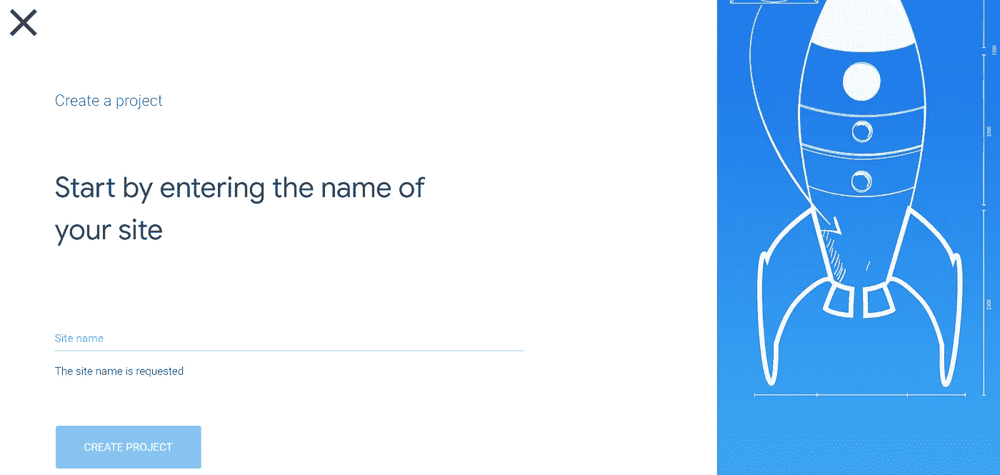
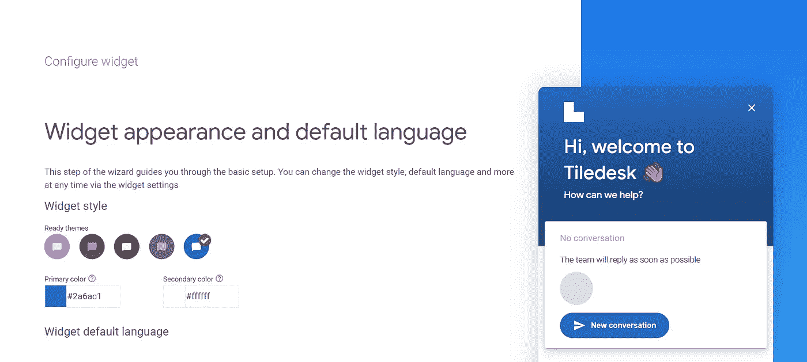

# 不要花费美元来构建聊天机器人，而是使用 TileDesk

> 原文：<https://javascript.plainenglish.io/dont-spend-dollars-to-build-chatbots-use-tiledesk-instead-12ef7b1d812c?source=collection_archive---------22----------------------->

## 通过与顾客更多的互动来增加你的销售额。


Photo by [Markus Spiske](https://unsplash.com/@markusspiske?utm_source=medium&utm_medium=referral) on [Unsplash](https://unsplash.com?utm_source=medium&utm_medium=referral)

之前，我写了'[如何今天开始你的业务并赚取$$'](https://medium.com/code-blog/how-to-start-your-business-today-and-earn-b52bd1d94ceb) 和'[企业如何通过销售代码赚取收入](/how-businesses-earn-revenue-from-selling-code-ed3a90316277)。

但企业需要更多地与用户联系，以增加销售额。我们都知道大多数企业失败是因为资金不足。所以在这里，我将帮助你免费使用聊天机器人来发展你的业务。

> **注意:**我没有为任何产品做广告，也不建议在这里购买任何东西。我们将在这里使用的产品是免费的，所以不要紧张。

我们开始吧。

每个企业都需要顾客，我们甚至可以说，顾客决定了企业的成败。

因此，每家公司都使用各种战术和策略，并实施多种方法来吸引客户。顶级跨国公司雇佣数据科学家、ML 工程师和各种复杂的技术。

例如，亚马逊分析数据来推荐产品。即使是一本书，也会因为评论、购买数量等等因素而出现在首页。

Udemy 基于相同的假设向用户推荐课程，如评论、购买次数等。我们也知道 YouTube 视频推荐。

为什么会这样？来吸引顾客。

吸引顾客的另一个主要技巧是与用户建立联系。正因如此，Convertkit，Mailchimp 发展迅速。

几乎每个博客作者都使用基于订阅的技术与用户联系。

但是用户如何通过网站、app 与你联系，解决他们的问题呢？通过聊天机器人。

# 什么是聊天机器人？

根据甲骨文的说法，聊天机器人是一种模拟和处理人类对话(书面或口头)的计算机程序，允许人类与数字设备互动，就像他们与真人交流一样。

此外，根据[调查](https://www.globenewswire.com/news-release/2021/03/26/2199940/0/en/The-global-Chatbot-market-size-to-grow-from-USD-2-9-billion-in-2020-to-USD-10-5-billion-by-2026-at-a-Compound-Annual-Growth-Rate-CAGR-of-23-5.html)，全球聊天机器人市场规模将从 2020 年的 29 亿美元增长到 2026 年的 105 亿美元，复合年增长率(CAGR)为 23.5%。

不要紧张，我们不会通过编码来创建聊天机器人，但我们会节省时间。

# 使用免费聊天机器人服务

我喜欢免费服务，我已经免费学习了，[创建了一个免费托管和域名的博客](/how-i-created-a-gatsby-blog-with-free-domain-and-hosting-e83f6bfd2824)，现在我将使用免费聊天机器人。

我知道一些免费服务已经够糟糕了，但并不是所有的都是糟糕的。在这个数字时代，你可以找到很棒的产品和免费服务。

例如，三个主要的操作系统是 Windows、macOS 和 Linux。除此之外，Linux 是开源的，你可以免费使用它。Freecodecamp 是一个帮助初学者学习编码的组织。所以你可以信任免费服务。

现在让我们用 Tiledesk 来做聊天机器人。

# 什么是 Tiledesk？

据 Tiledesk 介绍，Tiledesk 是一个开源的实时聊天平台，用 Angular、Node.js 和 MongoDB 编写。它允许代理直接从他们的设备与访问者聊天。

它支持网络和移动，是一个人工智能驱动的实时聊天。

你兴奋吗？大概比我还多吧！

那我们开始吧。

# 如何使用/整合它

访问他们的[官网](https://tiledesk.com/)。

首先，注册 Tiledesk。然后转到控制台并创建一个新项目。



在这里你必须输入你的网站名称。您可以在这里为您的项目命名任何内容。写下你的网站名称，点击按钮名称`create project`。如果您想集成并在本地主机上看到它，您也可以这样做(您不需要网站域名来使用此服务)。



在这里，您可以直接配置您的聊天机器人。简单来说，你可以改变你的聊天机器人的颜色。

向下滚动，你可以使用这个聊天机器人的语言。自定义颜色并选择语言后，单击继续按钮。

在这之后，你会得到一个代码。只需将它添加到网站的 head 标签中。

```
<script type="application/javascript">
      window.tiledeskSettings = 
        {
        projectid: "6012y034a12a7b8485968382"
        };
        (function(d, s, id) {
          var js, fjs = d.getElementsByTagName(s)[0];
          if (d.getElementById(id)) return;
          js = d.createElement(s); js.id = id;
          js.src = "[https://widget.tiledesk.com/v4/launch.js](https://widget.tiledesk.com/v4/launch.js)";
          fjs.parentNode.insertBefore(js, fjs);
        }(document, 'script', 'tiledesk-jssdk'));
    </script>
```

其实你创建网站的时候，有主文件名索引或者 app。这是主 HTML 文件，在这里你可以看到和标签。

在标签内，复制提供的代码(不要使用上面的代码，因为它包含虚拟数据，不会工作)。

就这样，您的网站将为 chatbot 做好准备，Tiledesk 将为您创建一个支持仪表板。

今天就到这里，谢谢。

[](https://medium.com/code-blog/getting-started-and-earning-105-813-yr-as-a-web-developer-for-beginners-19b2cd26fcc2) [## 作为一名面向初学者的 Web 开发人员，开始工作并获得每年 105，813 美元的收入。

### 成为 Web 开发人员的简单方法。

medium.com](https://medium.com/code-blog/getting-started-and-earning-105-813-yr-as-a-web-developer-for-beginners-19b2cd26fcc2) [](/how-i-would-learn-front-end-web-development-if-i-had-to-start-over-again-24e6228050d0) [## 如果我必须重新开始，我将如何学习前端 Web 开发

### 一个白手起家的 web 开发者的故事。

javascript.plainenglish.io](/how-i-would-learn-front-end-web-development-if-i-had-to-start-over-again-24e6228050d0) [](/stop-using-css-and-bootstrap-use-tailwind-css-instead-94c689ec3b8a) [## 停止使用 CSS 和 Bootstrap，改用 Tailwind CSS

### 顺风 CSS 给你更多的灵活性，节省你的时间。

javascript.plainenglish.io](/stop-using-css-and-bootstrap-use-tailwind-css-instead-94c689ec3b8a) 

*更多内容尽在*[*plain English . io*](http://plainenglish.io/)