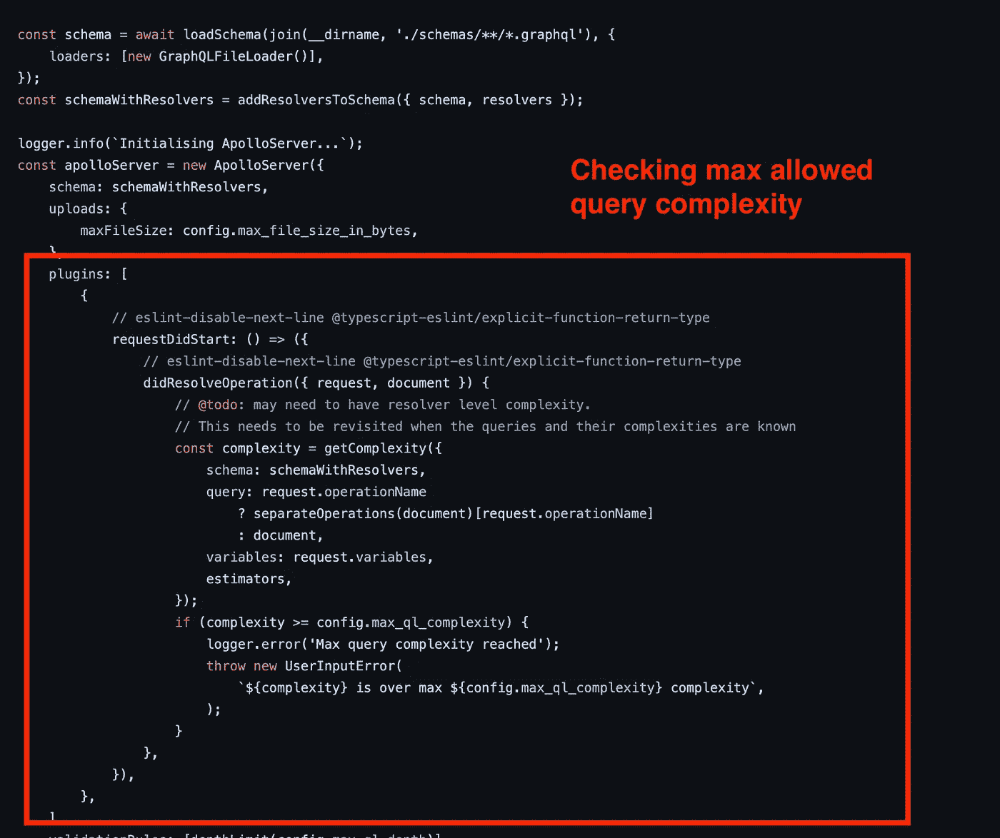

# 现在，作为一名 JavaScript/TypeScript 开发人员，您的收入将翻倍

> 原文：<https://javascript.plainenglish.io/double-your-income-as-a-javascript-typescript-developer-today-933d6fc5337e?source=collection_archive---------0----------------------->


# 最好的开发人员得到的报酬比一般人多

如果你是一个靠写 JavaScript/TypeScript 代码挣钱的职业开发者，那么这篇文章将向你展示如何让你的收入翻倍。

这个想法很简单:最好的开发人员比一般的开发人员获得更多的报酬。要做到最好，你需要快速交付没有错误的复杂质量特性，并教会其他同事如何做。

你可以随时关闭这篇文章，但请听我说完:

*   如果你能在一天内完成整个脸书，你就是开发者之神。企业会乞求你为他们工作。你将击败竞争对手，变得异常富有
*   如果你能在 100 年内完成一个完整的脸书——你是一个平庸的开发者。你需要说服企业雇佣你。你的薪水很一般

今天你可以做一个重要的选择:你想变得更快，还是更喜欢保持缓慢？

在本文中，我将向您展示如何比其他 90%的开发人员变得更快，并获得双倍的高薪。

在过去的 15 年里，我一直从事软件开发和团队领导的工作。从低级的 *XOR EAX，EAX* 到 *monadic ( > > =)* ，我都和多种语言合作过。从 OOP 到 FP。有 [React](https://www.youtube.com/watch?v=Tn6-PIqc4UM) 、 [GraphQL](https://www.youtube.com/watch?v=eIQh02xuVw4) 、 [Serverless](https://www.youtube.com/watch?v=W_VV2Fx32_Y) 、 [Docker](https://www.youtube.com/watch?v=Gjnup-PuquQ) 、CI/CD、 [Terraform](https://www.youtube.com/watch?v=tomUWcQ0P3k) 、 [Solidity](https://www.youtube.com/watch?v=kdvVwGrV7ec) 等等，应有尽有。

甚至现在我还在用 [Github Copilot](https://copilot.github.com/) 在 Webstorm 的 60%机械键盘上用 VIM 布局写这篇文章(写的不好但是 js 写的让人毛骨悚然)。

我想说的是，15 年来，我看到并尝试了很多东西。经过 15 年的努力，你会开始发现为什么人们努力写代码，为什么他们效率如此之低，速度如此之慢。

今天我想免费教你如何变得比 90%的开发者更优秀。这篇文章只写给关心钱的职业开发者。如果你是一个初学者，如果你为了乐趣或者作为一种爱好而编程，你可以跳过这篇文章，因为你没有理由这么快。

简单的想法:
优质快速的特点交付→击败竞争对手→从大企业获得更多资金。

准备好了吗？让我告诉你如何成为最好的。

# 要成为最好的，你需要快。为了更快，你需要避免过度设计。

> 过度工程化是聪明人的病。你越聪明，你就越能自掘坟墓。

**我想对你的工作做一个大胆的声明。**你的代码至少有一半是过度工程化的，没有为你的终端客户提供任何价值。它消耗了你一半的时间和一半的资源，却没有为你的最终客户创造任何价值。

如果你对我所说的不感兴趣，你可以关闭这篇文章。没什么丢人的。但是如果你留下来，你会从新的角度看到你的代码。

过度工程化是聪明人的病。普通人会写一个大的不可读的函数，它被定位在一个文件中。但是你，我的朋友，可以创建成千上万的结构化混乱的文件。文件、控制器、适配器、类型、函数、配置、管道、容器、数据库、模式、层、接口，等等。

我打赌你会说:*没门，阿列克谢，我不是工程过度！我将一切分离，以支持未来的扩展业务需求。我需要这个强大复杂的工具，因为我预计下个月/年/十年将有 100 万用户。*

是的，可以这样。但是你真的想知道吗？

我处在你的位置。我过度设计了很多。我知道那种感觉。**感觉自己做的是对的**。

您的过度工程化来自于解决您当前需求中尚不存在的未来问题。您今天试图解决未来的可伸缩性/可扩展性问题。您尝试在业务开展之前预测未来的业务需求。

你生活在对未来的恐惧中。您担心未来的项目变更会彻底破坏某些东西。你试图不惜一切代价避免未来的伤害。讽刺的是你在挖自己的坟墓。

您使用复杂而强大的工具来完成简单的工作。这些工具让你感到高效、聪明和安全，因为你写了很多复杂的代码，但它们让你慢下来，并告诉你营销谎言。

缓慢的功能交付→平庸的职业生涯→平庸的薪酬。这是大多数人走的平庸之路。你想知道不同的路径吗？

过度工程的来源主要有两种:

1.  过度使用的良好实践。棘手的是好的实践确实有用。他们为项目提供价值。但是你过度使用了它们
2.  对你的工作来说太复杂的工具。
    棘手的是复杂的工具确实有用。他们确实为项目提供了价值。但不是为了你的项目。复杂的工具有很大的代码/学习成本，但它们非常小众

几个过度使用的良好实践会让你慢下来的例子:

*   干燥原理
*   坚实的原则
*   依赖注入
*   类型安全
*   函数式编程
*   面向对象的程序设计(Object Oriented Programming)
*   测试
*   提取抽象概念
*   将代码分割成更小的部分函数/类/组件/文件

几个过度使用的工具让你慢下来的例子:

*   以打字打的文件
*   类似红杉/猫鼬的 ORM
*   GraphQL
*   MongoDB
*   Redux
*   Knex 之类的查询构建器
*   库伯内特斯
*   玩笑
*   将（行星）地球化（以适合人类居住）
*   反应钩形/成形
*   总体上对受控输入做出反应
*   无服务器环境
*   授权/身份验证的自定义实现
*   微服务架构

你现在应该感到个人受到了冒犯，因为我列举了你使用的几种工具和你喜欢的几种做法。这是完全正常的反应。深呼吸，慢慢呼出。**我会给你看一些能让你比其他 90%的开发者更优秀的东西**，值得你付出情感上的痛苦。

棘手的部分是复杂的工具和良好的实践确实有用。他们确实为项目提供了价值。但是它们带来了 90%的开发人员倾向于忽略的过度工程成本。

我将向您展示如何减少代码中的过度工程。这将最终使你的代码小 10 倍。

更少的代码→更快的特性交付→更多的钱。


Our enemy is over-engineering.

# 什么是过度工程化？

> 三年前，我想在互联网上发表一篇文章，所以我和 GraphQL 以及[盖茨比](https://www.youtube.com/watch?v=GuvAMcsoreI)一起写了一个博客来发表这篇文章。花了一个月。

在我们消灭过度工程之前，我们需要理解什么是过度工程。过度工程是您编写的代码，但它现在并没有为您的最终客户提供任何价值。通常，当开发人员编写这样的代码时，他们会告诉自己:

*   如果我将这段代码添加到我的项目中，我会使它更具可读性
*   我会让我的项目更容易维护
*   更具可扩展性
*   更易测试

我们想要所有这些东西，然而，它们都是有代价的:许许多多的代码、文件、层、配置，当然还有*学习*。

过度工程对开发人员的思想开了一个玩笑。它承诺在遥远的未来给你巨大的价值，但却要求你现在就为之付出代价。它告诉你一个甜蜜的谎言:当然这段代码现在对你的客户没有任何作用，但是相信我，从长远来看，它会节省时间，你是一个非常聪明的开发者。

我会给你看一个超工程的例子。通过研究这个例子，你将开始看到你的代码中过度工程化的模式。如果你知道过度工程是什么样子，你就会避免把它添加到你的代码中。更少的代码→更快的特性交付→更多的钱。

# 过度工程的可怕例子

你不需要到处寻找一个令人敬畏的过度工程的例子。我在 GitHub 上花了大约 30 分钟，发现了这么漂亮的 10/10 样本。我对代码质量感到惊讶。

这个项目有 4 个主要的贡献者，他们来自剑桥，例如，一个非常顶尖的地方。这些人都是受过良好教育的专业人士。有请，有请 https://github.com/libero/reviewer-submission

堆栈:

*   以打字打的文件
*   表达
*   阿波罗图表
*   Knex 用于构建 Postgres SQL
*   模式验证的 Joi
*   开玩笑的测试

它将与您的个人堆栈不同，但所有的过度工程概念都适用于任何工具和代码。

我们感兴趣的是:

*   代码有很多很多层，为最终用户提供低价值，例如，过度工程化
*   开发人员是专业的，组织良好
*   开发人员对好的实践有一种极端生硬的决心

我们将查看后端代码。我们将从代码中抽取 1 个特征/故事，看看它是如何工作的。我将向您展示为什么这段代码提供的价值很低，以及它如何欺骗人们认为它是有用的。

我将向您展示如何用少 40 倍的代码实现**同样的最终用户价值。更少的代码→更快的特性交付→更多的钱。很简单。我们走吧！**

# 简单的功能:用户可以请求他的表单提交

假设 Postgres 中有一个表，它存储了一些表单提交。用户可以提交表单，表格存储表单。该企业要求创建一个 web 服务，允许用户获取表单提交。听起来很简单:

*   验证用户身份
*   运行选择查询以获取他的表单提交
*   然后通过互联网以 JSON 的形式返回结果

非常简单，最重要的是非常普遍的模式。90%的 web 应用都是这样。

制作这样一个功能有多难？让我们给企业留下深刻印象，让这个功能**变得非常非常快**。你可以在一个小时之内制作一个非常酷的应用程序:

*   作为 web 服务器，我们将使用 Node+ [Express](https://youtu.be/-MTSQjw5DrM?t=214)
*   我们将创建一个简单的 HTTP get 端点
*   对于 auth，我们将使用 OIDC。这个东西允许授权给一些权威。你还记得“用谷歌/脸书登录”按钮吗？即将发生
*   我们将使用[https://auth0.com](https://auth0.com)作为我们的主要 OIDC 权威，它是免费的，并提供了一个不错的用户界面
*   我在这里免费创建了一个 Postgres 数据库[https://elephantsql.com](https://elephantsql.com)

整个申请在[单个文件](https://gist.github.com/aleksejkozin/5acc75f4a7a1ddd3d236ba870e1b075e)中。您可以复制并粘贴这 40 行，并通过将它们作为`nodemon app.js`运行并打开[来摆弄它们。请不要删除数据库，因为其他人会想玩桌子。](http://localhost:3000/submissions)


90% of web applications structured like this

90%的 web 应用程序都是这样的:HTTP 请求→ Auth → SQL →返回 JSON。业务价值本身就在 app.get()中，就像 10 行一样，其他的东西都是库初始化的样板。

在编程中，对程序的简单程度有严格的限制。我能想到的简化这个功能的唯一方法是使用[谷歌表格](https://www.google.com/forms/about/)。但是**没有限制你可以让一个程序**有多复杂。有限的优势——无尽的劣势。

让我们测试软件复杂性的物理极限。

# 过度设计:用户可以请求他的表单提交

让我们看看剑桥的人们是如何做到的:

我们将通过初始化 GraphQL Apollo 服务器来预热。GraphQL 就像 REST 一样，有很多好处。阿波罗服务器就像快车。

GraphQL 做了一些非常棒的事情:

*   它允许客户端通过仅发送部分数据来节省流量，并通过一次请求多个端点来节省时间
*   它还为第三方用户提供我们 API 的文档
*   它还将传输模式应用于我们的数据。这样，我们的域将与我们向最终用户发送数据的方式**分离**。所以我们可以改变我们的域名而不影响我们的客户

让我们初始化阿波罗 GraphQL 服务器:



Initializing Apollo with security and complexity checks

**你可以说有点罗嗦**，但事实并非如此。GraphQL 的问题在于，客户端可能会以无限的复杂性编写请求。我们不希望我们的客户端编写无限深度的查询，这将花费无限的时间和 CPU 来执行。因此，在我们执行查询之前，我们需要验证它不会破坏我们的后端，或者这将是一个愚蠢的安全漏洞。这可以通过阿波罗插件来完成。

GraphQL 最重要的部分是模式。这个想法与 SQL 或 Joi 域模式相同:您定义了一些形状，模式引擎将验证该形状是否正确。数字就是数字，日期就是日期，字符串就是字符串。GraphQL 模式也将作为我们的 API 的文档:


Our API consists of a query that returns an array of Submissions


The transport GraphQL submission schema

如您所见，我们定义了 **getSubmissions 查询。**非常简单的查询。它以数组的形式返回所有提交的内容。提交模式也由其他模式组成，我不包括它们，以免让你不知所措。

现在最酷的部分开始了。是时候开始编写我们的解决方案了。解析器是什么——只是从我们的客户端接收请求并返回数据的函数。标准应用层。

我们将定义 **getSubmissions 查询解析器**。它将验证客户端，获取他的用户 id 并调用 DashboardService。


getSubmissions query resolver

现在我们要去某个地方，看看接下来会发生什么。

**DashboardService** 是与客户端仪表板相关的所有服务的瘦包装器，例如 SubmissionService 和 PermissionService。它调用**submission service . findbyuserid()。**

DashboardServic 做了一件多么有趣的事情，它将域模式转换为数据传输模式。这是因为我们的域与 GraphQL 是解耦的。这样我们可以在不改变 API 的情况下改变域，这在将来可能是有益的。这是单一责任原则的精髓:


The DashboardService groups dashboard related features together and convert them from the domain to the transport model

让我们测试一下我们的 dashboard 服务。用测试覆盖您的代码是最佳实践:


Testing the DashboardService with Jest

DashboardService 调用**submission service . findbyuserid()**。

这是事情开始升温的地方。

我们有几个与提交记录相关的特性，所以让我们将它们打包成一个 **SubmissionService** 。SubmissionService 的作用:它使用 Knex、Mail、S3 或 DataRepository 等基本服务来处理提交操作。很简单。有查找全部/删除/提交等。

我们希望**将**我们的业务逻辑与代码的其他部分分离，这样我们的业务逻辑就存在于 SubmissionService 之类的服务中。这样，如果我们改变我们的业务逻辑实现，我们将不需要改变业务逻辑消费者。最好的情况是。有时你会改变所有的层，但我们暂时忽略它。

我们将把 Knex(和其他基础设施服务)作为依赖项注入 SubmissionService。这样我们就可以在测试过程中改变它们。这样我们就可以对有副作用的服务进行单元测试。相当方便的技术。我个人喜欢依赖注入。

我们将在 SubmissionService 中创建一个 **findByUserID()** 方法。但是我们现在还不能执行 Postgres SELECT，这是很愚蠢的。SubmissionService 只是一个控制器。它使用其他服务来完成它的工作。它与我们如何在数据库中存储数据的实现细节无关。

这就是单一责任原则的全部内容。SubmissionService 将向执行 SQL 繁重任务的 **submissionRepository** 发送命令。


SubmissionService consumes other dependencies and decouples business logic from other parts of our code

代码太多了。休息时间！你可以选择伸展一下或者喝一杯水。


It is break time

> 过度工程化是聪明人的病。你越聪明，你就越能自掘坟墓。

让我们回顾一下我们所做的事情:

*   一个用户想要请求他所有的表单提交
*   用户向我们的 Apollo 服务器发送一个 GraphQL 请求
*   我们验证请求将消耗合理数量的 CPU 和资源，并将其传递给解析器
*   在 getSubmissions 查询解析器中，我们对用户进行身份验证，并使用 user-id 调用 DashboardService
*   DashboardService 负责所有仪表板服务从域到传输模式的转换。它还调用 SubmissionsService
*   我们已经在 DashboardService 上应用了单元测试
*   SubmissionsService 是一个将多个服务缝合在一起的控制器。它用具体的数据存储实现调用 submissionRepository

我们得到了应用程序的核心，最重要的部分就在我们面前。

我们现在可以实现一个具体的数据库提交仓库。我们将使用 Knex。如果您不熟悉 Knex——它是一个 SQL 查询构建器。它允许你不用写 SQL 就能写 SQL。我们为什么要用它？你会经常问自己这个问题。

我们不喜欢 Knex API tho。我们想改变它。因此，我们将把 Knew 包装成一个定制的 **KnexAdapter** 。很常见的技术。默认库的 API 并不总是方便使用，这就是为什么我们可以将它们包装到我们方便的适配器中。此外，如果 Knex 会改变它的 API，我们就不需要去修改 Knex 调用的代码库(手工劳动)，我们只需要在一个地方修改一个适配器:


We do not like Knex API, so we create an adapter

让我们编写一个 Knex 查询，它将为我们完成构建 SQL 查询的繁重工作:


KnexAdapter will produce SQL, and we will parse results to the domain model

如果您没有花时间学习 Knex API，这是 Knex 将要构建的 SQL:

```
SELECT ... our columns ... FROM manuscript
WHERE created_by = $user_id
ORDER BY updated DESC
```

执行查询后，我们将提交数据从 DB 加载到内存中。然而，我们还不能把它发送给最终客户，那将是愚蠢的。我们需要对结果应用 **entryToModel()** 。

我很激动！在这里，事情会上升一个档次。

entryToModel()包含我们的域数据模式。它将数据的 DB 表示转换为数据的领域表示。这允许我们将我们的领域从我们存储数据的方式中分离出来，并应用一些很酷的转换、验证、数据规范化、数据清理等(我们还没有这样做，但也许我们将来会需要它)。非常常见和强大的技术:


Converts data from the Postgres model to the domain model

这里你可以看到我们正在调用一个额外的**提交类**。问题是，它保存了我们如何在域中存储提交的可重用逻辑。我们在项目中经常用到这个类。将可重用的代码提取到一个类中是一种很好的做法:


Our domain model of submission part 1

提交类的另一个截图，我无法将代码放入其中:


Our domain model of submission part 2

正如您从 Submission 类中看到的，我们可以安全地调用我们的**域数据模式**。我们将使用 Joi 实现该模式。

Joi 所做的是验证所有数据的形状和格式是否正确——日期就是日期，数字就是数字，等等。通过这种方式，我们可以将从数据库外部源接收的“未知”类型脚本转换为具体的类型脚本类型，并保证不会有任何错误。

> 个人觉得 Joi 没那么欢乐。它与 TS 有冲突，不能改变数据。所以我花了一个月的时间做自己的方案。完全过度工程化。但这超出了我们今天的讨论范围。

模式被递归调用:disclosureSchema、authorSchema、manuscriptDetailsSchema 等。它们用于验证嵌套对象。为了不让代码淹没您，我就不介绍其他内容了:


Joi schema that validates our domain model

就是这样！我们的专题/故事:“用户可以请求提交表单”完成了！

让我们回顾一下我们所做的事情:

*   一个用户想要请求他所有的表单提交
*   用户向我们的 Apollo 服务器发送一个 GraphQL 请求
*   我们验证请求将消耗合理数量的 CPU 和资源，并将其传递给解析器
*   在 getSubmissions 查询解析器中，我们对用户进行身份验证，并使用 user-id 调用 DashboardService
*   DashboardService 负责所有仪表板服务从域到传输模式的转换。它还调用 SubmissionsService
*   我们已经在 DashboardService 上应用了单元测试
*   SubmissionsService 是一个将多个服务缝合在一起的控制器。它用具体的数据存储实现调用 submissionRepository
*   存储库使用 KnexAdapter 以更方便的方式调用 Knex
*   Knex 构建一个 SQL 查询并从 Postgres 请求数据
*   我们对来自 Postgres 的数据应用领域模式并返回模式。领域模式由 3 层组成:entryToModel、提交类和 Joi 模式
*   在 DashboardService 中，我们将域模式转换为数据传输模式
*   我们将数据传输模式从解析器返回给最终用户

用户→Gql→Apollo→dashboard service→Submission service→Knex adapter→Knex→postress QL 模式→提交类→ Joi → Gql →用户

代码是干净的。上面写满了测试。遵循最佳实践。打字安全。可扩展。可维护。

然而你觉得有些不对劲。“用户可以请求提交表单”怎么可能需要 500 行代码、一周的工作和 4 个非常昂贵的剑桥专家一个月的学习工具？

这个功能花了这么多时间和精力去开发，我们从中得到了什么？

# 这段代码真的那么没用吗？

> 是的，没用。

直觉上，问题很明显:对于这个简单的特性来说，代码有点太多了。然而，这个代码做了一些事情，它没有死。它运行一些计算，移动数据，创建一些结构，一些文件，等等。它似乎在做一些有用的事情，但我们不确定具体是什么。真的那么没用吗？感觉给了一些价值。

如果我们看一看，我们项目中的大多数过度工程来自:

1.  模式/模型
2.  GraphQL
3.  多个薄层:适配器/服务/控制器

让我们逐一检查它们，并尝试找出它们的价值。也许我们的客户真的需要这些复杂性。也许时间没有浪费。快速高质量的特性交付是成功的关键。

## 为什么我们需要模式/模型？

定义模型背后的主要思想是:

1.  您可以将一部分代码与另一部分代码隔离/分离。在我们的程序中，数据流是这样的:客户端 GraphQL 域 Joi 模型 Postgres。
    如果我们想改变 Postgres，我们不需要改变 Client，因为我们只需要更新 Domain 和 Postgres 之间的 2 个转换函数。
2.  您可以在层之间应用额外的转换/验证。

想象我们正在打造一个脸书。我们想存储用户的个人资料。我们希望我们的用户能在屏幕上看到他们的个人资料。我们有一个叫“阿列克谢”的用户，他的密码是“上帝”。

首先，我们希望将用户存储在像数据库这样的持久存储中。第二，我们想用漂亮的 html+css 在前端展示它。在我们的例子中，“用户阿列克谢”的相同想法有几种模型/表示:

*   我们数据库里的一条记录。该表有一个形状数据库【创建表用户】(名称文本，密码文本)
    `name | password
    Aleksey | god`
*   一堆 HTML 标签在屏幕上呈现出美丽的用户档案
    `<h1>User Profile</h1>
    <p>Hi, my name is <b>Aleksey</b></p>`

请注意:当我们从数据库模型转换到 HTML 模型时，我们需要过滤掉密码。这是模型之间转换的基本类型。这个行业中非常流行的例子。

去耦和转换是很酷的功能，但是它们也有成本:

*   我们需要定义我们的模型/模式
*   我们需要定义转换函数
*   一些逻辑将在模型之间复制，因为它们看起来通常是相同的

在我们的“用户可以请求他的表单提交”中，我们有 3 个模式:

A) **GraphQL 模式**。这是我们数据的传输表示


b)具有 **Joi** 的域模式


c)和**后置格赖斯模式**。这是我们数据的存储表示。我无法访问他们的 Postgres 模式，但我能够恢复它

```
CREATE TABLE submissions
(
    id                               serial
        CONSTRAINT submissions_pkey
            PRIMARY KEY,
    created                          date,
    updated                          date,
    created_by                       text,
    status                           text,
    last_step_visited                text,
    meta                             entrymeta,
    cover_letter                     text,
    previously_discussed             text,
    previously_submitted             text[],
    cosubmission                     text[],
    opposed_senior_editors_reason    text,
    opposed_reviewing_editors_reason text,
    submitter_signature              text,
    disclosure_consent               boolean,
    opposed_reviewers_reason         text
);
```

看，它们都非常相似。没有发生什么事情。它们有不同的实现细节，比如，一个使用 GraphQL，另一个使用 Joi，另一个是 Postgres。但归根结底，这是一回事。现在有一个问题:

*   为了创建一个模式，你需要键入很多:GraphQL、Joi、Postgres——你用不同的方言一遍又一遍地定义同一件事
*   要在模式之间传输数据，需要编写转换 1 到 1 函数

代价是巨大的。这一切有什么意义呢？

开发人员希望，如果我们将来需要改变 Postgres 模型，我们只需要改变 Postgres 和 Joi 之间的转换函数。

这就是为什么开发人员把代码放在那里。他们预计 Postgres 会改变，他们认为如果他们有一些额外的层，更新程序会更容易。

我想做一个大胆的声明:他们试图让生活变得更简单，却让生活变得困难了 10 倍。

Postgres 可以与我们的 API 耦合，因为它本质上是一对一的转换。如果 Postgres 将更新 shape，那么他们将有 99%的机会更新所有其他模型/模式/转换/服务。基本上，任何 Postgres 的改变都会给他们带来大量的工作。

具有讽刺意味的是，他们给自己制造了他们想避免的问题。

## 我们为什么需要 GraphQL？

GraphQL 代价很大:

*   你(以及这个项目中你之后的所有人)将需要学习一门新的语言
*   您需要编写模式
*   您需要学习如何使用复杂的 Apollo 服务器(身份验证、查询复杂性分析、分页期间的合并状态等)
*   您需要将数据从 GraphQL 转换到 Domain，然后再转换回来

为什么人们愿意支付这个费用？有几个好处:

*   客户端可以决定请求什么数据。这样可以节省流量
*   客户端可以一次请求多个端点。这可以节省加载时间
*   您已经为第三方消费者提供了现成的文档

这些都是很酷的功能！但是，在以下情况下，它们是相关的:

*   有很多很多的客户端请求大量的数据，请求量非常大
*   您提供了对 API 的第三方访问，并且您需要同步文档

我想做一个大胆的声明:当你是一个 Shopify 或 Instagram 时，这是相关的，但当你为剑桥提供表格时，就不那么相关了。规模不在，成本和过度工程在。

## 为什么我们需要适配器/服务/控制器？

适配器主要用于两件事:

1.  如果你不喜欢第三方 API/库的形状，你可以包装它。您可以提供附加要素，或者只是更改现有要素的形状。比如，我不希望 API 抛出异常，所以我把它的所有方法都包装在 try/catch 中，如果出错就返回 false。
2.  您希望保护自己免受第三方 API 更新的影响，这将导致代码中的更改传播。
    假设你需要在 node 发送一封邮件。你会怎么做？你会调用一些像 AWS SES API 这样的第三方库。但是如果 AWS SES 要改 API 呢？那么您将需要更改使用这个 API 的代码。这可能需要大量的工作。
    因此，您很聪明，您引入了包装 AWS SES 的个人邮件服务邮件 API，并在您的代码中使用您的邮件服务。这样，如果 AWS SES 将更新他们的 API，你只需要更新邮件服务就可以了。

听起来很有用。但是，你将需要付出过度工程化的代价。很容易以一个无用的服务/适配器结束。他们有很多样板代码，但是产生一对一的 API 转换。查看完美的例子:


A thin 1 to 1 service that consumes code but produces no value

控制器主要用于调用服务和适配器，并存储一些域业务逻辑。

控制器背后的想法是一样的:解耦。您可以更新业务逻辑实现，而无需更新逻辑的使用者。但是，你将需要付出过度工程化的代价。很容易以无用的控制器告终。

# 但是当你把应用程序变小的时候，你失去了一些功能！

> 没有丢失任何有价值的东西。

你可以争辩说小应用程序失去了一些有用的功能，你将是正确的。但是这个应用程序获得的只是一点点的复杂性。我们可以在一小时内造好这个东西。对某些人来说。然而，我们的最终用户会很高兴收到他们提交的表单。

再次看看我们的小应用程序:


10 lines of the essence of web development

好处是显而易见的:极小的代码和快速的开发，超级容易更新这些代码。但是让我们回顾一下我们失去了哪些功能:

*   没有模式和模型。我们存储数据的方式与我们将数据传输给最终用户的方式紧密相关。如果我们改变我们的 Postgres 模式，我们将影响我们所有的用户。我们应该通过创建模式和模型来解决这个问题吗？**否。**实施成本无法弥补收益。如果 Posrgree 发生变化，我们可以在几分钟内手动更改我们的客户端。
*   没有适配器。我们直接调用所有第三方服务。这意味着，如果服务将改变它们的 API，我们将需要在多个地方改变我们的代码(在我们所有的特性中)。我们应该通过创建适配器来解决这个问题吗？**没有**如果有人会更新 pool.query() API，我们很乐意手动更改这些，这需要几分钟。
*   没有适配器。这意味着我们不能用我们的定制逻辑扩展第三方服务。我们应该创建适配器吗？**不**我们对当前的 API 实现很满意。
*   没有控制器。我们的业务逻辑与我们存储和传输数据的方式紧密相关。也许我们应该只提取一个控制器？**否**。商业逻辑现在是如此微小。
*   没有打字稿。我们已经失去了类型安全。现在我们可以在重构过程中意外地得到空指针引用。要不要加 TypeScript？现在没什么事情发生。当代码变得更加复杂时，我们可以添加 TypeScript。
*   没有 GraphQL。这意味着我们的客户不能选择他们想要请求的数据，可能会收到比他们需要的更多的数据。我们应该使用 GraphQL 吗？**不**天哪，这个剑桥表单 API 的客户大概有 1000 个。如果他们收到全部数据，企业就不会缺钱。如果将来数据传输过多会成为问题，我们会添加 GraphQL，但显然不是现在。
*   没有 GraphQL。这意味着没有 API 文档。API 文档应该使用 GraphQL 吗？**没有**就叫吧，看 JSON 来什么。在这个 API 上总共有 4 个开发者，他们可以以管理员身份打开 Postgres 并看到那里的模式，因为我们的 PG 模式就是 API 模式。太酷了！
*   没有测试。这意味着在重构过程中，我们可能会破坏某些东西。我们应该测试我们的查询吗？**不**这只是一个基本的选择，没有复杂的逻辑在进行。即使我们打破了没有人会死的东西，它不是一架飞机或医疗软件。但是我希望您展示如何测试 SQL 查询，如果它们变得很大的话。文末查一下。

基本上，我们将代码大小减少了 40 倍，并且几乎没有损失最终用户需要的任何功能。真的有这么简单吗？

在剑桥人制作 1 个功能的时候，你可以提供 10 个功能。这些功能都是经过测试的高质量产品。记住高质量的功能=更多的钱。

# 开发者过度工程化的原因

为什么剑桥的人会成功呢？他们超级聪明，有顶级文凭为证。然而，他们制造了这种过度工程化的混乱。

开发人员过度设计是因为:

1.  他们希望解决今天没有的未来问题。想猜猜未来
2.  他们想到处玩，找点乐子，感觉自己很聪明
3.  他们的同龄人使用这些工具，所以他们模仿他们的同龄人

让我们回顾一下。如果我们看一看，我们项目中的大多数过度工程来自:

1.  模式/模型。在这里，我们希望将我们的域/传输层/数据库相互分离。如果一个将要改变，那么改变传播将在层边界停止。我们还期望特性中的数据在层之间被大量转换。
2.  GraphQL。在这里，我们希望为我们的客户端提供一个更具可伸缩性的 API，它可以在过多的调用中请求过多的数据。我们还希望我们的潜在第三方用户的文档。
3.  适配器/服务/控制器。在这里，我们希望保护自己免受潜在的代码更改传播的影响。我们还希望有一个点来扩展第三方 API 的附加功能。

有一个共同的主题。所有这些过度工程的共同主题是什么？

*   工具和实践是有益的
*   工具和实践非常抽象，推理起来非常复杂。这造成了混乱
*   我们现在付出了巨大的代价
*   但是我们现在没有价值
*   但是我们被承诺未来的价值

基本上，我们需要在墙上钉一颗钉子，为了这项工作，我们雇了一台手提钻推土机，团队有三个人:工程师、项目经理和司机。我们这些人也需要住宿，所以租了房子。房子需要打扫，所以我们雇了一名清洁工。这些人都需要吃饭，所以我们租了一个厨房。现在，所有这些人都需要从他们的家到他们的工作，所以我们租了一辆车。这辆车需要保养，所以我们……这太复杂了。

我们过度设计了。过度工程的几个编程例子:

*   我的客户现在没有性能问题，但也许将来会有。因此，让我用接下来的两个月来学习和实现 GraphQL
*   GraphQL 允许我的 1 客户每月请求提交一次表单。GraphQL 从不让我做。非常酷和可靠的工具。我会说服我遇到的所有其他开发人员使用它！
*   我的业务逻辑只有 5 行，但是它使用的 API 可能会改变，我需要重写它。因此，让我将业务逻辑封装到控制器中。并将 API 封装到适配器中，因为我可能想要扩展它们
*   我现在在构建动态 SQL 查询方面没有问题，我在 SQL 性能方面也没有任何问题，但是我听说这个 ORM 工具可以节省我很多时间。我没时间学 SQL。所以让我花两个月的时间来学习这个 ORM
*   我需要做一个静态的 web 表单。所以让我们在前端使用 React 和 Redux。因为，你知道，在未来我可能有 100MB 的动态状态和 10000 个依赖于状态的组件

# 如何做到最好

> 成为最好的秘诀是对复杂说不的意志力。

更少的代码→更快的特性交付→更多的钱。

无论代价如何，我们总是需要使用最佳实践吗？在遇到性能问题之前，我们还需要这些工具的附加功能吗？这是 90%的开发者说是的地方。你需要说不。你需要拒绝构建复杂的应用程序。

应用程序是活的有机体。它们随着时间而进化。如果你从一个小的解决方案开始，你可以投入最少的资源，然后看看效果如何。

*   如果您在某个时候遇到低性能问题，您总是可以添加更复杂的工具来解决性能问题
*   如果你遇到一个变化，不要害怕做一些体力劳动，它最多需要 30 分钟

但是如果你试图预先解决所有的可伸缩性问题，你最终会得到一个毫无意义的应用程序。“一个用户可以请求他的表单提交”需要 500 行代码，以及 4 个非常昂贵的剑桥专家数周的工作。

在开发过程中，我们应该专注于用高质量的代码和低成本为我们的客户快速交付价值。

# 如何避免过度工程化

> 将您的应用程序发展成一个离开的有机体。从尽可能小的物理规模开始，然后随着业务需求的增长而增长。

让我展示一个我们应用程序发展的例子。我们从本质出发:


想象一下，我们的剑桥表格业务正在增长。业务需求发生了变化，应用程序如下所示:


这里的问题是，我们的业务逻辑变得相当复杂。

*   我们知道，业务正在增长，未来的需求也会发生变化
*   我们知道，需求的更新意味着复杂 SQL 查询的更新

在这种情况下，我们将受益于子查询提取和自动化测试。

如果没有自动化测试，在每次 SQL 重构之后，我们将需要手动验证我们的复杂 SQL 查询是否按预期工作。您知道查询很容易变成:


**BIG**

让我们测试我们的大查询。

我们将把 SQL 提取到一个变量中，这样我们就可以在测试和端点中使用它。

我们将在这里使用一个很酷的技巧。我们将在一个事务中运行每个测试，并在之后回滚它。这将允许我们在临时数据库上运行查询，并且不修改其状态。

我们将只测试 1 条快乐之路。

在运行我们的业务逻辑之前，我们将截断提交表并在那里插入测试数据。这样，我们可以确保在干净的桌面上运行我们的测试。

运行我们的查询后，我们将验证它的输出。


How to test SQL queries

正如您所看到的，我们的应用程序的复杂性大大增加了。但是我们从这个复杂性高峰中获得了很多价值。我们不需要在每次查询更新后手工测试复杂的业务逻辑规则。太酷了！

现在，假设我们的业务正在增长，现在我们添加了一个包含大量业务逻辑的复杂函数 someBusinessLogic()。这个函数还会给你发送一封邮件，因为当有人调用你的函数时，你想得到通知。

因为逻辑很复杂，所以你要为它写一个测试。然而，您的逻辑有一个令人讨厌的副作用:每次 CI/CD 运行您的测试，您都会收到一封电子邮件。您希望只接收来自客户的电子邮件，而不是来自测试管道的电子邮件。


Our test produces a nasty side effect

当您想要在包含副作用的服务之外测试您的业务逻辑时，您需要使用某种形式的依赖注入。Jest 提供了依赖注入工具。您可以在模拟测试期间交换导入的 JS 模块。

使用 Jest，您可以在测试期间在 mock 上交换 sendEmailService()。这样你就不会收到讨厌的电子邮件通知，但你仍然可以测试你复杂的业务逻辑:


Using jest to swap side effect services to mock during tests

Jest 模拟依赖注入比向构造函数传递额外的变量要简单得多:


Constructor that consumes dependencies


Drilling services as params produce boilerplate

样板构造函数注入消耗的量是很大的:

*   构造函数定义
*   有时类型定义
*   您将需要在层次结构的顶层创建服务，并深入研究它们
*   参数钻取和附加定义将创建大量样板文件

有人可能会说:*哦，我在这个任务中使用了依赖注入框架，它为我节省了很多样板文件。*

只是用笑话嘲弄，是一句台词。您的项目中不需要更多的工具，并且您已经使用了 Jest。工具比需要的多=过度设计。

这就是避免过度设计的方法:

*   随着业务需求的增长发展您的应用程序
*   从物理上尽可能小的地方开始
*   随着业务需求的增长，根据需要添加良好的实践和工具
*   例如，当逻辑太难手工测试时，添加测试
*   或者，当您想在有副作用的服务之外单独测试您的业务逻辑时，添加 jest mocks

# 结论:作为一名 JS/TS 开发人员，今天你的收入将免费翻倍

要让你的收入翻倍，你需要让你的功能开发速度翻倍。要让你的速度翻倍，你需要在相同质量下写更少的代码。要编写更少的代码，您需要避免过度工程化:

*   当构建功能时，从物理上尽可能小的地方开始，拒绝使用工具，尝试遇到性能瓶颈。您的目标是以最小的复杂性快速交付价值。这样你的代码将是可扩展的/可支持的/可维护的
*   一点体力劳动比自动化和代码编写要好。如果你能在 1 小时的手工工作中解决问题，就不要自动化
*   不要试图今天就解决未来的潜在问题，要关注现在的问题。解决未来会很有诱惑力，但是你应该拒绝
*   代码复制 90%的时候比抽象提取要好。避免不惜一切代价创建函数、类、层、文件。只有当你厌倦了一遍又一遍地输入同样的东西时，才是时候创建一个抽象概念了
*   程序应该逐步进化。你不是从 GraphQL 或 Redux 开始的，而是进化成它
*   不要总是使用好的实践。只在非常有益的情况下使用它们。例如，不要对每一个边缘情况进行自动化测试，这将需要数千行代码。仅在 1 个快乐的复杂用户路径上应用它们
*   不要一直使用大型工具。只在非常有益的情况下使用它们。只有遇到性能瓶颈时，才使用附加工具

仅此而已。通过这种方式，你将比 90%的竞争对手更快地交付特性。

感谢各位的阅读，这是一个相当不错的旅程。如有问题，欢迎在评论区或 cirnotoss@gmail.com 联系我

*更多内容看*[***plain English . io***](http://plainenglish.io/)