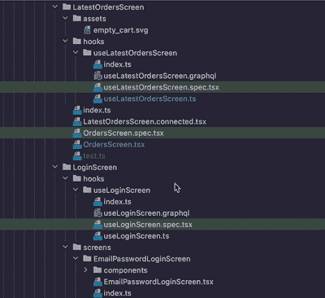
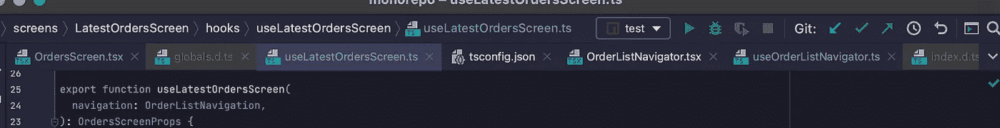

# 使用这个简单的技巧，您的反应编码速度将翻倍

> 原文：<https://javascript.plainenglish.io/double-your-react-coding-speed-with-this-simple-trick-ca2e47d1bf97?source=collection_archive---------0----------------------->

Small reusable building blocks

如果你和 React or 或者 React Native 一起工作，感觉你的编码速度很慢，花时间去捕捉错误，而不是添加新的特性，处理长的源文件并且很难找到东西，并且一遍又一遍地实现相同的逻辑，如果你把你的代码重构成**可重用的**构建块，你的编码速度会加倍。

> 有了可重用的 React 组件(和钩子),构建令人敬畏的东西是微不足道的。这就像把乐高积木拼在一起。👍
> 
> — [科里豪斯](https://medium.com/u/e986f7cdb458?source=post_page-----ca2e47d1bf97--------------------------------)，[设计可重复使用的反应元件](https://medium.com/@housecor/designing-reusable-react-components-1cbeb897b048)

# 你将如何学习

我们将看看像您这样的开发人员编写的反应组件。**我们将一步一步重构**使其更上一层楼。期待收到**许多真知灼见**，这会提高你的反应编码速度。

> 重构，重构，重构——这很正常；您必须多次更改代码；这是一个自然的学习过程。
> 
> — [托马斯·埃格林斯卡斯](https://medium.com/u/ac4e83345a52?source=post_page-----ca2e47d1bf97--------------------------------)，[与 React 共事一年后，我学到的最重要的一课是](https://medium.com/free-code-camp/mindset-lessons-from-a-year-with-react-1de862421981#3bb9)

*   本文将包含大量的反应代码。不要害怕代码。花点时间阅读和理解它。**如果您在评论**中有任何问题请随意提问，我将 10 次回复 10 次。
*   这是一篇大文章。内容全面。请随意将本文保存在您的标签中**并尝试多次阅读**。
*   即使代码将在 React Native 中，您也可以很容易地使用本文来提高您的 React 技能。

祝你好运，玩得开心！

# 我们将重构的原始反应组件

像您这样的开发人员编写的简单组件。它的功能是什么:

*   从后端获取浏览器列表
*   正在加载时，在屏幕上显示“加载”状态
*   以卡片列表的形式显示加载的浏览器
*   当用户按下一张卡片时，它会显示一个带有详细浏览器描述的模态窗口

## 这个代码看起来像你的代码吗？

# 这个组件的优点是什么

*   它的工作原理，例如:列表将被下载并显示给具有上述所有功能的用户。
*   它使用反作用钩。

# 这个组件的缺点是什么

该组件是一个**整体**，例如:该组件被设计和制造成只在一个应用程序中的一个地方使用一次。

**记住这句口头禅:**

> 成为快速开发人员的艺术是编写**可重用**构件的艺术。

**你的组件和功能越可重用，你就越快。这给了你巨大的优势**:

*   你花在输入代码上的时间更少了。可重用的组件/功能可以隐藏大量的代码，并且可以使用 100 次。并且您只需要实现它们一次。想象一下，每次使用“fetch(URL)”时都要实现 HTTP 协议，这会降低您的速度。
*   你花在输入代码上的时间甚至更少。将新特性添加到一个地方比添加到 10 个不同的地方要快。如果你重用你的构建模块，你就有一个地方来添加你的功能。在一个地方添加一个特性，在任何地方都可以得到结果。
*   你花在捕捉 bug 上的时间更少了。您将使用已经尝试和测试过的构建块。新代码需要测试，但旧代码可以信任。
*   **你花更少的时间阅读代码**。如果您重用一个构建块，它可以节省您理解代码的时间。从熟悉的部分构建程序很容易。
*   你花在阅读代码上的时间就更少了。分离的可重复使用的构建模块可以在不同的文件中移动，这样你就可以使用更小的模块，屏幕上的代码也不会那么混乱。这将提高你对代码的理解。

> 作为一名开发人员，通常会花更多的时间来弄清楚代码是做什么的，而不是实际编写代码。
> 
> –[Alexis Mangin](https://medium.com/u/f9f631989d8e?source=post_page-----ca2e47d1bf97--------------------------------)，[React 开发者为什么要模块化他们的应用？](https://medium.com/@alexmngn/why-react-developers-should-modularize-their-applications-d26d381854c1)

*   你为你的可重用构建模块编写更少的测试。测试让你的生活像蜂蜜一样甜，但是用一块巨石，你会发现自己一次又一次地测试同样的逻辑。更多可重用的构建模块=更少的测试。

> Monolith =慢速编码
> 
> **可重用**积木=快速编码

# 如何让这 100 行代码更加可重用

让我们先尝试一些非常基本和简单的东西，然后再学习高级的东西。我们如何能够在多个地方使用这 100 条线路？

# **将常量移动到组件的道具上**

我们将 URL 常量移动到 props，并且已经可以使用不同的 URL 重用浏览器组件。重用影响肯定很小，但是很容易实现。

热身？那我们试试真正酷的东西吧。

# 分离业务逻辑和视图逻辑

> 当 UI 组件不知道网络、业务逻辑或应用程序状态时，生活会更简单。给定相同的属性，总是呈现相同的数据。
> 
> ——[埃里克·艾略特](https://medium.com/u/c359511de780?source=post_page-----ca2e47d1bf97--------------------------------)，[反应过来](https://medium.com/javascript-scene/the-missing-introduction-to-react-62837cb2fd76)的失踪介绍

**这是本文**最重要的部分。如果你只能学会一件事，那就顺其自然吧:

> 成为快速反应开发人员的艺术是将业务逻辑与视图逻辑分离的艺术。

哇，如此复杂的尖峰！别害怕，我会指引你。

**业务逻辑:**做决策和存储状态的东西，例如:上面的< Browsers / > body 中的一切都返回。

**视图逻辑:**在屏幕上显示状态并读取用户输入的所有内容，例如:返回的所有内容(…)

让我们向前迈出一小步，将我们的组件分成两部分，然后检查它将如何使我们的代码更加可重用。

**我们将做什么:**

*   为我们的业务逻辑创建了一个自定义的 React hook useBrowsers()
*   为我们的视图逻辑创建了一个 React 组件

好吧，我们正在前进，我们的代码远非完美，但它变得更加可重用:

*   我们可以将<browserslist>用于不同的数据源。以前，我们只能使用来自远程 HTTP 端点的数据；但是现在我们可以从内存/光盘/或任何其他地方获得它。</browserslist>
*   我们可以在不同的屏幕上使用 useBrowsers()，甚至不使用任何屏幕。例如，我们可以在具有不同设计的不同应用程序中使用 useBrowsers()。

但这种分裂远非完美！**我们仍然可以让这些代码更加可重用。**

> 可重用的构建模块=快速编码

# 将你的代码分成许多小的可重复使用的文件

重要的事情先来。将整块分割成两部分为重构提供了新的可能性。如果把我们的代码分成不同的文件/模块，我们可以使我们的程序更具可读性(你也更快)。这将允许我们孤立地考虑每个模块**。**并使每个模块更具可读性和可重用性。

Typical React project file structure

这是一个典型的 React 项目文件结构:

*   index.js 从 Browsers.jsx 导出
*   “组件”和“挂钩”文件夹存储与<browsers>组件相关的构建模块。</browsers>
*   jsx 还可以将演化成一个包含相关“钩子”、“组件”和索引的文件夹

**React 项目文件结构是递归树**。

Possible recursive React project structure

在 David Gilbertson 的文章中阅读更多关于 React 项目结构的信息:

 [## 构建 React 应用程序的 100%正确的方法(或者为什么没有这样的东西)

### 当涉及到构造一个 React 应用程序时，理想的结构是这样的，它允许你用…

medium.com](https://medium.com/hackernoon/the-100-correct-way-to-structure-a-react-app-or-why-theres-no-such-thing-3ede534ef1ed) 

让我们检查我们的 BrowsersList.jsx

啊，是啊，代码少多了。感觉不那么杂乱。现在我们可以专注于重构这部分代码了。

> 减少屏幕上的混乱=快速编码

但是在我们提高这个组件的可重用性之前，让我先解决当前设计的一个大问题。

# **大问题与**许多可重复使用的小文件

查看我们的<browserslist>功能签名:</browserslist>

*   如果我们重命名一些属性，例如，将“changeDescription”重命名为“setSelectedBrowser”，或者将“Description”重命名为“Browser”
*   或者是否会删除一些道具
*   或者会增加新的道具

然后每个我们用<browserslist>的地方都会破！</browserslist>

每次更改组件的签名时，都会破坏代码中使用该组件的每个位置。而且你会经常改变签名，很难在第一天就做出一个完美的签名，例如:**设计经常出现在你的打字代码**中。因为我们专注于制造大量高度可重用的组件，我们将在许多地方获得突破。

您的 IDE 不能通过自动重构来重命名这样的属性。你将需要手工做它。手动检查每个使用场所。这是慢速编码。

最糟糕的是，我们将会得到休息，而自己却不知道。抓住机会的唯一方法是:

*   运行我们的应用
*   手动导航到损坏的组件
*   撞车了
*   阅读崩溃文本
*   修复错误，然后重试

这是一项缓慢而乏味的任务。这就是令人讨厌的 bug 进入生产的方式。这种情况经常发生。

检查我们的 Browsers.jsx，是不是坏了？

谁知道呢！为了确保这一点，我们需要打开 BrowsersList.jsx 和 useBrowsers.js 并手动比较参数。

这个代码是不是被破解了？

是的。useBrowsers.js 中的“descripton”少了“I”，这是个错别字。

**许多初级开发人员花费大量时间调试他们的应用**，试图找出哪个道具坏了，或者哪个道具收到了不正确的数据(字符串而不是数字)。但是这个问题有一个快速的解决方案。

# 用 JavaScript 停止慢速编码，用 TypeScript 开始快速编码

现在是 2021 年，每个 React / React 本地开发人员都应该使用 TypeScript。没有任何理由不使用 TypeScript。

> 这看起来可能很吓人
> 
> 对我们来说，TypeScript 的好处大大超过了它确实存在的缺点。我们最关注的是额外的培训费用。
> 
> 这个问题最明显的解决方案是逐步引入特性——您可以简单地启用 TypeScript，而无需更改任何代码，添加一些简单的类型声明。最后，我们的经验是，使用最基本的 TypeScript 可以获得很多好处。
> 
> — [菲利克斯·里瑟伯格](https://medium.com/u/23626b04abce?source=post_page-----ca2e47d1bf97--------------------------------)，[空闲时打字稿](https://slack.engineering/typescript-at-slack/)

# 酷炫的打字稿功能

**更少的虫子。更少的错误=更快的编码**

TypeScript saves you from bugs

我们发现了我们的“I”错别字:

TypeScript Magic highlights errors

您的 IDE 将收到 React props 的自动完成特性。当您使用带有未知属性的第三方组件时，这尤其可以节省您的时间:

TypeScript Magic autocompletes props

**您的创意将获得“重构名称”功能。这会节省你重命名道具的时间。一个道具的所有使用都将在一次点击中自动重命名。**

**您再也不会忘记添加空/未定义的检查。**

? — means that the parameter can be undefined

**当然，如果我们试图将无效数据放入我们的道具中，我们会得到一个错误高亮:**

TypeScript Magic checks if props are correct

TypeScript 很容易为您节省大量时间和调试代码的压力。

> JavaScript =慢速编码
> 
> 快速编码

# 快速系统设计的第一步:定义你的类型。

*这不是一个全面的 TypeScript 教程。如果你觉得卡住了，请参考*[*typescriptlang.org*](https://www.typescriptlang.org/docs/handbook/basic-types.html)*然后回来。*

让我们回到我们的<browserslist>组件，为它的 props 定义一些类型(不要忘记把你的文件从。jsx 到。tsx)。</browserslist>

并更新我们的 useBrowsers()签名:

现在，TypeScript 将验证 useBrowsers()和 BrowsersList **是否兼容**。如果我们改变 BrowsersList 属性，我们将得到一个错误。仅此一点就保证了产品中的 bug 大大减少。

> 更少的错误=更快的编码

# 快速系统架构

BrowsersListProps 目前看起来很乱:

*   组件应显示加载状态。在类型定义中使用一行。
*   应该显示浏览器列表[]。在类型定义中使用一行。
*   应该显示一个带有详细浏览器描述的模式窗口。**在类型定义中使用 4 行**。这些行限制我们在模态窗口中显示“描述”字段。而且**感觉**我们可能需要在这种模式下显示更多的浏览器字段。请记住，**更改组件签名非常昂贵/缓慢。**

我们可以做一个幸运的猜测，缩短我们的类型定义，重构“模态窗口”特性以使用浏览器类型。

这将降低道具的复杂性:

TypeScript Magic checks if a signature is correct

这个小的重构练习应该向您展示 TypeScript 的另一个显著特征:快速系统设计。

编写类型非常容易。它们实际上很小(4 行类型与 60 行实际组件),但是包含了大量关于系统的信息。因此，您可以编写一些类型并设计您的程序，而无需实际编写任何代码。这为您节省了大量的**架构**时间。这允许你的设计从使用中**浮现**，并且快速浮现。

> 任何系统设计的第一步:定义你的类型。
> 
> 使用 TypeScript 类型的架构和规划=快速编码

# **定义好类型后，你可以开始填充组件的主体**

让我们修复我们的<browserslist>,让它处理一个新的 BrowsersListProps 签名。我们可以重构<browseritem>，这样就只需要 2 个道具，而不是过多的道具。这将使代码可读性更强，速度更快。</browseritem></browserslist>

> 如果你的组件有很多道具，这是一个很好的重构暗示

这个组件已经看起来可读性很强，不那么可怕了。

> 减少屏幕上的混乱=快速编码

# 从<browserslist>中提取可重用的<uifriendlylist>逻辑</uifriendlylist></browserslist>

仅仅通过观察一个组件，开发人员就能获得许多不同的感受。比如我感觉<browserslist>中的“显示列表的加载状态”就是一个很酷的功能。太酷了，以至于它很有可能被用在许多不同的组件中。</browserslist>

现在我们有所进展。我们发现了一些黄金。这可能是我们的应用程序的一个非常有用和可重用的功能。但是目前，**与< BrowsersList / >组件耦合在一起，我们不能在不同的地方重用它。让我们修理它。**

我们想做一个新的<uifriendlylist>，用它代替简单的<flatlist>。该<uifriendlylist>将具有显示装载状态的能力。</uifriendlylist></flatlist></uifriendlylist>

像往常一样，我们首先定义一些类型:

*   “T”是一个类型参数。带参数的类型称为[泛型](https://www.typescriptlang.org/docs/handbook/generics.html)。“UIFriendlyList < T >的“T”与函数“foo(arg)”的“arg”是相同的。如果你想从另一个类型构造你的类型，你可以使用泛型。更多信息请查看罗斯·布拉特的这篇文章:

 [## 解释了类型脚本泛型

### 了解什么是泛型以及如何在 Typescript 中使用泛型

rossbulat.medium.com](https://rossbulat.medium.com/typescript-generics-explained-15c6493b510f) 

*   “&”是[交集](https://www.typescriptlang.org/docs/handbook/unions-and-intersections.html#intersection-types)。“类型 X = A & B”意味着 X 将包含 A **和** B。

检查此动力移动:

*   我们为我们的属性 UIFriendlyListProps 定义了类型。
*   我们定义了一个[泛型](https://www.typescriptlang.org/docs/handbook/generics.html)类型，例如:列表可以包含任何类型的内部条目。
*   UIFriendlyListProps 用我们的“加载状态”特性扩展了 React 本机库中的 FlatListProps
*   所以我们从 FlatListProps 和{loading？:布尔}

多酷啊。

我对这个设计很满意，让我们制作这个组件的主体，并将其移动到另一个文件 UIFriendlyList.jsx 中

我们还添加了一个空状态。因此用户可以确定列表是空的，并且没有等待数据到达。非常友好的用户界面功能。

> <uifriendlylist>是一个高度可重用的组件，将来肯定会节省我们的时间。有了这个组件，我们成为了一个反应更快的开发人员。</uifriendlylist>

现在，让我们检查一下我们的<browserslist>:</browserslist>

这就是我所说的。这个组件比[原来的 BrowsersList](https://gist.github.com/aleksejkozin/98ebb0c3fc826c23bbd9afc30cfda24f) 更容易理解。我们得到了一个可重复使用的< UIFriendlyList / >,这肯定会节省我们的时间。我们可以更进一步，假设我们想要重用 ModalWindow+List 逻辑，但让我们就此打住。

这个“提取可复用部件”的过程，**永无止境，耗费时间**。如果你觉得你可以在另一个地方度过更有成效的时间，你应该停下来。

> 我们人类倾向于将编写代码作为一种拖延的形式。通过解决未来的假设问题来推迟解决我们现在的难题。
> 
> —[Justin Travis Waith-Mair](https://medium.com/u/c2cca5f47e14?source=post_page-----ca2e47d1bf97--------------------------------)，[停止编写可重用的 React 组件](https://medium.com/the-non-traditional-developer/stop-writing-reusable-react-components-bd649cba2700)

我们已经完成了视图逻辑，是时候检查 useBrowsers()钩子中的业务逻辑了。

# 重构 useBrowsers()钩子中的业务逻辑

> 就像组件一样，我们可以创建定制的可重用钩子。这使得代码可读性更好，因为代码库被分成了更小的、可重用的块
> 
> –[Bikash Paneru](https://medium.com/u/9cf5c71f047d?source=post_page-----ca2e47d1bf97--------------------------------)，[如何在 React 中写出更好的功能组件](https://medium.com/better-programming/how-to-write-better-functional-components-in-react-bc974f777145)

让我们重构 useBrowsers()以返回一个有效的 BrowsersListProps 对象。我还重构了“loading”:现在它会在 fetch 之前设置为“true”，之后设置为“false”。

看起来很好，但我们可以更深入，提取一个可重复使用的构建模块。这种“获取 URL 并将结果存储在一个状态中，同时显示加载”的事情看起来像是一个高度可重用的构建块。我们希望**将**从 useBrowsers()中分离出来。

像往常一样，让我们从定义一些类型开始。我们希望使用 useFetch()钩子，它可以在一个状态中存储获取的数据，还可以指示加载。我们还想将从端点获取的数据定义为 FetchBrowsersResults:

看起来不错，现在让我们定义 useFetch()主体并将其移动到专用文件 useFetch.ts:

我还添加了一个获取异常警报。因此，用户将看到错误描述。

> useFetch()是一个高度可重用的函数，将来肯定会节省我们的时间。有了这个功能，我们成为了一个反应更快的开发者。

现在让我们重构 useBrowsers()钩子:

与[最初的 useBrowsers()](https://gist.github.com/aleksejkozin/98ebb0c3fc826c23bbd9afc30cfda24f) 相比，它要小得多，也容易理解。

我看不出还有什么可重用的逻辑可以从这个组件中提取。所以让我们更进一步。

# 如何成为一名反应更快的开发人员的 4 个简单技巧。

我们已经完成了主要部分，让我们放松一下。我会给你 4 个简单的建议。

# 1.永远不要手工格式化你的代码

您的 IDE 应该为您提供“自动重新格式化代码”功能。您的 React 项目应该包含. eslintrc.js 和. prettierrc.js 文件。他们配置林挺(红线)和代码风格。您应该可以通过按热键来应用这些梯框:

Auto reformat feature

# 2.切勿手动导入模块

您的 IDE 应该为您提供“自动导入”功能。从不键入"../../../"手动输入，或者手动输入/删除导入来浪费您的时间。

检查“自动导入”功能的运行情况:

Add all missing imports feature

# 3.像专业人士一样跳来跳去

如果你用小的可重用部件来构建你的项目，你将会有许多小的可重用文件和组件。你很快就会明白，用“鼠标和打开的标签”导航和“在文件列表中选择一个文件”变得几乎不可能。

检查这个微型移动应用程序的巨大文件结构:

The huge file structure of a React app

你知道试图在你的标签中找到正确的文件的痛苦吗？

10 tabs open, where is the file I’m looking for?

您的 IDE 应该为您提供这些有用的工具:

*   通过搜索字符串跳转到文件
*   通过搜索字符串跳转到组件
*   跳转到以前打开的文件
*   跳转到光标下的组件定义
*   跳转到组件使用

研究你的 IDE 的热键。这会让你的开发者体验像黄油一样顺滑。

# 4.使用林挺 ESLint

每个 React 开发者都知道错误的 useEffect/Memo/Callback hook 依赖的痛苦。他们总是很难发现错误:

Finding these errors without linting is very hard

ESLint 允许毫不费力地缓存这些错误。

> eslint 和 typescript 等开发工具有助于在大型团队中维护代码库。一个好的开发人员知道如何编码。一个优秀的开发人员知道如何在团队中工作。
> 
> — [罗曼·阮](https://medium.com/u/97cb4df60473?source=post_page-----ca2e47d1bf97--------------------------------)，[设计您的 React 应用程序。需要注意的发展和商业前景](https://blog.usejournal.com/architecting-your-react-application-5af9cd65a891)

所有这些功能在 Webstorm IDE 中都可以使用。我推荐你使用 Webstorm 进行 TypeScript React 开发。

# 结论:制作可重复使用的积木的艺术

> 成为快速开发人员的艺术是编写**可重用**构件的艺术。

要想快速，您需要:

*   将业务逻辑与视图逻辑分开
*   使用 TypeScript 会遇到较少的错误
*   使用类型脚本启用强大的 IDE 功能:林挺、名称重构、自动完成
*   在为快速架构设计编写代码之前定义类型脚本类型
*   将你的代码分成许多小的可重复使用的文件以减少混乱
*   要求您的 IDE 格式化代码并导入模块
*   使用热键在文件间跳转
*   练习重构

我们已经成功重构了我们的<browsers>组件。检查最初的浏览器组件:这是一个巨大的、难以理解的整体。像这样的代码感觉很重，会降低我们的速度。</browsers>

看着这个轻如鸿毛的美女:

我们制作了一个易于理解的 component + extracted 2 个非常方便的高度可重用的部分:

*   useFetch()

我们可以在应用程序的不同地方使用这些部件，甚至可以在不同的应用程序中使用。这肯定会加快我们的开发过程。

# 摆弄文章中的代码

检查 Codesandbox 游戏中的[最终结果](https://codesandbox.io/s/browsers-refactor-00x9b)以进行游戏并了解更多信息。这段代码是用 React 编写的，与本文中的 React 原生代码有所不同。

# 下一步是什么

*   大量阅读
*   多多练习
*   提问。**特别是**在这篇文章下的评论区

**最后也是最重要的:**

*   自动测试 React 组件
*   实践 TDD

测试部分跳进去会觉得很混乱，但是会让你的生活甜得像棒棒糖。查看伊恩·威尔逊的这篇文章，这是开始你的测试之旅的好地方:

 [## 如何用 TDD 和 React 测试库构建健壮的 React 应用

### 当我开始学习 React 时，有一件事让我很纠结，那就是用一种既有用又…

medium.com](https://medium.com/free-code-camp/how-to-build-sturdy-react-apps-with-tdd-and-the-react-testing-library-47ad3c5c8e47) 

每天训练你的手艺，假以时日，你会成为大师。

祝你好运，玩得开心！