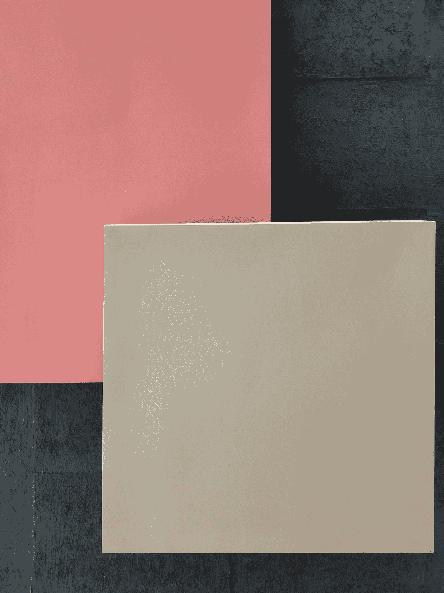
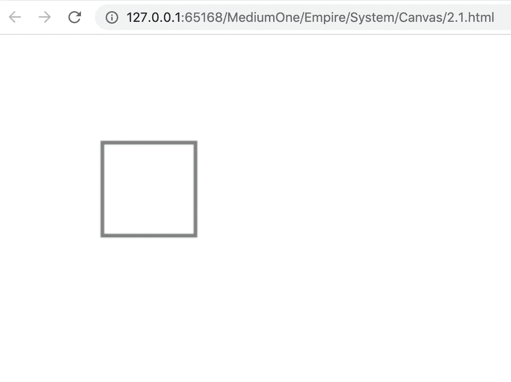
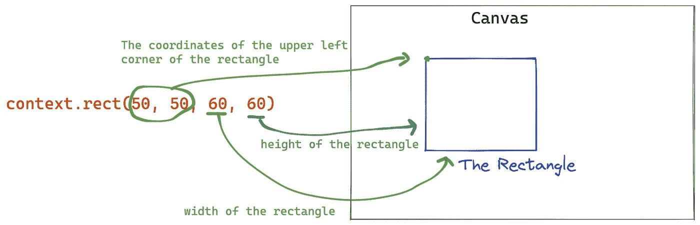
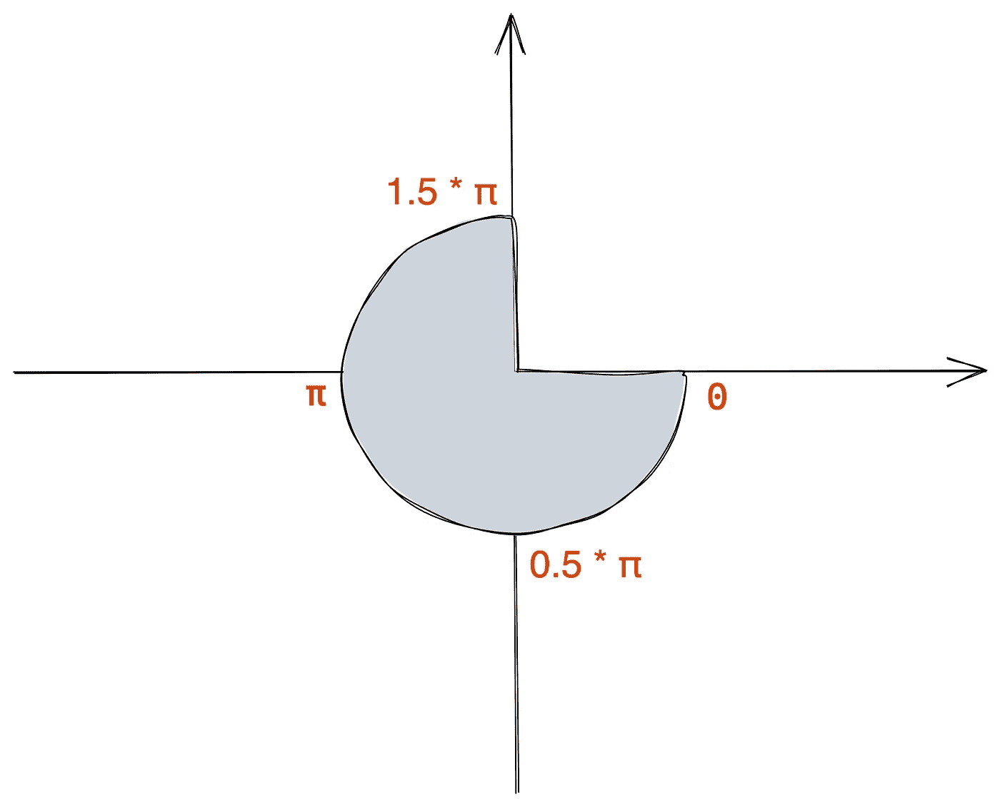
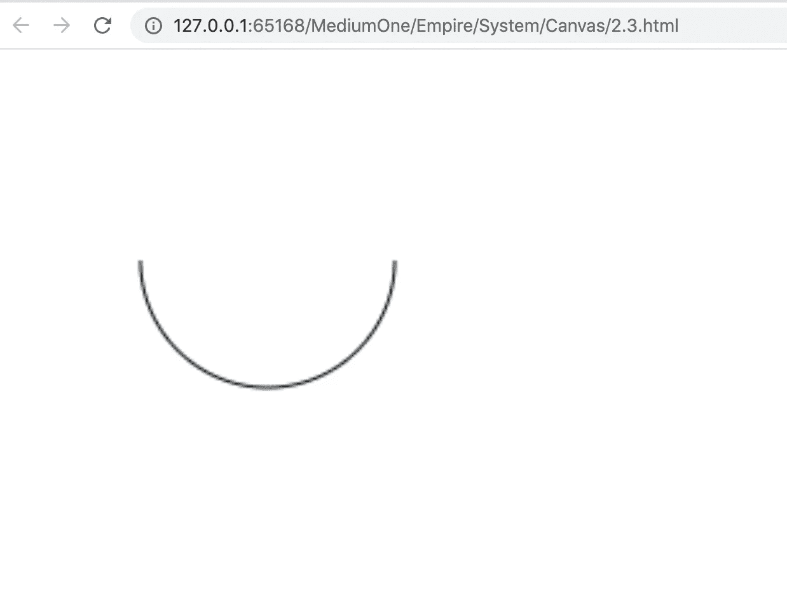
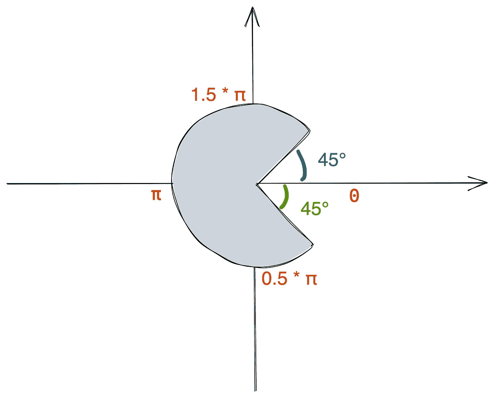
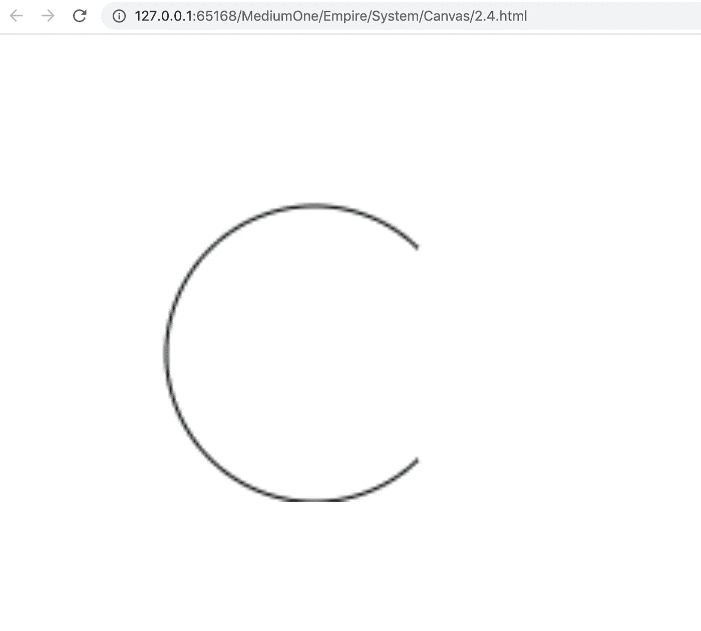
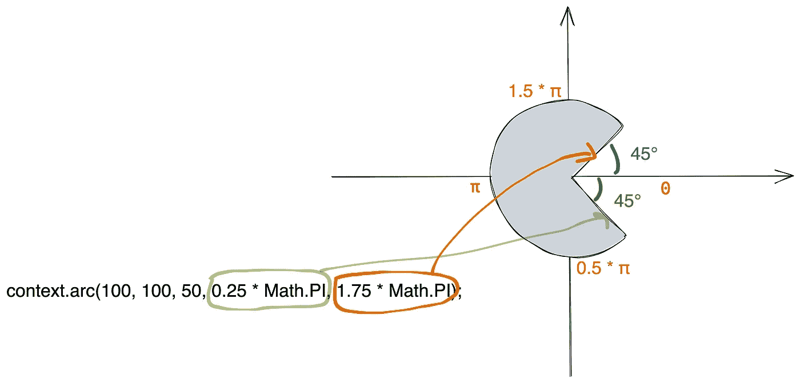
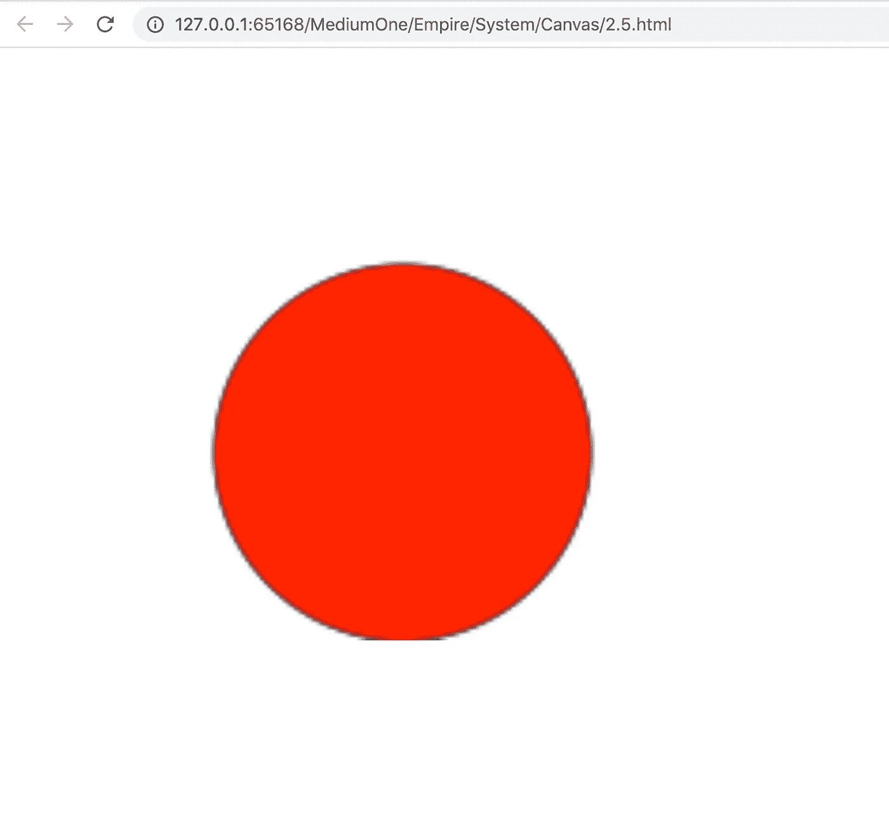

# 在画布上画矩形和圆形

> 原文：<https://javascript.plainenglish.io/draw-rectange-and-circle-in-canvas-e7594e77a8e8?source=collection_archive---------5----------------------->



Photo by [Vineet Sharma](https://unsplash.com/@vineetforever?utm_source=medium&utm_medium=referral) on [Unsplash](https://unsplash.com?utm_source=medium&utm_medium=referral)

[在上一篇文章](https://bytefish.medium.com/basic-usage-of-canvas-54e3afb8aa54)中，我们介绍了如何绘制线段。现在我们想画一个长方形，那么应该怎么做呢？

实际上，矩形是由四条线段组成的。我们只需要画四条首尾相连的线段，并确保它们之间的角度为 90 度。

代码如下:

结果:



但实际上有一种直接用来在上下文对象中画矩形的方法，叫做`context.rect(`)。用这个 API 画矩形更方便。

该方法接收四个参数:



代码片段:

```
let canvas = document.getElementById("canvas");
let context = canvas.getContext("2d");context.rect(50, 50, 60, 60);
context.strokeStyle = 'black';
context.stroke();
```

# 画圆

`arc()`方法创建一个弧/曲线(用于创建一个圆或圆的一部分)。

```
context.arc(x,y,r,sAngle,eAngle,counterclockwise);
```

*   x:圆心的 x 坐标
*   y:圆心的 y 坐标
*   r:圆的半径
*   桑乐:起始角度，以弧度表示(圆弧圆的三点钟位置为 0 度)
*   eAngle:结束角度，以弧度为单位
*   逆时针:可选。指定是逆时针还是顺时针绘制。`false`是顺时针，`true`是逆时针



示例:

结果:



如果我们想在画布上画出这个形状的图形，应该怎么做？
*(假设此圆弧的中心坐标为(100，100)，半径为 50。)*



从图中可以看出，如果顺时针计算，这条弧的起始弧为 45°或 0.25 * π，终止弧为 360°-45°，即 315°或 1.75π，可以这样画:

```
context.arc(100, 100, 50, 0.25 * Math.PI, 1.75 * Math.PI);
```

结果:



解释:



之前我们画了圆弧，那么现在我们想画一个完整的圆，应该怎么做？很简单，我们只需要画一个 0°到 360°的圆弧。

结果:



*更多内容请看*[***plain English . io***](http://plainenglish.io/)