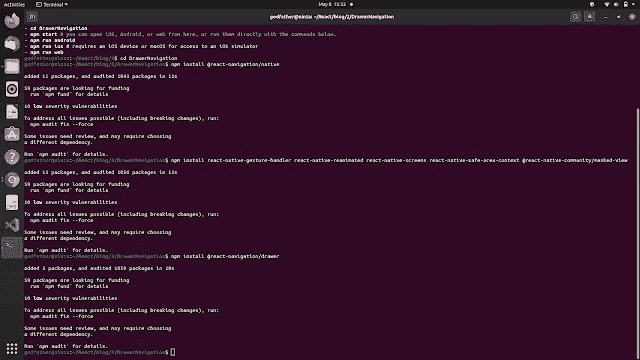

# React Native Expo 中的抽屉导航(带源代码)

> 原文：<https://javascript.plainenglish.io/drawer-navigation-in-react-native-expo-with-source-code-426055f7e9f4?source=collection_archive---------1----------------------->

## 如何使用 React Native Expo 添加抽屉导航

您好，React 原生开发者！

导航是手机 app 开发的重要组成部分。在上一节中，我们知道了如何在 React Native 中实现底部选项卡导航。在这一部分，我们将了解抽屉导航以及抽屉导航在 React Native Expo 中的工作原理。它既适用于 Android 设备，也适用于 IOS 设备。

我们开始吧！


Photo by [AltumCode](https://unsplash.com/@altumcode?utm_source=medium&utm_medium=referral) on [Unsplash](https://unsplash.com?utm_source=medium&utm_medium=referral)

如果您正在寻找视频教程，那么它就在这里:

# React Native Expo 的设置和安装

1.制作一个你选择的目录。说“测试”。

2.在“test”目录下打开终端或命令提示符，编写命令:`**expo init DrawerNavigation**`

3.选择空白模板并按回车键。等到下载完所有的 javascript 依赖项。

4.下载完成后，导航到文件夹“DrawerNavigation”。

5.在“DrawerNavigation”文件夹中安装以下依赖项。

```
**npm install** [**@react**](http://twitter.com/react)**-navigation/native****npm install react-native-gesture-handler react-native-reanimated react-native-screens react-native-safe-area-context** [**@react**](http://twitter.com/react)**-native-community/masked-view****npm install** [**@react**](http://twitter.com/react)**-navigation/drawer**
```

6.在安装完所有的依赖项之后，您将会看到类似这样的内容。



# 抽屉导航代码

打开 **App.js** 。导入以下包:

```
import { createDrawerNavigator } from '@react-navigation/drawer';import { NavigationContainer } from '@react-navigation/native';
```

现在出于测试目的，我们想使用抽屉导航来导航到两个屏幕。因此，在“DrawerNavigation”文件夹中创建一个名为“Screens”的目录。在“屏幕”文件夹中，制作两个文件， **Home.js** 和 **Settings.js** 。
将下面的代码粘贴到 **Home.js** 中:

```
import React from 'react'import { StyleSheet, Text, View } from 'react-native';export default function Home() {return (<View  style={{ flex: 1, alignItems: 'center', justifyContent: 'center' }}><Text>Home Screen</Text></View>)}
```

将以下代码粘贴到 **Settings.js** 中:

```
import React from 'react'import { Text, View } from 'react-native';function Settings() {return (<View  style={{ flex: 1, alignItems: 'center', justifyContent: 'center' }}><Text>Setting Screen</Text></View>)}export default Settings
```

我们希望在两个屏幕上都有一些基本的视图。我们完成了这一部分。现在返回 App.js 并导入两个屏幕。

```
import HomeScreen from './Screens/Home'import SettingsScreen from './Screens/Settings'
```

嗯，我们的主应用程序还不知道这两个屏幕。所以，写点什么吧。

```
const Drawer = createDrawerNavigator();export default function App() {return (<NavigationContainer><Drawer.Navigator initialRouteName="Home"><Drawer.Screen name="Home" component={HomeScreen} /><Drawer.Screen name="Settings" component={SettingsScreen} /></Drawer.Navigator></NavigationContainer>);}
```

我们将初始路由设置为归属路由。最后，在终端或命令提示符下使用“npm start”运行应用程序。在构建之后，我们会看到类似这样的东西。

这是简单的 JavaScript 代码。如果有任何困惑，请查看 [Github 代码](https://github.com/imrohit007/Drawer-Navigation-in-React-Native-Expo),或者您可以在下面评论。

谢谢你。

你好，我叫 Rohit Kumar Thakur。我对自由职业持开放态度。我构建了 **React 本地项目**，目前正在开发 **Python Django** 。随时联系我(**freelance.rohit7@gmail.com**)。

*更多内容看* [***说白了. io***](http://plainenglish.io/) ***。*** *报名参加我们的* [***免费每周简讯点击这里***](http://newsletter.plainenglish.io/) ***。***