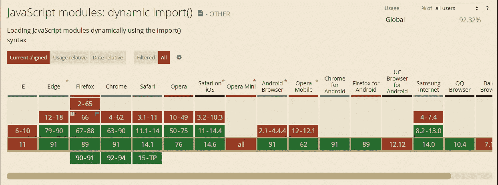

# 用例子解释 JavaScript 中的动态导入

> 原文：<https://javascript.plainenglish.io/dynamic-imports-in-javascript-explained-with-examples-c2122743e5ac?source=collection_archive---------4----------------------->

## 如何在 JavaScript 中轻松使用动态导入？


Image created with ❤️️ By author.

动态导入是 JavaScript ES2020 规范的一大特色。它们是使 ES6 模块更加动态、强大和高性能的一种方式。除此之外，它们允许您在需要时有条件地导入模块。

在本文中，我们将通过与 ES6 静态导入的比较来了解动态导入。让我们开始吧。

# 静态进口

ES6 模块中使用的语法是静态的。这意味着当你从一个特定的文件中导入一段代码时，无论你是否使用它，这个文件都会被加载。

这对性能不好，因为有时您从中导入代码的文件可能非常大。所以浏览器必须下载那个大文件。因此，这将影响性能和加载时间。

让我们看一个简单的例子来展示静态导入是如何工作的:

我们将创建一个按钮，当你点击它时显示文本。我们需要建立一个包含 3 个文件的项目(`index.html`、`index.js`和`app.js`)。

首先，我们需要创建 HTML 文件并将 JavaScript 文件与它链接起来:

```
<!DOCTYPE html>
<html lang="en"><head>
    <meta charset="UTF-8">
    <meta http-equiv="X-UA-Compatible" content="IE=edge">
    <meta name="viewport" content="width=device-width, initial-scale=1.0">
    <title>Document</title>
    **<script type="module" src="index.js" defer></script>
    <script type="module" src="app.js" defer></script>**
</head><body>
    **<button>Show Text</button>
    <div class="text"></div>**
</body></html>
```

在文件`app.js`中，我们将创建一个函数，将文本添加到具有 HTML 中的类`text`的 div 中。然后我们将使用 ES6 `export default`导出该函数，以便稍后在`index.js`导入。

```
*//app.js* const textDiv = document.querySelector('body .text');function showText(){
    textDiv.innerHTML = "Hello World!";
}**export default** showText;
```

现在，我们将转到文件`index.js`并创建一个单击事件，以便在我们单击按钮时调用函数`showText`。所以我们将使用静态 ES6 导入，以便从`app.js`导入函数`showText`。

```
*//index.js* //Import the function showText from app.js using a static import
**import showText from "./app"**//select the button element.
const btn = document.querySelector('body button');//Add the click event & provide showText as a callback.
btn.addEventListener("click", **showText**)
```

现在，无论何时单击该按钮，文本`Hello World`都会显示在页面上。如您所见，我们使用了静态导入，我们的功能运行良好。然而，静态导入的问题是，无论您是否使用它，浏览器总是在加载时下载导入的代码。

在这种情况下，浏览器将在加载时下载文件`app.js`,即使它的代码尚未执行。这不好，想象一下如果文件非常大。这可能会影响网站的性能和加载时间。这就是动态导入发挥作用的地方。

# 动态导入

正如我所说的，动态导入允许我们在需要时有条件地导入模块。

所以为了动态地导入一个模块，你必须像这样调用关键字`import`作为一个函数:`import("./path.js")`并且你传递它你的文件的路径，我在这里用`"./path.js"`只是作为一个例子。所以你必须走自己的路。

另外，记住函数`import('')`返回一个承诺。这意味着你可以对它使用语法`.then`和`.catch`。

这里有一个例子:

```
**import**('the path here')
  .**then**(module => {
    //do something.
  }).**catch**(err => console.log(err.message));
```

现在在一个实例中使用动态导入。我们将使用上面创建一个按钮的同一个例子来尝试一下，当你点击它时，这个按钮会显示文本。

所以我们将创建我们的 HTML 文件并在`app.js`中导出函数`showText`，就像我们在上面的静态导入示例中所做的那样。然后我们将转到文件`index.js`并在那里使用动态导入。

因为负责动态导入的导入函数返回一个承诺，所以我们可以对它使用 async 和 await 语法。

下面是一个例子:

```
*//index.js**//select the button element.*
const btn = document.querySelector('body button');*//using a dynamic import with async/await to import showText function.* btn.addEventListener("click", **async**() =>{
    const **showText** = **await** **import("./app.js")**;
    **showText()**;
})
```

现在，功能按预期运行，一旦我们单击按钮，文本就会显示出来。但是在这个例子中使用动态导入的好处是，只有当我们点击按钮时，浏览器才会下载导入的文件`app.js`。它不会总是在加载时下载。

所以这是一种在你只需要的时候加载内容的更有效的方式。这就是我喜欢动态导入的原因。

# 何时使用动态导入？

首先，动态导入不能替代静态导入。记住这一点。仅在必要时使用动态导入是一个好习惯。

以下是一些必须使用动态导入的情况:

*   当静态导入降低了代码的加载速度时。
*   当您稍后才需要导入的代码时。
*   当静态导入增加内存使用时。
*   当导入的模块在加载时不被执行或不存在时。

# 浏览器支持

除了 IE 浏览器，其他主流浏览器都支持动态导入。所以设置起来也没那么难。



Capture by the author from [CanIUse](https://caniuse.com/?search=dynamic%20import).

# 结论

正如您所看到的，一般来说，模块对于在 JavaScript 文件之间共享代码非常有用。动态导入是一种只在需要时加载内容的方式。所以如果有必要的话，一定要使用它们。如果没有，使用静态导入总是好的。

感谢您阅读这篇文章。希望你觉得有用。

**更多阅读**

[](/7-awesome-apis-for-all-frontend-developers-a06c1057661) [## 面向所有前端开发人员的 7 款出色的 API

### 您的下一个项目可能需要的有用的 API。

javascript.plainenglish.io](/7-awesome-apis-for-all-frontend-developers-a06c1057661) [](/4-awesome-things-you-can-do-using-only-html-10ab13a245ef) [## 只用 HTML 就能做的 4 件了不起的事情

### HTML 比你想象的更有用。在以下情况下不需要 JavaScript。

javascript.plainenglish.io](/4-awesome-things-you-can-do-using-only-html-10ab13a245ef) 

*多内容于* [***浅显易懂***](http://plainenglish.io)