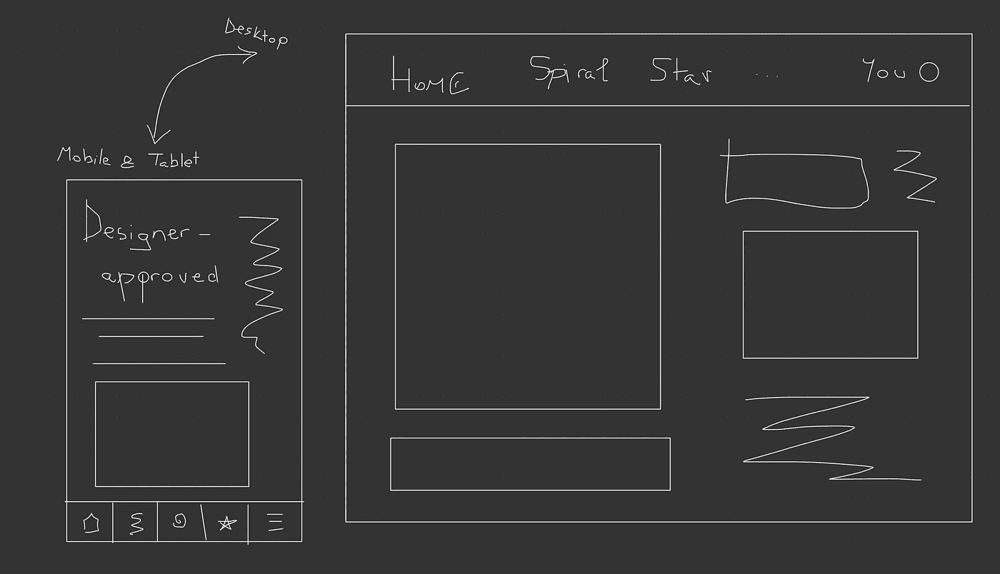

# 带有 React 和 MaterialUI 的动态导航模式

> 原文：<https://javascript.plainenglish.io/dynamic-navigation-patterns-with-react-and-materialui-2c7fe55486f7?source=collection_archive---------8----------------------->

## 如何根据用户的当前平台动态改变网站的导航模式


Photo by [Anastasia Petrova](https://unsplash.com/@anastasia_p?utm_source=medium&utm_medium=referral) on [Unsplash](https://unsplash.com?utm_source=medium&utm_medium=referral)

MaterialUI 是一个强大的 React UI 框架——公平地说，是最受欢迎的。开始使用它就像运行`npm install @material-ui/core`一样简单。但是随着你对它的功能了解越来越多，事情就变得有趣了——它的`Grid`系统只是冰山一角。

我最近做了一个有趣的任务:我重新实现了我们的应用程序的导航，使其具有响应性。最终目标当然是提供改进的 UX，因为当用户从他们的手机/平板电脑的浏览器导航网站时，他们将获得原生应用的感觉，而桌面用户将访问他们在桌面上习惯的导航风格。

起初，这似乎很奇怪:一个人怎么能做到这一点？原来没那么难啊！让我们一起浏览(双关语)完成这项任务所需的步骤。

除了`mui`依赖之外，如果你还没有添加 [React 路由器](https://reactrouter.com/web/guides/quick-start)到你的项目中，不要忘记:

```
npm install react-router-dom
```

重要的事情先来:我们今天要做的事情的一个粗略的草稿:



Don’t let our designer see this, I don’t want them to suffer

正如你所看到的:我们希望让我们的用户能够根据他们的平台不同地浏览我们的应用程序。在移动设备和平板电脑上，我们的导航将通过底部的导航条来完成——最右边的按钮会打开屏幕右侧的抽屉(例如，我注意到 MS Teams 移动应用程序正在使用这种模式)，而在笔记本电脑上，用户将导航网站的经典版本，页面显示在屏幕顶部。

我们将从确定路线开始。让我们假设在您的`routes.ts`文件中，您已经这样定义了您的路线:

在您将使用这些路线的文件中，您将以这种方式导入它们:`import * as routes from '../../path/to/routes’`。

我们将在一个开关中显示应用程序的主要内容:它的内容将根据用户导航的当前页面而变化。这种导航可以通过顶部导航栏或底部导航栏来实现。

让我们开始实现我们的主`Switch`(桌面版)。

您将把这个组件插入到内容网格项目中(或者您计划的应用程序布局)。让我向您展示这个布局组件的简化版本:

在应用程序的顶部，你会显示一个标题(它可能会包含桌面上你的页面的链接，在较小的设备上会被删除)。然后，如您所见，内容本身由页面组成，这取决于当前的路径。在你的布局底部，你会显示底部导航菜单，但只在较小的设备上。`!isDesktopOrUp`的等效版本是将菜单包装在 MUI 的`Hidden`组件中:

在指定的平台上，`Hidden`组件当然会隐藏它里面包装的东西。例如，如果你想只在平板电脑上显示一些东西，你可以这样使用它:

对于标题，您很可能希望遵循以下结构:

正如你在上面的片段中看到的，导航按钮隐藏在平板电脑和手机上——所以我们信守了我们对用户的承诺，不拥挤小屏幕，同时为每个人提供舒适的体验。

回到我们的导航:让我们实现`BottomNavigationMenu`组件。

我把组件拆下来，这样你就能得到要点:

*   您将处理当前所选导航按钮的文本和图标的颜色。
*   抽屉的可见性是通过状态控制的。
*   `handleChange`方法需要知道特殊的抽屉路径，它不会导航到任何地方。

你当然会有一个`styles.ts`文件，你可以在这里设计你的底部导航:

抽屉组件可以是 MaterialUI 的`MuiDrawer`上的简单包装器。

运行你的应用程序，缩小你的视窗:你会注意到应用程序进入“平板模式”，然后进入“移动模式”，而在你的桌面的全尺寸上，底部导航消失，你的页面名称重新出现在屏幕顶部的标题上。

我希望这对你有所帮助，希望你今天学到了一些东西。如果你卡住了或者你想补充一些东西，不要回避开始对话！我们都在一起。社区是程序员最美好的部分之一。

非常感谢你的阅读！

*更多内容请看*[***plain English . io***](http://plainenglish.io)