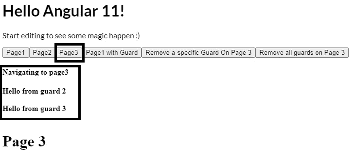

# 动态添加和删除可启用角度路由防护

> 原文：<https://javascript.plainenglish.io/dynamically-add-and-remove-canactivate-route-guards-in-angular-e7820ab4e061?source=collection_archive---------4----------------------->


每个角度应用程序都实现了通过路由表的导航。经验丰富的 Angular 开发人员意识到在路线上添加防护装置以确保路径安全的重要性。

有时，开发人员可能会要求使用相同路径到达**的某些流不会被该路径上的守卫**阻塞。很多时候，大多数开发人员通过在防护中添加额外的逻辑来实现这一点。这本身不是一个坏主意，但这意味着守卫在穿越路线时会被击中并激活，即使这不是必需的。

这就是[**AOP——路由**](https://www.npmjs.com/package/aop-routing) 库进来的地方！

## 本文将解释如何使用 aop-routing 库，在运行时轻松更新 Angular 路由表，以在导航过程中移除或添加路由上的 CanActivate 防护。

**从 Angular version 11 开始，没有在应用程序运行时动态添加或删除 CanActivate 防护的本机方法。**

如果您没有听说过 **aop-routing** 库，请在这里阅读更多关于它的内容:[Aop-routing for Angular](https://medium.com/analytics-vidhya/the-aop-routing-library-for-angular-9ada05f1741d)

*Aop-Routing 库通过简单的排版装饰器提供了在 Angular 中执行* [*命令和 Popstate 导航*](https://medium.com/analytics-vidhya/angular-routing-imperative-vs-popstate-7d254b495c54) *操作的能力，而不需要导入 Angular Router 对象。*


## 让我们从 3 个简单的步骤将 aop 库添加到我们的角度应用程序开始:

1.  将 aop 路由库安装到您的角度应用中

```
npm install aop-routing
```

2.安装库后，将 **AopRoutingModule** 添加到应用程序的顶层/根模块导入数组中。

```
imports: [
   ...
    AopRoutingModule
  ]
```

3.将 **AopNavigationService** 依赖项添加到顶级/根模块构造函数中。

```
export class AppModule {
  constructor(private navigationService: AopNavigationService) {}
 }
```

要启用 aop 路由库的动态路由表更新，请将以下对象添加到导入中的 AopRoutingModule:

```
 @NgModule({
 …
 imports: [
 …
 AopRoutingModule.forRoot({expirementNav**:** true})
 ],
 …
})
```

下面的示例源代码可以在 Stackblitz 中访问。
**源代码:**

[https://stackblitz.com/edit/aop-routing-dynamic-guards?文件=src/app/app.component.ts](https://stackblitz.com/edit/aop-routing-dynamic-guards?file=src/app/app.component.ts)

**应用**:

[https://AOP-routing-dynamic-guards . stackblitz . io](https://aop-routing-dynamic-guards.stackblitz.io)

**注意**:为了正确显示打印输出，请确保来回导航到不同的页面。例如，如果您已经在第 3 页点击了“**移除第 3 页的防护装置**”按钮，然后再次点击**第 3 页**按钮，**您将看不到输出的差异，因为角度路由引擎知道它在同一个激活的组件**上。要正确测试，请在不同页面之间来回导航，以查看正确的输出。

对于以下示例，我们将使用下面的路由表:

```
const routes: Routes = [{ path: "page1", component: Page1Component },{ path: "page2", component: Page2Component, canActivate: [TestGuard2] },{ path: "page3", component: Page3Component, canActivate: [TestGuard2, TestGuard3] },];
```

从上面的片段中可以得出以下结论:

*   页面 1 在其路由上没有保护
*   页面 2 在其路线上有 **TestGuard2**
*   页面 3 在其路线上有 **TestGuard2** 和 **TestGuard3**

下面是我们的 **app.component.ts** 和**app.component.html**

AppComponent.ts 有 3 个简单的方法，使用 aop-routing 库分别导航到页面 1、页面 2 和页面 3:

```
import { Component, VERSION } from "@angular/core";
import { RouteNext } from "aop-routing";@Component({
selector: "my-app",
templateUrl: "./app.component.html",
styleUrls: ["./app.component.css"]
})export class AppComponent {name = "Angular " + VERSION.major;@RouteNext("page1")
public goToNextPage1() {
 this.setNavigationMessage("Navigating to page1");
 this.displayService.guardMsg = "";
}@RouteNext("page2")
public goToNextPage2() {
 this.setNavigationMessage("Navigating to page2");
 this.displayService.guardMsg = "";
}@RouteNext("page3")
public goToNextPage3() {
 this.setNavigationMessage("Navigating to page3");
 this.displayService.guardMsg = "";
}}
```

app.component.html

```
<hello name="{{ name }}"></hello><p>Start editing to see some magic happen :)</p><button (click)="goToNextPage1()">Page1</button><button (click)="goToNextPage2()">Page2</button><button (click)="goToNextPage3()">Page3</button><router-outlet></router-outlet>
```

下面是 **TestGuard2** 的实现(其他守卫的实现基本相同)。当守卫被击中时，它会在屏幕上打印出友好的**‘来自守卫 x** 的问候’。

```
import { Injectable } from "@angular/core";
import { CanActivate } from "@angular/router";@Injectable({providedIn: "root"})
export class TestGuard2 implements CanActivate {public canActivate(): boolean { this.displayService.addGuardMsg('Hello from guard 2');return true;
}}
```

简单重述一下上面的代码，单击每个按钮将调用其对应的方法，这将输出消息消息'**导航到 pagex** ' ，如果该页面上有守卫，守卫将登录到屏幕'**Hello from guard x【T27]'**


# 向路径动态添加防护

让我们看看在应用程序运行时给 page1 添加一个保护是多么容易。

首先，让我们看看单击 Page1 以确定其路由上没有保护的输出。


1.  我们将创建一个名为' **Page1 with guard** 的新按钮，它将调用在 AppComponent.ts 中创建的新方法' **addGuardToPage1**

```
import { RouteNext, RouteTransform } from "aop-routing";
import { TestGuard1 } from "./pages/guards/testguard1";@RouteNext()
public addGuardToPage1() {this.setNavigationMessage("Navigating to page1 and adding guard");
this.displayService.guardMsg = "";const routeTransform: RouteTransform = {
    path: 'page1',
    canActivateGuards: [TestGuard1]
 };
return {routeTransform}}
```

2.点击新的**‘带防护装置的第 1 页**’按钮将把**测试防护装置 1** 添加到**第 1 页**并导航到它。下面是输出。


## 动态移除路线中的防护:

1.  我们将创建一个名为“移除第 3 页上的防护”的新按钮，该按钮将调用在 AppComponent.ts 中创建的新方法“ **removeGuardOnPage3** ”。该方法将从第 3 页路由中移除 **TestGuard2** ，但保留 **TestGuard3** 。

```
@RouteNext()
public removeGuardOnPage3() {this.setNavigationMessage("Navigating to page3 and removing TestGuard2 from its path");this.displayService.guardMsg = "";const routeTransform: RouteTransform = {
path: "page3",
canActivateGuards: [TestGuard2]
};return { routeTransform };}
```

让我们回想一下，当我们点击第 3 页按钮导航到第 3 页时，它将点击 TestGuard2 和 TestGuard3，输出如下



2.现在，当我们单击“**移除第 3 页上的特定守卫**”按钮时，您会注意到导航不会点击 **TestGuard2** ，并且我们将不再看到来自守卫 2 的输出“ **Hello”**


**您会注意到添加和删除特定防护的代码是相同的**。这是因为 aop-routing 库很聪明，知道如果传递给它的动作的保护已经存在，它将删除它，否则它将添加它。

> aop-routing 库很聪明，它知道如果传递给它动作的保护已经存在，它将删除它，否则它将添加它。

## 移除路线上的所有防护装置:

从一条路由中删除所有的保护非常简单，就像上一步一样，所需要做的就是**向 RouteTransform 对象**的 canActivateGuards 属性返回一个空数组。

1.  我们将创建一个名为“移除第 3 页上的所有防护”的新按钮，该按钮将调用在 AppComponent.ts 中创建的新方法“ **removeAllGuardOnRoute** ”。该方法将移除第 3 页路径上的所有防护。

```
@RouteNext()
public removeAllGuardOnRoute() {this.setNavigationMessage("Navigating to page3 and removing all guards in its path");this.displayService.guardMsg = "";const routeTransform: RouteTransform = {
path: "page3",
canActivateGuards: []
};return { routeTransform };}
```

2.现在，当我们点击第页上的“**移除所有守卫”时，我们将不会看到任何守卫被击中，也不会看到他们的任何消息被打印到屏幕上。我们只会看到打印到屏幕上的'**导航到第 3 页并移除其路径上的所有防护装置**':**


**注意:**需要记住的一点是，**当 aop-routing 库更新路由表时，它会在导航完成后将其恢复到原始状态。**

如果你喜欢这篇文章，一定要看看我下面的其他文章！

*   [**地图 vs WeakMap**](https://medium.com/p/b324d20cc277)
*   [**Aop-路由库**](https://medium.com/analytics-vidhya/the-aop-routing-library-for-angular-9ada05f1741d)
*   [**角度路由:命令式 vs PopState**](https://medium.com/analytics-vidhya/angular-routing-imperative-vs-popstate-7d254b495c54)
*   [**简单地说异步编程(理论)**](https://ericsarpong.medium.com/asynchronous-programming-in-a-nutshell-theory-d5fd07cf3b22)
*   [**什么是类型脚本元组**](https://medium.com/@ericsarpong/what-is-a-typescript-tuple-814a016f61fd)
*   [**深度潜入 Javascript 图**](https://medium.com/@ericsarpong/deep-dive-into-javascript-map-object-24c012e0b3fe)