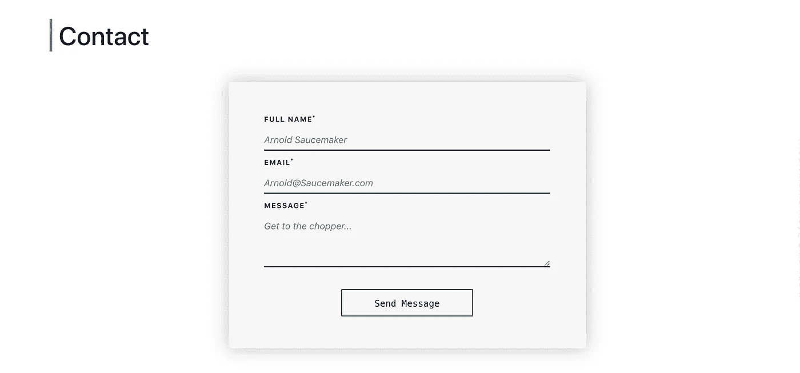
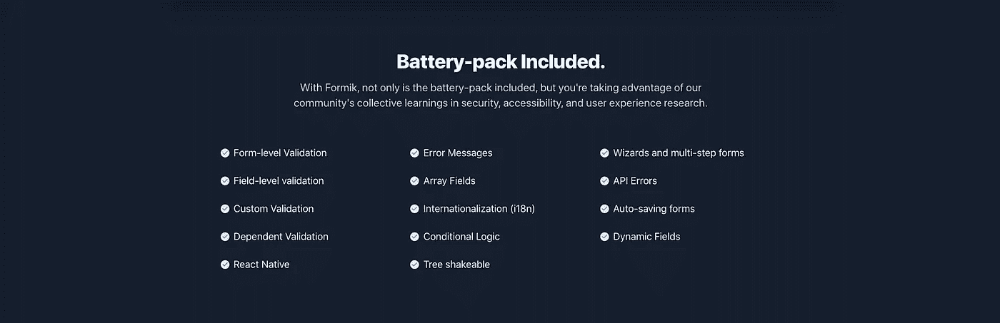
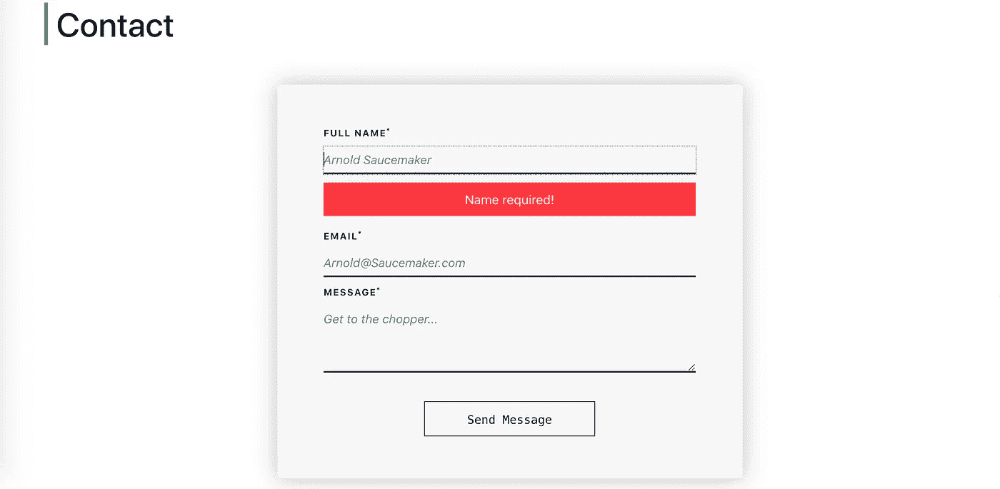
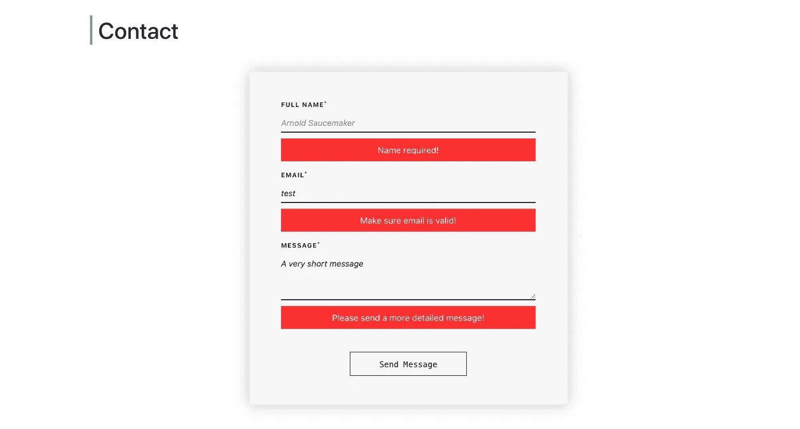

# 使用 Formik 和 Yup 无缝验证 React 表单

> 原文：<https://javascript.plainenglish.io/easily-validate-react-forms-using-formik-and-yup-677d2191c785?source=collection_archive---------12----------------------->

## *反应形式可以很快变得复杂。福米克会节省你们两个人流泪的时间。*

Photo by [Joshua Reddekopp](https://unsplash.com/@joshuaryanphoto?utm_source=medium&utm_medium=referral) on [Unsplash](https://unsplash.com?utm_source=medium&utm_medium=referral)

# React 中的表单与传统的 HTML、CSS 和普通 JS:

React 表单可能会有点麻烦，只是因为多组件结构的作用域问题(*由模块化组件的概念*带来)。

再加上这些独立组件之间复杂的数据流—就状态管理而言，很容易忽略全局。

在时间紧迫的专业环境中工作时，时间至关重要。代码**必须以干净、可伸缩、可维护和可重用的方式写好**,并具有适当的安全性。

## 因此，您已经在 React web 应用程序中构建了一个联系人表单，布局如下(去掉占位符):

Screenshot belongs to PJ Codes.

出于本教程的考虑，我不会浪费任何时间向您解释 React 中处理表单的传统(非库)方式。

假设对于这个联系表单，我们有 **2** 组件:**如上图**所示的联系表单**和一个名为** `InputField`的组件，该组件接受一些表单元素属性作为道具，并基于这些道具动态返回 HTML 输入字段。

为了让我们的`inputField`组件获得它的*属性*属性，我们首先需要定义某种数据结构，这将允许我们定义属性名称并赋予它们值— *这里每个输入类型一个对象就足够了，我们可以将它们整齐地放入一个数组中。*

**我们可以很容易地做这样的事情:**

现在，在我们开始使用 Formik 之前，让我们先简单介绍一下它们:

## 福米克:

一个轻量级和直观的 React 库，用于构建、验证和提交表单。Formik 使用核心的 React 状态管理特性，如**状态**和**道具**，而不是花哨的订阅和幕后观察。这使得学习曲线相对平坦，并使调试更加容易。

其核心是，Formik 是一个简化复杂表单验证的工具。它还支持同步和异步验证**到现场级**。

## 这里有更多的规格:

Credit: Screenshot taken from formik.org

**看看这个简单的例子:**

对于经验丰富的 React 开发人员来说，这是显而易见的，但是对于那些对这个有点陌生的人来说，让我用简单的英语为你解释一下:

*(反应过来的大神可以跳过这部分)*

*   第 5 行:我们创建一个名为`SignupForm`的功能组件。
*   **第 7–14 行:**我们使用了`useFormik`钩子，向它传递一些初始值和一个提交函数，这个函数在提交时被调用。我们使用`JSON.stringify(value, replacer, space)`最初记录我们提交的数据。如果你不熟悉这个函数是如何工作的，让我很快地解释给你听。 ***值*** 表示我们通过提交时传入的实际值。 ***replacer*** 表示改变字符串化过程行为的函数。在这种情况下既然是`null`，我们就把 ***值*** 对象的所有属性和值作为我们的最终结果。最后， ***空格*** 参数表示一些空白字符，以便于阅读。值 **< 1** 表示没有空格。
*   **第 15–27 行**:我们返回一个`form`元素，这个元素附加了我们的`onSubmit`事件处理程序。然后，我们呈现一个`input`字段，并传入一些属性，如`onChange`记录了我们的键入输入的*和`value`实际捕获了我们的键入输入。*

现在我们对 Formik 有了基本的了解，让我们运行下面的代码:`npm install formik` ( *只是为了让它运行*)。

## 是的:

一个 Javascript 模式构建器和验证器，允许您定义 JSON 模式、转换值、指定必填字段等等。Yup 将解析和验证分成不同的步骤，使用起来非常直观。

**检查这个快速示例(*与 Formik 示例*分开):**

## 简单解释一下，因为我想让你们理解这些东西:

*   **第 4-12 行**:我们通过链接我们的数据类型来定义一个模式(本例中是*对象*)。对于每个键，我们指定该键是否是必需的，我们通过链接`positive()`函数调用来设置整数的界限，并格式化我们的 URL 和日期。
*   **第 15–22 行**:然后我们通过向我们的对象传递实际数据来做一些有效性检查，如果有效性评估为 true，我们在`.then`函数中执行一些逻辑。
*   **第 25–29 行** : `schema.cast`基本上将尝试对模式的值进行类型转换。比如说。`age:'24'`作为`age: 24`输出。

很简单，对吧？*那么 Formik 和 Yup 是如何合作的呢*？

让我们看看前面的联系表单示例。因为我们已经创建了一个对象数组(*每个对象代表一个 HTML 输入元素*)，现在我们需要开始为我们的表单启动**验证**逻辑。

## 简洁明了:

在`useFormik`钩子中，我们传入 3 个东西:

*   初始值。
*   使用 Yup 验证模式。这里是我们规定验证规则的地方(*要求，消息长度，电子邮件格式等。*)。
*   `onSubmit`函数，在里面我们可以执行一些用户界面逻辑(显示错误标签等)。).

## 然后，我们简单地呈现我们的表单:

我们映射字段数组，并使用简洁的简写方式传递每个元素:`{...el}`。我们另外传入一些额外的道具。

他们在这里，他们做什么

*   `key` =每个单独元素的唯一标识符(罩下的*)。*
*   *`onChange` =变更的通用事件处理程序。这将更新`values[key]`，其中`key`表示输入的`name`属性。*
*   *`value` =查找输入的`name`属性的必需值。*
*   *`errors` =使用输入的`name`属性触发`handleBlur`、`handleSubmit`等的错误。*
*   *`name` =输入的`name`属性的必需值。*
*   *`onBlur` =当输入失去焦点时触发某些逻辑的函数。*
*   *`touched` =跟踪用户是否触摸了该区域(*点击*)。*

# *现在，让我们看看我们的输入字段组件！*

*我们接受从表单组件传入的道具，首先检查我们的元素名称是否是`input`。如果是，我们用适当的属性和值等呈现一个输入字段。否则，我们返回一个带有适当属性和值的`textarea`。*

*然后，如果用户在没有输入任何数据或任何不正确数据的情况下点击进入和离开字段(*触摸*)，我们会呈现一个错误通知。这就是 Formik 和 Yup 大放异彩的地方:)*

*所有的验证和错误处理逻辑都是由两个库在幕后执行的，这节省了您的时间、精力和眼泪！记住，我们所做的只是在我们的`useFormik`钩子的`validationSchema`键中规定一些规则。*

*注意，我们有一个单独的**通知小部件组件**(红色)，它根据我们在**第 41–43 行传递给它的属性动态显示一条消息。***

**

*Screenshot belongs to PJ Codes.*

**

*Screenshot belongs to PJ Codes.*

## *下面是我们的通知小部件的代码:*

*在**第 6 行**上，我们有一个函数**检查来自道具**的通知类型，并且*在我们的`styles`对象内调用**第 23 行** & **第 25 行**上的那个函数*。*

*然后我们在**行 34** 返回一个`
`标签，并传入我们的通知类型、样式规则和错误消息…以及 *violaah* 。*

*希望这对你有帮助:)*

*请到—[PJcodes.com](https://www.pjcodes.com/)来见我*

## *资源*

***福米克公文**:[https://formik.org/docs/overview](https://formik.org/docs/overview)*

***是的官方文件**:[https://github.com/jquense/yup](https://github.com/jquense/yup)*

**更多内容请看*[***plain English . io***](http://plainenglish.io)*