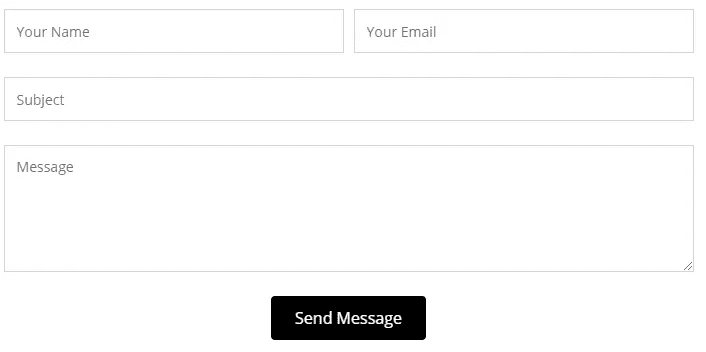
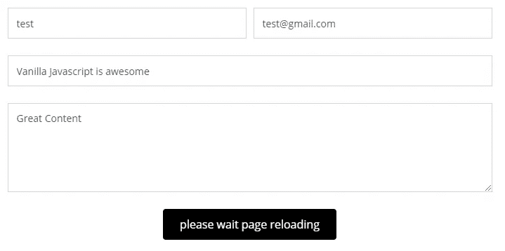

# 防止用户提交多个表单的简单普通 JavaScript 攻击

> 原文：<https://javascript.plainenglish.io/easy-vanilla-javascript-hack-to-prevent-multiple-form-submission-from-users-9fb9be397e6d?source=collection_archive---------18----------------------->


Photo by [Sergey Zolkin](https://unsplash.com/@szolkin?utm_source=medium&utm_medium=referral) on [Unsplash](https://unsplash.com?utm_source=medium&utm_medium=referral)

用户倾向于在网站上多次点击表单提交，因为他们不知道自己是否在第一次点击时提交了表单。

下面，我将展示一个简单的普通 JavaScript 函数，它可以防止用户提交多个表单，并通知用户他们的表单正在加载到下一个进程(例如，结帐，下一页)。

此外，这也将增强您对 JavaScript 的理解，因为其中使用了各种 HTML DOM 方法。

```
function "functionname"(){setTimeout(function(){document.getElementById("submitbuttonID").disabled = true;},"time in miliseconds");document.getElementById("submitbuttonID").innerHTML = "please wait page reloading";}document.getElementById("submitbuttonID").addEventListener('click', "functionname" );
```

用户使用`setTimeout`方法来禁用提交按钮。请注意，当用户单击提交按钮时，这个方法通过使用`addEventListener`方法来启动。

`innerHTML`用于将**“发送消息”**文本替换为**请等待页面重新加载文本**。这通知用户他们的表单已经提交，他们应该等待页面加载。下面是用户点击提交按钮前后的代码片段。



Figure: Before and after image after the user has clicked the submit button.

就是这样。就这么简单，同时，您可以了解 JavaScript 和 HTML DOM 元素。希望这对普通 JavaScript 用户有教育意义。

*更多内容请看*[*plain English . io*](http://plainenglish.io/)