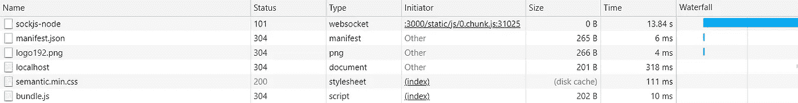
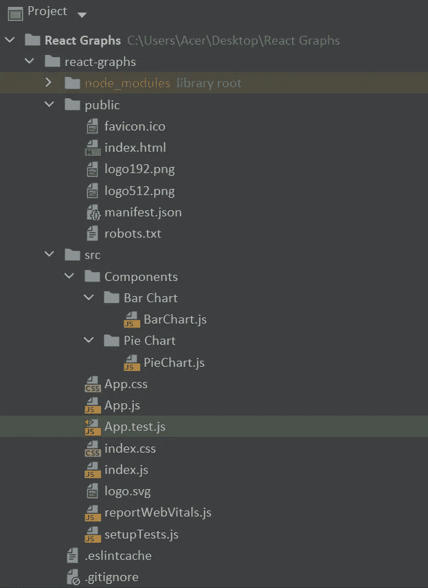
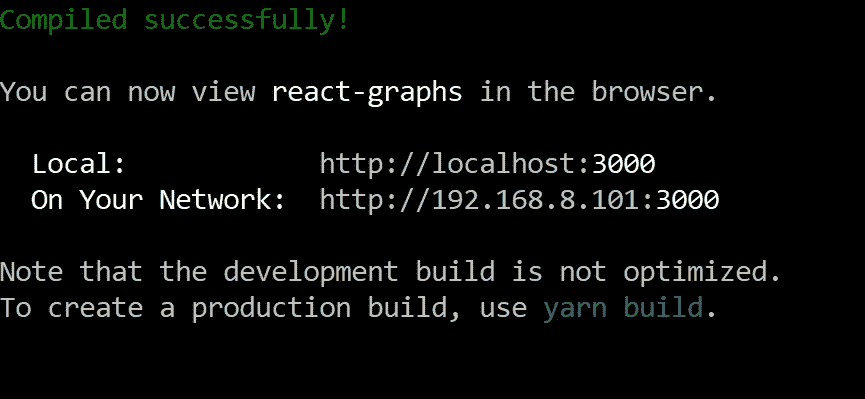
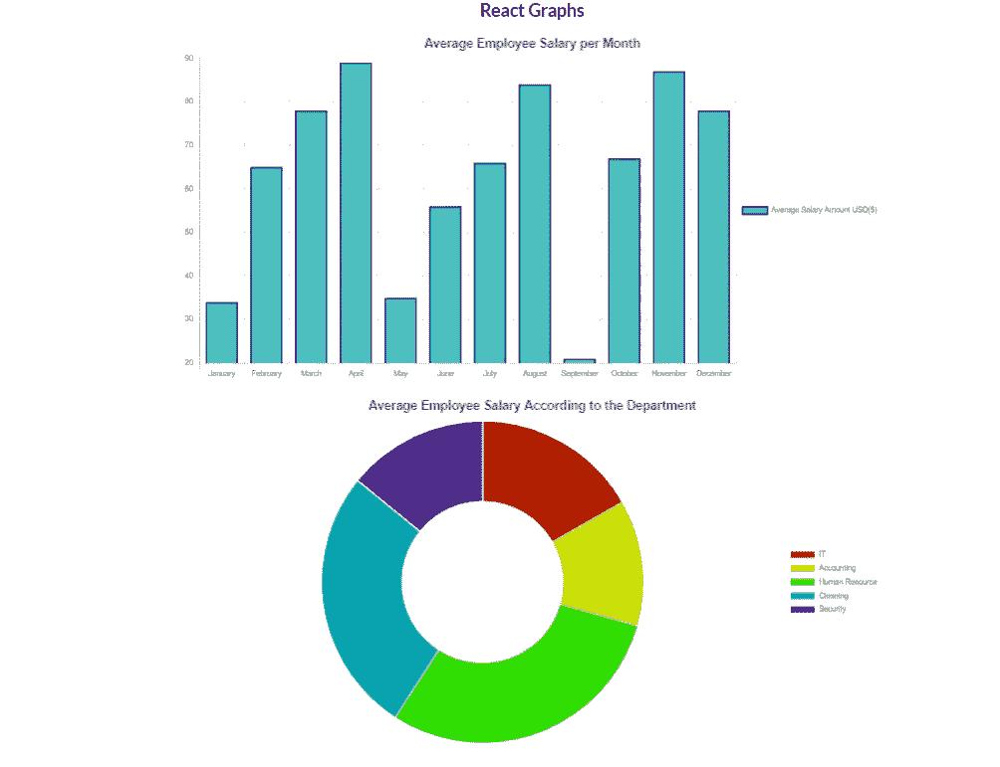

# 在 React 中创建图表的简单方法

> 原文：<https://javascript.plainenglish.io/easy-way-to-create-charts-in-react-c5b44a74e11d?source=collection_archive---------6----------------------->


Photo by [fauxels](https://www.pexels.com/@fauxels?utm_content=attributionCopyText&utm_medium=referral&utm_source=pexels) from [Pexels](https://www.pexels.com/photo/photo-of-person-holding-mobile-phone-3183153/?utm_content=attributionCopyText&utm_medium=referral&utm_source=pexels)

React 是著名的前端 web 开发库之一，由脸书和开发者共同开发和维护。React 比其他前端开发框架更受欢迎的原因是易于学习、文档好读、良好的架构带来的高性能。在 React 开发中，组件是关键因素。

一切都被认为是起反应的成分。这有助于组件的可重用性。React 具有丰富的内置组件。但是为了进一步改进，我们可以使用第三方库，它是 React 中的一个依赖项。

因此，在这篇文章中，让我们讨论一种在 React 中创建图表的简单方法。这对您的项目很有用。


[https://images.app.goo.gl/kQyoJ3t86p79TXeRA](https://images.app.goo.gl/kQyoJ3t86p79TXeRA)

所以一开始，你需要在你的电脑上安装 React。所以需要在电脑上安装 Node.js。使用 React 不需要了解 Node.js 的所有内容。你只需要安装 Node.js 就可以使用 React 了。可以去 Node.js 的[官网免费安装适合自己电脑的版本。您可以选择最新版本或 LTS 版本。成功安装 Node.js 后，可以打开命令提示符并检查计算机中 Node.js 的版本。](https://nodejs.org/en/download/current/)

键入以下代码以检查您的版本:

```
#check the version of the node js
node -v
```

成功安装 Node.js 之后，您就可以在您的计算机上安装 React 了。所以你可以选择两种方式。你可以 npm 或者[纱](https://classic.yarnpkg.com/en/)到这个。

```
npm install --global yarn
```

在本教程中，我使用的是纱线，但你可以根据自己的喜好选择任何东西。将 React 安装到您的计算机后，您需要创建一个新的 React 应用程序。您可以创建一个新文件夹并启动命令提示符，然后键入以下代码来创建新的 React 应用程序。

```
#using npm
npx create-react-app react-graphs#using yarn
yarn create react-app react-graphs
```

创建 React 应用程序后，您需要安装两个库来帮助我们创建好看的图表。因此，您需要将这些依赖项安装到新创建的项目中。

```
npm i react-chartjs-2
npm install chart.js 
```

您需要使用语义用户界面来获得额外的样式。通过使用[语义 UI CDN](https://cdnjs.com/libraries/semantic-ui) ，向您的项目添加语义 UI 也是一个简单的步骤。您只需要将以下代码放入项目中的 index.html 文件。

```
//Adding semantic UI CDN to the project
<link rel="stylesheet" href="https://cdnjs.cloudflare.com/ajax/libs/semantic-ui/2.4.1/semantic.min.css"/>
```

成功安装语义 UI 后，可以使用开发人员控制台的网络选项卡进行检查。可以看到语义 UI 被加载到了网页上。



Semantic UI in the Developer Console After Installation

然后，您需要从代码编辑器中打开项目。您需要在 src 文件夹中创建一个名为 Components 的附加目录。然后，您需要在组件内部创建两个文件夹，分别名为 BarChart 和 PieChart。然后，您需要在条形图目录中创建 BarChart.js 文件。然后，您需要将以下代码放入 BarChart.js 中

```
//BarChart.js Codeimport React from 'react';
import {Bar} from 'react-chartjs-2';

const state = {
    **labels**: ['January', 'February', 'March',
        'April', 'May','June','July','August','September','October','November','December'],
    **datasets**: [
        {
            **label**: 'Average Salary Amount USD($)',
            **backgroundColor**: 'rgba(75,192,192,1)',
            **borderColor**: 'rgba(0,0,0,1)',
            **borderWidth**: 2,
            **data**: [34, 65, 78, 89, 35,56,66,84,21,67,87,78]
        }
    ]
}

export default class BarChart extends React.Component {
    render() {
        return (
            <div>
                <Bar
                    data={state}
                    options={{
                        **title**:{
                            **display**:true,
                            **text**:'Average Employee Salary per Month',
                            **fontSize**:20
                        },
                        **legend**:{
                            **display**:true,
                            **position**:'right'
                        }
                    }}
                />
            </div>
        );
    }
}
```

然后您需要在 PieChart 目录中创建 PieChart.js 文件。然后，您需要将以下代码放入 PieChart.js 中

```
//PieChart.js Codeimport React from 'react';
import { Doughnut} from 'react-chartjs-2';

const state = {
    **labels**: ['IT', 'Accounting', 'Human Resource',
        'Cleaning', 'Security'],
    **datasets**: [
        {
            **label**: 'department',
            **backgroundColor**: [
                '#B21F00',
                '#C9DE00',
                '#2FDE00',
                '#00A6B4',
                '#6800B4'
            ],
            **hoverBackgroundColor**: [
                '#501800',
                '#4B5000',
                '#175000',
                '#003350',
                '#35014F'
            ],
            **data**: [45, 34, 80, 72, 38]
        }
    ]
}

export default class PieChart extends React.Component {
    render() {
        return (
            <div>

                <Doughnut
                    data={state}
                    options={{
                        **title**:{
                            **display**:true,
                            **text**:'Average Employee Salary According to the Department',
                            **fontSize**:20
                        },
                        **legend**:{
                            **display**:true,
                            **position**:'right'
                        }
                    }}
                />
            </div>
        );
    }
}
```

创建这些文件后，您需要将两个组件导入 app.js 文件。我将两个组件放在两个不同的 div 组件中，用一个 UI 容器作为类名。

```
//App.js Code
import './App.css';
import BarChart from "./Components/Bar Chart/BarChart";
import PieChart from "./Components/Pie Chart/PieChart";

function *App*() {
  return (
    <div className="App">
    <h1>React Graphs</h1>
      <div>
          <div className =" ui container">
            <BarChart/>
          </div>
          <br/>
          <div className =" ui container">
              <PieChart/>
          </div>

      </div>
    </div>
  );
}

export default *App*;
```

这是我们将使用的文件夹结构:



Folder Structure for this Tutorial in WebStorm IDE

在成功地完成了这些步骤之后，您需要运行这个项目。

根据您的软件包管理器，您可以使用以下代码:

```
#using npm
npm start#using yarn
yarn start
```



Command Prompt After Running Code using Yarn

这是一个简单的 React 条形图和饼图组件，可以用于您的项目。



Project Running on [http://localhost:3000/](http://localhost:3000/)

## 结论

这是使用 React 创建图表的一步一步的简单指南。您可以将后端连接到此，并根据您的需要从数据库中查询数据以显示在这些图表中。您只需要将检索数据提供到条形图中的数据数组中。js 和 PieChart.js。我认为你可以在这些步骤上努力。但是在这篇文章中，我主要关注于让您很好地理解一种创建图表来做出反应的简单方法。所以我觉得这篇文章对你的工作会有帮助。您可以从这里的[进入储存库。](https://github.com/PasinduUkwatta/React-Graphs)

对于软件开发人员来说，更好地理解 React 组件非常重要。所以你应该对这些事情有很好的了解，并且应该有能力处理这些事情。这将有助于你作为软件开发人员的职业发展。

本文探讨了 React 图表在现代应用中的应用，希望能帮助您更准确地完成工作。我想感谢你阅读我的文章，我希望在未来写更多关于新趋势话题的文章，以关注我的帐户，如果你喜欢你今天所读的！

参考资料:

[](https://www.npmjs.com/) [## npm

### 编辑描述

www.npmjs.com](https://www.npmjs.com/) [](https://www.npmjs.com/package/react-charts) [## 反应图

### React 的简单、身临其境的交互式图表喜欢这个库吗？全都试试！反应表，反应查询，反应…

www.npmjs.com](https://www.npmjs.com/package/react-charts) [](https://www.educative.io/edpresso/how-to-use-chartjs-to-create-charts-in-react) [## 如何在 React 中使用 chart.js 创建图表

### 如何在 React 中使用 chart.js 创建图表

如何在 react ww . educative . io 中使用 chart.js 创建图表](https://www.educative.io/edpresso/how-to-use-chartjs-to-create-charts-in-react)