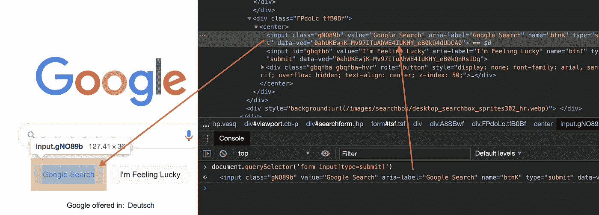
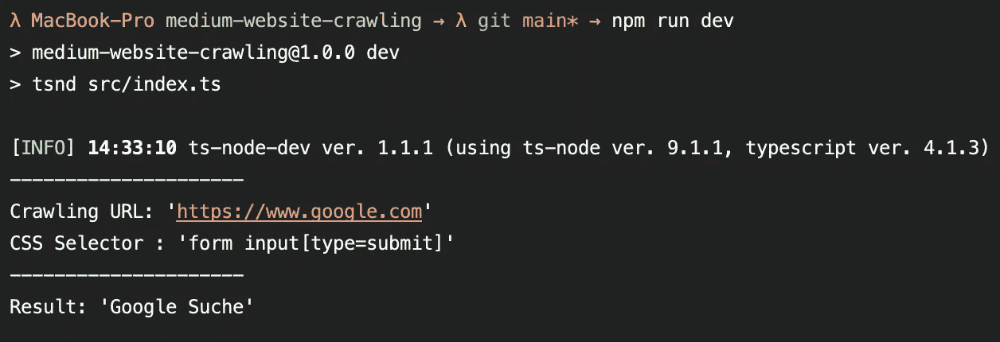

# 用 Node.js 中的 jsdom 轻松抓取网站

> 原文：<https://javascript.plainenglish.io/easy-website-crawling-with-jsdom-in-node-js-2ae15e126ed2?source=collection_archive---------3----------------------->

## 用不到 10 行代码抓取网站

Photo by [Luke Besley](https://unsplash.com/@besluk) on [Unsplash](https://unsplash.com/)

## ⚠️警告！⚠️

在我们开始之前，请注意，不是互联网上的每个人都喜欢他的网站突然收到数百个来自你的爬行脚本的请求，只是因为你想从那里提取一些信息。因此，请确保您负责任地使用网站抓取。要么降低你对单页的要求，要么请求网站所有者的批准，这样你就不会被屏蔽或者使别人的生活变得困难。

## 编码前准备

你会有你爬某些网站的理由。例如，您可能只是想从一个网站中提取一些数据，而这些数据是无法通过 API 获得的。或者您希望在一切正常的情况下监控网站上的某些元素。或者完全不同的东西。

不管是什么，你首先要做一个快速的研究，看看你想在一个特定的网站上爬什么。这里有两个重要的通用参数(至少对于一个简单的用例来说):

*   我们要抓取的 URL
*   我们想要抓取哪些元素，由一些 CSS 选择器定义

例如，您的理由可能是从特定网站上的一些 HTML 表中提取一些数据。所以你的 URL 可以是[https://www.xyz.com](https://www.mydatawebsite.com)，CSS 选择器可以是`table tr`用于查找特定表格的行。

对于我的例子，我决定要抓取[https://www.google.com](https://www.google.com)并检查表单中第一个提交输入元素的值。

所以我访问了 https://www.google.com，用 Chrome 开发工具检查了他们的 HTML。只是快速检查了一下`document.querySelector('form input[type=submit]');`，我可以看到`submit`类型的第一个输入元素是他们的“谷歌搜索”，多巧啊，对吧？😉

Inspecting [https://www.google.com](https://www.google.com) with the Chrome Dev Tools

但是当然，你不希望每次都手动操作，也许有数百个网站需要你的数据，所以让我们创建一个超级短的爬行脚本。

## 让我们开始编码吧

像往常一样，我在 GitHub 上为您准备了一个资源库，您可以克隆它作为一个小小的开端。我在我的知识库中使用了 TypeScript，但是当然，你也可以自由地使用普通的 JS。

 [## abszisex/medium-网站抓取

### 通过在 GitHub 上创建一个帐户，为 abszisex/medium 网站抓取开发做出贡献。

github.com](https://github.com/Abszissex/medium-website-crawling) 

对于开始爬行，我们实际上只需要两个包。

*   `node-fetch` —它为 node 提供了使用便捷的`fetch()`方法来请求网站的可能性，因为 Node.js 本身并不支持它。
*   `jsdom` —为了解析 HTML，我们接收一个字符串，转换成我们可以处理的实际 DOM。

所以使用`npm install --save node-fetch jsdom`安装它们。

如果你正在使用 TypeScript，你也应该安装他们的类型`npm install --save-dev @types/node-fetch @types/jsdom`。

安装完所需的模块后，我们可以开始实际的代码了:

和往常一样，我尽量把更多的文档放在代码层面上，这样就很容易理解了。而是简单解释一下我们正在做的事情:

*   我们从准备变量的`main`方法开始，然后运行爬行(`scrape`)。之后，我们简单地输出参数和爬行结果。
*   在`scrape`方法中，我们首先调用`getWebsiteContent()`方法，这样我们就可以以普通字符串的形式接收我们想要抓取的网站的 HTML。
*   下一步，我们用我们的字符串初始化`JSDOM`，将它转换成一个实际的 DOM，我们可以在那里工作。
*   最后但同样重要的是，我们用我们的`cssSelector`查询 DOM，并尝试获得我们有希望找到的`HTMLInputElement`的`value`。

所以现在让我们通过`npm run dev`直接运行我们的类型脚本代码:

Run crawling via ‘npm run dev’

如你所见，该程序输出我们的参数和名为“Google Suche”的结果，这是“Google 搜索”的德语版本。这正是我们想要的。

## 结论

我希望我能向你展示如何用几行代码就能轻松地抓取一个网站(如果你去掉所有的注释，实际代码将少于 10 行！).

当然，您的实际用例很可能更复杂，您将使用一些循环和更复杂的查询机制，但这不会增加实际爬行的复杂性，它只是对结果的额外解析/处理😉

当你开始爬行时，不要忘记对网站所有者负责和“公平”。

感谢您花时间阅读我的文章。

## 你想联系吗？

如果你想联系我，请在 LinkedIn 上给我打电话。

另外，请随意查看我的书籍推荐📚。

 [## 我的书籍推荐

### 在接下来的章节中，你可以找到我对所有日常生活话题的书籍推荐，它们对我帮助很大。

mr-pascal.medium.com](https://mr-pascal.medium.com/my-book-recommendations-4b9f73bf961b)  [## 通过我的推荐链接加入 Medium—Pascal Zwikirsch

### 作为一个媒体会员，你的会员费的一部分会给你阅读的作家，你可以完全接触到每一个故事…

mr-pascal.medium.com](https://mr-pascal.medium.com/membership)