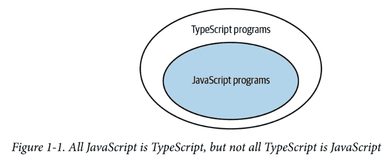
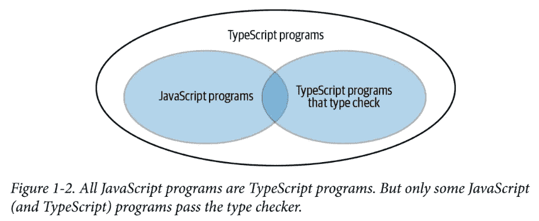
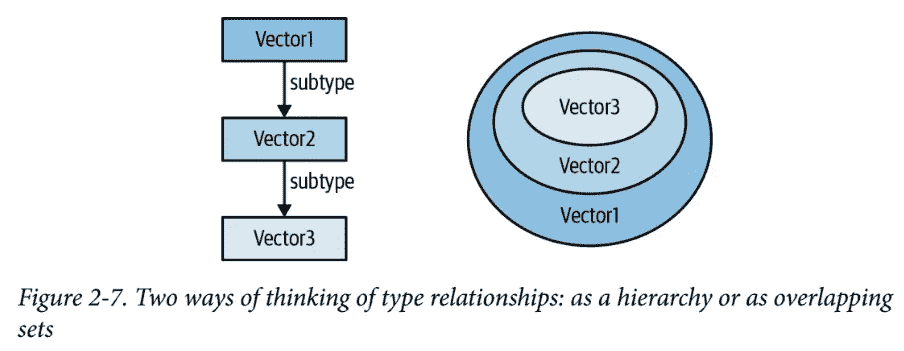
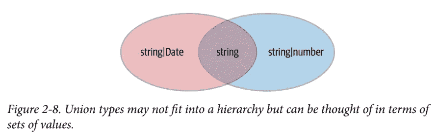
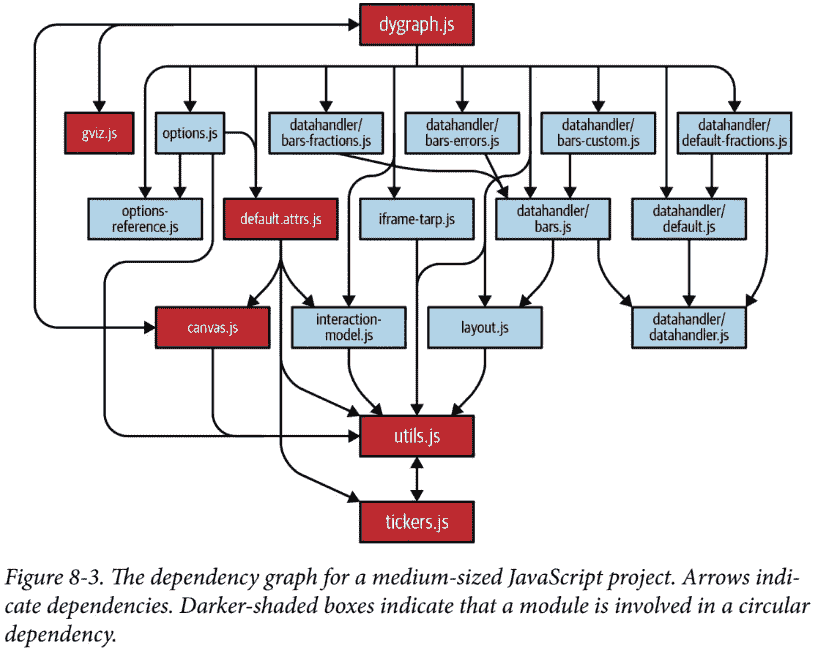

# 有效的打字稿:62 种改进打字稿的具体方法

> 原文：<https://javascript.plainenglish.io/effective-typescript-62-specific-ways-to-improve-your-typescript-5a9462ed260a?source=collection_archive---------2----------------------->

## …简而言之

Photo by [Luca Martini](https://unsplash.com/@lucamartini?utm_source=unsplash&utm_medium=referral&utm_content=creditCopyText) on [Unsplash](https://unsplash.com/s/photos/types?utm_source=unsplash&utm_medium=referral&utm_content=creditCopyText)

## 我个人对这个话题的看法

2019 年，我不得不决定是选择 *TypeScript* 还是 *JavaScript* 为工业领域的 MVP 进行 web 界面的前端开发。在后台，我确信不会使用*的打字稿*或者*的 JavaScript* 。在前端，我不太确定是用*类型脚本*还是用 *JavaScript* 。我已经在个人网站项目中实现了一些 JavaScript，但我不会称自己为专业的前端开发人员。然而，我知道缺乏打字会成为一个问题。

然而，只要在前端开发和维护少量简单的逻辑，打字的缺乏就不会那么重要。然而，如果需要越来越复杂的逻辑，最好还是坚持使用*类型的脚本*。

更多的上下文:此外，在一个质量要求很高的领域，我可能会为以后的项目选择错误的语言。在我能够读完这本书之前，我必须决定选择哪种语言。从之前的*有效…* 丛书( [*有效现代 C++*](https://www.oreilly.com/library/view/effective-modern-c/9781491908419/) 和 [*有效 Python*](https://www.oreilly.com/library/view/effective-python-90/9780134854717/) )中学到了很多。我决定获得 [*有效的打字稿:62 种提高你使用打字稿*](https://www.oreilly.com/library/view/effective-typescript/9781492053736/) 的具体方法在尽可能少的时间里学习尽可能多的与实践相关的东西。

## 没什么好补充的！

这本书的结构有助于从头到尾阅读。可以按照任意顺序阅读单个提示(“项目”)。然而，我建议从头到尾读一遍。至少对我来说，这本书不会让我大开眼界。

内容切中要害。这些物品被分门别类。几乎所有的条目都涉及类型系统。这些提示是关于添加到 JavaScript w.r.t .类型之上的主题。这听起来很无聊，但对我来说非常有趣。代码可靠性，在 *JavaScript* 中可能出错但在 *TypeScript* 中不会出错的事情(如果你不使用*任何*)。

*TypeScript* 代码被编译成 *JavaScript* 代码的含义也非常有用(编译时与运行时)。动态类型、可选类型提示的 *Python* 和静态类型的 *C++* 的区别非常有趣。然而，如果你搜索一本讲述 *TypeScript* 编程基础的书，它可能不适合你。大多数项目都有一个或几个例子的解释。

此外每个项目都有一个*要记住的事情*部分。因为这篇文章是对我自己的思想支持，所以从现在开始我几乎只引用内容。然而，除了从这篇文章中获得价值，你可能还得阅读这本书。

1.  了解 TypeScript(第 1 至第 5 项)
2.  TypeScript 的类型系统(第 6 至 18 项)
3.  类型推断(第 19 至 27 项)
4.  型号设计(第 28 至 37 项)
5.  使用任何(项目 38 至 44)
6.  类型声明和@types(第 45 到 52 项)
7.  编写和运行您的代码(第 53 至 57 项)
8.  迁移您的代码(第 58 至 62 项)

## 第 1 项:理解 TypeScript 和 JavaScript 之间的关系

[Effective TypeScript, p. 2]

[Effective TypeScript, p. 5]

要记住的事情[有效打字稿，第 6/7 页]:

*   TypeScript 是 JavaScript 的超集。换句话说，所有的 JavaScript 程序都已经是类型脚本程序了。TypeScript 有它自己的语法，所以一般来说，TypeScript 程序不是有效的 JavaScript 程序。
*   TypeScript 添加了一个类型系统，该系统模拟 JavaScript 的运行时行为，并试图找出将在运行时引发异常的代码。但是你不应该期望它标记每一个异常。代码有可能通过类型检查，但在运行时仍会抛出。
*   虽然 TypeScript 的类型系统在很大程度上模拟了 JavaScript 的行为，但有些构造是 JavaScript 允许的，但 TypeScript 选择禁止，比如调用参数数量错误的函数。这在很大程度上是一个品味问题。

## 第二条:知道你使用的是哪种类型

要记住的事情[有效打字稿，第 9/10 页]:

*   TypeScript 编译器包括几个影响语言核心方面的设置。
*   使用 tsconfig.json 而不是命令行选项配置 TypeScript。
*   除非您要将 JavaScript 项目转换为 TypeScript，否则请打开 noImplicitAny。
*   使用 strictNullChecks 来防止“未定义不是对象”样式的运行时错误。
*   旨在使 strict 能够获得 TypeScript 所能提供的最彻底的检查。

## 第 3 条:理解代码生成与类型无关

标题:

*   有类型错误的代码会产生输出
*   您不能在运行时检查 TypeScript 类型
*   类型运算不能影响运行时值
*   运行时类型可能与声明的类型不同
*   不能基于 TypeScript 类型重载函数
*   TypeScript 类型对运行时性能没有影响

要记住的事情[有效打字稿，第 16 页]:

*   代码生成独立于类型系统。这意味着 TypeScript 类型不会影响代码的运行时行为或性能。
*   有类型错误的程序有可能产生代码(“编译”)。
*   TypeScript 类型在运行时不可用。要在运行时查询一个类型，您需要某种方法来重建它。标记联合和属性检查是实现这一点的常用方法。有些构造(如 class)引入了 TypeScript 类型和运行时可用的值。

## 第 4 项:熟悉结构类型

要记住的事情[有效打字稿，第 19/20 页]:

*   请理解 JavaScript 是鸭类型的，TypeScript 使用结构类型来对此建模:可分配给接口的值可能具有类型声明中明确列出的属性之外的属性。类型不是“密封的”
*   请注意，类也遵循结构化类型规则。您可能没有您期望的类的实例！
*   使用结构类型来促进单元测试。

## 第 5 项:限制任何类型的使用

标题:

*   任何类型都没有类型安全
*   任何让你毁约
*   没有任何类型的语言服务
*   当你重构代码时，任何类型都会掩盖错误
*   任何隐藏你的类型设计
*   任何破坏都凝结在打字系统中

要记住的事情[有效打字稿，第 24 页]:

*   any 类型有效地抑制了类型检查器和 TypeScript 语言服务。它会掩盖真正的问题，损害开发人员的体验，破坏对类型系统的信心。能避免就避免使用！

## 第 6 项:使用你的编辑器询问和探索类型系统

要记住的事情[有效打字稿，第 29 页]:

*   通过使用可以使用 TypeScript 语言服务的编辑器来利用它们。
*   使用您的编辑器为类型系统如何工作以及 TypeScript 如何推断类型建立直觉。
*   知道如何进入类型声明文件，看看它们是如何模拟行为的。

## 第 7 项:将类型视为一组值

[Effective TypeScript, p. 32]

[Effective TypeScript, p. 34]

要记住的事情[有效打字稿，第 35 页]:

*   将类型视为值的集合(类型的域)。这些集合可以是有限的(例如，布尔或文字类型)，也可以是无限的(例如，数字或字符串)。
*   TypeScript 类型形成交叉集(维恩图)而不是严格的层次结构。两种类型可以重叠，但都不是对方的子类型。
*   请记住，一个对象仍然可以属于一个类型，即使它有类型声明中没有提到的附加属性。
*   类型运算适用于集合的定义域。A 和 Bis 的交集 A 的定义域和 B 的定义域的交集。对于对象类型，这意味着 A& B 中的值同时具有 A 和 b 的属性
*   将“扩展”、“可分配给”和“的子类型”视为“的子集”的同义词

## 第 8 条:知道如何判断一个符号是在类型空间还是值空间

要记住的事情[有效打字稿，第 40 页]:

*   知道如何在读取 TypeScript 表达式时判断自己是在类型空间还是值空间。使用 TypeScript playground 来建立对此的直觉。
*   每个值都有一个类型，但是类型没有值。像类型和接口这样的构造只存在于类型空间中。
*   “foo”可能是字符串文字，也可能是字符串文字类型。意识到这种区别，并了解如何辨别这两者。
*   typeof、this 以及许多其他操作符和关键字在类型空间和值空间中具有不同的含义。
*   有些构造，如 class 或 enum，既引入了类型又引入了值。

## 第 9 条:更喜欢类型声明而不是类型断言

要记住的事情[有效打字稿，第 43 页]:

*   更喜欢类型声明(:type)而不是类型断言(as Type)。
*   知道如何注释一个箭头函数的返回类型。
*   当您知道一些 TypeScript 不知道的类型时，请使用类型断言和非空断言。

## 第 10 条:避免对象包装类型(字符串、数字、布尔值、符号、BigInt)

要记住的事情[有效打字稿，第 46 页]:

*   理解如何使用对象包装类型来提供基元值的方法。避免实例化它们或直接使用它们。
*   避免 TypeScript 对象包装类型。请改用基本类型:string 代替 String，number 代替 Number，boolean 代替 Boolean，symbol 代替 Symbol，bigint 代替 BigInt。

## 第 11 条:认识超额财产检查的局限性

要记住的事情[有效打字稿，第 49 页]:

*   当您将对象文本赋给变量或将它作为参数传递给函数时，它会经历额外的属性检查。
*   过剩属性检查是一种有效的查找错误的方法，但它不同于由 TypeScript 类型检查器完成的通常的结构可赋值性检查。将这些过程混为一谈会让你更难建立一个可分配性的心智模型。
*   请注意过度属性检查的限制:引入中间变量将会取消这些检查。

## 第 12 条:尽可能对整个函数表达式应用类型

要记住的事情[有效打字稿，第 52 页]:

*   考虑将类型批注应用于整个函数表达式，而不是它们的参数和返回类型。
*   如果您重复编写相同类型的签名，请找出一个函数类型或寻找一个现有的类型。如果你是一个库的作者，为 commoncallbacks 提供类型。
*   使用 typeof fn 匹配另一个函数的签名。

## 第 13 条:知道类型和接口的区别

要记住的事情[有效打字稿，第 56 页]:

*   理解类型和接口的区别和相似之处。
*   知道如何使用任一种语法编写相同的类型。
*   在决定在您的项目中使用哪一种时，请考虑已建立的风格以及增强是否有益。

## 第 14 条:使用类型操作和泛型来避免重复

要记住的事情[有效打字稿，第 64 页]:

*   DRY(不要重复自己)原则既适用于逻辑，也适用于类型。
*   命名类型而不是重复它们。使用扩展来避免接口中的重复字段。
*   了解 TypeScript 提供的在类型之间进行映射的工具。这些类型包括 keyof、typeof、索引和映射类型。
*   泛型类型相当于类型的函数。使用它们在类型之间映射，而不是重复类型。使用扩展来约束泛型类型。
*   熟悉标准库中定义的泛型类型，如 Pick、Partial 和 ReturnType。

## 第 15 项:对动态数据使用索引签名

要记住的事情[有效打字稿，第 67 页]:

*   当直到运行时才能知道对象的属性时，使用索引签名，例如，如果从 CSV 文件加载它们。
*   考虑将 undefined 添加到索引签名的值类型中，以实现更安全的访问。
*   尽可能使用更精确的类型来索引签名:接口、记录或映射类型。

## 第 16 项:优先使用数组、元组和 ArrayLike 对索引签名进行编号

要记住的事情[有效打字稿，第 70/71 页]:

*   要明白数组是对象，所以它们的键是字符串，不是数字。numberas 索引签名是一个纯粹的类型脚本构造，旨在帮助捕获 bug。
*   比起自己在索引签名中使用数字，更喜欢使用数组、元组或类数组类型。

## 第 17 项:使用 readonly 来避免与突变相关的错误

要记住的事情[有效打字稿，第 77 页]:

*   如果你的函数不修改它的参数，那么把它们声明为 readonly。这使得它的契约更加清晰，并防止实现中的意外变化。
*   使用 readonlyto 来防止突变错误，并找到代码中发生突变的地方。
*   理解 const 和 readonly 的区别。
*   要明白 readonly 是浅薄的。

## 第 18 项:使用映射类型保持值同步

要记住的事情[有效打字稿，第 80 页]:

*   使用映射类型来保持相关值和类型的同步。
*   考虑在向接口添加新属性时使用映射类型来强制选择。

## 第 19 条:避免用可推断的类型来混淆你的代码

要记住的事情[有效打字稿，第 87 页]:

*   当 TypeScript 可以推断相同的类型时，避免编写类型批注。
*   理想情况下，您的代码在函数/方法签名中有类型注释，但在代码体的局部变量中没有。
*   考虑对对象文字和函数返回类型使用显式注释，即使它们可以被推断出来。这将有助于防止用户代码中出现实现错误。

## 第 20 条:对不同的类型使用不同的变量

要记住的事情[有效打字稿，第 89/90 页]:

*   虽然变量值可以改变，但它的类型通常不会改变。
*   为了避免人类读者和类型检查器的混淆，避免对不同类型的值重用变量。

## 第 21 项:了解类型扩展

要记住的事情[有效打字稿，第 93 页]:

*   了解 TypeScript 如何通过扩展常量来从常量中推断类型。
*   熟悉影响这种行为的方式:const、类型注释、上下文和 as const。

## 第 22 项:了解类型收缩

要记住的事情[有效打字稿，第 96 页]:

*   理解 TypeScript 如何基于条件和其他类型的控制流来缩小类型。
*   使用标记/区分联合和用户定义的类型保护来帮助缩小范围。

## 第 23 项:一次性创建所有对象

要记住的事情[有效打字稿，第 99 页]:

*   我更喜欢一次完成所有的东西，而不是一点一点地完成。使用对象扩展({…a，…b})以类型安全的方式添加属性。
*   知道如何有条件地向对象添加属性。

## 第 24 条:使用别名时要保持一致

要记住的事情[有效打字稿，第 102 页]:

*   别名可以防止 TypeScript 缩小类型。如果您为 avariable 创建别名，请始终如一地使用它。
*   使用析构语法来鼓励一致的命名。
*   请注意函数调用可能会使属性的类型细化无效。信任对局部变量的细化多于对属性的细化。

## 第 25 条:对同步代码使用异步函数代替回调

要记住的事情[有效打字稿，第 107 页]:

*   为了更好的可组合性和类型流，更喜欢承诺而不是回调。
*   可能的话，最好使用异步和等待，而不是原始承诺。它们生成更精确、更简单的代码，并消除了各类错误。
*   如果一个函数返回一个承诺，就声明它是异步的。

## 第 26 项:理解上下文是如何在类型推断中使用的

要记住的事情[有效打字稿，第 111 页]:

*   注意上下文是如何在类型推断中使用的。
*   如果分解变量会引入类型错误，请考虑添加类型声明。
*   如果变量确实是一个常数，使用 const 断言(作为 const)。但是请注意，这可能会导致使用中出现错误，而不是定义错误。

## 第 27 项:使用函数构造和库来帮助类型流

要记住的事情[有效打字稿，第 115 页]:

*   使用内置的函数构造和实用程序库中的函数构造(如 Lodash ),而不是手工创建的构造，以改善类型流，提高可读性，并减少对显式类型注释的需求。

## 第 28 项:首选总是表示有效状态的类型

要记住的事情[有效打字稿，第 122 页]:

*   既表示有效状态又表示无效状态的类型很可能导致混乱和容易出错的代码。
*   首选只表示有效状态的类型。即使它们更长或更难表达，它们最终也会节省你的时间和痛苦！

## 第 29 条:对你所接受的要宽容，对你所生产的要严格

要记住的事情[有效打字稿，第 125 页]:

*   输入类型往往比输出类型更广泛。可选属性和 uniontypes 在参数类型中比在返回类型中更常见。
*   为了在参数和返回类型之间重用类型，引入一个规范形式(对于返回类型)和一个松散形式(对于参数)。

## 第 30 条:不要在文档中重复类型信息

要记住的事情[有效打字稿，第 127 页]:

*   避免在注释和变量名中重复类型信息。在最好的情况下，它是类型声明的重复，在最坏的情况下，它将导致信息冲突。
*   如果类型中没有明确的单位，可以考虑在变量名中包含单位(如 timeMs 或 temperatureC)。

## 第 31 项:将空值推到类型的外围

要记住的事情[有效打字稿，第 130 页]:

*   避免这样的设计:一个值为空或非空与另一个值为空或非空隐式相关。
*   通过使较大的对象为空或完全非空，将空值推到 API 的边界。这将使代码对于人类读者和类型检查器来说都更加清晰。
*   考虑创建一个完全非空的类，并在所有值都可用时构造它。
*   虽然 strictNullChecks 可能会标记出代码中的许多问题，但它对于揭示函数在空值方面的行为是不可或缺的。

## 第 32 项:比起联合的接口，更喜欢接口的联合

要记住的事情[有效打字稿，第 134 页]:

*   具有多个联合类型属性的接口通常是错误的，因为它们模糊了这些属性之间的关系。
*   接口的联合更加精确，可以被 TypeScript 理解。
*   考虑在您的结构中添加一个“标记”,以便于 TypeScript 的控制流分析。因为它们得到了很好的支持，标记联合在 TypeScript 代码中无处不在。

## 第 33 项:首选更精确的字符串类型

要记住的事情[有效打字稿，第 138 页]:

*   避免“字符串型”代码。在并非每个字符串都是可能的情况下，最好使用更合适的类型。
*   更倾向于使用 string literal 类型的联合，而不是更准确地描述变量定义域的 stringif。您将得到更严格的类型检查，并改善开发体验。
*   对于期望成为对象属性的函数参数，首选 keyof T 而不是 string。

## 第 34 条:不完整的类型比不准确的类型更好

要记住的事情[有效打字稿，第 142 页]:

*   避免类型安全的恐怖山谷:不正确的类型通常比没有类型更糟糕。
*   如果您不能准确地建模一个类型，就不要不准确地建模！使用任何或未知来确认差距。
*   随着打字越来越精确，请注意错误信息和自动完成功能。这不仅仅是关于正确性:开发者体验也很重要。

## 第 35 项:从 API 和规范生成类型，而不是数据

要记住的事情[有效打字稿，第 147 页]:

*   考虑为 API 调用和数据格式生成类型，以在代码的边缘获得类型安全。
*   更喜欢从规范而不是数据中生成代码。罕见病例很重要！

## 第 36 项:使用问题域语言的名称类型

要记住的事情[有效打字稿，第 149 页]:

*   尽可能重用问题领域中的名称，以提高代码的可读性和抽象程度。
*   避免对同一事物使用不同的名字:使名字的区别有意义。

## 第 37 项:考虑将“品牌”用于名义打字

要记住的事情[有效打字稿，第 152 页]:

*   TypeScript 使用结构化(“duck”)类型，这有时会导致令人惊讶的结果。如果你需要名义上的打字，考虑把“品牌”贴在你的价值观上，以示区别。
*   在某些情况下，你可以在类型系统中完全附加品牌，而不是在运行时。您可以使用这种技术在 TypeScript 的类型系统之外对属性进行建模。

## 第 38 条:对任何类型使用尽可能窄的范围

要记住的事情[有效打字稿，第 155 页]:

*   尽可能缩小 any 的使用范围，以避免在代码中的其他地方出现不必要的类型安全损失。
*   永远不要从函数中返回 any 类型。这将悄悄地导致调用该函数的任何客户端失去类型安全。
*   如果您需要消除一个错误，可以考虑将@ts-ignore 作为 any 的替代方法。

## 第 39 条:比起简单的 any，更喜欢 any 的精确变体

要记住的事情[有效打字稿，第 157 页]:

*   当您使用 any 时，请考虑任何 JavaScript 值是否是真正允许的。
*   如果 any[]或{[id:string]:any }或()=> any 能够更准确地为您的数据建模，那么最好使用更精确的形式。

## 第 40 项:在良好类型的函数中隐藏不安全的类型断言

要记住的事情[有效打字稿，第 159 页]:

*   有时，不安全的类型断言是必要的或权宜之计。当你需要使用它的时候，把它藏在一个有正确签名的函数里。

## 第 41 项:理解进化

要记住的事情[有效打字稿，第 162 页]:

*   虽然 TypeScript 类型通常只细化，但隐式 any 和 any[]类型是允许发展的。你应该能够识别和理解这个结构出现的地方。
*   为了更好地进行错误检查，请考虑提供显式类型注释，而不是使用 evolving any。

## 第 42 项:对于未知类型的值，使用 unknown 而不是 any

要记住的事情[有效打字稿，第 165/166 页]:

*   未知类型是任何类型的类型安全替代。当你知道你有一个值，但不知道它的类型是什么时，使用它。
*   使用 unknown 强制用户使用类型断言或进行类型检查。
*   理解{}、对象、未知之间的区别。

## 第 43 项:首选类型安全方法进行猴子修补

要记住的事情[有效打字稿，第 168 页]:

*   比起在全局或 DOM 上存储数据，更喜欢结构化代码。
*   如果必须在内置类型上存储数据，请使用类型安全的方法之一(扩充或断言自定义接口)。
*   理解扩充的范围问题。

## 第 44 条:跟踪你的类型覆盖率，防止类型安全的倒退

要记住的事情[有效打字稿，第 170 页]:

*   即使没有设置任何类型，任何类型都可以通过显式 Any 或第三方类型声明(@types)进入您的代码。
*   考虑跟踪你的程序的类型有多好。这将鼓励您重新考虑使用 any 的决定，并随着时间的推移增加类型安全性。

## 第 45 项:将 TypeScript 和@types 放在 devDependencies 中

要记住的事情[有效打字稿，第 173 页]:

*   避免在系统范围内安装 TypeScript。使 TypeScript 成为项目的 devDependency，以确保团队中的每个人都使用一致的版本。
*   将@types 依赖项放在 devDependencies 中，而不是 dependencies 中。如果您在运行时需要@types，那么您可能需要重新设计您的流程。

## 第 46 项:理解类型声明中涉及的三个版本

要记住的事情[有效打字稿，第 177 页]:

*   @types 依赖项涉及三个版本:库版本、@types 版本和 TypeScript 版本。
*   如果更新库，请确保更新相应的@types。
*   理解绑定类型与在确定类型上发布它们的优缺点。如果您的库是用 TypeScript 编写的，那么最好使用绑定类型，如果不是，那么就一定要类型化。

## 第 47 项:导出公共 API 中出现的所有类型

要记住的事情[有效打字稿，第 178 页]:

*   导出在任何公共方法中以任何形式出现的类型。你的用户无论如何都可以提取它们，所以你也可以让他们更容易提取。

## 第 48 项:将 TSDoc 用于 API 注释

要记住的事情[有效打字稿，第 181 页]:

*   使用 JSDoc-/TSDoc 格式的注释来记录导出的函数、类和类型。这有助于编辑在最相关的时候向用户展示信息。
*   使用@param、@returns 和 Markdown 进行格式化。
*   避免在文件中包含类型信息(见第 30 项)。

## 第 49 项:在回调中为此提供一个类型

要记住的事情[有效打字稿，第 181 页]:

*   理解这种绑定是如何工作的。
*   当它是你的 API 的一部分时，在回调中提供一个类型。

## 第 50 条:优先选择条件类型而不是重载声明

要记住的事情[有效打字稿，第 187 页]:

*   优先选择条件类型而不是重载类型声明。通过在联合上分布，条件类型允许您的声明支持联合类型，而无需额外的重载。

## 第 51 项:服务器依赖关系的镜像类型

要记住的事情[有效打字稿，第 188 页]:

*   使用结构化类型来切断不重要的依赖关系。
*   不要强迫 JavaScript 用户依赖@types。不要强迫 web 开发者依赖 NodeJS。

## 第 52 条:注意测试类型的陷阱

要记住的事情[有效打字稿，第 192/193 页]:

*   测试类型时，要注意相等性和可赋值性之间的区别，尤其是对于函数类型。
*   对于使用回调的函数，测试回调参数的推断类型。如果它是你的 API 的一部分，不要忘记测试它的类型。
*   警惕任何涉及类型的 in 测试。可以考虑使用 dtslintforstricter 这样的工具，不太容易出错的检查。

## 第 53 项:ECMAScript 功能优于 ECMAScript 功能

要记住的事情[有效打字稿，第 200 页]:

*   总的来说，您可以通过从代码中移除所有类型来将 TypeScript 转换为 JavaScript。
*   枚举、参数属性、三重斜杠导入和装饰符是这个规则的历史例外。
*   为了让 TypeScript 在您的代码库中的角色尽可能清晰，我建议避免这些功能。

## 第 54 项:知道如何迭代对象

要记住的事情[有效打字稿，第 202 页]:

*   当您确切知道键是什么时，使用 let k: keyof T 和 for-in 循环来迭代对象。请注意，函数作为参数接收的任何对象都可能有额外的键。
*   使用 Object.entries 迭代任何对象的键和值。

## 第 55 项:了解 DOM 层次结构

要记住的事情[有效打字稿，第 202 页]:

*   DOM 有一个类型层次结构，在编写 JavaScript 时通常可以忽略它。但是这些类型在 TypeScript 中变得更加重要。理解它们将有助于您为浏览器编写类型脚本。
*   了解 Node、Element、HTMLElement 和 EventTarget 之间的区别，以及 Event 和 MouseEvent 之间的区别。
*   要么在代码中为 DOM 元素和事件使用足够具体的类型，要么给 TypeScript 上下文来推断它。

## 第 56 条:不要依靠隐私来隐藏信息

要记住的事情[有效打字稿，第 209 页]:

*   私有访问修饰符只能通过类型系统来实施。它在运行时不起作用，可以通过断言绕过。不要认为它会隐藏数据。
*   为了更可靠地隐藏信息，请使用闭包。

## 第 57 项:使用源映射调试 TypeScript

要记住的事情[有效打字稿，第 214 页]:

*   不要调试生成的 JavaScript。使用源映射在运行时调试您的 TypeScript 代码。
*   确保您的源映射一直映射到您运行的代码。
*   根据您的设置，您的源映射可能包含原始代码的内联副本。除非你知道你在做什么，否则不要发表它们！

## 第 58 项:编写现代 JavaScript

标题:

*   使用 ECMAScript 模块
*   使用类而不是原型
*   使用 let/const 代替 var
*   使用 for-of 或数组方法，而不是 for(；；)
*   优先选择箭头函数而不是函数表达式
*   使用压缩对象文本和析构赋值
*   使用默认函数参数
*   使用 async/await 代替原始承诺或回调
*   不要在 TypeScript 中使用严格的

要记住的事情[有效打字稿，第 223 页]:

*   TypeScript 允许您在任何运行时环境下编写现代 JavaScript。通过使用它所支持的语言特性来利用这一点。除了改进您的代码库之外，这将有助于 TypeScript 理解您的代码。
*   使用 TypeScript 学习语言特性，如类、析构和异步/等待。
*   不要为“使用严格”而烦恼:TypeScript 更严格。
*   查看 TC39 GitHub repo 和 TypeScript 发行说明，了解所有最新的语言特性。

## 第 59 项:使用@ts-check 和 JSDoc 试验 TypeScript

要记住的事情[有效打字稿，第 227/228 页]:

*   将“// @ts-check”添加到 JavaScript 文件的顶部，以启用类型检查。
*   识别常见错误。知道如何声明全局变量并为第三方库添加类型声明。
*   使用 JSDoc 注释进行类型断言和更好的类型推断。
*   不要花太多时间让你的代码用 JSDoc 完美地输入。请记住，目标是转换为。ts！

## 第 60 项:使用 allowJs 混合使用 TypeScript 和 JavaScript

要记住的事情[有效打字稿，第 229 页]:

*   在过渡项目时，使用 allowJs 编译器选项来支持混合的 JavaScript 和 TypeScript。
*   在开始大规模迁移之前，获取您的测试并构建使用 TypeScript 的链。

## 第 61 条:一个模块一个模块地转换你的依赖图

[Effective TyeScript, p. 230]

要记住的事情[有效打字稿，第 233/234 页]:

*   通过为第三方模块和外部 API 调用添加@types 来开始迁移。
*   从依赖图的底部开始向上迁移您的模块。第一个模块通常是某种实用程序代码。考虑可视化依赖图来帮助您跟踪进度。
*   当你发现奇怪的设计时，抵制重构代码的冲动。为将来的重构保留一个想法列表，但是要把重点放在类型脚本转换上。
*   请注意转换过程中出现的常见错误。如有必要，复制 JSDoc 注释，以避免在转换时失去类型安全性。

## 第 62 条:在启用无迁移之前，不要认为迁移完成

要记住的事情[有效打字稿，第 235 页]:

*   在采用 noImplicitAny 之前，不要认为您的 TypeScript 迁移已经完成。松散的类型检查可以掩盖类型声明中的真正错误。
*   在强制执行无插入之前，逐渐修复类型错误。在采用更严格的检查之前，给你的团队一个熟悉 TypeScript 的机会。

## 参考

*   【有效打字稿】:范德卡姆，丹，ed。(2019) *有效的打字稿:改善你打字稿的 62 种具体方法*。第一版。塞瓦斯托波尔:奥莱利

快乐阅读:)