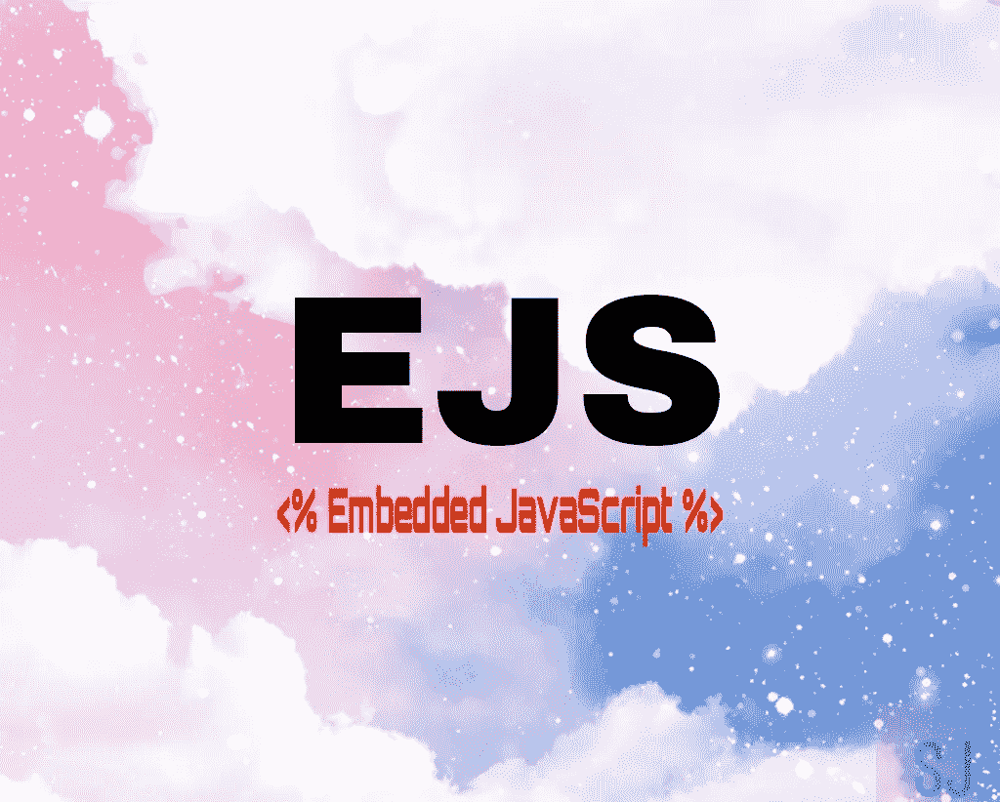
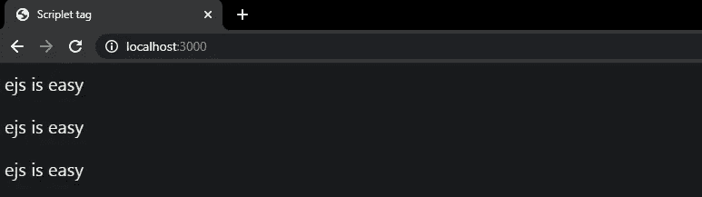
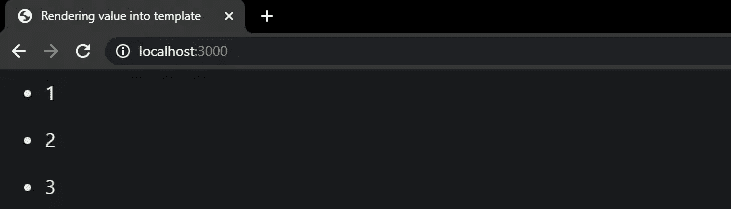

# 嵌入式 JavaScript:入门所需的一切

> 原文：<https://javascript.plainenglish.io/ejs-everything-you-need-to-know-to-get-started-a039faf53692?source=collection_archive---------6----------------------->



# 什么是 EJS？

EJS 仅仅代表*嵌入式 JavaScript* 。它是 Node.js 和 Express.js 最流行的模板视图引擎之一。

***注意:*** *模板引擎是一种工具，它使我们能够编写* ***HTML 标记*** *，其中穿插了其定义的标签或语法，这些标签或语法将在模板的最终输出中插入变量，或者在运行时运行一些编程逻辑，然后将最终的 HTML 发送到浏览器进行显示。*

# 为什么是 EJS？

*   每当你必须输出带有大量 JavaScript 的 HTML 时，EJS 最有用。
*   如果您正在处理生成动态内容或提供与实时更新有关的东西，那么它可以大大减少代码负载。

# ***EJS 入门***

## 使用 npm/yarn 安装 ejs

```
$ npm install ejs 
or
$ yarn add ejs
```

## 普通 EJS 标签

## 1.`<%`

该标签用于嵌入控制流、条件、无输出的 JS 代码。

****注意*** *:* `*%>*` *称为* ***普通结尾*** *标签，它是关闭所有标签所必需的。**

*例如，下面的代码将使用`<%`标签来执行一个 For 循环*

*Use of Scriptlet tag in EJS*

**

## *2.`<%=`*

*将值输出到模板中，对 HTML 进行转义。它用于嵌入 JavaScript 代码，该代码将输出标签中存在的表达式的结果。*

*下面的代码使用了`<%= %>`标签。这里它输出表达式(i+1)的值。*

**

## *3.`<%-`*

*输出时不将 HTML 值转义到模板中。当使用偏旁时。`<%=`对进入缓冲区的 HTML 进行转义，而`<%-`不会这样做。*

*让我们来呈现 HTML 代码。*

## *4.`<%#`*

*注释标记在文件中添加注释。运行脚本时，标记的内容将被自动忽略。*

*其他标签是`<%_` ( ' ***空格符圆滑*** ' *Scriptlet 标签*，它去除所有前导空格)和`<%%`(输出一个文字`<%`)。*

## *EJS 是翡翠更好更容易的替代品*

*[Jade](http://jade-lang.com/) 是 Express 的默认视图引擎，但是 Jade 的语法有时很难理解。EJS 是一个简单的选择。*

*easy peasy lemon squeezy*

***使用 express.js 和 EJS 的基本服务器设置:***

*`app.set('view engine', ‘ejs')`帮助将 EJS 设置为视图引擎。*

*此外，创建一个名为 **views** 的目录，该目录将存储所有的 **ejs** 文件，这些文件将基于不同的路线呈现由不同部分组成的单独布局。*

*现在在**视图**目录中创建一个名为 **index.ejs** 的文件。这将作为应用程序的起点。*

## *分音*

*EJS 的神奇之处在于，我们可以使用 EJS 创建局部视图。这在制作大型网站时很方便，因为它通过在文件中定义可重用的代码包并在需要的地方包含它，使开发更容易维护。*

*当您想要在多个视图(页面)中重用同一个 HTML 时，片段就很方便了。片段可以被认为是功能，它们使大型网站更容易维护，因为你不必去改变它出现的每一页的代码。相反，您可以在一个文件中定义可重用代码包，并在任何需要的地方包含它。*

*使用`<%- include('RELATIVE/PATH/TO/FILE') %>`在文件中嵌入 EJS 片段。请记住，提到的路径应该是相对于您想要嵌入的文件。*

*例如，您可以为所有页面提供通用的页眉、页脚和导航。*

*在 index.ejs 中，标题和名称将从 server.js 中传递。*

*在上面的代码片段中，第 6 行和第 8 行使用了 EJS 部分音。*

## *条件式*

*通过使用 `<% %>`,我们可以很容易地在普通的 HTML 中加入一些条件。这里有一个简单的例子:*

## *环*

*循环是任何编程语言中非常重要的一部分。它减少了重复性任务的麻烦。在 EJS，循环可以以下面的方式使用*

## ***表格效果图***

*借助于一个 ***表格*** 标签，EJS 的一个表格被渲染成 HTML 格式。*

*这里的区别是，在显示动态数据时，我们必须使用 ***Scriptlet*** 标签，这样，我们就可以呈现一个包含动态内容的表格。*

*rendering of a table in ejs*

*在上面的代码中，该表以数组的形式填充了从外部源(renderer，即 server.js)传递来的数据。并且通过使用 JavaScript `forEach`数组迭代器方法，遍历数组并将内容显示为单独的 ***td*** 标签的值。*

*下面是更新后的 **server.js** 文件*

*updated server.js*

*完整代码:*

*[](https://github.com/sagunjaiswal/EJS101) [## sagunjaiswal/EJS101

### EJS(嵌入式 javascript)指南 Permalink 无法加载最新的提交信息。EJS(嵌入式 javascript)指南我的…

github.com](https://github.com/sagunjaiswal/EJS101) 

这个帖子到此为止。感谢阅读到最后！✌

我将非常乐意得到您的反馈和建议。😊

**在这里找到我**👇

*   领英:【https://www.linkedin.com/in/sagun-jaiswal/ 
*   GitHub:[https://github.com/sagunjaiswal](https://github.com/sagunjaiswal)*