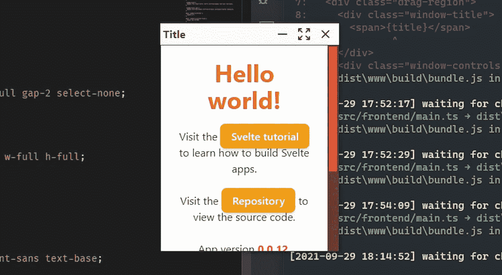
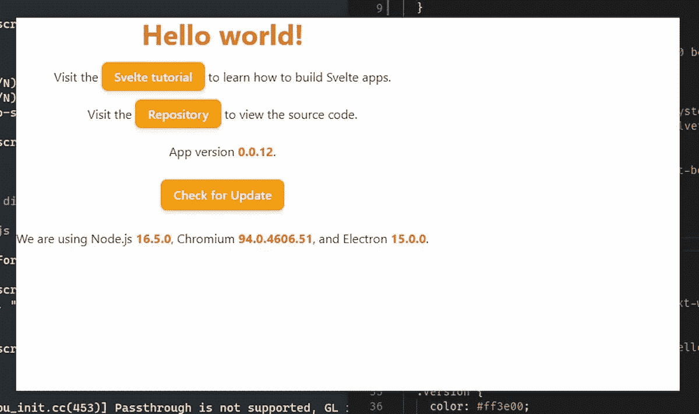
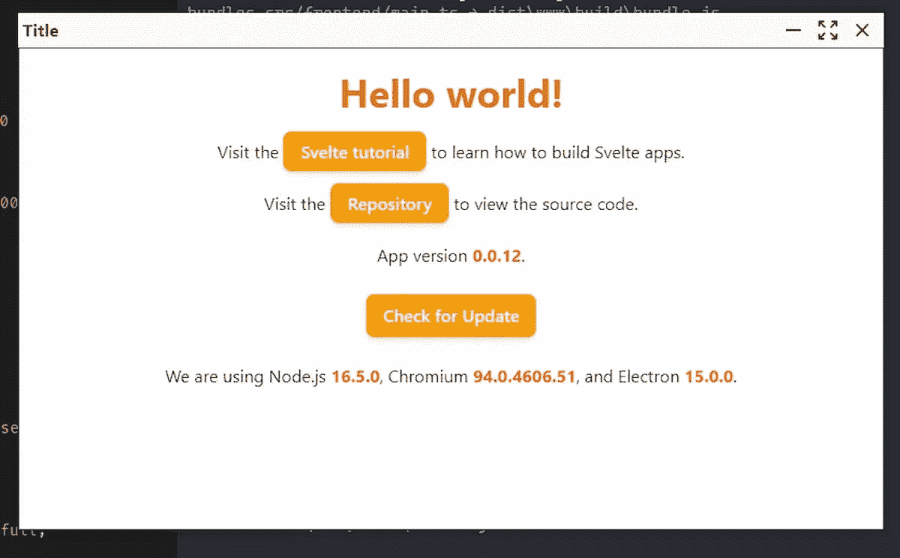

# 带细长尾翼的电子无缝标题栏

> 原文：<https://javascript.plainenglish.io/electron-seamless-titlebar-with-svelte-and-tailwind-bd4d53d81c67?source=collection_archive---------6----------------------->



Photo Credit: [Samuele](https://blog.stranianelli.com/electron-seamless-titlebar-with-svelte-and-tailwind-english/)

经过一些测试，我决定不使用默认情况下电子创建的窗口。我决定创建自己的标题栏，带有 Windows 风格的控制按钮。网上有很多教程指南。罗尼·杜塔的一个项目给了我灵感。

# 更新依赖关系

在开始这篇文章之前，有一点要注意。我不是从零开始，但我仍然使用我的[el3um 4s/memento-svelte-e-type script](https://github.com/el3um4s/memento-svelte-electron-typescript)模板。首先，像往常一样，我确保将所有依赖项更新到最新版本:

```
npm run check-updates
```

# 创建一个没有标题栏的窗口

首先，我通过将`frame`属性设置为`false`来创建一个没有标题栏的窗口:

# 添加基本样式

出于美观的原因，我在`tailwind.pcss`文件中添加了一些基本的样式:

唯一的奇类是`overflow-y-hidden`。它用于隐藏电子窗口的滚动条。我将使用一个自定义滚动条附加到页面的主要部分。

当我(用`npm run dev`启动应用程序时，我会看到这样一个窗口:



有什么问题？没有标题栏的窗口没有关闭按钮，不能移动。是时候添加自定义标题栏了。

# 添加自定义标题栏

做一些测试，最好的方法似乎是创建一个组件`src/frontend/Componentes/MainWithTitlebar.svelte`，在其中插入标题栏和页面的主要部分。

我写了基本代码:

然后我将组件添加到`App.svelte`:

显然，这不会引起任何可见的变化。我需要给我的组件添加一些样式:

我使用 Tailwind 的`h-8`类将页眉高度设置为 32px，并相应地设置底层页面高度:


仅仅设置一个标题栏来移动窗口是不够的。幸运的是，电子让你很容易实现这种可能性。只需添加 CSS 样式`-webkit-app-region: drag`:

# 添加窗口控制按钮

现在窗户可以移动了。但我也希望能够关闭，最小化和缩放它。我需要一些按钮:

我将按钮区域设置为`no-drag`是为了更容易点击按钮。说到按钮，在上面的代码中，我用了一些文字，但也许用图标更好。顺风让你轻松使用 [heroicons](https://heroicons.com/) 图标。我利用它，创建了一些苗条的组件来显示图标。例如，这是`IconClose.svelte`组件:

创建图标后，我将它们插入标题栏:

# 给窗口添加标题

有几种方法可以给窗口添加标题。一个简单的方法是:



# 自定义滚动条

默认情况下，电子显示 Chrome 滚动条。我可以用一些 CSS 代码改变它的风格:

这是结果:


# 启用按钮

如果我点击按钮，什么也不会发生，因为我没有添加任何功能。我立即下定决心:

显然，函数必须用代码填充。我能用什么？我需要使用特定的 API。我创建了`src/electron/IPC/windowControl.ts`文件:

在`src/electron/preload.ts`上注册新的 API:

最后，我允许主电子窗口使用 API。我编辑了`src/electron/index.ts`文件:

这允许我返回到我正在处理的组件(`MainWithTitlebar.svelte`)并添加缺少的功能:

现在我可以使用各种按钮来最小化，最大化和关闭窗口。

# 重置窗口大小

然而，有一个反常的行为。当我最大化窗口时，我想用另一个图标替换`maximize`图标。也许当我点击时，我可以恢复原来的窗口大小。

为了实现这一点，我可以利用`[<svelte:window>](https://svelte.dev/docs#svelte_window)`元素。通过将它插入到我的细长组件中，我可以在不离开组件本身的情况下拦截一些与窗口相关的事件。

为什么我要这么做？因为我还没有找到更简单的方法来判断窗口何时全屏。然后我不得不使用一个技巧:我检查窗口的大小。如果窗口至少和屏幕一样大，那么我假设它被最大化了。否则不行。

简单来说，`[$:](https://svelte.dev/docs#3_%24_marks_a_statement_as_reactive)` [将一条语句标记为反应式](https://svelte.dev/docs#3_%24_marks_a_statement_as_reactive):这大大简化了必要的代码。

现在我只需添加函数:

然后:

仅此而已。

[](https://github.com/el3um4s/memento-svelte-electron-typescript) [## GitHub-El 3um 4s/memento-svelte-electronic-typescript:使用 Svelte 创建桌面应用程序的模板…

### 模板创建一个桌面应用程序与苗条，TailwindCSS，电子和打字稿(与电子更新…

github.com](https://github.com/el3um4s/memento-svelte-electron-typescript) 

感谢阅读！敬请关注更多内容。

***不要错过我的下一篇文章—报名参加我的*** [***中邮箱列表***](https://medium.com/subscribe/@el3um4s)

[](https://el3um4s.medium.com/membership) [## 通过我的推荐链接加入 Medium—Samuele

### 阅读萨缪尔的每一个故事(以及媒体上成千上万的其他作家)。不是中等会员？在这里加入一块…

el3um4s.medium.com](https://el3um4s.medium.com/membership) 

*原载于 2021 年 10 月 2 日 https://blog.stranianelli.com*[](https://blog.stranianelli.com/electron-seamless-titlebar-with-svelte-and-tailwind-english/)**。**

**更多内容看* [***说白了就是***](http://plainenglish.io/) ***。*** *报名参加我们的* [***免费每周简讯这里***](http://newsletter.plainenglish.io/) ***。****