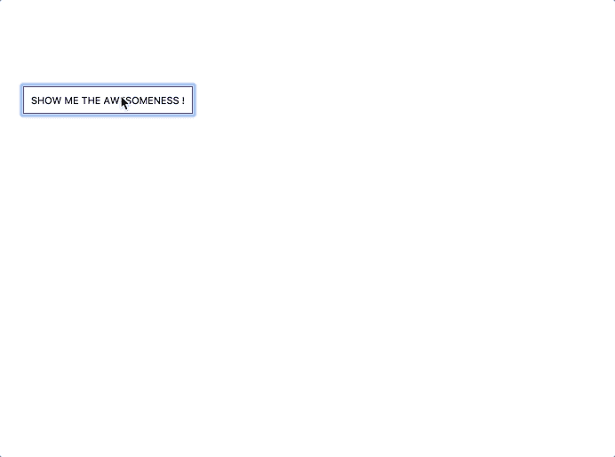

# 11 个库，让您的 React 应用更上一层楼

> 原文：<https://javascript.plainenglish.io/eleven-libraries-to-take-your-react-app-up-a-notch-570c11923738?source=collection_archive---------2----------------------->

*为您的下一个 React 项目提供有效且易于实现的库。*


当 React 在 2013 年发布时，它立即席卷了编程界。React 提供了一种方法来轻松构建交互式 UI 组件，同时管理整个应用程序的状态。它是迄今为止最流行的 JavaScript 框架，也是最受欢迎的框架之一。因此，难怪每年为 React 创建数百个开源库。

这里列出了 11 个现成可用的库，可以让你的 React 应用更上一层楼。

## 洛达什


JavaScript 程序员可能对`lodash`很熟悉，但那些刚接触 React 的人可能不知道，每当你用`create-react-app`开始一个新项目时，它已经是内置的了。`lodash`通过消除处理数组、数字、对象、字符串等的麻烦，使 JavaScript 变得更简单。

下载软件包后，您只需使用

```
import _ from "lodash"
```

您可以开始使用所有内置函数，这些函数都以下划线(`_`)开头。这里有一个例子:

```
_.chunk(array, size)
// Creates an array of elements split into groups the length of size. If array can't be split evenly, the final chunk will be the remaining elements._.chunk(['a', 'b', 'c', 'd'], 2)      // => [['a', 'b'], ['c', 'd']]_.chunk(['a', 'b', 'c', 'd'], 3)      // => [['a', 'b', 'c'], ['d']]
```

这些方法非常适合迭代数组、对象和字符串，操作和测试值，以及创建复合函数。

点击查看所有功能和文档[。](https://lodash.com/docs/4.17.15)

## 日期-fns


这个库的口号是“它就像是日期的 Lodash ”,和`lodash`相似，`date-fns`也有很多内置函数。无论您是想转换时区还是相互比较日期/时间，您一定会从这个库中找到一些用处。有 200 多种功能适合各种场合。

要使用 date-fns，找到您正在寻找的方法，并像这样导入它:

```
import { format, compareAsc } from 'date-fns' format(new Date(2014, 1, 11), 'MM/dd/yyyy')        //=> '02/11/2014' const dates = [ 
   new Date(1995, 6, 2), 
   new Date(1987, 1, 11),    
   new Date(1989, 6, 10) 
   ] dates.sort(compareAsc) 
//=> [ 
//     Wed Feb 11 1987 00:00:00, 
//     Mon Jul 10 1989 00:00:00, 
//     Sun Jul 02 1995 00:00:00 
// ]
```

文档可以在[这里](https://date-fns.org/docs/Getting-Started/)找到。

## 反应图标


使用`react-icons`可以非常容易地在 React 项目中包含流行图标。从十几个库和几千个图标中选择，包括许多品牌标志。最好的部分是图标可以直接作为文本在你的组件中使用，所以你不必担心 CSS 的大小，因为你会一个图像。

`react-icons`利用 ES6 导入，你只需要包含你的项目正在使用的图标，就像这样:

```
import { FaBeer } from 'react-icons/fa';function Question (){
    return <h3> Lets go for a <FaBeer />? </h3>
}
```

您可以搜索图标并访问此处的文档[。](https://react-icons.github.io/react-icons)

## react-门户

虽然很少使用门户，但大多数 React 开发人员仍然熟悉它们。门户提供了一种一流的方式，将子组件呈现到父组件的 DOM 层次结构之外的 DOM 节点中。reactor 本身有一个内置的门户创建器，但是这个过程很麻烦，并且文档可能有点密集。`react-portal`解决了这个问题。

要使用这个库，用标准的 JavaScript 选择器在你的 HTML 代码中定位门户容器，就像`getElementById`或者`querySelector`一样，你就都准备好了。

```
**import** { Portal } **from** 'react-portal';<Portal>
    This text is portaled at the end **of** document.body**!** </Portal><Portal **node**={document **&&** document.getElementById('new-york')}>
    This text is portaled into New York**!** </Portal>
```

文档可在此找到。

## 反应-日历


这是你的反应应用的终极日历应用。`react-calendar`支持几乎所有语言，设置快速简单。有了几十个可能的道具，日历可以根据您的需要进行定制。`react-calendar`举个例子:

```
import React, { useState } from 'react';
import Calendar from 'react-calendar';

function MyApp() {
  const [value, onChange] = useState(new Date());

  return (
    <div>
      <Calendar
        onChange={onChange}
        value={value}
      />
    </div>
  );
}
```

参见[现场演示](https://projects.wojtekmaj.pl/react-calendar/)或访问[文档](https://www.npmjs.com/package/react-calendar)。

## 反应-选项卡


`react-tabs`是一个可访问的选项卡组件，也可能是为“反应”设置的最简单的选项卡组件。它很简单，它的默认样式允许平滑的用户体验。要实现，请使用下面的代码作为起点。

```
import { Tab, Tabs, TabList, TabPanel } from 'react-tabs';
import 'react-tabs/style/react-tabs.css';

export default () => (
  <Tabs>
    <TabList>
      <Tab>Title 1</Tab>
      <Tab>Title 2</Tab>
    </TabList>

    <TabPanel>
      <h2>Any content 1</h2>
    </TabPanel>
    <TabPanel>
      <h2>Any content 2</h2>
    </TabPanel>
  </Tabs>
);
```

查看更多示例并在此处查看文档。

## 反应-侧栏


如果你刚接触编码或造型，只是不适合你，那么你知道创建导航菜单有多难。`react-sidebar`为您简化流程。根据您实现的定制和事件处理功能，代码可能会有点长，但是您可以在这里查看演示[，以及完整的](https://paulusschoutsen.nl/react-sidebar/example/#)[文档](https://github.com/balloob/react-sidebar#installation)。

## 反应-信用卡


如果您正在开发一个接受信用卡付款的电子商务应用程序，这就是您的图书馆。`react-credit-cards`在用户输入其信用卡凭证时提供视觉刺激。虽然它可能需要一点时间来设置，我是一个有趣的动画，肯定会改善用户体验。

了解如何实现它[在这里](https://www.npmjs.com/package/react-credit-cards)。

## @stripe/react-stripe-js


在信用卡这个话题上，Stripe 在提供支付处理软件和 API 的金融技术领域是一个响当当的名字，他们的 React 库是一个受欢迎的库。如果你想在你的应用中实现支付处理，请点击这里查看文档。

## 反应迟钝



如今，使用`alert()`已经过时，对 UX 来说没什么用。相反，使用`react-toastify`创建一个 toast 通知。它使用简单，也有相当多的定制选项。下面是一个示例代码块:

```
import React from 'react';

  import { ToastContainer, toast } from 'react-toastify';
  import 'react-toastify/dist/ReactToastify.css';

  function App(){
    const notify = () => toast("Wow so easy!");

    return (
      <div>
        <button onClick={notify}>Notify!</button>
        <ToastContainer />
      </div>
    );
  }
```

查看文档，以及这里的演示。

## 语义-用户界面-反应


如果你想尝试除了 Bootstrap 之外的另一个样式库，只需看看`semantic-ui-react`。这是语义 UI 的官方 React 集成，许多公司在日常工作中使用它。凭借丰富的内置特性，`semantic-ui-react`允许您通过向目标元素添加特定的类来快速设计漂亮的 React 网站。

点击了解更多[。](https://react.semantic-ui.com/)

# 最后

无论您是 React 新手，还是从一开始就一直在使用它，您在某些时候肯定会使用不同的库。它们可以被用来极大地提高你的代码。

当您构建下一个 React 项目时，尝试实现这里共享的一个库。也许有一天你会设计一个属于自己的图书馆！

*更多内容请看*[*plain English . io*](http://plainenglish.io/)